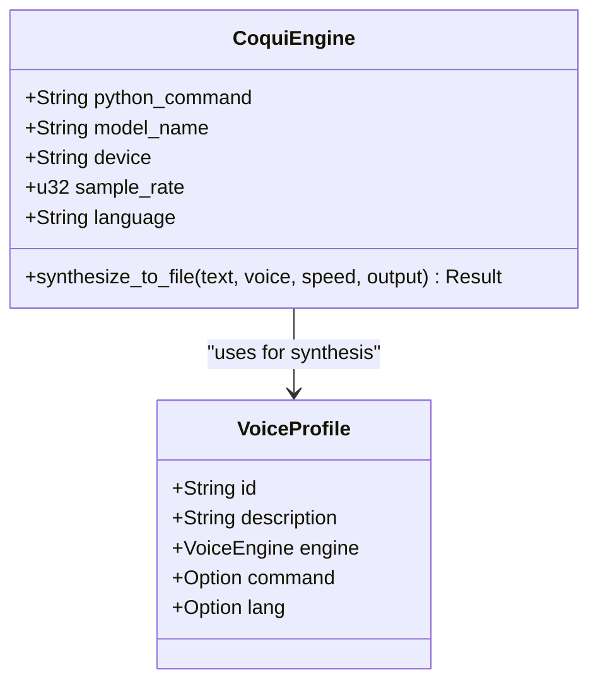
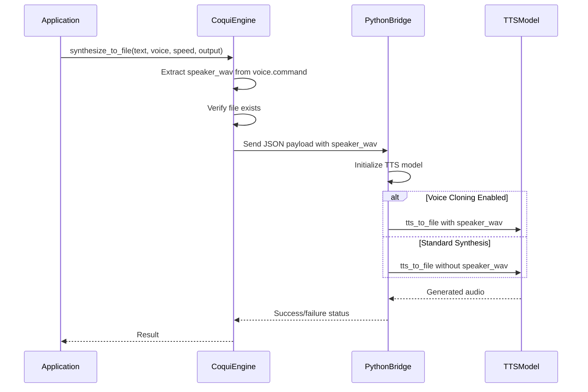
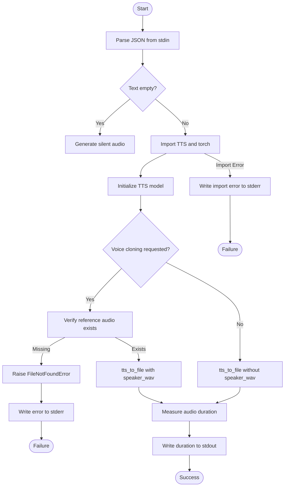

# CoquiTTS Engine and Voice Cloning

<cite>
**Referenced Files in This Document**   
- [coqui_tts.rs](file://src/coqui_tts.rs)
- [tts.rs](file://src/tts.rs)
- [kokoro_bridge.py](file://python/kokoro_bridge.py)
- [COQUI_USAGE_GUIDE.md](file://COQUI_USAGE_GUIDE.md)
- [COQUI_TTS_IMPLEMENTATION.md](file://COQUI_TTS_IMPLEMENTATION.md)
</cite>

## Table of Contents
1. [Introduction](#introduction)
2. [CoquiEngine Configuration](#coquiengine-configuration)
3. [Voice Cloning Workflow](#voice-cloning-workflow)
4. [COQUI_BRIDGE_SCRIPT Implementation](#coqui_bridgescript-implementation)
5. [Configuration via Environment Variables](#configuration-via-environment-variables)
6. [Creating Cloned Voice Profiles](#creating-cloned-voice-profiles)
7. [Performance Considerations](#performance-considerations)
8. [Troubleshooting Guide](#troubleshooting-guide)

## Introduction
The CoquiTTS engine implementation provides advanced text-to-speech capabilities with voice cloning functionality. This system integrates Rust-based engine management with Python-based TTS processing through an embedded bridge script. The architecture enables high-quality speech synthesis with support for voice cloning using reference audio samples, allowing users to generate speech in custom voices. The implementation supports multiple languages and provides flexible configuration options for device targeting, model selection, and audio parameters.

## CoquiEngine Configuration
The CoquiEngine struct manages all configuration aspects for the TTS engine, including Python interpreter path, model selection, device targeting, sample rate, and language settings. Configuration is primarily handled through environment variables with sensible defaults.

The CoquiEngine struct contains the following configuration fields:
- python_command: Path to Python interpreter (default: python3)
- model_name: TTS model identifier (default: tts_models/multilingual/multi-dataset/xtts_v2)
- device: Target device for processing (cpu, cuda, mps)
- sample_rate: Audio sample rate in Hz (default: 24,000)
- language: Default language code (default: en)

Configuration is initialized through the Default trait implementation, which reads environment variables when available or falls back to default values. This allows users to customize engine behavior without modifying code.



**Diagram sources**
- [coqui_tts.rs](file://src/coqui_tts.rs#L0-L40)
- [tts.rs](file://src/tts.rs#L36-L43)

**Section sources**
- [coqui_tts.rs](file://src/coqui_tts.rs#L0-L40)

## Voice Cloning Workflow
The voice cloning workflow leverages the VoiceProfile.command field to store the path to reference audio for speaker_wav parameter in TTS synthesis. When creating a cloned voice profile, the reference audio file path is stored in the command field, which is then used during synthesis to enable voice cloning mode.

The workflow follows these steps:
1. Create a VoiceProfile using the coqui_clone method with reference audio path
2. During synthesis, CoquiEngine extracts the speaker_wav path from the VoiceProfile.command field
3. The engine verifies the reference audio file exists before proceeding
4. The speaker_wav parameter is included in the payload to the Python bridge
5. The bridge script uses the reference audio for voice cloning during synthesis

When the reference audio is not available or voice cloning is not requested, the system automatically falls back to standard synthesis mode using the configured language model without voice cloning.



**Diagram sources**
- [coqui_tts.rs](file://src/coqui_tts.rs#L77-L115)
- [tts.rs](file://src/tts.rs#L438-L471)

**Section sources**
- [coqui_tts.rs](file://src/coqui_tts.rs#L50-L75)
- [tts.rs](file://src/tts.rs#L100-L120)

## COQUI_BRIDGE_SCRIPT Implementation
The embedded COQUI_BRIDGE_SCRIPT handles dependency loading, model initialization with TTS API, and both standard and voice-cloned synthesis modes. The script operates as a standalone Python program that receives configuration via stdin as JSON and communicates results via stdout.

Key implementation aspects:
- Imports TTS API and torch dependencies with error handling
- Parses JSON payload from stdin containing synthesis parameters
- Determines device automatically if not specified, preferring GPU when available
- Initializes TTS model with specified parameters
- Implements safety checks for reference audio existence
- Provides fallback mechanism for missing reference files
- Returns duration metadata via stdout on success

The script includes comprehensive error handling, writing detailed error messages to stderr when dependencies cannot be imported or synthesis fails. It also handles edge cases like empty text input by generating silent audio files with appropriate metadata.



**Diagram sources**
- [tts.rs](file://src/tts.rs#L438-L471)
- [kokoro_bridge.py](file://python/kokoro_bridge.py#L0-L89)

**Section sources**
- [tts.rs](file://src/tts.rs#L438-L471)

## Configuration via Environment Variables
The CoquiTTS engine supports configuration through environment variables, allowing users to customize behavior without code changes. These variables provide flexibility for different deployment scenarios and hardware configurations.

Available configuration options:
- VOXWEAVE_COQUI_PYTHON: Python interpreter path (default: python3)
- VOXWEAVE_COQUI_MODEL: TTS model identifier (default: tts_models/multilingual/multi-dataset/xtts_v2)
- VOXWEAVE_COQUI_DEVICE: Processing device (default: cpu; options: cpu, cuda, mps)
- VOXWEAVE_COQUI_SAMPLE_RATE: Audio sample rate in Hz (default: 24000)
- VOXWEAVE_COQUI_LANGUAGE: Default language code (default: en)

These environment variables are read during CoquiEngine initialization, with fallbacks to default values if variables are not set. This configuration system enables easy adaptation to different environments, such as switching between CPU and GPU processing based on available hardware.

**Section sources**
- [coqui_tts.rs](file://src/coqui_tts.rs#L15-L35)
- [COQUI_USAGE_GUIDE.md](file://COQUI_USAGE_GUIDE.md#L200-L230)

## Creating Cloned Voice Profiles
Creating cloned voice profiles involves using the VoiceProfile::coqui_clone method to store reference audio paths. This method creates a VoiceProfile with the Coqui engine type and stores the reference audio path in the command field, which is later used for voice cloning during synthesis.

To create a cloned voice profile:
1. Call VoiceProfile::coqui_clone with a unique ID, description, language code, and reference audio path
2. The method stores the audio path in the command field while setting the engine to Coqui
3. Use the resulting VoiceProfile in synthesis calls to enable voice cloning

The reference audio should be a clean recording of the target voice, preferably in WAV format with minimal background noise. Longer recordings (3-5 seconds) of continuous speech generally produce better cloning results than short phrases.

```rust
// Example of creating a cloned voice profile
let voice = VoiceProfile::coqui_clone(
    "my-clone",           // Unique identifier
    "My Cloned Voice",    // Description
    "en",                 // Language code
    "/path/to/reference/audio.wav"  // Reference audio path
);
```

**Section sources**
- [tts.rs](file://src/tts.rs#L85-L95)
- [COQUI_USAGE_GUIDE.md](file://COQUI_USAGE_GUIDE.md#L100-L120)

## Performance Considerations
The CoquiTTS implementation has several performance considerations that affect system requirements and user experience:

**Model Size and Downloads**
- The XTTS v2 model is approximately 2GB in size
- First-time usage requires downloading the model, which may take several minutes depending on internet speed
- Subsequent uses load from local cache

**Hardware Requirements**
- CPU mode: Works on any system but with slower synthesis times
- GPU mode (CUDA): Requires NVIDIA GPU with at least 4GB VRAM for optimal performance
- Apple Silicon (MPS): Utilizes GPU acceleration on M1/M2/M3 Macs
- Minimum RAM: 8GB recommended for smooth operation

**Warm-up Times**
- Model loading takes 10-30 seconds on first use
- Subsequent synthesis calls are faster once the model is loaded
- Keeping the engine instance alive avoids repeated loading delays

**Audio Quality Factors**
- Reference audio quality directly impacts cloning quality
- Clear, noise-free recordings produce better results
- Sample rate consistency between reference and output audio
- Adequate recording length (3+ seconds) for voice characteristics

**Section sources**
- [COQUI_USAGE_GUIDE.md](file://COQUI_USAGE_GUIDE.md#L295-L310)
- [COQUI_TTS_IMPLEMENTATION.md](file://COQUI_TTS_IMPLEMENTATION.md#L100-L120)

## Troubleshooting Guide
This section addresses common issues encountered when using the CoquiTTS engine with voice cloning capabilities.

**PyTorch CUDA Errors**
- Issue: "CUDA out of memory" or similar GPU-related errors
- Solution: Switch to CPU mode by setting VOXWEAVE_COQUI_DEVICE="cpu"
- Alternative: Reduce batch size or use a smaller model if available

**Insufficient Disk Space**
- Issue: Model download fails due to lack of space
- Solution: Ensure at least 3GB of free space for model download and cache
- The XTTS v2 model requires ~2GB, with additional space for temporary files

**Audio Quality Degradation**
- Issue: Poor voice cloning quality or robotic-sounding output
- Causes and solutions:
  - Low-quality reference audio: Use clean recordings with minimal background noise
  - Short reference audio: Use recordings of at least 3 seconds
  - Mismatched language: Ensure reference audio language matches synthesis language
  - Poor microphone quality: Use higher-quality recording equipment

**Missing Reference Audio**
- Issue: "Speaker reference audio not found" errors
- Solutions:
  - Verify the file path exists and is accessible
  - Check file permissions
  - Ensure the path is absolute or relative to the working directory
  - Confirm the file is in a supported format (WAV recommended)

**Dependency Installation Issues**
- Issue: "Failed to import coqui dependencies"
- Solution: Install required Python packages:
  ```bash
  pip install TTS torch numpy
  ```
- For GPU support, install appropriate PyTorch version for your hardware

**Microphone Access Issues**
- Issue: "No input device available"
- Solutions:
  - Check microphone permissions in operating system settings
  - Ensure microphone is properly connected and functioning
  - Verify no other application is exclusively using the microphone

**Section sources**
- [COQUI_USAGE_GUIDE.md](file://COQUI_USAGE_GUIDE.md#L315-L350)
- [kokoro_bridge.py](file://python/kokoro_bridge.py#L15-L25)