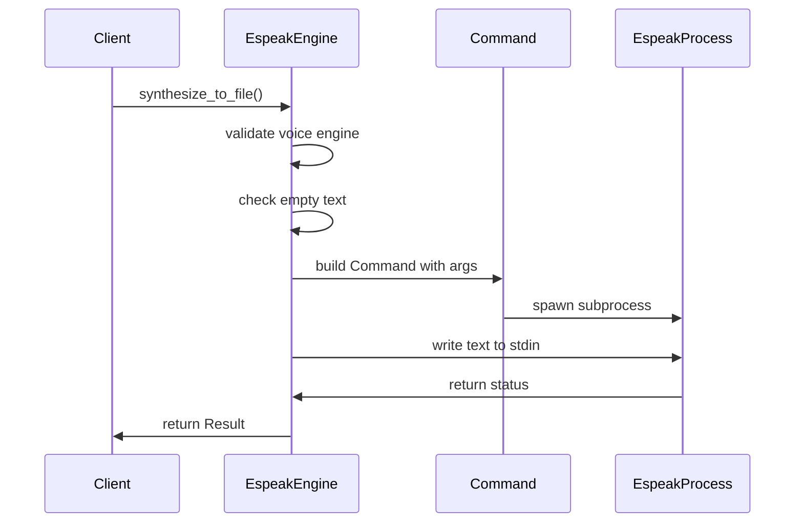
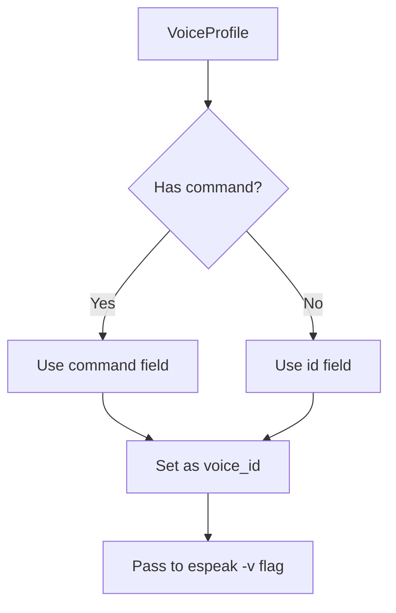

# Espeak Engine Integration

<cite>
**Referenced Files in This Document**   
- [tts.rs](file://src/tts.rs)
</cite>

## Table of Contents
1. [Introduction](#introduction)
2. [EspeakEngine Implementation](#espeakengine-implementation)
3. [Voice Selection Mechanism](#voice-selection-mechanism)
4. [Speed Normalization Logic](#speed-normalization-logic)
5. [Text Streaming Approach](#text-streaming-approach)
6. [Configuration Options](#configuration-options)
7. [Empty Text Handling](#empty-text-handling)
8. [Performance Considerations](#performance-considerations)
9. [Troubleshooting Guide](#troubleshooting-guide)

## Introduction
The Espeak TTS engine integration in Voxweave provides a robust text-to-speech solution through system command execution. This document details the implementation of the `EspeakEngine` struct that adheres to the `SpeechEngine` trait, enabling speech synthesis via the espeak command-line tool. The integration handles voice selection, speed normalization, text streaming, and configuration through environment variables, providing a flexible and efficient TTS solution.

**Section sources**
- [tts.rs](file://src/tts.rs#L101-L150)

## EspeakEngine Implementation
The `EspeakEngine` struct implements the `SpeechEngine` trait using Rust's `std::process::Command` to execute the espeak binary. The implementation follows a clean separation of concerns with helper methods for command resolution and speed normalization. The core functionality is contained in the `synthesize_to_file` method, which orchestrates the entire TTS process by constructing the appropriate command line arguments and managing the subprocess lifecycle.

The engine first validates that the requested voice uses the Espeak engine, then handles empty text input as a special case before proceeding with normal synthesis. For valid text input, it spawns a subprocess with the configured espeak command, passing parameters for output file, voice selection, speech rate, and stdin streaming.

**Diagram sources**
- [tts.rs](file://src/tts.rs#L101-L150)
- [tts.rs](file://src/tts.rs#L152-L192)

**Section sources**
- [tts.rs](file://src/tts.rs#L101-L192)

## Voice Selection Mechanism
The voice selection mechanism maps `VoiceProfile.command` values to espeak voice identifiers through a fallback system. When synthesizing speech, the engine first attempts to use the `command` field from the `VoiceProfile` structure. If this field is not set (None), it falls back to using the `id` field as the voice identifier.

This approach provides flexibility in voice configuration, allowing specific espeak voice codes to be specified independently from the internal voice ID. The available voices are defined in the `ESPEAK_VOICES` constant, which maps voice IDs to their descriptions and corresponding espeak command identifiers. This mapping enables the system to support multiple languages and voice variants while maintaining a consistent internal representation.

**Diagram sources**
- [tts.rs](file://src/tts.rs#L101-L150)
- [tts.rs](file://src/tts.rs#L341-L375)

**Section sources**
- [tts.rs](file://src/tts.rs#L101-L150)
- [tts.rs](file://src/tts.rs#L341-L375)

## Speed Normalization Logic
The speed normalization logic converts float speed multipliers to espeak's rate parameter, which operates in the range of 80-450 words per minute (WPM). The implementation uses a base rate of 175.0 WPM, which represents the default speaking speed. The input speed multiplier is applied to this base rate, and the result is rounded to the nearest integer before being clamped to the valid range.

This approach ensures that speed adjustments are intuitive and predictable, with a multiplier of 1.0 producing normal speed, values less than 1.0 slowing down speech, and values greater than 1.0 speeding it up. The clamping prevents extreme values that could make speech unintelligible or cause espeak to fail. The normalized rate is then passed to espeak via the `-s` command line argument.

**Diagram sources**
- [tts.rs](file://src/tts.rs#L101-L150)

**Section sources**
- [tts.rs](file://src/tts.rs#L101-L150)

## Text Streaming Approach
The text streaming approach uses stdin piping to handle large inputs efficiently, avoiding command line length limitations and enabling real-time processing. The implementation configures the subprocess with `Stdio::piped()` for stdin and includes the `--stdin` flag in the espeak command line arguments. After spawning the process, the engine writes the input text directly to the subprocess's stdin stream.

This method allows for efficient memory usage as the entire text doesn't need to be incorporated into the command line arguments. It also enables potential future enhancements for streaming text input, where text could be fed to the subprocess incrementally. The approach handles encoding by writing the text as raw bytes, relying on espeak's ability to interpret UTF-8 encoded input.

**Section sources**
- [tts.rs](file://src/tts.rs#L152-L192)

## Configuration Options
The primary configuration option for the Espeak engine is the `VOXWEAVE_ESPEAK_COMMAND` environment variable, which allows users to specify a custom path to the espeak binary. When present, this environment variable overrides the default "espeak" command, enabling the use of espeak installations in non-standard locations or alternative TTS engines with compatible command-line interfaces.

The `resolve_command` method implements this functionality by attempting to read the environment variable and falling back to "espeak" if it's not set. This design provides flexibility for different deployment scenarios, from development environments with custom espeak builds to production systems where espeak might be installed in a non-standard location.

**Section sources**
- [tts.rs](file://src/tts.rs#L101-L150)

## Empty Text Handling
Empty text input is handled by creating an empty audio file at the specified output path. When the input text, after trimming whitespace, is empty, the engine bypasses the espeak subprocess entirely and directly writes an empty byte array to the output file using `std::fs::write`. This approach ensures consistent behavior and prevents espeak from potentially failing or producing unexpected output when given empty input.

This handling is particularly important for applications that process user-generated content, where empty text fields might occur due to editing errors or data import issues. By creating an empty audio file rather than failing, the system maintains pipeline integrity and allows downstream processes to handle the empty audio appropriately.

**Section sources**
- [tts.rs](file://src/tts.rs#L101-L150)

## Performance Considerations
The Espeak engine integration has several performance characteristics to consider. The most significant is subprocess startup overhead, as each synthesis request spawns a new espeak process. This overhead makes the engine less suitable for applications requiring rapid, successive TTS operations. Unlike neural TTS systems, espeak does not benefit from GPU acceleration, relying solely on CPU computation for speech synthesis.

The text streaming approach mitigates memory usage concerns for large inputs, but the per-request process spawning cannot be optimized within the current architecture. Applications with high-throughput requirements might benefit from implementing a process pooling mechanism or considering alternative TTS engines with daemon modes. The lack of warm-up time between requests also means each synthesis incurs the full startup cost of the espeak binary.

**Section sources**
- [tts.rs](file://src/tts.rs#L152-L192)

## Troubleshooting Guide
Common issues with the Espeak engine integration include missing espeak installations, voice not found errors, and encoding problems with special characters. For missing espeak installations, verify that espeak is installed and accessible in the system PATH, or set the `VOXWEAVE_ESPEAK_COMMAND` environment variable to the correct path.

Voice not found errors typically occur when requesting a voice that espeak doesn't support on the current system. Check the available voices by running `espeak --voices` on the command line and ensure the requested voice identifier matches exactly. Encoding problems with special characters can often be resolved by ensuring the input text is properly UTF-8 encoded, as espeak expects UTF-8 input when using the stdin streaming approach.

When troubleshooting, examine the error messages returned by the subprocess, as they often contain specific information about what went wrong. The engine captures and returns stderr output from espeak, which can provide valuable diagnostic information for resolving issues.

**Section sources**
- [tts.rs](file://src/tts.rs#L152-L192)
- [tts.rs](file://src/tts.rs#L101-L150)