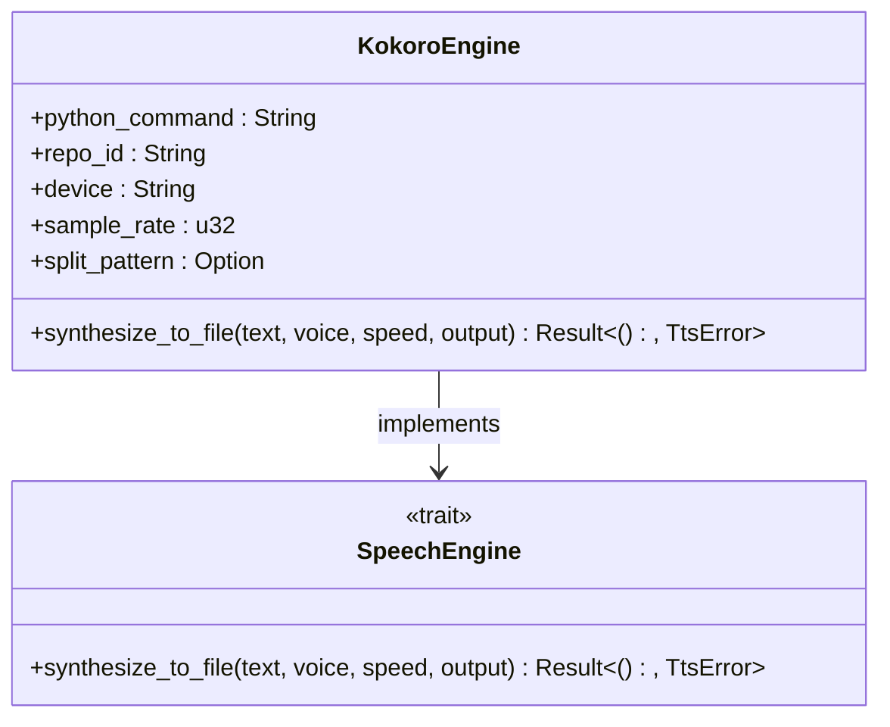
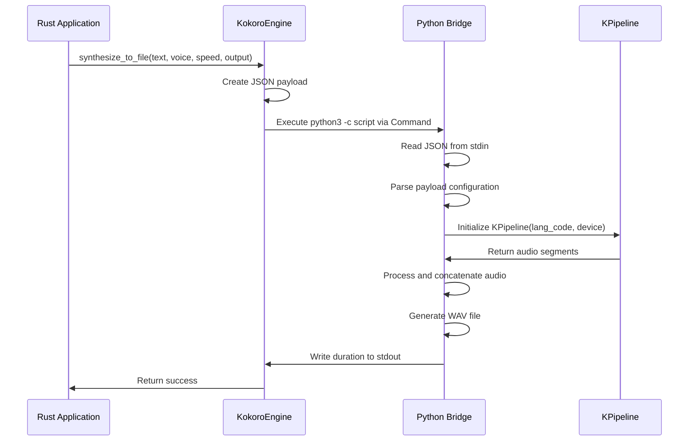
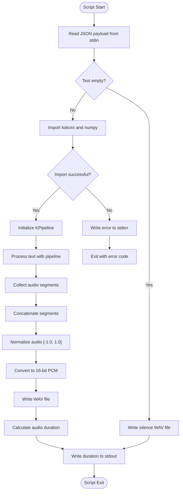

# Kokoro Engine Bridge

<cite>
**Referenced Files in This Document**   
- [kokoro_bridge.py](file://python/kokoro_bridge.py)
- [tts.rs](file://src/tts.rs)
</cite>

## Table of Contents
1. [Introduction](#introduction)
2. [KokoroEngine Configuration](#kokoroengine-configuration)
3. [Voice Identification System](#voice-identification-system)
4. [Inter-Process Communication](#inter-process-communication)
5. [Bridge Script Functionality](#bridge-script-functionality)
6. [Text Splitting and Processing](#text-splitting-and-processing)
7. [Performance Considerations](#performance-considerations)
8. [Troubleshooting Guide](#troubleshooting-guide)

## Introduction
The Kokoro TTS engine bridge provides a robust text-to-speech implementation that integrates Rust and Python components through inter-process communication. This system enables high-quality voice synthesis by leveraging the Kokoro deep learning model while maintaining the performance benefits of Rust for application logic. The bridge architecture separates concerns between the Rust frontend that manages configuration and execution, and the Python backend that handles the computationally intensive audio generation tasks.

**Section sources**
- [tts.rs](file://src/tts.rs#L152-L192)
- [kokoro_bridge.py](file://python/kokoro_bridge.py#L1-L89)

## KokoroEngine Configuration
The `KokoroEngine` struct in the Rust implementation manages all runtime parameters for the TTS system. It is configured through environment variables that control critical aspects of the synthesis process. The engine's default implementation reads these configuration values during initialization, providing sensible defaults when environment variables are not set.

The configuration includes:
- **Python interpreter path**: Controlled by `VOXWEAVE_KOKORO_PYTHON`, defaulting to "python3" if not specified
- **Model repository ID**: Set via `VOXWEAVE_KOKORO_REPO_ID`, defaulting to "hexgrad/Kokoro-82M"
- **Device selection**: Configured with `VOXWEAVE_KOKORO_DEVICE`, defaulting to "cpu" (can be set to "cuda" for GPU acceleration)
- **Sample rate**: Defined by `VOXWEAVE_KOKORO_SAMPLE_RATE`, defaulting to 24,000 Hz
- **Text splitting pattern**: Controlled by `VOXWEAVE_KOKORO_SPLIT_PATTERN`, defaulting to "\\n+" for splitting on newlines

These parameters are encapsulated within the `KokoroEngine` struct which implements the `SpeechEngine` trait, ensuring consistent interface across different TTS backends.

**Diagram sources**
- [tts.rs](file://src/tts.rs#L194-L232)

**Section sources**
- [tts.rs](file://src/tts.rs#L194-L232)

## Voice Identification System
The voice identification system uses a structured naming convention where voice IDs like 'af_alloy' encode both language and speaker information. The first letter represents the language variant:
- 'a' for American English
- 'b' for British English  
- 'e' for Spanish
- 'f' for French
- 'h' for Hindi
- 'i' for Italian
- 'j' for Japanese
- 'p' for Brazilian Portuguese
- 'z' for Mandarin Chinese

The second letter indicates gender: 'f' for female and 'm' for male. The remainder of the ID specifies the speaker name. This system allows for programmatic extraction of language and gender information from the voice ID, enabling appropriate language code mapping and voice selection.

The implementation includes comprehensive voice profiles that map these IDs to human-readable display names and associate them with their respective language codes, making the voices accessible through user interfaces.

**Section sources**
- [tts.rs](file://src/tts.rs#L341-L375)
- [tts.rs](file://src/tts.rs#L377-L451)

## Inter-Process Communication
The bridge employs JSON-based inter-process communication between the Rust frontend and Python backend. When text synthesis is requested, the `KokoroEngine` serializes configuration parameters into a JSON payload that is passed to the embedded `kokoro_bridge.py` script via standard input.

The payload includes:
- Input text to synthesize
- Output file path for the generated audio
- Voice identifier
- Language code
- Speech speed
- Sample rate
- Model repository ID
- Device specification (CPU/GPU)
- Text splitting pattern

This JSON serialization enables type-safe data transfer between the two language runtimes, ensuring that all necessary configuration is accurately conveyed to the Python component responsible for audio generation.

**Diagram sources**
- [tts.rs](file://src/tts.rs#L234-L269)
- [kokoro_bridge.py](file://python/kokoro_bridge.py#L1-L89)

**Section sources**
- [tts.rs](file://src/tts.rs#L234-L269)

## Bridge Script Functionality
The `kokoro_bridge.py` script serves as the Python backend for audio synthesis, handling all deep learning operations and audio processing. Upon execution, it reads the JSON payload from standard input and initializes the Kokoro pipeline with the specified configuration.

Key functionalities include:
- **Dependency loading**: Imports the Kokoro library and NumPy, with error handling for missing dependencies
- **Audio synthesis**: Uses the `KPipeline` class to generate speech from text, processing the output in segments
- **NumPy array handling**: Converts audio tensors to NumPy arrays using the `_coerce_numpy` function, which handles various tensor types including PyTorch tensors
- **WAV file generation**: Creates properly formatted WAV files with 16-bit PCM encoding at the specified sample rate
- **Audio normalization**: Clips audio values to the [-1.0, 1.0] range and converts to 16-bit integers for PCM encoding

The script implements robust error handling, writing error messages to stderr and exiting with appropriate status codes when dependencies cannot be loaded or synthesis fails.

**Diagram sources**
- [kokoro_bridge.py](file://python/kokoro_bridge.py#L1-L89)

**Section sources**
- [kokoro_bridge.py](file://python/kokoro_bridge.py#L1-L89)

## Text Splitting and Processing
The text splitting functionality allows for controlled segmentation of long input texts before synthesis. The `split_pattern` parameter accepts a regular expression that defines how text should be divided into smaller segments for processing. By default, the pattern "\\n+" splits text on one or more consecutive newlines, effectively processing each paragraph separately.

This approach addresses limitations in the underlying model by preventing memory issues with very long inputs and allowing for more natural pauses between text segments. When processing segmented text, the bridge script generates audio for each segment individually and then concatenates the resulting audio arrays.

The splitting occurs within the `KPipeline` during text processing, where the input text is divided according to the provided pattern before being passed to the synthesis engine. This ensures that each segment is processed with appropriate context while maintaining the overall continuity of the generated speech.

**Section sources**
- [tts.rs](file://src/tts.rs#L234-L269)
- [kokoro_bridge.py](file://python/kokoro_bridge.py#L1-L89)

## Performance Considerations
Several performance factors should be considered when using the Kokoro TTS engine:

- **Python startup overhead**: Each synthesis request spawns a new Python process, incurring startup costs. This can be mitigated by batching requests or maintaining a persistent Python process
- **GPU memory requirements**: When using CUDA acceleration, sufficient GPU memory is required to load the model. The 82M parameter model typically requires several gigabytes of VRAM
- **Batch processing limitations**: The current implementation processes text sequentially rather than in batches, limiting throughput for multiple synthesis requests
- **Memory usage**: Large text inputs are split into segments, but the concatenated audio still requires memory proportional to the total audio duration
- **I/O overhead**: The JSON serialization and process spawning add overhead to each synthesis operation

For optimal performance, consider using GPU acceleration for faster inference, preprocessing text to appropriate segment sizes, and implementing request batching when generating multiple audio files.

**Section sources**
- [tts.rs](file://src/tts.rs#L234-L269)
- [kokoro_bridge.py](file://python/kokoro_bridge.py#L1-L89)

## Troubleshooting Guide
Common issues and their solutions:

- **Python dependency conflicts**: Ensure the Python environment contains the required Kokoro library version. Use virtual environments to isolate dependencies.
- **CUDA compatibility**: Verify CUDA drivers and PyTorch CUDA support when using GPU acceleration. Check that the CUDA version matches the PyTorch installation.
- **Audio clipping artifacts**: These may occur when audio values exceed the [-1.0, 1.0] range. The bridge script includes clipping logic, but extreme values may still cause artifacts.
- **Missing voice errors**: Verify that voice IDs follow the correct format (e.g., 'af_alloy') and are included in the supported voices list.
- **Process spawning failures**: Check that the Python interpreter path is correct and accessible. Verify file permissions for the bridge script.
- **Empty audio output**: Ensure input text is not empty or whitespace-only, as this generates silence rather than speech.

When troubleshooting, examine both stdout and stderr outputs from the Python process, as errors are written to stderr while success information goes to stdout.

**Section sources**
- [kokoro_bridge.py](file://python/kokoro_bridge.py#L1-L89)
- [tts.rs](file://src/tts.rs#L267-L298)