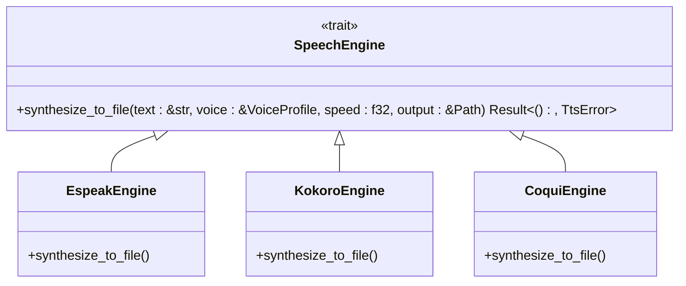
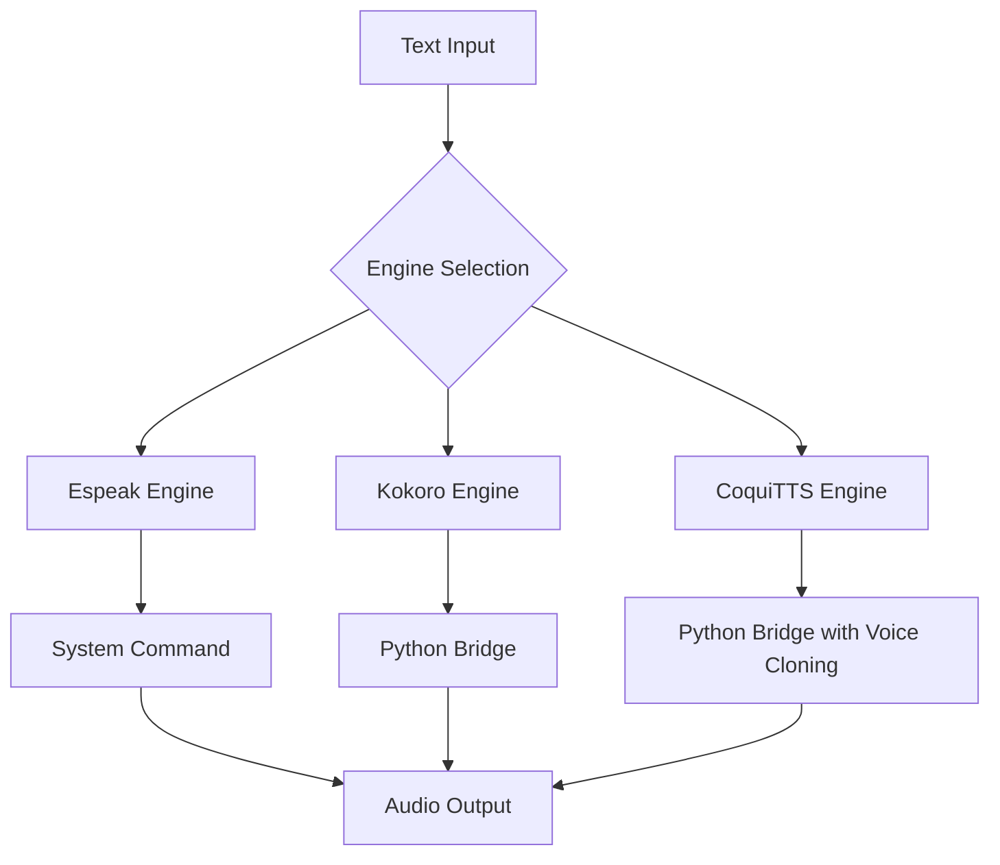
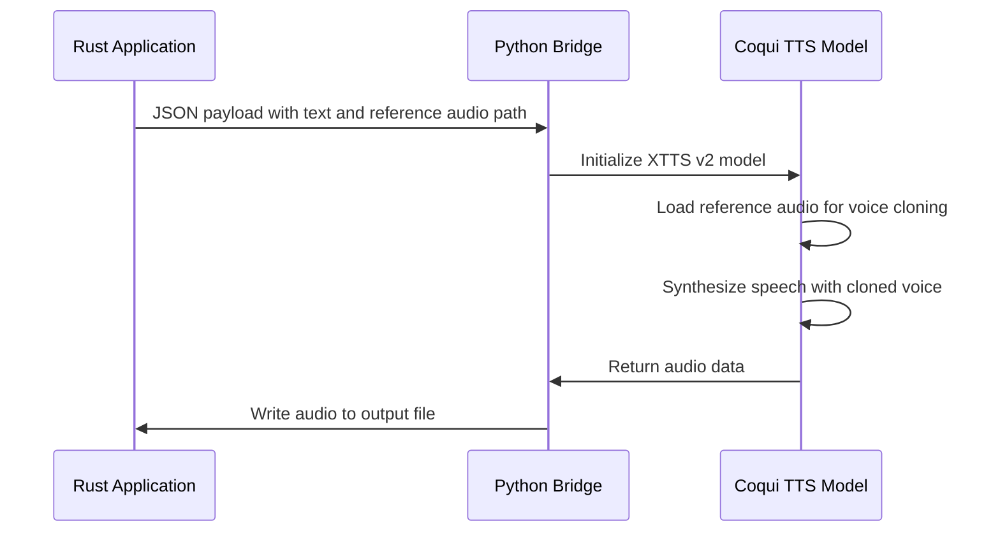
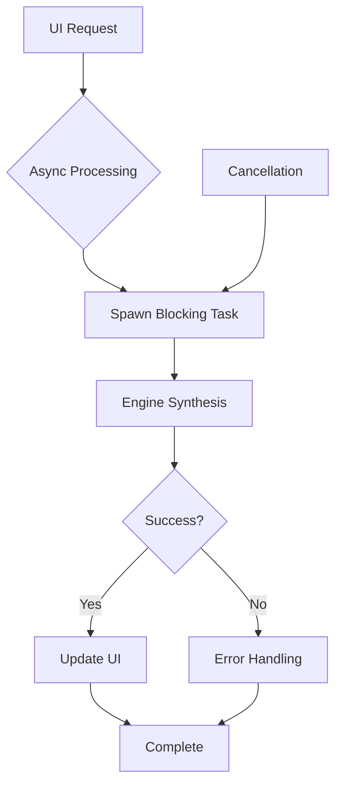

# Text-to-Speech Engine Guide

<cite>
**Referenced Files in This Document**   
- [tts.rs](file://src/tts.rs)
- [coqui_tts.rs](file://src/coqui_tts.rs)
- [kokoro_bridge.py](file://python/kokoro_bridge.py)
- [IMPLEMENTATION_SUMMARY.md](file://IMPLEMENTATION_SUMMARY.md)
- [COQUI_USAGE_GUIDE.md](file://COQUI_USAGE_GUIDE.md)
- [tts_service.rs](file://abogen-ui/crates/ui/services/tts_service.rs)
- [voices.rs](file://abogen-ui/crates/ui/services/voices.rs)
- [audio_recorder.rs](file://abogen-ui/crates/ui/components/audio_recorder.rs)
</cite>

## Table of Contents
1. [Introduction](#introduction)
2. [SpeechEngine Trait](#speechengine-trait)
3. [TTS Engine Implementations](#tts-engine-implementations)
4. [Engine Selection Logic](#engine-selection-logic)
5. [CoquiTTS Voice Cloning](#coquitts-voice-cloning)
6. [Configuration Options](#configuration-options)
7. [Usage Examples](#usage-examples)
8. [Async Processing Model](#async-processing-model)
9. [Performance Considerations](#performance-considerations)
10. [Troubleshooting Guide](#troubleshooting-guide)

## Introduction
The VoxWeave text-to-speech system implements a multi-engine architecture that provides flexible voice synthesis capabilities. This guide documents the core components of the TTS system, focusing on the unified interface that allows seamless integration of different TTS engines. The system supports three distinct engines: espeak-ng for lightweight synthesis, Kokoro for neural TTS, and CoquiTTS for advanced voice cloning capabilities. The architecture is designed to be extensible, allowing new engines to be added while maintaining a consistent interface for the rest of the application.

## SpeechEngine Trait
The `SpeechEngine` trait defined in `src/tts.rs` provides a unified interface for all TTS implementations, enabling consistent interaction with different voice synthesis engines. This trait abstraction allows the application to switch between engines without modifying the core logic.



**Diagram sources**
- [tts.rs](file://src/tts.rs#L91-L99)

**Section sources**
- [tts.rs](file://src/tts.rs#L91-L99)

## TTS Engine Implementations
The system implements three distinct TTS engines, each with its own characteristics and use cases. The `VoiceEngine` enum defines the available engine types: `Espeak`, `Kokoro`, and `Coqui`. Each engine implements the `SpeechEngine` trait, providing a consistent interface while leveraging different underlying technologies.

### Espeak Engine
The `EspeakEngine` provides a lightweight, system-level TTS solution using the espeak-ng command-line tool. It operates by spawning a subprocess and passing text through stdin, making it suitable for basic synthesis needs without requiring additional Python dependencies.

### Kokoro Engine
The `KokoroEngine` implements neural text-to-speech through a Python bridge, offering higher quality voice synthesis than espeak-ng. It communicates with the Python-based Kokoro TTS system by passing JSON payloads through stdin and receiving audio output.

### CoquiTTS Engine
The `CoquiEngine` provides advanced voice cloning capabilities using the Coqui TTS XTTS v2 model. Like Kokoro, it uses a Python bridge but extends functionality to support voice cloning from reference audio samples.



**Diagram sources**
- [tts.rs](file://src/tts.rs#L101-L102)
- [tts.rs](file://src/tts.rs#L185-L192)
- [tts.rs](file://src/tts.rs#L116-L117)

**Section sources**
- [tts.rs](file://src/tts.rs#L101-L102)
- [tts.rs](file://src/tts.rs#L185-L192)
- [tts.rs](file://src/tts.rs#L116-L117)

## Engine Selection Logic
The system routes TTS requests based on voice profiles, which contain engine-specific configuration. The `VoiceProfile` struct includes an `engine` field of type `VoiceEngine` that determines which engine will handle the synthesis request. When processing a TTS request, the system examines the voice profile's engine field and delegates to the appropriate implementation.

The selection logic is implemented in the TTS service layer, where incoming requests are analyzed and routed to the correct engine. For example, voices with IDs starting with "coqui-" are automatically routed to the Coqui engine, while other voices may use Kokoro or espeak-ng based on their configuration.

**Section sources**
- [tts_service.rs](file://abogen-ui/crates/ui/services/tts_service.rs#L36-L68)

## CoquiTTS Voice Cloning
The CoquiTTS implementation supports voice cloning through reference audio samples. The system uses a Python bridge script embedded in the Rust code to interface with the Coqui TTS XTTS v2 model. Voice cloning is enabled by providing a reference audio file in the voice profile's command field.

### Implementation Details
The voice cloning functionality is implemented through the `coqui_clone` method of `VoiceProfile`, which stores the path to the reference audio file in the command field. When synthesizing speech, the Coqui engine checks for this reference audio and uses it to clone the voice if available.

The embedded Python bridge script handles the communication between Rust and Python, accepting JSON payloads with text, output paths, and voice cloning parameters. The script initializes the Coqui TTS model and processes the synthesis request, returning the generated audio to the Rust application.



**Diagram sources**
- [tts.rs](file://src/tts.rs#L60-L102)
- [coqui_tts.rs](file://src/coqui_tts.rs#L60-L115)

**Section sources**
- [tts.rs](file://src/tts.rs#L60-L102)
- [coqui_tts.rs](file://src/coqui_tts.rs#L60-L115)

## Configuration Options
The TTS system provides several configuration options through environment variables, allowing users to customize engine behavior without modifying code. These options include sample rate, language selection, and device selection for GPU acceleration.

### CoquiTTS Configuration
The Coqui engine supports the following environment variables:
- `VOXWEAVE_COQUI_PYTHON`: Python command (default: python3)
- `VOXWEAVE_COQUI_MODEL`: TTS model (default: tts_models/multilingual/multi-dataset/xtts_v2)
- `VOXWEAVE_COQUI_DEVICE`: Device (cpu, cuda, mps, etc.)
- `VOXWEAVE_COQUI_SAMPLE_RATE`: Sample rate (default: 24000)
- `VOXWEAVE_COQUI_LANGUAGE`: Language (default: en)

### Kokoro Configuration
The Kokoro engine supports:
- `VOXWEAVE_KOKORO_PYTHON`: Python command (default: python3)
- `VOXWEAVE_KOKORO_REPO_ID`: Model repository ID (default: hexgrad/Kokoro-82M)
- `VOXWEAVE_KOKORO_DEVICE`: Device (cpu or cuda)
- `VOXWEAVE_KOKORO_SAMPLE_RATE`: Sample rate (default: 24000)

**Section sources**
- [COQUI_TTS_IMPLEMENTATION.md](file://COQUI_TTS_IMPLEMENTATION.md#L6-L16)

## Usage Examples
The system provides examples in IMPLEMENTATION_SUMMARY.md demonstrating how to use both standard and cloned voices. For standard voices, the `VoiceProfile::coqui` method creates a profile with a specified language. For voice cloning, the `VoiceProfile::coqui_clone` method accepts a reference audio path.

```rust
let voice = VoiceProfile::coqui_clone(
    "my-voice",
    "My Cloned Voice",
    "en",
    "/path/to/voice_clone_1234567890.wav"
);
```

The audio recorder component allows users to capture their own voice samples for cloning, automatically saving recordings to the desktop in WAV format for use with the voice cloning feature.

**Section sources**
- [IMPLEMENTATION_SUMMARY.md](file://IMPLEMENTATION_SUMMARY.md#L253-L320)
- [audio_recorder.rs](file://abogen-ui/crates/ui/components/audio_recorder.rs#L0-L327)

## Async Processing Model
The system employs an async processing model to prevent UI blocking during TTS synthesis. Synthesis requests are processed in background threads using tokio's spawn_blocking function, allowing the UI to remain responsive. The TTS service layer handles request queuing and progress reporting, with periodic yield points to ensure UI updates.

The async model uses a cancellation token pattern, allowing users to cancel long-running synthesis operations. Progress is reported through a shared state object that updates the UI at regular intervals.



**Diagram sources**
- [tts_service.rs](file://abogen-ui/crates/ui/services/tts_service.rs#L211-L240)

**Section sources**
- [tts_service.rs](file://abogen-ui/crates/ui/services/tts_service.rs#L211-L240)

## Performance Considerations
The system's performance characteristics vary significantly between engines. The espeak engine provides the fastest synthesis with minimal resource usage, while neural engines like Kokoro and CoquiTTS require more processing power but produce higher quality audio.

### Model Loading Times
CoquiTTS and Kokoro engines require loading large neural models into memory, resulting in significant startup times. The Coqui XTTS v2 model is approximately 1.8GB and downloads on first use. Subsequent runs are faster as the model is cached.

### GPU Acceleration
Both neural engines support GPU acceleration, which can significantly improve synthesis speed. The Coqui engine supports CUDA for NVIDIA GPUs and MPS for Apple Silicon, while Kokoro supports CUDA acceleration. GPU usage can be configured through environment variables.

**Section sources**
- [COQUI_USAGE_GUIDE.md](file://COQUI_USAGE_GUIDE.md#L253-L320)

## Troubleshooting Guide
Common issues include missing Python dependencies, audio quality problems, and device permission errors. The most frequent issue is missing Python packages, which can be resolved by installing the required dependencies.

### Missing Python Dependencies
If the system fails to import Coqui or Kokoro dependencies, ensure the required Python packages are installed:
```bash
pip install TTS torch numpy
```

### Audio Quality Issues
Poor audio quality may result from insufficient reference audio for voice cloning. Ensure reference recordings are clear, with minimal background noise and consistent volume.

### Device Permissions
On macOS, ensure the application has microphone permissions in System Preferences → Security & Privacy → Microphone when using the audio recorder component.

**Section sources**
- [COQUI_USAGE_GUIDE.md](file://COQUI_USAGE_GUIDE.md#L500-L550)
- [audio_recorder.rs](file://abogen-ui/crates/ui/components/audio_recorder.rs#L0-L327)