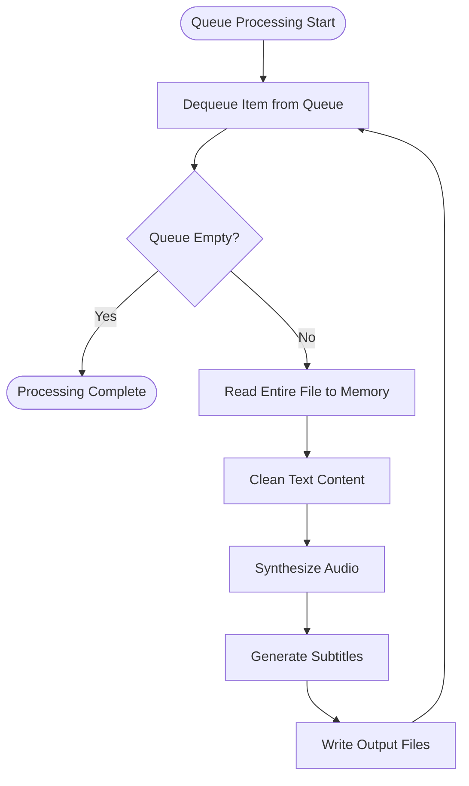
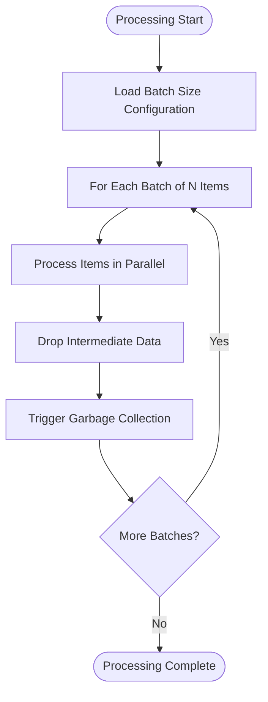
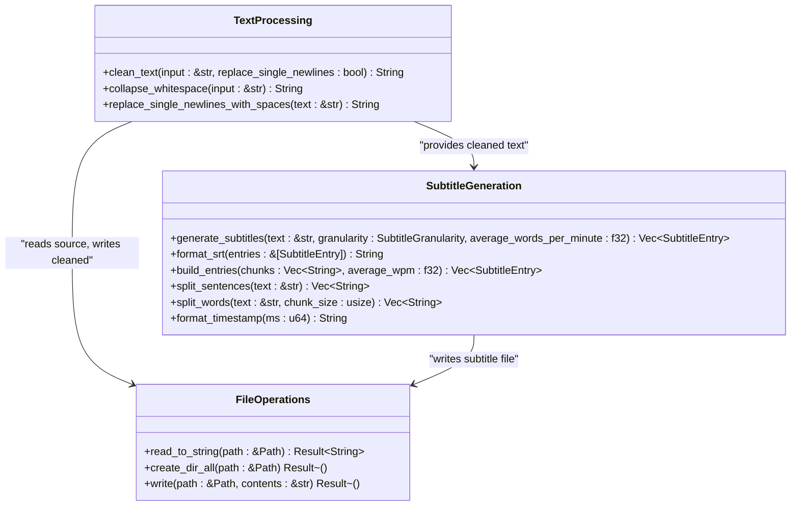
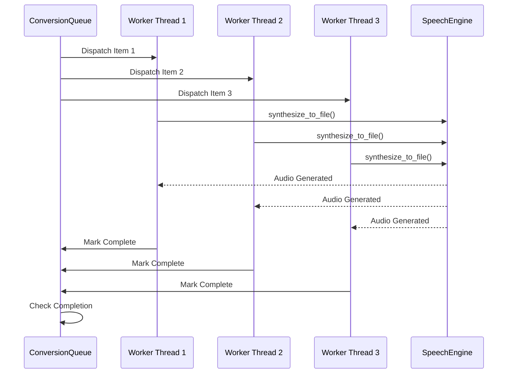

# CPU and Memory Usage Optimization

<cite>
**Referenced Files in This Document**   
- [pipeline.rs](file://src/pipeline.rs)
- [text.rs](file://src/text.rs)
- [subtitle.rs](file://src/subtitle.rs)
- [queue.rs](file://src/queue.rs)
- [build_output.txt](file://build_output.txt)
- [test_output.txt](file://test_output.txt)
</cite>

## Table of Contents
1. [Introduction](#introduction)
2. [Performance Bottlenecks in Processing Pipeline](#performance-bottlenecks-in-processing-pipeline)
3. [Synchronous Execution Model Analysis](#synchronous-execution-model-analysis)
4. [Memory Pressure Mitigation Strategies](#memory-pressure-mitigation-strategies)
5. [Text Processing Resource Impact](#text-processing-resource-impact)
6. [Queue Management and Parallelism](#queue-management-and-parallelism)
7. [Performance Monitoring and Analysis](#performance-monitoring-and-analysis)
8. [Troubleshooting Memory Issues](#troubleshooting-memory-issues)
9. [Conclusion](#conclusion)

## Introduction
This document provides a comprehensive analysis of CPU and memory usage optimization in VoxWeave's processing pipeline, with a focus on performance bottlenecks in text cleaning and audio synthesis stages. The analysis centers on the synchronous execution model in the `convert_path` and `convert_queue` functions within pipeline.rs, which can lead to high CPU utilization and memory accumulation during batch processing of large text files. The document outlines strategies to mitigate memory pressure, analyze performance metrics, and optimize system resource usage for efficient processing of multiple large requests.

## Performance Bottlenecks in Processing Pipeline

The primary performance bottlenecks in VoxWeave's processing pipeline occur during the text cleaning and audio synthesis stages, particularly when handling batch processing of large text files. The pipeline architecture processes each conversion request through a sequence of operations: reading the source file, cleaning text, synthesizing audio, and generating subtitles. Each of these stages contributes to the overall resource load, with text cleaning and audio synthesis being the most computationally intensive components.

The current implementation processes each queue item sequentially in memory, loading entire text files into memory before processing. This approach can lead to significant memory accumulation when handling multiple large requests simultaneously, as each file's content is fully loaded and processed before moving to the next item. The lack of streaming or chunked processing means that memory usage scales linearly with the size and number of input files, potentially leading to memory pressure and system performance degradation.

**Section sources**
- [pipeline.rs](file://src/pipeline.rs#L21-L109)
- [text.rs](file://src/text.rs#L7-L70)
- [subtitle.rs](file://src/subtitle.rs#L12-L156)

## Synchronous Execution Model Analysis

The synchronous execution model implemented in the `convert_path` and `convert_queue` functions contributes significantly to high CPU utilization and memory accumulation. The `convert_queue` function processes items in a blocking, sequential manner, where each item must complete processing before the next one begins. This synchronous approach prevents the system from leveraging available CPU cores efficiently and can lead to CPU underutilization during I/O operations while causing CPU spikes during computation-intensive tasks.

**Diagram sources**
- [pipeline.rs](file://src/pipeline.rs#L57-L89)

**Section sources**
- [pipeline.rs](file://src/pipeline.rs#L21-L109)
- [queue.rs](file://src/queue.rs#L100-L120)

## Memory Pressure Mitigation Strategies

To mitigate memory pressure in the processing pipeline, several strategies can be implemented to reduce memory accumulation during batch processing. The most effective approaches include processing queue items in smaller batches and implementing streaming text processing to avoid loading entire files into memory at once.

Batch processing with size limits allows the system to process a configurable number of items at a time, followed by a memory cleanup phase before continuing with the next batch. This approach prevents unbounded memory growth and allows the garbage collector to reclaim memory more effectively. Additionally, implementing streaming text processing would enable the system to process text content in chunks rather than loading entire files into memory, significantly reducing peak memory usage.

Another effective strategy is to implement early memory release by explicitly dropping variables that are no longer needed, allowing Rust's ownership system to free memory immediately rather than waiting for the end of the function scope. This is particularly important for large text buffers and intermediate processing results.

**Diagram sources**
- [pipeline.rs](file://src/pipeline.rs#L57-L89)
- [queue.rs](file://src/queue.rs#L100-L120)

**Section sources**
- [pipeline.rs](file://src/pipeline.rs#L57-L89)
- [queue.rs](file://src/queue.rs#L100-L120)

## Text Processing Resource Impact

The text cleaning, subtitle generation, and file I/O operations in the pipeline contribute significantly to the overall resource load. The text cleaning process, implemented in `clean_text`, performs multiple regex operations and string transformations that are computationally expensive, especially on large text files. The function processes the entire input in memory, first splitting by lines, then collapsing whitespace, and finally handling newline replacement based on configuration.

Subtitle generation also contributes to resource usage, particularly when using word-based granularity with small chunk sizes, as this creates a large number of subtitle entries that must be processed and formatted. The `generate_subtitles` function calculates timing based on average words per minute, creating timestamped entries that are then formatted into SRT format. This process involves multiple string allocations and formatting operations that increase memory pressure.

File I/O operations, while typically faster than computation, can still impact performance when dealing with many small files or slow storage systems. The current implementation performs synchronous file reads and writes, blocking the execution thread until completion. This can lead to inefficient CPU utilization during I/O wait times.

**Diagram sources**
- [text.rs](file://src/text.rs#L7-L70)
- [subtitle.rs](file://src/subtitle.rs#L12-L156)
- [pipeline.rs](file://src/pipeline.rs#L21-L109)

**Section sources**
- [text.rs](file://src/text.rs#L7-L70)
- [subtitle.rs](file://src/subtitle.rs#L12-L156)
- [pipeline.rs](file://src/pipeline.rs#L21-L40)

## Queue Management and Parallelism

Optimizing queue management and implementing parallelism can significantly improve the efficiency of the processing pipeline. The current `ConversionQueue` implementation uses a simple FIFO structure with synchronous processing, but several tuning parameters can be adjusted to balance system load.

Queue size configuration is critical for managing memory pressure. By limiting the maximum number of items in the queue, the system can prevent excessive memory allocation during high-load periods. Additionally, implementing parallel processing of queue items would allow the system to leverage multiple CPU cores, improving overall throughput and reducing total processing time.

The optimal parallelism level depends on the available system resources and the nature of the processing tasks. For CPU-intensive operations like audio synthesis, the number of parallel workers should generally match the number of available CPU cores. For I/O-bound operations, a higher degree of parallelism may be beneficial to keep the CPU busy during I/O wait times.

**Diagram sources**
- [queue.rs](file://src/queue.rs#L100-L120)
- [pipeline.rs](file://src/pipeline.rs#L57-L89)

**Section sources**
- [queue.rs](file://src/queue.rs#L100-L120)
- [pipeline.rs](file://src/pipeline.rs#L57-L89)

## Performance Monitoring and Analysis

Analyzing build_output.txt and test_output.txt provides valuable insights into memory allocation patterns and execution timing. These output files contain timing information for compilation and test execution, which can be used to identify performance trends and regression points.

The build output shows compilation times for different profiles, which can indicate changes in code complexity or dependencies that might affect runtime performance. The test output includes execution times for individual tests, allowing for the identification of specific functions or operations that may be performance bottlenecks.

To gain deeper insights into memory allocation patterns, additional profiling tools and instrumentation should be implemented. This could include memory usage tracking at various stages of processing, heap profiling to identify memory leaks, and CPU profiling to pinpoint computationally intensive code sections. The current test suite already includes comprehensive unit tests for core functionality, which provides a solid foundation for performance regression testing.

**Section sources**
- [build_output.txt](file://build_output.txt#L0-L1)
- [test_output.txt](file://test_output.txt#L0-L37)

## Troubleshooting Memory Issues

Identifying and resolving memory leaks in long-running processes requires a systematic approach. The first step is to monitor memory usage over time using system monitoring tools or built-in Rust profiling utilities. A steadily increasing memory footprint that does not decrease after processing cycles may indicate a memory leak.

Common causes of memory leaks in the current implementation include:
- Holding references to processed data longer than necessary
- Caching mechanisms without proper eviction policies
- Circular references in data structures
- Failure to drop large buffers after use

To optimize garbage collection behavior, the following practices are recommended:
- Use explicit scope blocks to limit variable lifetime
- Call `drop()` on large data structures when they are no longer needed
- Avoid unnecessary cloning of data
- Use iterators instead of collecting into intermediate vectors when possible
- Implement streaming processing to avoid loading entire files into memory

Regular performance testing with large datasets can help identify memory issues before they become critical in production environments. The existing test suite provides a good foundation for functional testing, but should be extended with performance and memory usage tests to catch potential issues early.

**Section sources**
- [pipeline.rs](file://src/pipeline.rs#L21-L109)
- [text.rs](file://src/text.rs#L7-L70)
- [subtitle.rs](file://src/subtitle.rs#L12-L156)

## Conclusion
Optimizing CPU and memory usage in VoxWeave's processing pipeline requires addressing the synchronous execution model in the `convert_path` and `convert_queue` functions, which currently leads to high CPU utilization and memory accumulation during batch processing. By implementing batch processing with size limits, streaming text processing, and parallel execution, the system can significantly reduce memory pressure and improve overall efficiency.

Key recommendations include configuring queue size and parallelism settings to balance system load, optimizing text processing operations to reduce computational overhead, and implementing comprehensive performance monitoring to identify and resolve memory issues. The existing codebase provides a solid foundation for these improvements, with clear separation of concerns between text cleaning, audio synthesis, and subtitle generation components.

Future enhancements should focus on adding configurable parameters for batch size, parallelism level, and memory limits, along with improved error handling and resource cleanup mechanisms. These changes will make the processing pipeline more robust and scalable, capable of handling large volumes of text files efficiently while maintaining stable system performance.