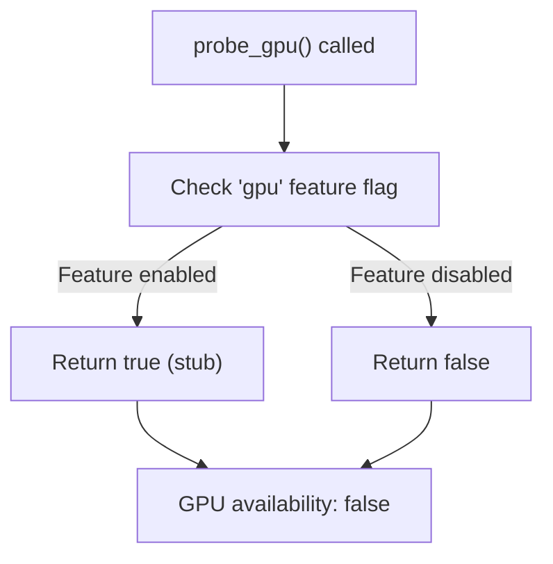
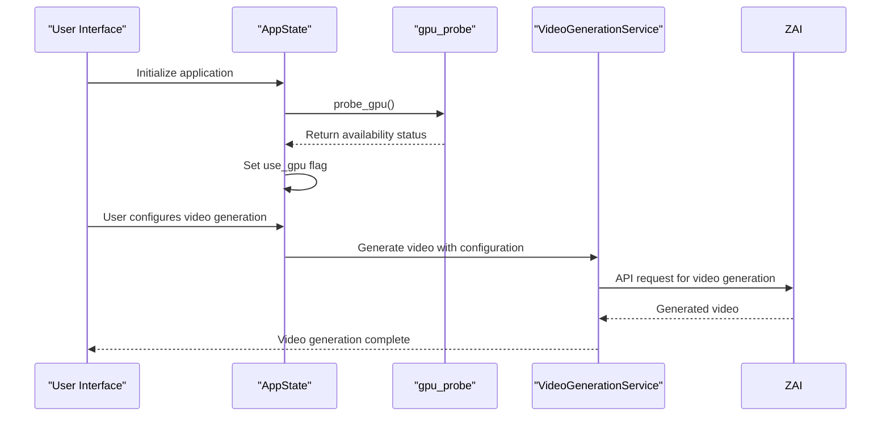

# GPU Detection and Acceleration Issues

<cite>
**Referenced Files in This Document**   
- [gpu_probe.rs](file://abogen-ui/crates/ui/services/gpu_probe.rs)
- [video.rs](file://src/video.rs)
- [Cargo.toml](file://Cargo.toml)
- [state.rs](file://abogen-ui/crates/ui/state.rs)
- [abogen-ui/Cargo.toml](file://abogen-ui/crates/ui/Cargo.toml)
</cite>

## Table of Contents
1. [Introduction](#introduction)
2. [GPU Detection Implementation](#gpu-detection-implementation)
3. [Feature Flag Configuration](#feature-flag-configuration)
4. [Integration with Video Generation](#integration-with-video-generation)
5. [Common GPU-Related Issues](#common-gpu-related-issues)
6. [Debugging Strategies](#debugging-strategies)
7. [Best Practices for GPU Feature Management](#best-practices-for-gpu-feature-management)
8. [Conclusion](#conclusion)

## Introduction
This document addresses GPU detection and acceleration issues in the VoxWeave application, focusing on the implementation and limitations of the GPU probing mechanism. The analysis covers the current stub implementation of GPU detection, its integration with video generation workflows, and potential pitfalls when GPU acceleration is assumed but not actually available. The document provides troubleshooting guidance, debugging techniques, and recommendations for robust GPU feature management.

## GPU Detection Implementation

The GPU detection functionality is implemented in the `gpu_probe.rs` service within the UI layer of the application. This implementation uses Rust's conditional compilation features to determine GPU availability based on the presence of the 'gpu' feature flag.

The current implementation is a stub that returns `true` whenever the 'gpu' feature is enabled at compile time, without performing any actual hardware detection or capability verification. This approach creates a potential for false positives where the system reports GPU availability even when no compatible GPU is present or properly configured.



**Diagram sources**
- [gpu_probe.rs](file://abogen-ui/crates/ui/services/gpu_probe.rs#L3-L13)

**Section sources**
- [gpu_probe.rs](file://abogen-ui/crates/ui/services/gpu_probe.rs#L1-L26)

## Feature Flag Configuration

The 'gpu' feature flag is defined in the Cargo.toml file of the abogen-ui crate and controls the conditional compilation of GPU-related functionality. When this feature is enabled, the `probe_gpu()` function returns `true`, indicating GPU availability to the rest of the application.

The feature flag system allows for compile-time configuration of GPU support, but requires proper setup during the build process. The absence of actual GPU probing logic means that the flag's value directly determines the reported GPU availability, making correct feature flag resolution critical.

```toml
[features]
default = []
gpu = []
real-tts = []
video-generation = ["reqwest"]
zai-video = ["reqwest", "video-generation"]
coqui-tts = ["cpal", "hound"]
```

To verify that the 'gpu' feature flag is correctly enabled during compilation, check the build command or configuration to ensure the feature is specified. When building the application, use:

```bash
cargo build --features gpu
```

Or for release builds:

```bash
cargo build --release --features gpu
```

**Section sources**
- [abogen-ui/Cargo.toml](file://abogen-ui/crates/ui/Cargo.toml#L24-L24)

## Integration with Video Generation

The GPU availability check integrates with the video generation pipeline in the `video.rs` module, which handles AI video rendering through the Z.ai API. While the current implementation assumes that GPU acceleration would be used when available, the actual video generation process is performed remotely via API calls rather than local GPU processing.

The application state maintains a `use_gpu` flag that is initialized based on the 'gpu' feature flag presence at compile time. This flag is then used in the UI to determine whether GPU acceleration options should be presented to the user.



**Diagram sources**
- [gpu_probe.rs](file://abogen-ui/crates/ui/services/gpu_probe.rs#L3-L13)
- [video.rs](file://src/video.rs#L0-L452)
- [state.rs](file://abogen-ui/crates/ui/state.rs#L215-L226)

**Section sources**
- [video.rs](file://src/video.rs#L0-L452)
- [state.rs](file://abogen-ui/crates/ui/state.rs#L20-L226)

## Common GPU-Related Issues

Several issues can arise from the current GPU detection implementation and its integration with the video generation pipeline:

### False Positive Detection
The most significant issue is false positive GPU detection. Since the `probe_gpu()` function only checks the feature flag without verifying actual GPU hardware or drivers, the system may report GPU availability when none exists. This can lead to user confusion when GPU-accelerated features fail at runtime.

### Missing CUDA Dependencies
Even with the 'gpu' feature enabled, the application may fail if CUDA libraries or compatible drivers are not installed on the system. The current implementation does not check for these dependencies, assuming their presence when the feature flag is set.

### Incompatible GPU Drivers
Outdated or incompatible GPU drivers can prevent proper acceleration even when compatible hardware is present. The stub implementation provides no mechanism to detect driver issues or compatibility problems.

### Runtime Failures
When GPU acceleration is assumed but not available, runtime failures may occur in components that expect GPU support. These failures can be difficult to diagnose since the root cause (false GPU detection) is separated from the point of failure.

### Feature Flag Mismatch
A mismatch between the intended GPU support and the actual build configuration can occur if the 'gpu' feature flag is enabled without ensuring that the target environment has the necessary GPU resources.

## Debugging Strategies

Effective debugging of GPU detection and acceleration issues requires a systematic approach to verify each component of the GPU support pipeline.

### Verify Feature Flag Resolution
Check that the 'gpu' feature flag is correctly resolved at compile time by examining the build output or using cargo commands:

```bash
cargo tree --features gpu
```

This command shows the dependency tree with the specified features, confirming that the 'gpu' feature is active.

### Enable Verbose Logging
Implement comprehensive logging around GPU detection and video generation to capture the flow of execution and any failures:

```rust
let gpu_available = probe_gpu();
log::info!("GPU detection result: {}", gpu_available);
if gpu_available {
    log::info!("GPU feature flag is enabled");
} else {
    log::info!("GPU feature flag is disabled");
}
```

### Validate GPU Support in Target Environment
Before relying on GPU acceleration, validate that the target environment has the necessary components:
- Compatible GPU hardware
- Properly installed GPU drivers
- Required runtime libraries (CUDA, cuDNN, etc.)
- Sufficient VRAM for the intended operations

### Test Without GPU Feature
To isolate issues related to the GPU detection logic, build and test the application without the 'gpu' feature enabled:

```bash
cargo build --no-default-features --features coqui-tts
```

This helps determine if issues are specifically related to GPU handling or exist in the core functionality.

### Check Environment Variables
Verify that any required environment variables for GPU operation are properly set, such as CUDA-related variables or API keys for cloud-based GPU services.

## Best Practices for GPU Feature Management

To improve the reliability and robustness of GPU feature management in VoxWeave, consider the following best practices:

### Implement Actual GPU Probing
Replace the stub implementation with actual GPU detection logic that verifies the presence of compatible hardware and drivers. This could include:
- Querying system information for GPU devices
- Checking driver versions and compatibility
- Testing basic GPU operations
- Verifying required libraries are available

### Add Fallback Mechanisms
Implement graceful fallback to CPU-only processing when GPU acceleration is requested but not available. This ensures functionality even when GPU resources are insufficient:

```rust
let gpu_available = probe_gpu() && verify_gpu_functionality();
if gpu_available {
    // Use GPU acceleration
} else {
    // Fall back to CPU processing
    log::warn!("GPU not available, using CPU fallback");
}
```

### Improve Feature Flag Documentation
Clearly document the requirements and implications of enabling the 'gpu' feature flag, including:
- Required hardware specifications
- Necessary driver versions
- Expected performance improvements
- Potential compatibility issues

### Implement Runtime GPU Checks
Add runtime verification of GPU functionality rather than relying solely on compile-time feature flags. This allows the application to adapt to the actual runtime environment.

### Provide Clear User Feedback
Communicate GPU status and capabilities clearly to users through the interface, including:
- Current GPU detection status
- Performance expectations
- Troubleshooting guidance for GPU issues
- Options to manually override GPU usage

### Comprehensive Testing
Implement thorough testing of both GPU-enabled and GPU-disabled configurations to ensure consistent behavior across different environments.

## Conclusion
The current GPU detection implementation in VoxWeave relies on a compile-time feature flag without actual hardware verification, creating potential for false positives and runtime issues. While this approach simplifies initial implementation, it requires careful management to avoid user confusion and system failures. By implementing actual GPU probing, adding robust fallback mechanisms, and improving documentation and user feedback, the reliability of GPU feature management can be significantly enhanced. The integration with video generation should account for the possibility of GPU unavailability and provide graceful degradation to ensure consistent functionality across different hardware configurations.