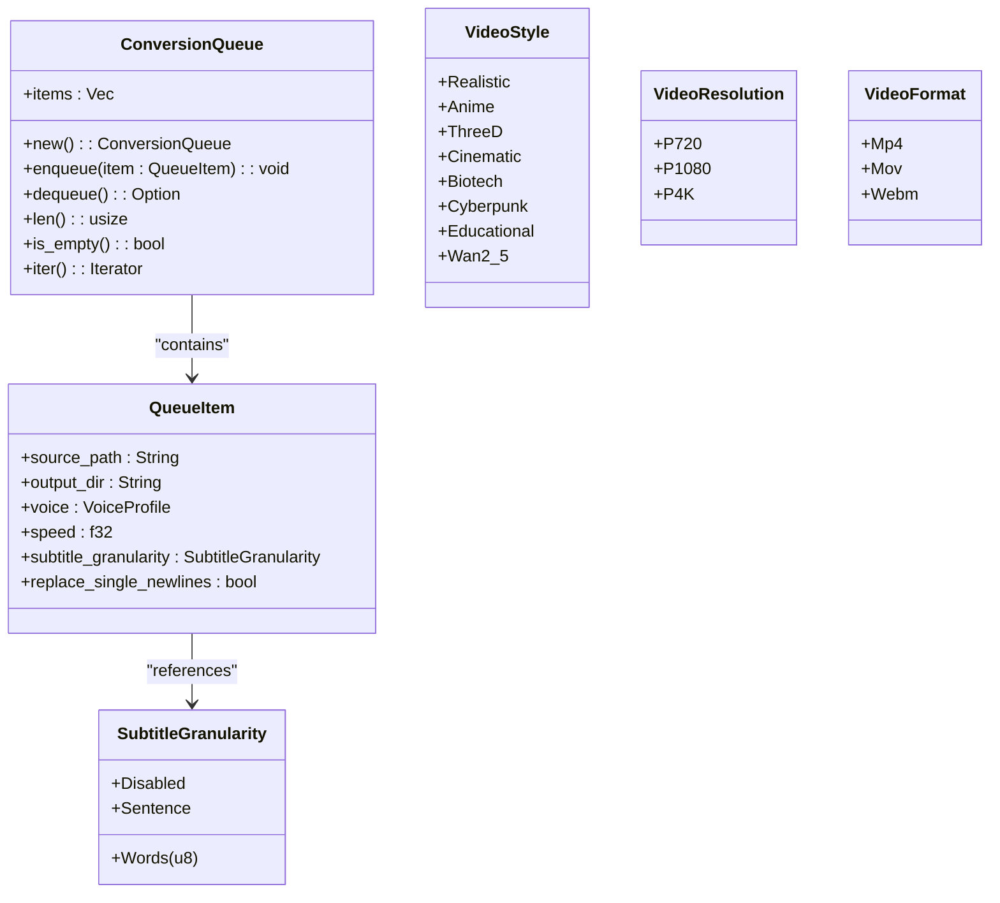
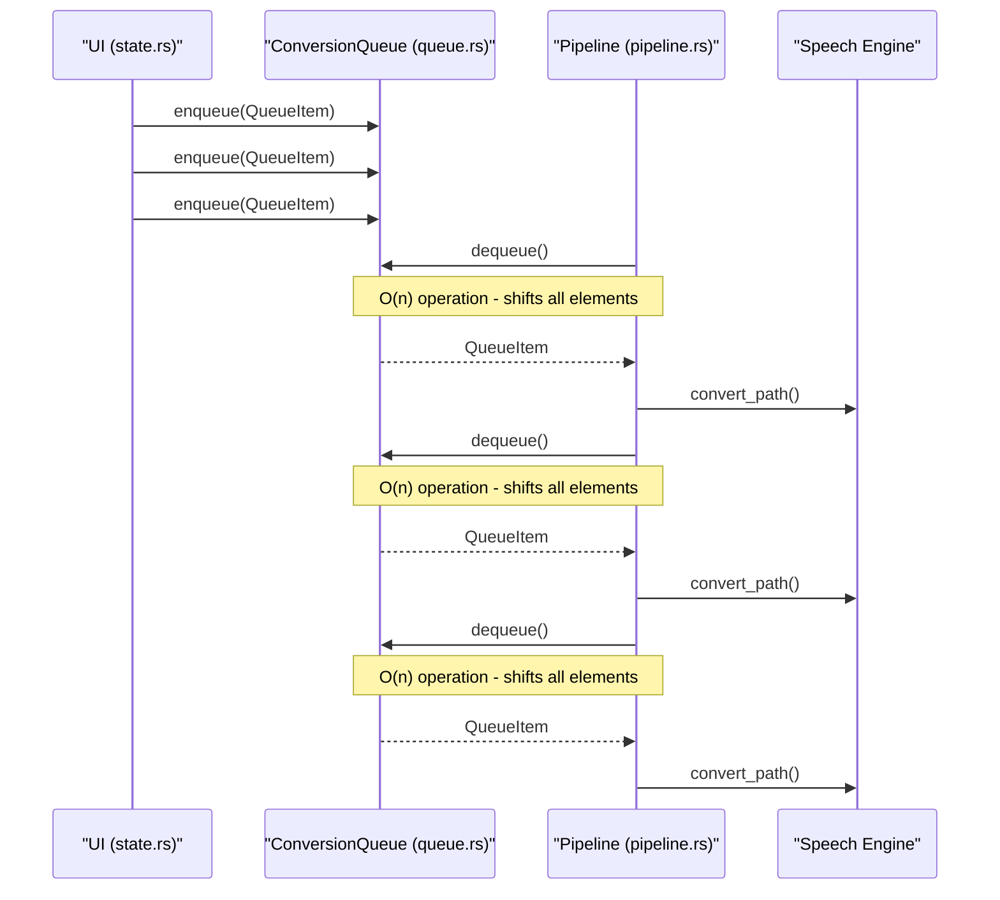
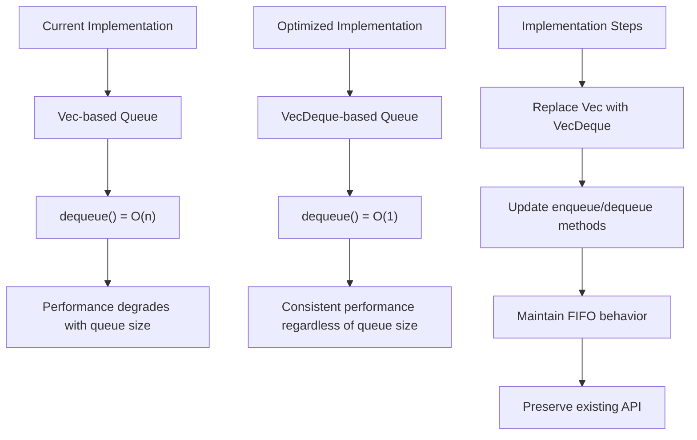
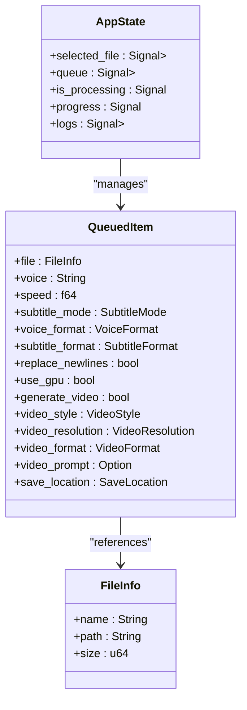
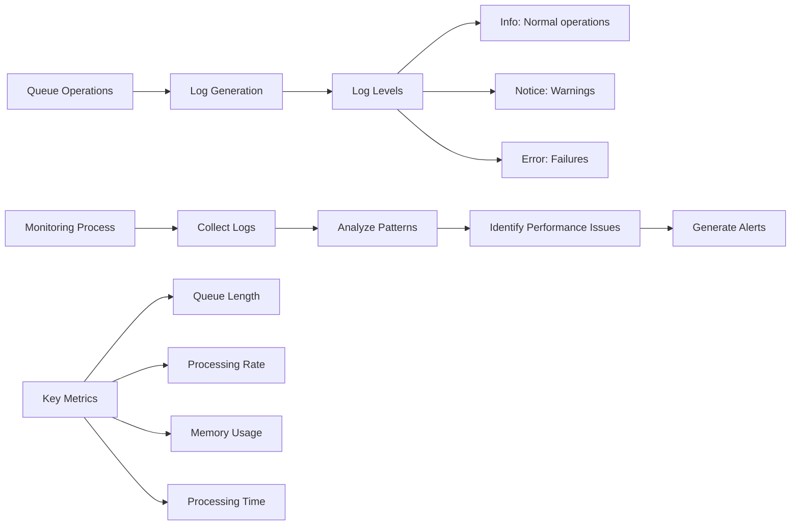

# Queue Processing and Backlog Management

<cite>
**Referenced Files in This Document**   
- [queue.rs](file://src/queue.rs)
- [state.rs](file://abogen-ui/crates/ui/state.rs)
- [pipeline.rs](file://src/pipeline.rs)
- [tts_service.rs](file://abogen-ui/crates/ui/services/tts_service.rs)
- [queue_modal.rs](file://abogen-ui/crates/ui/components/queue_modal.rs)
- [test_output.txt](file://test_output.txt)
</cite>

## Table of Contents
1. [Introduction](#introduction)
2. [Queue Implementation Analysis](#queue-implementation-analysis)
3. [Performance Impact of O(n) Dequeue Operation](#performance-impact-of-on-dequeue-operation)
4. [Symptoms of Queue Performance Issues](#symptoms-of-queue-performance-issues)
5. [Optimization Strategies](#optimization-strategies)
6. [Monitoring and Diagnostics](#monitoring-and-diagnostics)
7. [UI and CLI Integration](#ui-and-cli-integration)
8. [Best Practices](#best-practices)
9. [Conclusion](#conclusion)

## Introduction
This document provides a comprehensive analysis of queue processing performance issues in VoxWeave, focusing on the FIFO-based queue implementation and its impact on system performance during high-throughput scenarios. The analysis covers the current implementation's limitations, performance implications, and recommended optimization strategies to ensure efficient processing and backlog management.

## Queue Implementation Analysis

The VoxWeave application implements a FIFO (First-In-First-Out) queue system for managing text-to-speech and video generation tasks. The core queue functionality is implemented in the `ConversionQueue` struct within `queue.rs`, which uses a `Vec<QueueItem>` as its underlying data structure.

**Diagram sources**
- [queue.rs](file://src/queue.rs#L63-L132)

**Section sources**
- [queue.rs](file://src/queue.rs#L63-L132)

## Performance Impact of O(n) Dequeue Operation

The current implementation of the `dequeue` operation in `ConversionQueue` has significant performance implications due to its O(n) time complexity. When an item is removed from the front of the queue using `self.items.remove(0)`, all remaining elements must be shifted one position to the left to fill the gap.

This operation becomes increasingly expensive as the queue size grows, leading to performance degradation in high-throughput scenarios. The O(n) complexity means that processing time increases linearly with queue size, creating a bottleneck in the system's ability to handle large backlogs efficiently.

The performance impact is particularly noticeable in the `convert_queue` function in `pipeline.rs`, which processes items sequentially by repeatedly calling `dequeue()`. As each dequeue operation requires shifting all remaining elements, the total time complexity for processing n items becomes O(n²), significantly impacting overall throughput.

**Diagram sources**
- [queue.rs](file://src/queue.rs#L108-L112)
- [pipeline.rs](file://src/pipeline.rs#L62)
- [state.rs](file://abogen-ui/crates/ui/state.rs#L100-L150)

**Section sources**
- [queue.rs](file://src/queue.rs#L108-L112)
- [pipeline.rs](file://src/pipeline.rs#L62)

## Symptoms of Queue Performance Issues

When the queue grows large, several performance symptoms become apparent:

1. **Increasing processing time per item**: As the queue size increases, each subsequent item takes longer to process due to the cumulative effect of O(n) dequeue operations.

2. **Memory bloat**: The `Vec` implementation stores all queue items in contiguous memory, which can lead to memory pressure when handling large numbers of items.

3. **UI responsiveness degradation**: In the web interface, large queues can cause the UI to become unresponsive as operations block the main thread.

4. **Backlog accumulation**: During peak load periods, the system may be unable to keep up with incoming requests, leading to growing backlogs.

5. **Inconsistent processing rates**: Processing speed decreases as the queue grows, creating unpredictable performance characteristics.

The test output in `test_output.txt` confirms the basic functionality of the queue implementation but does not reveal performance characteristics under load, as the test cases use small queue sizes.

**Section sources**
- [test_output.txt](file://test_output.txt#L0-L37)
- [queue.rs](file://src/queue.rs#L129-L155)

## Optimization Strategies

### VecDeque Implementation

The most effective optimization is to replace the `Vec`-based implementation with `VecDeque`, which provides O(1) amortized time complexity for both enqueue and dequeue operations. This change would eliminate the performance bottleneck in the dequeue operation.

**Diagram sources**
- [queue.rs](file://src/queue.rs#L63-L132)

### UI Pagination via State Management

An alternative approach is to implement pagination in the UI layer through `state.rs`, limiting the in-memory queue size and loading items in batches. This strategy reduces memory pressure and improves UI responsiveness.

The `AppState` struct in `state.rs` manages the queue as a `Signal<Vec<QueuedItem>>`, which can be modified to support pagination by:

1. Implementing virtual scrolling for large queues
2. Loading queue items in batches from persistent storage
3. Maintaining only a subset of items in memory at any time

**Diagram sources**
- [state.rs](file://abogen-ui/crates/ui/state.rs#L100-L150)

**Section sources**
- [state.rs](file://abogen-ui/crates/ui/state.rs#L100-L150)
- [queue_modal.rs](file://abogen-ui/crates/ui/components/queue_modal.rs#L0-L194)

## Monitoring and Diagnostics

Effective monitoring of queue performance requires tracking key metrics:

- Queue length over time
- Processing rate (items per second)
- Average processing time per item
- Memory usage related to queue storage

The logging system implemented in both `queue.rs` and `state.rs` provides basic diagnostic capabilities. Log entries with different levels (Info, Notice, Warning, Error) can be used to track queue operations and identify performance issues.

**Section sources**
- [queue.rs](file://src/queue.rs#L63-L75)
- [state.rs](file://abogen-ui/crates/ui/state.rs#L200-L250)
- [test_output.txt](file://test_output.txt#L0-L37)

## UI and CLI Integration

The queue system serves as a common interface between the CLI pipeline and UI components, ensuring consistent behavior across different interfaces. The `ConversionQueue` struct in `queue.rs` is used by both the CLI pipeline in `pipeline.rs` and the UI services in `tts_service.rs`.

This integration ensures that:
- Both interfaces follow the same FIFO processing order
- Queue operations have consistent semantics
- Error handling is uniform across interfaces
- Performance characteristics are predictable

The `process_queue` function in `tts_service.rs` demonstrates how the UI layer interacts with the queue system, processing items while maintaining UI responsiveness through asynchronous operations.

**Section sources**
- [pipeline.rs](file://src/pipeline.rs#L62)
- [tts_service.rs](file://abogen-ui/crates/ui/services/tts_service.rs#L211-L240)
- [queue.rs](file://src/queue.rs#L108-L112)

## Best Practices

### Queue Size Limits
Implement reasonable limits on queue size to prevent memory exhaustion and maintain system responsiveness. This can be achieved through:
- Configuration-based maximum queue size
- Automatic rejection of new items when limits are reached
- Warning notifications when approaching limits

### Background Processing
Ensure queue processing occurs in background threads to maintain UI responsiveness, as demonstrated in the `process_queue` implementation in `tts_service.rs` which uses `tokio::task::spawn_blocking` for CPU-intensive operations.

### User Feedback
Provide clear feedback during long operations:
- Progress indicators showing processing status
- Estimated completion times
- Ability to cancel ongoing operations
- Detailed logs of processing activities

### Error Handling
Implement robust error handling for queue operations:
- Graceful handling of failed processing attempts
- Persistence of queue state across application restarts
- Recovery mechanisms for interrupted operations

## Conclusion
The current FIFO queue implementation in VoxWeave presents a significant performance bottleneck due to the O(n) complexity of the dequeue operation. This design choice leads to degraded performance as queue size increases, affecting both processing latency and system responsiveness.

The recommended optimization strategies include:
1. Migrating from `Vec` to `VecDeque` for O(1) dequeue operations
2. Implementing UI pagination to limit in-memory queue size
3. Enhancing monitoring capabilities to detect performance issues early

By addressing these performance concerns, VoxWeave can maintain consistent processing rates even under high load, providing a better user experience and more predictable system behavior. The integration between CLI and UI queue systems should be preserved while implementing these optimizations to ensure consistent behavior across all interfaces.