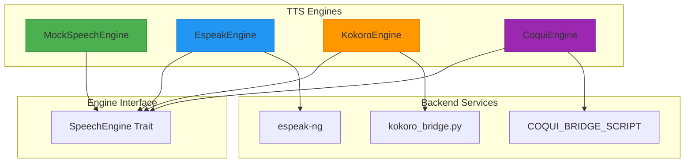
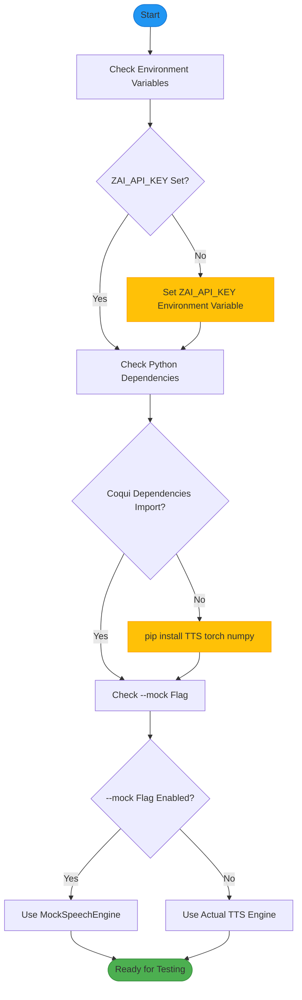
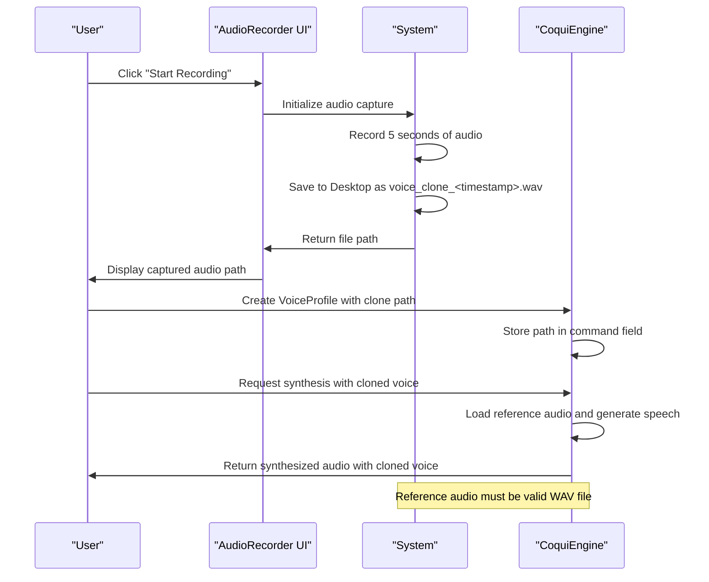

# Text-to-Speech Engine Issues

<cite>
**Referenced Files in This Document**   
- [tts.rs](file://src/tts.rs)
- [coqui_tts.rs](file://src/coqui_tts.rs)
- [kokoro_bridge.py](file://python/kokoro_bridge.py)
- [audio_recorder.rs](file://abogen-ui/crates/ui/components/audio_recorder.rs)
- [tts_service.rs](file://abogen-ui/crates/ui/services/tts_service.rs)
- [zai_video.rs](file://abogen-ui/crates/ui/services/zai_video.rs)
- [test_output.txt](file://test_output.txt)
- [COQUI_USAGE_GUIDE.md](file://COQUI_USAGE_GUIDE.md)
</cite>

## Table of Contents
1. [Introduction](#introduction)
2. [Core Engine Architecture](#core-engine-architecture)
3. [Common TTS Engine Issues](#common-tts-engine-issues)
4. [Configuration and Environment Troubleshooting](#configuration-and-environment-troubleshooting)
5. [Voice Selection and Output Configuration](#voice-selection-and-output-configuration)
6. [Audio Generation Performance Issues](#audio-generation-performance-issues)
7. [CoquiTTS Voice Cloning Guide](#coqui-tts-voice-cloning-guide)
8. [Kokoro Bridge Integration](#kokoro-bridge-integration)
9. [Testing and Debugging Strategies](#testing-and-debugging-strategies)
10. [Conclusion](#conclusion)

## Introduction
This document provides comprehensive troubleshooting guidance for the VoxWeave text-to-speech (TTS) engine, focusing on its multi-engine architecture. The system supports three primary TTS engines: espeak-ng for basic synthesis, Kokoro for high-quality voices, and CoquiTTS for advanced voice cloning capabilities. Users may encounter various issues across these engines, ranging from missing system dependencies to Python environment problems and voice cloning failures. This guide addresses common error patterns, configuration issues, and performance problems, providing specific solutions for each scenario. The document also covers the use of the --mock flag for testing without external dependencies and offers detailed guidance on recording voice samples for CoquiTTS integration.

## Core Engine Architecture
The VoxWeave TTS system implements a modular architecture with three distinct speech engines, each serving different use cases and quality requirements. The architecture follows a trait-based design pattern where all engines implement the SpeechEngine trait, ensuring a consistent interface for audio synthesis across different backends. The MockSpeechEngine provides a testing alternative that writes text directly to files without external dependencies, while the EspeakEngine interfaces with the espeak-ng system utility for basic speech synthesis. The KokoroEngine and CoquiEngine represent the advanced TTS capabilities, communicating with their respective Python-based backends through stdin/stdout JSON payloads. This design allows for flexible engine selection based on user requirements, from simple text-to-speech conversion to sophisticated voice cloning applications.

**Diagram sources**
- [tts.rs](file://src/tts.rs#L101-L150)
- [coqui_tts.rs](file://src/coqui_tts.rs#L10-L115)

**Section sources**
- [tts.rs](file://src/tts.rs#L1-L522)
- [coqui_tts.rs](file://src/coqui_tts.rs#L1-L115)

## Common TTS Engine Issues
Users of the VoxWeave TTS system may encounter several common issues related to system dependencies, Python environment configuration, and voice cloning failures. The most frequent problem involves missing espeak-ng system dependencies, which prevents the EspeakEngine from functioning properly. This typically manifests as a "command execution failed" error when attempting to synthesize speech. Another common issue relates to Python environment problems with the kokoro bridge, where missing Python packages or incorrect Python paths prevent the KokoroEngine from initializing. CoquiTTS voice cloning failures often occur due to missing reference audio files or incorrect file paths stored in the VoiceProfile's command field. These issues are typically accompanied by "Speaker reference audio not found" error messages during synthesis attempts.

**Section sources**
- [tts.rs](file://src/tts.rs#L15-L50)
- [kokoro_bridge.py](file://python/kokoro_bridge.py#L1-L89)
- [COQUI_USAGE_GUIDE.md](file://COQUI_USAGE_GUIDE.md#L1-L672)

## Configuration and Environment Troubleshooting
Configuration issues in the VoxWeave TTS system often stem from environment variable misconfiguration or missing API keys. One common error pattern is the "ZAI_API_KEY not set" message, which occurs when attempting to use video generation features without proper authentication. This can be resolved by setting the ZAI_API_KEY environment variable or ensuring the appropriate configuration file contains the required credentials. Python import failures, such as "failed to import coqui dependencies," typically indicate missing Python packages and can be addressed by installing the required dependencies using pip install TTS torch numpy. For the --mock flag usage, users can test the system without external dependencies by enabling the MockSpeechEngine, which bypasses all external TTS services and writes raw text to output files for verification purposes.

**Diagram sources**
- [zai_video.rs](file://abogen-ui/crates/ui/services/zai_video.rs#L49-L94)
- [tts.rs](file://src/tts.rs#L101-L150)

**Section sources**
- [zai_video.rs](file://abogen-ui/crates/ui/services/zai_video.rs#L0-L235)
- [COQUI_USAGE_GUIDE.md](file://COQUI_USAGE_GUIDE.md#L1-L672)

## Voice Selection and Output Configuration
Voice selection and output format generation in VoxWeave are controlled through the VoiceProfile system and output format conversion utilities. Users can select from various voice options, including espeak-ng voices, Kokoro voices, and CoquiTTS voices, each identified by unique voice IDs. The system supports multiple output formats, including WAV, MP3, and FLAC, with conversion handled by ffmpeg when necessary. Configuration issues may arise when attempting to generate non-WAV formats without ffmpeg installed, resulting in conversion failures. The system automatically handles format conversion through the convert_audio_format function, which invokes ffmpeg to transform WAV output from the TTS engines into the requested format. Users should ensure ffmpeg is available in their system path when requesting MP3 or FLAC output formats.

**Section sources**
- [tts_service.rs](file://abogen-ui/crates/ui/services/tts_service.rs#L70-L103)
- [tts.rs](file://src/tts.rs#L60-L102)

## Audio Generation Performance Issues
Performance issues in the VoxWeave TTS system are often related to GPU availability and memory usage during voice synthesis. Audio generation timeouts can occur when the system lacks sufficient computational resources, particularly when using GPU-accelerated models like CoquiTTS. Quality issues may manifest as distorted audio or incomplete synthesis, typically due to memory constraints or improper device configuration. Users experiencing performance problems should first verify their GPU availability using the probe_gpu function and ensure proper device configuration through environment variables like VOXWEAVE_COQUI_DEVICE. For systems with limited memory, switching to CPU mode by setting VOXWEAVE_COQUI_DEVICE="cpu" can prevent out-of-memory errors, albeit with reduced performance. Monitoring system resources during synthesis can help identify bottlenecks and optimize the configuration accordingly.

**Section sources**
- [gpu_probe.rs](file://abogen-ui/crates/ui/services/gpu_probe.rs#L0-L24)
- [coqui_tts.rs](file://src/coqui_tts.rs#L10-L115)

## CoquiTTS Voice Cloning Guide
The CoquiTTS voice cloning feature allows users to create personalized voices using reference audio recordings. To use this functionality, users must first record a voice sample using the AudioRecorder component, which captures audio from the microphone and saves it as a WAV file on the desktop. The recorded audio file serves as the reference for voice cloning and must be provided when creating a VoiceProfile with the coqui_clone method. The path to the reference audio is stored in the VoiceProfile's command field and passed to the CoquiEngine during synthesis. Users should ensure the recording environment is quiet and speak clearly for optimal cloning results. The system supports voice cloning in multiple languages, with language selection controlled by the lang parameter in the VoiceProfile constructor.

**Diagram sources**
- [audio_recorder.rs](file://abogen-ui/crates/ui/components/audio_recorder.rs#L25-L61)
- [coqui_tts.rs](file://src/coqui_tts.rs#L10-L115)

**Section sources**
- [audio_recorder.rs](file://abogen-ui/crates/ui/components/audio_recorder.rs#L1-L327)
- [COQUI_USAGE_GUIDE.md](file://COQUI_USAGE_GUIDE.md#L1-L672)

## Kokoro Bridge Integration
The kokoro_bridge.py integration enables communication between the Rust-based VoxWeave application and the Python-based Kokoro TTS engine. The bridge script accepts JSON payloads via stdin containing text, voice parameters, and output specifications, then returns synthesis results via stdout. Integration issues typically stem from Python environment problems, such as missing dependencies or incorrect Python paths. The system uses the VOXWEAVE_KOKORO_PYTHON environment variable to specify the Python interpreter, defaulting to "python3" if not set. Users may encounter import errors if the kokoro package is not installed in the specified Python environment. The bridge handles audio synthesis by processing text through the KPipeline, concatenating audio segments, and writing the final output as a WAV file with proper headers and encoding.

**Section sources**
- [kokoro_bridge.py](file://python/kokoro_bridge.py#L1-L89)
- [tts.rs](file://src/tts.rs#L194-L232)

## Testing and Debugging Strategies
Effective testing and debugging of the VoxWeave TTS system involves several strategies to isolate and resolve issues. The test_output.txt file provides valuable information about test execution, showing successful test runs and any failures that occurred. Unit tests in the coqui_integration.rs file verify the basic functionality of the CoquiEngine and voice profile creation. For debugging, users should first check the test_output.txt file to confirm the system builds and tests successfully. When encountering issues, enabling verbose logging can provide detailed information about the synthesis process. The --mock flag is particularly useful for testing the application flow without external dependencies, allowing developers to verify the UI and pipeline functionality independently of the TTS engines. Additionally, running the test_coqui.py script can verify Python dependency installation and CoquiTTS functionality.

**Section sources**
- [test_output.txt](file://test_output.txt#L1-L37)
- [coqui_integration.rs](file://tests/coqui_integration.rs#L1-L147)

## Conclusion
The VoxWeave TTS system offers a robust multi-engine architecture capable of handling various text-to-speech requirements, from basic synthesis to advanced voice cloning. By understanding the common issues and their solutions, users can effectively troubleshoot problems related to system dependencies, Python environment configuration, and voice cloning failures. The comprehensive error handling and modular design allow for targeted debugging and resolution of performance issues. With proper configuration and adherence to the troubleshooting guidelines provided in this document, users can leverage the full capabilities of the VoxWeave TTS system for their audio generation needs.