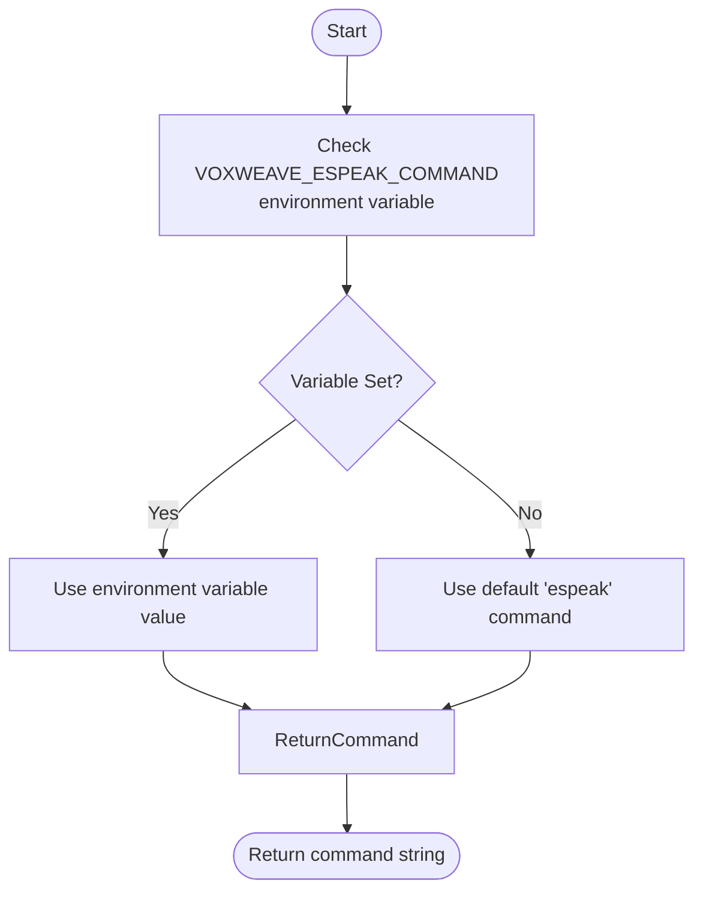
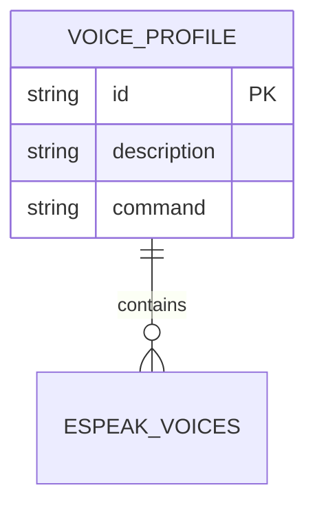
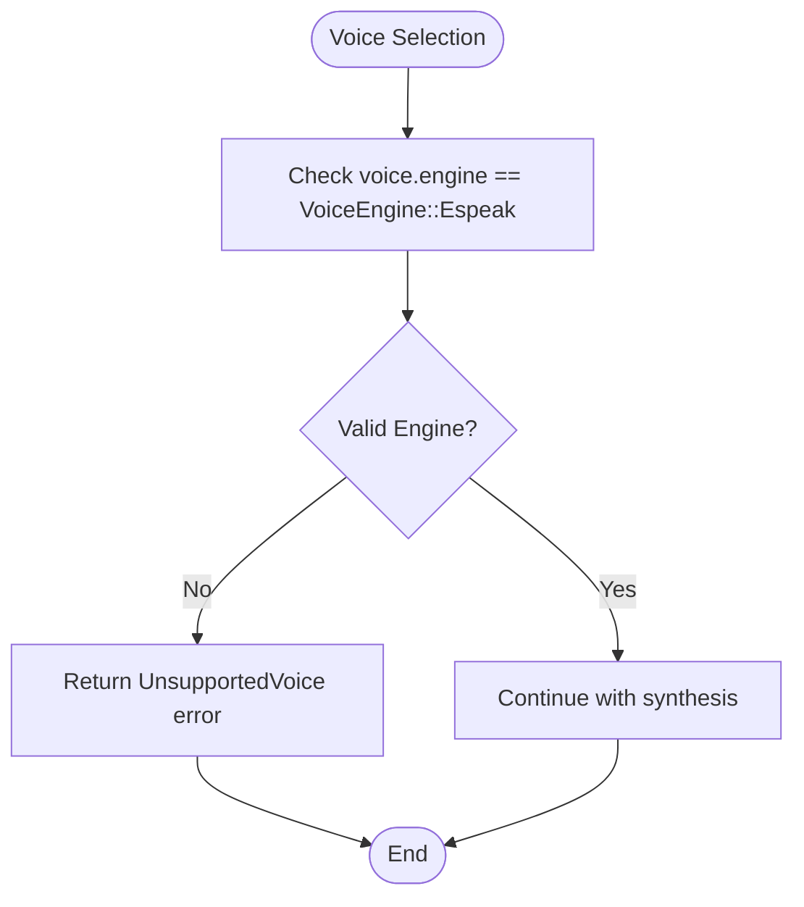
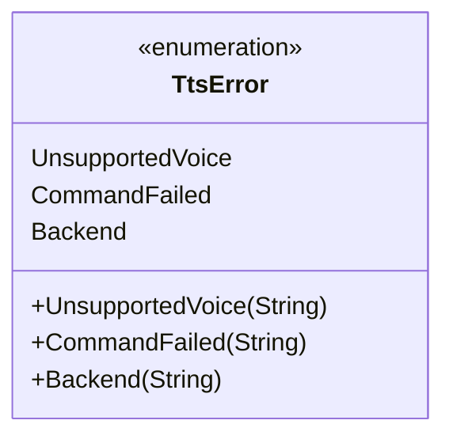
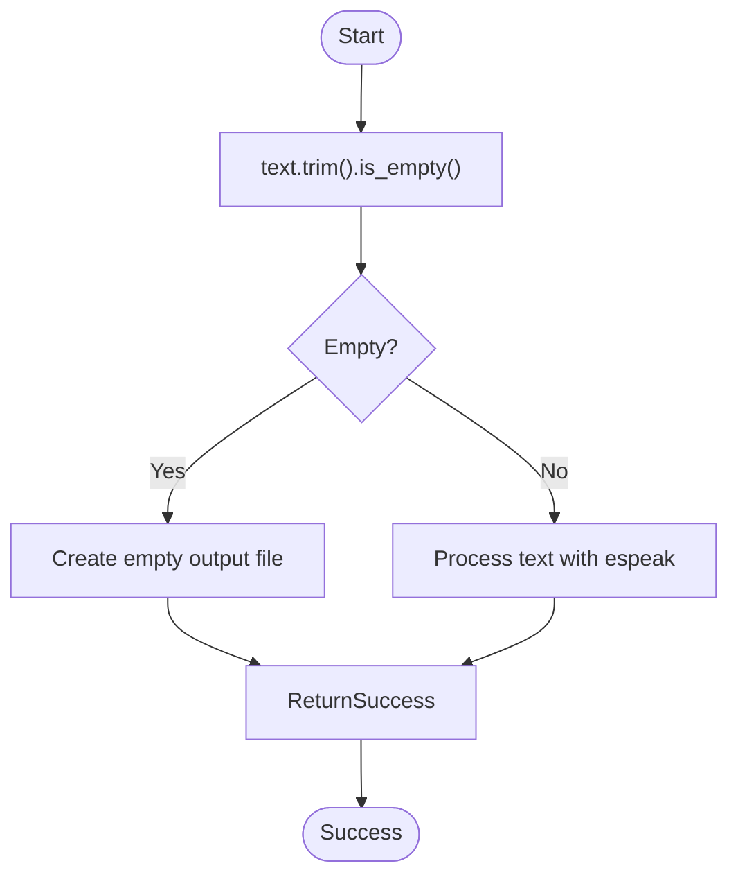
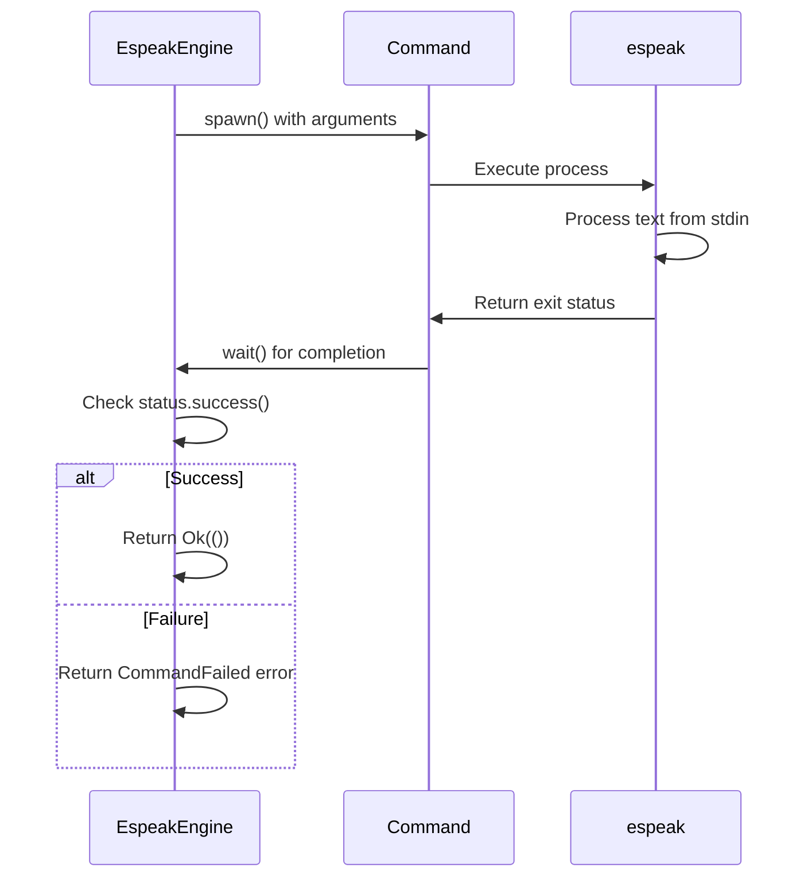

# espeak-ng Integration Issues

<cite>
**Referenced Files in This Document**   
- [tts.rs](file://src/tts.rs)
- [config.rs](file://src/config.rs)
</cite>

## Table of Contents
1. [Introduction](#introduction)
2. [Common Integration Issues](#common-integration-issues)
3. [Command Configuration and Environment Variables](#command-configuration-and-environment-variables)
4. [Voice Selection and Profile Management](#voice-selection-and-profile-management)
5. [Error Handling in EspeakEngine](#error-handling-in-espeakengine)
6. [Text Input Processing](#text-input-processing)
7. [Audio Output and Process Exit Status](#audio-output-and-process-exit-status)
8. [Troubleshooting Guide](#troubleshooting-guide)

## Introduction
This document addresses common issues encountered when integrating espeak-ng with the VoxWeave text-to-speech system. It covers configuration problems, voice selection errors, command execution failures, and proper error handling within the EspeakEngine implementation. The document provides solutions for ensuring successful audio generation through proper system setup and environment configuration.

## Common Integration Issues
Users may encounter several common problems when using espeak-ng with VoxWeave:

1. **Missing espeak-ng installation**: The system fails to locate the espeak command when espeak-ng is not installed
2. **Incorrect command path**: Default command resolution fails due to non-standard installation paths
3. **Voice selection errors**: Requested voice IDs do not match available espeak voices
4. **Empty text input**: Processing empty or whitespace-only text inputs
5. **Special character handling**: Text containing special characters that may affect espeak processing

The system includes a mock mode for testing without requiring espeak-ng installation, as evidenced by the MockSpeechEngine implementation.

**Section sources**
- [tts.rs](file://src/tts.rs#L101-L112)

## Command Configuration and Environment Variables
The EspeakEngine implementation provides flexible command resolution through environment variable configuration.

### VOXWEAVE_ESPEAK_COMMAND Environment Variable
The `VOXWEAVE_ESPEAK_COMMAND` environment variable allows users to override the default 'espeak' command with a custom executable path or name. This is particularly useful when:
- espeak-ng is installed at a non-standard location
- The executable name differs from the default 'espeak'
- Multiple versions of espeak are available on the system

The command resolution follows this priority:
1. Value from VOXWEAVE_ESPEAK_COMMAND environment variable
2. Default 'espeak' command



**Diagram sources**
- [tts.rs](file://src/tts.rs#L105-L108)

### Verifying espeak-ng Installation
To verify proper espeak-ng installation, users should execute the following system commands:

```bash
# Check if espeak is available
which espeak

# Test espeak functionality
espeak --version

# List available voices
espeak --voices
```

On macOS, install espeak-ng using Homebrew:
```bash
brew install espeak-ng
```

On Linux, use the system package manager:
```bash
sudo apt-get install espeak-ng
```

## Voice Selection and Profile Management
VoxWeave manages voice profiles through predefined voice configurations and proper voice ID mapping.

### Default Voice Profiles
The ESPEAK_VOICES constant defines the default voice profiles available in the system:



**Diagram sources**
- [tts.rs](file://src/tts.rs#L350-L363)

### Voice ID Mapping
Voice IDs in VoxWeave map directly to espeak voice identifiers. The current implementation supports the following voice profiles:

- **en-us**: English (US)
- **en-gb**: English (UK)
- **en-au**: English (Australia)
- **es-es**: Spanish
- **fr-fr**: French
- **de-de**: German
- **it-it**: Italian
- **pt-br**: Portuguese (Brazil)
- **tr-tr**: Turkish
- **hi-in**: Hindi
- **ja-jp**: Japanese
- **zh-cn**: Chinese (Mandarin)

The voice selection process validates that the requested voice engine matches Espeak before proceeding with synthesis.



**Diagram sources**
- [tts.rs](file://src/tts.rs#L115-L117)

**Section sources**
- [tts.rs](file://src/tts.rs#L350-L363)

## Error Handling in EspeakEngine
The EspeakEngine implementation includes comprehensive error handling for various failure scenarios.

### Error Types
The TtsError enum defines three primary error types relevant to espeak-ng integration:



**Diagram sources**
- [tts.rs](file://src/tts.rs#L2-L15)

### CommandFailed Error
The CommandFailed error occurs when:
- The espeak command cannot be executed
- The process returns a non-zero exit status
- External command execution fails

This error captures the underlying system error message for diagnostic purposes.

### Backend Error
The Backend error type handles internal processing failures such as:
- I/O operations on audio files
- Writing to process stdin
- File system operations

## Text Input Processing
The EspeakEngine implementation includes specific handling for text input processing issues.

### Empty Input Handling
When text input is empty or contains only whitespace, the system handles this gracefully by creating an empty output file:



**Diagram sources**
- [tts.rs](file://src/tts.rs#L119-L121)

Special characters in the input text are passed directly to espeak through stdin, allowing espeak-ng to handle character encoding and pronunciation.

**Section sources**
- [tts.rs](file://src/tts.rs#L119-L121)

## Audio Output and Process Exit Status
The EspeakEngine monitors the espeak process exit status to ensure successful audio generation.

### Process Execution Flow


**Diagram sources**
- [tts.rs](file://src/tts.rs#L152-L192)

### Exit Status Codes
The system checks the exit status of the espeak process:
- **Success (0)**: Audio generation completed successfully
- **Non-zero**: Command execution failed

When the process fails, the stderr output is captured and returned as part of the CommandFailed error message, providing valuable diagnostic information.

## Troubleshooting Guide
Follow this step-by-step guide to resolve common espeak-ng integration issues:

### Missing espeak-ng Installation
1. Verify espeak-ng is installed:
```bash
which espeak
```
2. Install espeak-ng if missing:
```bash
# macOS
brew install espeak-ng

# Linux
sudo apt-get install espeak-ng
```

### Command Path Issues
1. Check if espeak is in the system PATH:
```bash
which espeak
```
2. If espeak is installed but not found, set the VOXWEAVE_ESPEAK_COMMAND environment variable:
```bash
export VOXWEAVE_ESPEAK_COMMAND="/path/to/espeak"
```

### Voice Selection Errors
1. List available espeak voices:
```bash
espeak --voices
```
2. Verify the requested voice ID matches available voices
3. Use one of the supported voice IDs from ESPEAK_VOICES

### Testing the Integration
1. Test espeak functionality independently:
```bash
echo "Hello world" | espeak -w test.wav
```
2. Run VoxWeave in mock mode to isolate issues:
```bash
./target/debug/voxweave convert samples/example.txt --mock --voice en-us
```
3. Remove --mock flag once espeak-ng is confirmed working

### Debugging Command Execution
1. Enable verbose output if available
2. Check the exact command being executed in the source code
3. Verify all command arguments are properly formatted
4. Ensure the output directory is writable

**Section sources**
- [tts.rs](file://src/tts.rs#L152-L192)
- [tts.rs](file://src/tts.rs#L267-L298)