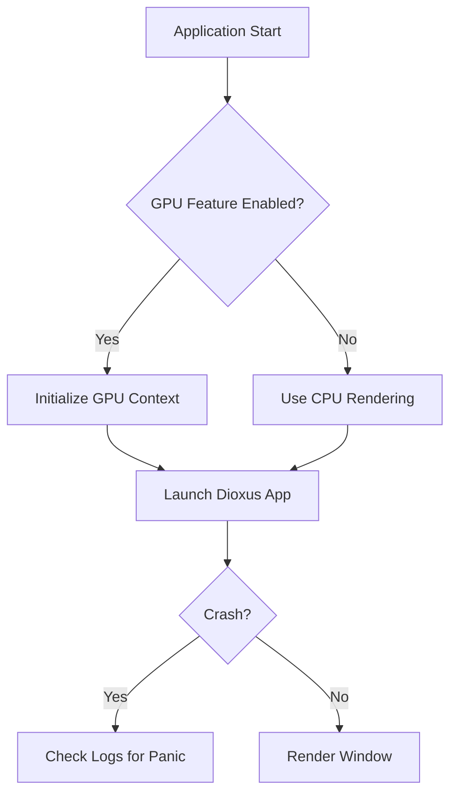
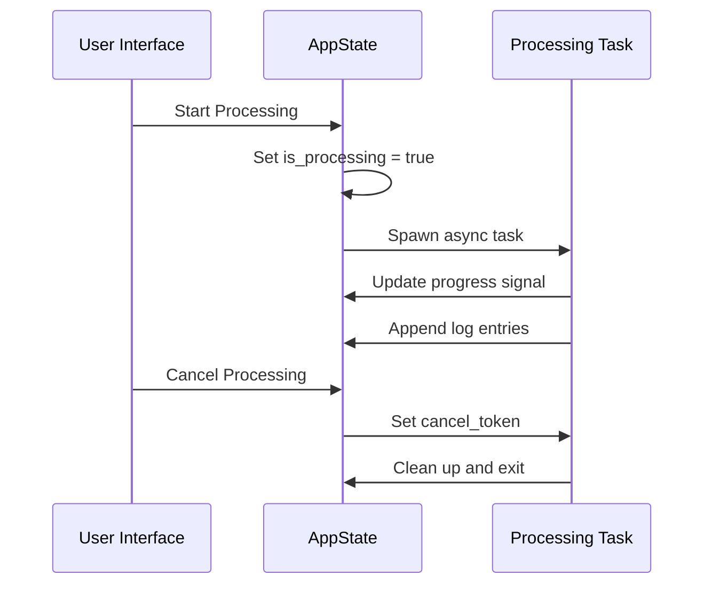
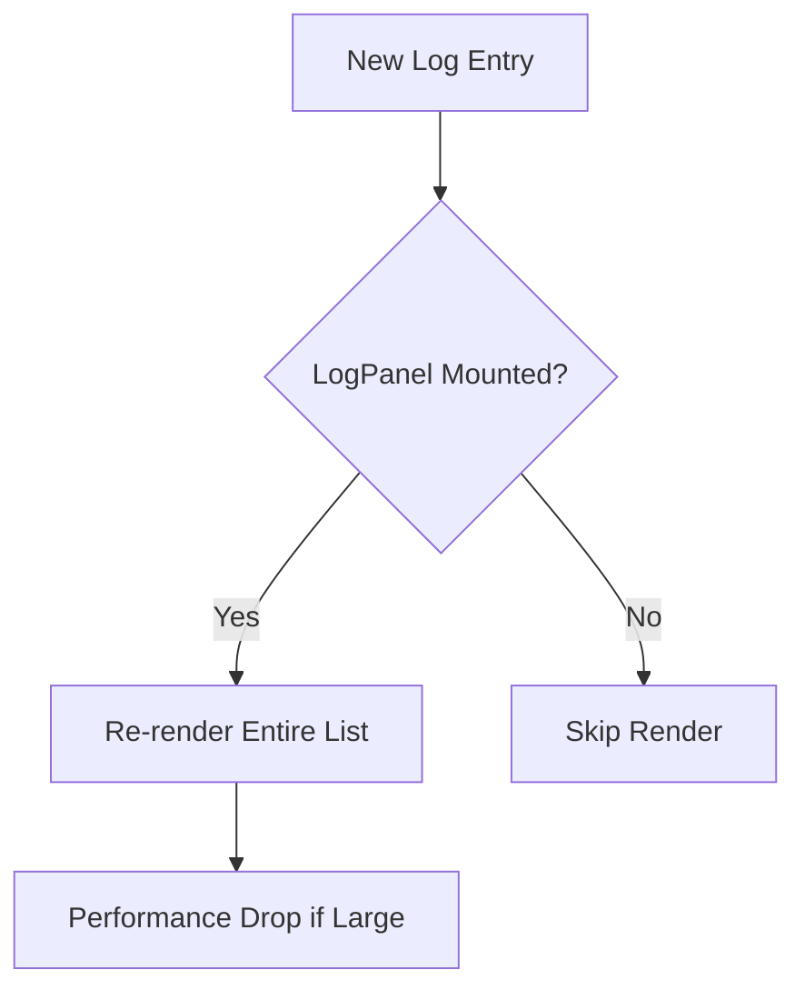

# Desktop Application Issues

<cite>
**Referenced Files in This Document**   
- [lib.rs](file://abogen-ui/crates/ui/lib.rs)
- [state.rs](file://abogen-ui/crates/ui/state.rs)
- [gpu_probe.rs](file://abogen-ui/crates/ui/services/gpu_probe.rs)
- [file_picker.rs](file://abogen-ui/crates/ui/services/file_picker.rs)
- [log_panel.rs](file://abogen-ui/crates/ui/components/log_panel.rs)
- [progress_bar.rs](file://abogen-ui/crates/ui/components/progress_bar.rs)
- [main.rs](file://abogen-ui/apps/desktop/src/main.rs)
</cite>

## Table of Contents
1. [Introduction](#introduction)
2. [Common Desktop Issues](#common-desktop-issues)
3. [Signal Mutation and State Management](#signal-mutation-and-state-management)
4. [File Picker Integration Problems](#file-picker-integration-problems)
5. [GPU Detection and Acceleration](#gpu-detection-and-acceleration)
6. [Performance Issues in UI Components](#performance-issues-in-ui-components)
7. [Borrow Checker Errors in Closures](#borrow-checker-errors-in-closures)
8. [Debugging Strategies](#debugging-strategies)
9. [Conclusion](#conclusion)

## Introduction
This document addresses common desktop-specific issues encountered in the Dioxus-based application within the `voxweave` project. It focuses on troubleshooting application crashes, rendering failures, event handling bugs, and state mutation problems. Special attention is given to signal management, file picker integration, GPU detection, and performance bottlenecks in key UI components such as the log panel and progress bar.

**Section sources**
- [main.rs](file://abogen-ui/apps/desktop/src/main.rs#L1-L7)
- [lib.rs](file://abogen-ui/crates/ui/lib.rs#L1-L639)

## Common Desktop Issues

The desktop application may experience several platform-specific issues:

- **Application crashes on startup**: Often caused by missing feature flags or incorrect initialization of Dioxus components.
- **Window rendering failures**: Typically related to GPU acceleration settings or missing platform-specific dependencies.
- **Event handling bugs**: May arise from improper closure captures or signal mutation during async operations.

These issues are particularly prevalent when transitioning between development and production builds or across different operating systems.



**Diagram sources**
- [main.rs](file://abogen-ui/apps/desktop/src/main.rs#L1-L7)
- [gpu_probe.rs](file://abogen-ui/crates/ui/services/gpu_probe.rs#L1-L27)

## Signal Mutation and State Management

Desktop signal mutations, especially during processing and cancellation flows, require careful handling. The `AppState` struct in `state.rs` manages shared state across components using Dioxus signals.

Key state variables include:
- `is_processing`: Indicates active processing
- `progress`: Tracks completion percentage
- `logs`: Stores log entries
- `cancel_token`: Signals cancellation requests

During processing, improper mutation of these signals—especially within closures—can lead to race conditions or inconsistent UI states.



**Diagram sources**
- [lib.rs](file://abogen-ui/crates/ui/lib.rs#L100-L200)
- [state.rs](file://abogen-ui/crates/ui/state.rs#L150-L200)

**Section sources**
- [lib.rs](file://abogen-ui/crates/ui/lib.rs#L1-L639)
- [state.rs](file://abogen-ui/crates/ui/state.rs#L1-L259)

## File Picker Integration Problems

The file picker service (`file_picker.rs`) provides platform-agnostic file selection but currently lacks full implementation for both web and native platforms.

Known issues:
- Native file picker returns `None` and logs a warning
- Web implementation is stubbed and non-functional
- No actual file selection occurs, affecting `selected_file` signal updates

This prevents users from adding files to the processing queue, breaking core functionality.

**Section sources**
- [file_picker.rs](file://abogen-ui/crates/ui/services/file_picker.rs#L1-L37)
- [lib.rs](file://abogen-ui/crates/ui/lib.rs#L150-L170)

## GPU Detection and Acceleration

GPU detection is handled by `gpu_probe.rs`, which conditionally returns availability based on the `gpu` feature flag.

Behavior:
- When `feature = "gpu"` is enabled: `probe_gpu()` returns `true`
- Otherwise: returns `false`

This static stub prevents actual hardware detection, potentially leading to incorrect assumptions about GPU availability and performance.

**Section sources**
- [gpu_probe.rs](file://abogen-ui/crates/ui/services/gpu_probe.rs#L1-L27)
- [state.rs](file://abogen-ui/crates/ui/state.rs#L200-L210)

## Performance Issues in UI Components

### Log Panel
The `LogPanel` component may suffer from performance degradation when handling large volumes of log entries due to unoptimized re-renders.

### Progress Bar
The `ProgressBar` component uses inline styling and direct signal reads, which can cause unnecessary re-renders if updated too frequently.

Both components lack throttling mechanisms, potentially overwhelming the UI thread during intensive processing.



**Diagram sources**
- [log_panel.rs](file://abogen-ui/crates/ui/components/log_panel.rs#L1-L44)
- [progress_bar.rs](file://abogen-ui/crates/ui/components/progress_bar.rs#L1-L24)

**Section sources**
- [log_panel.rs](file://abogen-ui/crates/ui/components/log_panel.rs#L1-L44)
- [progress_bar.rs](file://abogen-ui/crates/ui/components/progress_bar.rs#L1-L24)

## Borrow Checker Errors in Closures

A common error pattern occurs in closures that attempt to write to signals, such as `E0716` (temporary value dropped while borrowed). This arises when signal values are used in async contexts without proper cloning.

Example scenario:
- A closure captures `app_state.logs.write()` and attempts to modify it within a spawned task
- The mutable borrow is held across an await point, violating Rust's borrowing rules

Solution:
- Clone signals before moving them into closures
- Use `state.clone()` instead of borrowing references
- Ensure all signal accesses are properly scoped

**Section sources**
- [lib.rs](file://abogen-ui/crates/ui/lib.rs#L120-L140)
- [state.rs](file://abogen-ui/crates/ui/state.rs#L1-L259)

## Debugging Strategies

### Using Rust Backtraces
Enable backtrace output:
```bash
RUST_BACKTRACE=1 cargo run
```

Look for panics in:
- Signal mutation across await boundaries
- Unimplemented features (e.g., file picker)
- GPU context initialization

### Logging
Use `log::info!`, `log::warn!`, and `log::error!` strategically:
- In `file_picker.rs` to trace selection attempts
- Around signal mutations in `lib.rs`
- In async processing tasks

### Debugging State Mutations
- Monitor `AppState` changes using `use_effect` to log signal updates
- Validate state consistency after cancellation
- Check for unintended re-renders using Dioxus devtools

**Section sources**
- [lib.rs](file://abogen-ui/crates/ui/lib.rs#L1-L639)
- [state.rs](file://abogen-ui/crates/ui/state.rs#L1-L259)
- [file_picker.rs](file://abogen-ui/crates/ui/services/file_picker.rs#L1-L37)

## Conclusion
Desktop-specific issues in the Dioxus application stem primarily from incomplete platform integrations, improper signal handling, and missing runtime checks. Resolving these requires implementing actual file picker APIs, enhancing GPU detection, optimizing UI components, and ensuring safe signal usage in async contexts. Developers should leverage Rust's type system and Dioxus's reactivity model to prevent common pitfalls like borrow checker errors and state inconsistency.