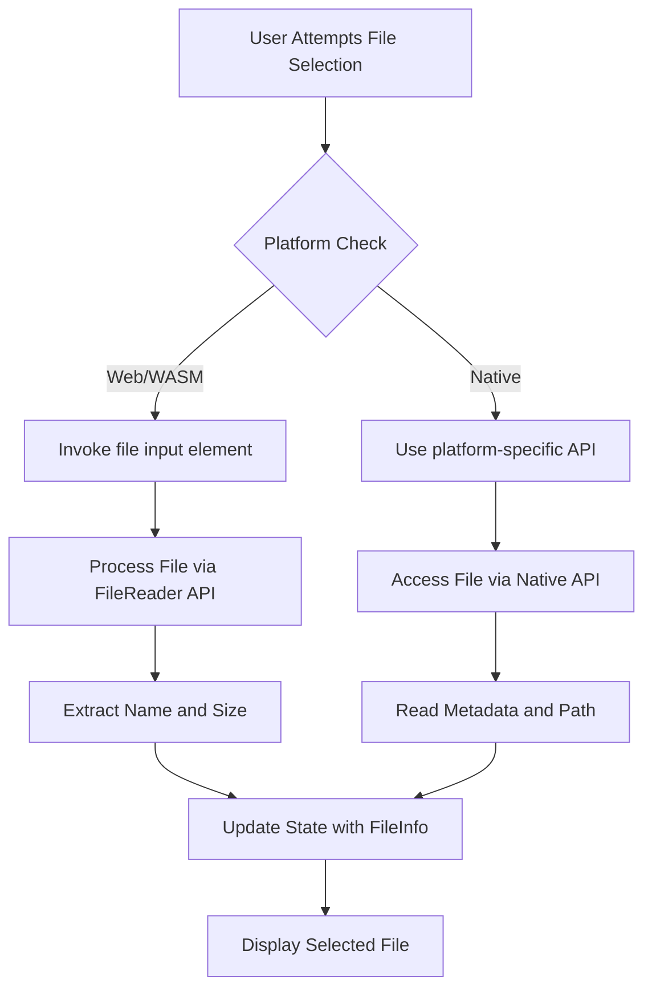
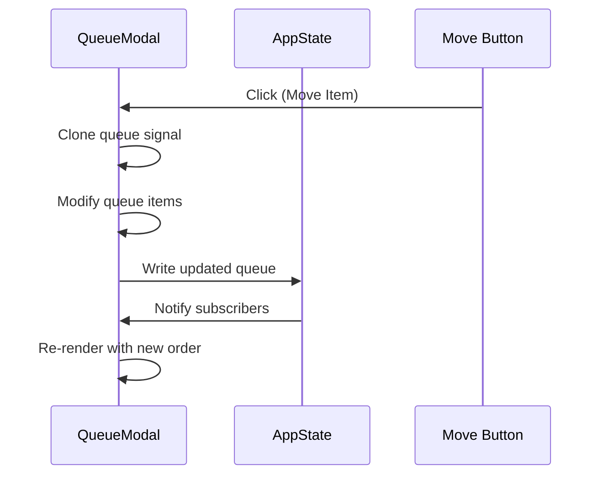

# Mobile Platform Issues

<cite>
**Referenced Files in This Document**   
- [drop_zone.rs](file://abogen-ui/crates/ui/components/drop_zone.rs)
- [file_picker.rs](file://abogen-ui/crates/ui/services/file_picker.rs)
- [queue_modal.rs](file://abogen-ui/crates/ui/components/queue_modal.rs)
- [main.rs](file://abogen-ui/apps/mobile/src/main.rs)
- [STATUS.md](file://abogen-ui/STATUS.md)
</cite>

## Table of Contents
1. [Introduction](#introduction)
2. [Touch Event Handling Failures](#touch-event-handling-failures)
3. [Mobile Layout Rendering and Responsiveness](#mobile-layout-rendering-and-responsiveness)
4. [File Selection and Drag-and-Drop Issues](#file-selection-and-drag-and-drop-issues)
5. [WebAssembly Performance and Memory Usage](#webassembly-performance-and-memory-usage)
6. [Component Lifecycle and State Synchronization](#component-lifecycle-and-state-synchronization)
7. [Signal Mutation and Borrow Checker Errors](#signal-mutation-and-borrow-checker-errors)
8. [Conclusion](#conclusion)

## Introduction
This document addresses mobile-specific issues in the Dioxus UI implementation for the abogen application. The focus is on troubleshooting problems that arise specifically on mobile platforms, including touch interactions, layout rendering, file handling, performance bottlenecks, and state management. The analysis is based on the current codebase structure, with particular attention to components and services that exhibit platform-specific behavior.

## Touch Event Handling Failures
Touch event handling in the Dioxus mobile application may fail due to improper propagation or incorrect event binding. The `drop_zone.rs` component implements drag-and-drop functionality but uses `ondragover`, `ondragleave`, and `ondrop` events that may not be fully supported or properly triggered on all mobile browsers. The current implementation stops event propagation explicitly, which could interfere with default touch behaviors.

The component relies on desktop-style drag events even in mobile contexts, potentially leading to unresponsive interactions. Mobile platforms often require additional touch-specific event listeners such as `touchstart`, `touchmove`, and `touchend` to ensure reliable gesture recognition.

**Section sources**
- [drop_zone.rs](file://abogen-ui/crates/ui/components/drop_zone.rs#L92-L128)

## Mobile Layout Rendering and Responsiveness
The application's layout responsiveness on mobile devices depends on CSS styling and component structure. The `drop_zone.rs` component uses fixed dimensions and absolute positioning, which may not adapt well to varying screen sizes. The use of hardcoded pixel values and fixed panel heights can lead to overflow or improper scaling on smaller screens.

The current styling applies a minimum height of 150px to the drop zone, which may consume excessive screen space on mobile devices. Additionally, the z-index management and positioning strategy may cause overlapping issues with other UI elements in constrained viewports.

**Section sources**
- [drop_zone.rs](file://abogen-ui/crates/ui/components/drop_zone.rs#L92-L128)

## File Selection and Drag-and-Drop Issues
File selection on mobile platforms presents significant challenges due to platform limitations. The `file_picker.rs` service currently contains stub implementations for both web and native platforms but does not provide functional file picking capabilities. The web module issues a warning that the file picker is not implemented, which will result in non-functional file selection on mobile browsers.

The `drop_zone.rs` component attempts to handle file drops but has platform-specific limitations:
- On non-WASM targets, it relies on desktop drag-and-drop APIs
- On WASM targets, it spawns async tasks to process file data but lacks proper error handling for mobile-specific file access restrictions

Mobile browsers often restrict direct file system access, making it difficult to obtain file paths or metadata. The current implementation assumes files can be read directly from paths, which may not be possible in mobile web contexts.



**Diagram sources**
- [drop_zone.rs](file://abogen-ui/crates/ui/components/drop_zone.rs#L0-L234)
- [file_picker.rs](file://abogen-ui/crates/ui/services/file_picker.rs#L0-L36)

**Section sources**
- [drop_zone.rs](file://abogen-ui/crates/ui/components/drop_zone.rs#L0-L234)
- [file_picker.rs](file://abogen-ui/crates/ui/services/file_picker.rs#L0-L36)

## WebAssembly Performance and Memory Usage
Mobile WebAssembly execution faces performance bottlenecks due to limited device resources. The application's use of Dioxus with WASM introduces overhead in rendering and state management. Long-running processes such as video rendering or text processing can lead to memory accumulation, especially when signals are frequently updated.

The current architecture passes `AppState` by value to components, which may result in unnecessary cloning of state data. Signal mutations within closures can create additional memory pressure when not properly managed. The lack of explicit memory cleanup in long-running operations may lead to gradual performance degradation on mobile devices with constrained RAM.

**Section sources**
- [main.rs](file://abogen-ui/apps/mobile/src/main.rs#L0-L6)

## Component Lifecycle and State Synchronization
Component lifecycle issues arise from improper state management during screen transitions. The interaction between `ProcessingScreen` and `queue_modal.rs` may suffer from state desynchronization when signals are mutated in closures without proper ownership handling.

The `queue_modal.rs` component maintains a queue state but does not implement cleanup mechanisms when the modal is closed. This can lead to stale state persisting across navigation events. The current implementation uses direct signal writes within event handlers, which may not be properly synchronized when multiple components access shared state.



**Diagram sources**
- [queue_modal.rs](file://abogen-ui/crates/ui/components/queue_modal.rs#L0-L194)

**Section sources**
- [queue_modal.rs](file://abogen-ui/crates/ui/components/queue_modal.rs#L0-L194)

## Signal Mutation and Borrow Checker Errors
Signal mutation issues on mobile platforms stem from Rust's borrow checker constraints in async contexts. The codebase previously encountered E0716 errors related to temporary values being dropped while borrowed, particularly in component closures.

The solution implemented, as documented in `STATUS.md`, follows the pattern of copying signals before mutation:

```rust
let mut signal_copy = original_signal;
*signal_copy.write() = new_value;
```

This approach works because Dioxus signals are `Copy` types, allowing them to be cloned before mutation. This pattern avoids borrow checker errors when modifying state within event handlers and async closures. The same pattern should be applied consistently across all mobile components to prevent similar issues.

**Section sources**
- [STATUS.md](file://abogen-ui/STATUS.md#L196-L206)

## Conclusion
The mobile platform issues in the Dioxus UI primarily revolve around platform-specific limitations in file handling, touch event processing, and performance constraints. The current implementation has several stubbed or incomplete features that need to be properly implemented for mobile compatibility. Key areas for improvement include proper mobile file selection, responsive layout design, efficient signal management, and robust error handling for platform-specific limitations. The established pattern for signal mutation provides a solid foundation for resolving borrow checker issues across the codebase.