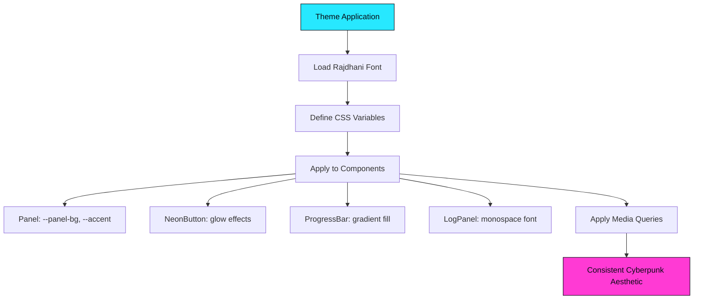
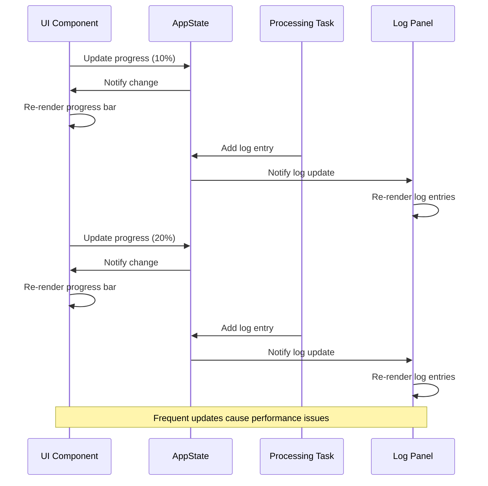

# UI Application Issues

<cite>
**Referenced Files in This Document**   
- [Trunk.toml](file://apps/web/Trunk.toml)
- [state.rs](file://crates/ui/state.rs)
- [theme.rs](file://crates/ui/theme.rs)
- [audio_recorder.rs](file://crates/ui/components/audio_recorder.rs)
- [drop_zone.rs](file://crates/ui/components/drop_zone.rs)
- [progress_bar.rs](file://crates/ui/components/progress_bar.rs)
- [log_panel.rs](file://crates/ui/components/log_panel.rs)
- [queue_modal.rs](file://crates/ui/components/queue_modal.rs)
- [lib.rs](file://crates/ui/lib.rs)
</cite>

## Table of Contents
1. [Introduction](#introduction)
2. [Web Build Failures with Trunk.toml](#web-build-failures-with-trunktoml)
3. [Desktop Application Crashes](#desktop-application-crashes)
4. [Mobile Platform Compatibility Problems](#mobile-platform-compatibility-problems)
5. [State Management Issues](#state-management-issues)
6. [UI Component Troubleshooting](#ui-component-troubleshooting)
7. [Theme and Cyberpunk Aesthetic Rendering](#theme-and-cyberpunk-aesthetic-rendering)
8. [Cross-Platform UI Inconsistencies](#cross-platform-ui-inconsistencies)
9. [Performance Problems](#performance-problems)
10. [Component Lifecycle and Event Handling](#component-lifecycle-and-event-handling)

## Introduction
This document provides comprehensive troubleshooting guidance for the Dioxus-based multi-platform interface in the Abogen UI project. The application targets desktop, web, and mobile platforms with a unified cyberpunk aesthetic. This guide addresses common issues across all platforms, focusing on build configuration, state management, component behavior, styling, and performance. The troubleshooting strategies are based on the current implementation using Dioxus 0.7 with a shared UI crate architecture.

## Web Build Failures with Trunk.toml
Web build failures are primarily related to Trunk configuration and asset resolution. The Trunk.toml file in the web application specifies build targets, distribution directories, and development server settings. Issues typically arise from incorrect file watching configurations or server address binding.

The current Trunk.toml configuration correctly sets the target to index.html and specifies the dist directory for output. The development server is configured to listen on all addresses (0.0.0.0) at port 8080 with automatic browser opening. The watch configuration includes the source directories for both the web app and the shared UI crate, ensuring changes are detected across the workspace.

Common web build issues include:
- Asset resolution failures when manganis cannot locate CSS or font files
- WASM compilation errors due to missing feature flags
- Hot reload not triggering when editing shared UI components

Ensure that the manganis crate is properly configured to resolve assets and that the Dioxus web renderer is correctly initialized in the main function.

**Section sources**
- [Trunk.toml](file://apps/web/Trunk.toml#L1-L12)

## Desktop Application Crashes
Desktop application crashes are typically related to platform-specific dependencies and event handling. The desktop application uses the Dioxus desktop renderer with wry as the webview backend. Crashes can occur due to improper handling of system events, memory management issues, or incompatible native dependencies.

The desktop launcher is minimal, consisting only of importing the shared App component and launching it through dioxus::launch. This simplicity reduces the attack surface but means crashes are likely originating from within the shared UI components or their platform-specific implementations.

Common crash scenarios include:
- Audio recording functionality on platforms without proper cpal configuration
- File system access violations when writing to protected directories
- Memory leaks in long-running processing tasks
- Event loop deadlocks during intensive operations

Ensure that all platform-specific code paths are properly guarded with feature flags and that resource cleanup is handled correctly in all execution paths.

**Section sources**
- [main.rs](file://apps/desktop/src/main.rs#L1-L4)

## Mobile Platform Compatibility Problems
Mobile platform compatibility issues stem from the differences in mobile operating systems and their restrictions on certain functionalities. The mobile application uses the Dioxus mobile renderer, which has specific requirements for mobile deployment.

The mobile launcher, like the desktop and web variants, simply imports the shared App component and launches it. However, mobile platforms impose additional constraints on:
- File system access and storage permissions
- Background processing and audio recording
- Memory usage and application lifecycle management
- Touch event handling and responsive design

The current implementation may encounter issues with:
- Requesting proper permissions for file access and microphone usage
- Handling application suspension and resumption
- Adapting UI components to smaller screen sizes
- Managing battery consumption during processing tasks

Ensure that all mobile-specific requirements are addressed in the build configuration and that the UI remains responsive under mobile constraints.

**Section sources**
- [main.rs](file://apps/mobile/src/main.rs#L1-L4)

## State Management Issues
State management issues primarily revolve around the AppState structure and its interaction with Dioxus signals. The application uses a centralized state pattern with Signal types for reactive updates. The main challenges involve queue processing, real-time feedback, and proper signal mutation patterns.

The AppState struct contains signals for various application states including the processing queue, current processing status, progress percentage, and log entries. The state is designed to be shared across components through prop drilling.

Key state management patterns include:
- Using the signal copy pattern for mutations: creating a local copy of the signal before writing
- Properly handling async operations with spawn and await
- Maintaining consistency between UI state and processing state
- Preventing race conditions during queue modifications

The most common state-related issues are:
- Temporary value dropped while borrowed errors during signal mutation
- Inconsistent state between components due to improper signal cloning
- Race conditions when multiple components modify the same state
- Memory leaks from uncancelled async tasks

The recommended pattern for signal mutation is to create a local copy of the signal and use it within closures to avoid lifetime issues.

```mermaid
classDiagram
class AppState {
+Signal<Option<FileInfo>> selected_file
+Signal<Vec<QueuedItem>> queue
+Signal<String> voice
+Signal<f64> speed
+Signal<bool> is_processing
+Signal<u8> progress
+Signal<Vec<LogEntry>> logs
+Signal<Option<()>> cancel_token
}
class QueuedItem {
+FileInfo file
+String voice
+f64 speed
+SubtitleMode subtitle_mode
+VideoStyle video_style
+VideoResolution video_resolution
}
class LogEntry {
+String message
+LogLevel level
}
AppState --> QueuedItem : "contains"
AppState --> LogEntry : "contains"
AppState --> FileInfo : "references"
```

**Diagram sources**
- [state.rs](file://crates/ui/state.rs#L1-L255)

**Section sources**
- [state.rs](file://crates/ui/state.rs#L1-L255)
- [lib.rs](file://crates/ui/lib.rs#L31-L55)

## UI Component Troubleshooting
UI component issues affect specific interactive elements in the application. This section addresses problems with the audio recorder, file drop zone, and progress bar components.

### Audio Recorder Issues
The audio recorder component has platform-specific implementations based on the coqui-tts feature flag. On desktop with the feature enabled, it uses cpal for audio capture. On web or without the feature, it displays a placeholder.

Common issues include:
- Missing cpal dependencies on certain platforms
- Microphone permission denials
- Audio file writing failures
- Recording duration inaccuracies

The component uses tokio::task::spawn_blocking to handle the synchronous recording operation without blocking the main thread. Ensure that the output directory is writable and that proper error handling is in place.

**Section sources**
- [audio_recorder.rs](file://crates/ui/components/audio_recorder.rs#L1-L327)

### File Drop Zone Issues
The file drop zone component handles both drag-and-drop and click-to-browse file selection. It has different implementations for web and desktop platforms using conditional compilation.

Common issues include:
- Inconsistent file path handling between platforms
- Drag events not being properly captured
- File type validation failures
- Memory leaks from unhandled file data

The component uses Dioxus's HasFileData trait to access file information and handles both drag events and input change events. Ensure that the accept attribute is correctly set and that file metadata is properly extracted.

**Section sources**
- [drop_zone.rs](file://crates/ui/components/drop_zone.rs#L1-L234)

### Progress Bar Issues
The progress bar component displays processing progress as a percentage. It uses CSS styling to create a neon-themed progress indicator.

Common issues include:
- Progress updates not being reflected in the UI
- Animation jank during rapid updates
- Incorrect percentage calculations
- Layout overflow in constrained spaces

The component reads the progress signal and updates the width of the inner bar element. Ensure that progress updates are debounced appropriately to prevent excessive re-renders.

**Section sources**
- [progress_bar.rs](file://crates/ui/components/progress_bar.rs#L1-L23)

## Theme and Cyberpunk Aesthetic Rendering
Theme application issues affect the visual consistency of the cyberpunk aesthetic across platforms. The theme is implemented through CSS variables and custom styling in the theme.rs file.

The cyberpunk theme uses a dark color scheme with neon accents in cyan, magenta, amber, and lime. Key visual elements include:
- Rajdhani font from Google Fonts
- Glowing borders and shadows
- Custom panel styling with inset shadows
- Neon button effects with hover animations
- Responsive layout for different screen sizes

Common rendering issues include:
- Font loading failures
- CSS variable inheritance problems
- Inconsistent spacing across components
- Missing hover effects
- Layout breaking on smaller screens

The theme CSS is injected through the get_theme_css function and applied globally. Ensure that the CSS is properly loaded and that all components respect the theme variables.



**Diagram sources**
- [theme.rs](file://crates/ui/theme.rs#L1-L208)

**Section sources**
- [theme.rs](file://crates/ui/theme.rs#L1-L208)

## Cross-Platform UI Inconsistencies
Cross-platform UI inconsistencies arise from differences in how components render across desktop, web, and mobile platforms. The shared UI crate aims to provide consistency, but platform-specific behaviors can cause divergence.

Key areas of inconsistency include:
- Font rendering and text layout
- Button sizing and spacing
- Form control appearance
- Animation smoothness
- Touch vs. mouse interaction

The application uses responsive design principles with media queries to adapt to different screen sizes. However, platform-specific rendering engines (wry for desktop, browser for web, native for mobile) can interpret CSS differently.

Mitigation strategies include:
- Using relative units (em, rem) instead of absolute units (px)
- Testing layouts on all target platforms
- Implementing platform-specific CSS adjustments
- Standardizing event handling across platforms
- Ensuring consistent state management

Pay particular attention to the queue modal and log panel, which contain complex layouts that may break on smaller screens.

**Section sources**
- [queue_modal.rs](file://crates/ui/components/queue_modal.rs#L1-L194)
- [log_panel.rs](file://crates/ui/components/log_panel.rs#L1-L43)

## Performance Problems
Performance issues affect the log panel and queue modal, particularly when handling large amounts of data. These components can become sluggish when rendering many log entries or queue items.

The log panel uses a simple for loop to render all log entries, which can cause performance degradation with hundreds of entries. Consider implementing virtualization or pagination for large log sets.

The queue modal renders all queue items in a scrollable container. With many items, this can cause layout thrashing and slow rendering. The current implementation uses a simple for loop with enumerate, which is efficient but doesn't handle large datasets optimally.

Other performance considerations include:
- Minimizing unnecessary re-renders through proper signal usage
- Debouncing rapid state updates
- Optimizing CSS for rendering performance
- Reducing the frequency of expensive operations
- Implementing lazy loading for non-critical components

Monitor the application's memory usage and frame rate during processing tasks to identify bottlenecks.



**Diagram sources**
- [log_panel.rs](file://crates/ui/components/log_panel.rs#L1-L43)
- [progress_bar.rs](file://crates/ui/components/progress_bar.rs#L1-L23)
- [state.rs](file://crates/ui/state.rs#L1-L255)

**Section sources**
- [log_panel.rs](file://crates/ui/components/log_panel.rs#L1-L43)
- [progress_bar.rs](file://crates/ui/components/progress_bar.rs#L1-L23)

## Component Lifecycle and Event Handling
Component lifecycle issues affect how Dioxus components initialize, update, and clean up across different platforms. Event handling problems can lead to unresponsive UI elements or memory leaks.

The Dioxus component lifecycle includes:
- Initialization with use_signal and other hooks
- Rendering through the rsx! macro
- Event handling through closures
- Cleanup when components are unmounted

Common lifecycle issues include:
- Signals not being properly initialized
- Event handlers capturing stale state
- Memory leaks from uncancelled async tasks
- Race conditions during component updates
- Inconsistent behavior between hot reload and fresh loads

Event handling follows Dioxus patterns with onclick, onchange, and other event attributes. Ensure that event handlers are properly closures that capture the necessary state without creating reference cycles.

For the audio recorder, ensure that recording tasks are properly cancelled when the component is unmounted. For the file drop zone, verify that drag events are properly stopped from propagating to prevent unintended behavior.

**Section sources**
- [audio_recorder.rs](file://crates/ui/components/audio_recorder.rs#L1-L327)
- [drop_zone.rs](file://crates/ui/components/drop_zone.rs#L1-L234)
- [queue_modal.rs](file://crates/ui/components/queue_modal.rs#L1-L194)