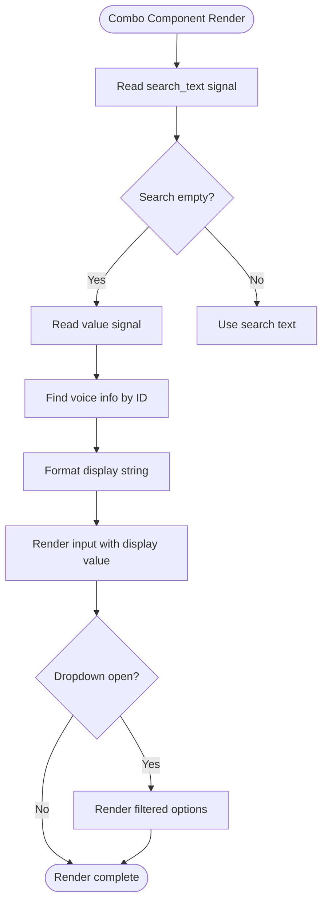
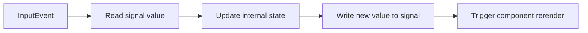
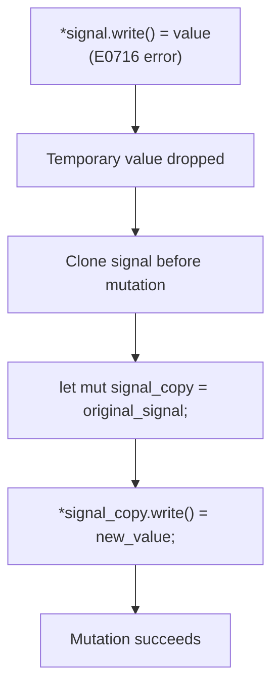
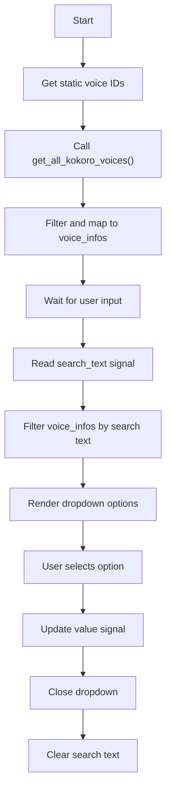

# Combo and Selection Component Issues

<cite>
**Referenced Files in This Document**   
- [combo.rs](file://abogen-ui/crates/ui/components/combo.rs)
- [state.rs](file://abogen-ui/crates/ui/state.rs)
- [lib.rs](file://abogen-ui/crates/ui/lib.rs)
- [checkbox.rs](file://abogen-ui/crates/ui/components/checkbox.rs)
- [tts_stub.rs](file://abogen-ui/crates/ui/services/tts_stub.rs)
- [voices.rs](file://abogen-ui/crates/ui/services/voices.rs)
- [STATUS.md](file://abogen-ui/STATUS.md)
</cite>

## Table of Contents
1. [Introduction](#introduction)
2. [Core Issues in Combo Components](#core-issues-in-combo-components)
3. [Signal Binding and State Management](#signal-binding-and-state-management)
4. [Enum-Based State Handling](#enum-based-state-handling)
5. [Borrow Checker Error Resolution](#borrow-checker-error-resolution)
6. [Two-Way Binding Patterns](#two-way-binding-patterns)
7. [Dynamic Option Population](#dynamic-option-population)
8. [Troubleshooting Guide](#troubleshooting-guide)
9. [Conclusion](#conclusion)

## Introduction
This document addresses common issues encountered when implementing combo and selection components in the Dioxus-based UI framework for the Voxweave application. It focuses on resolving problems related to initial value binding, signal updates, dropdown rendering, and borrow checker errors. The analysis covers components used for selecting voice, video style, subtitle mode, and other format options, with emphasis on proper integration with the `AppState` signal system.

**Section sources**
- [lib.rs](file://abogen-ui/crates/ui/lib.rs#L0-L639)
- [state.rs](file://abogen-ui/crates/ui/state.rs#L0-L258)

## Core Issues in Combo Components

The primary issues in combo components include incorrect initial value display, failure to update associated signals upon selection, and rendering problems in the dropdown menu. The `Combo` component, designed for voice selection, uses a `Signal<String>` for its value but faces challenges in maintaining consistent state between the input field and the selected option.

A key issue arises in the display logic where `search_text.read()` creates a temporary value that gets dropped before being used in conditional rendering, triggering borrow checker error E0716. This occurs because the `read()` method returns a guard that must be held for the duration of the operation.



**Diagram sources**
- [combo.rs](file://abogen-ui/crates/ui/components/combo.rs#L0-L145)

**Section sources**
- [combo.rs](file://abogen-ui/crates/ui/components/combo.rs#L0-L145)
- [STATUS.md](file://abogen-ui/STATUS.md#L196-L206)

## Signal Binding and State Management

Proper signal binding is critical for maintaining reactive UI updates. The `AppState` struct contains signals for all selection states, including `voice`, `video_style`, `subtitle_mode`, and others. These signals must be correctly bound to UI components to ensure two-way data flow.

The `Combo` component receives a `Signal<String>` as a prop and updates it when an option is selected. However, mutations to signals within closures require special handling due to Rust's ownership rules. The checkbox component demonstrates correct signal binding:



**Diagram sources**
- [checkbox.rs](file://abogen-ui/crates/ui/components/checkbox.rs#L0-L27)

**Section sources**
- [checkbox.rs](file://abogen-ui/crates/ui/components/checkbox.rs#L0-L27)
- [state.rs](file://abogen-ui/crates/ui/state.rs#L0-L258)

## Enum-Based State Handling

The application uses several enums to represent selection states, including `VideoStyle`, `SubtitleMode`, `VoiceFormat`, and `SubtitleFormat`. These enums implement `as_str()` methods to convert to string representations for UI display and parsing.

When handling enum-based state in selection components, the pattern involves matching string values from HTML select elements to enum variants:

```mermaid
stateDiagram-v2
[*] --> SelectValue
SelectValue --> MatchEnum
MatchEnum --> Realistic : "realistic"
MatchEnum --> Anime : "anime"
MatchEnum --> ThreeD : "3d"
MatchEnum --> Cinematic : "cinematic"
MatchEnum --> Biotech : "biotech"
MatchEnum --> Cyberpunk : "cyberpunk"
MatchEnum --> Educational : "educational"
MatchEnum --> Wan2_5 : "wan2.5-t2v-preview"
MatchEnum --> Default : _
Default --> Realistic
Realistic --> UpdateSignal
Anime --> UpdateSignal
ThreeD --> UpdateSignal
Cinematic --> UpdateSignal
Biotech --> UpdateSignal
Cyberpunk --> UpdateSignal
Educational --> UpdateSignal
Wan2_5 --> UpdateSignal
UpdateSignal --> Rerender
Rerender --> [*]
```

**Diagram sources**
- [state.rs](file://abogen-ui/crates/ui/state.rs#L100-L150)

**Section sources**
- [state.rs](file://abogen-ui/crates/ui/state.rs#L100-L150)
- [lib.rs](file://abogen-ui/crates/ui/lib.rs#L300-L400)

## Borrow Checker Error Resolution

Borrow checker error E0716 occurs when temporary values are dropped while still borrowed, commonly seen in signal operations. The solution, as documented in `STATUS.md`, is to clone or copy the signal before mutation:



This pattern works because Dioxus signals are `Copy` types in version 0.5, allowing them to be cloned without performance overhead. All signal mutations in closures should follow this pattern to avoid lifetime issues.

**Diagram sources**
- [STATUS.md](file://abogen-ui/STATUS.md#L196-L206)

**Section sources**
- [STATUS.md](file://abogen-ui/STATUS.md#L196-L206)
- [tts_stub.rs](file://abogen-ui/crates/ui/services/tts_stub.rs#L0-L216)

## Two-Way Binding Patterns

Two-way binding between UI controls and `AppState` signals follows a consistent pattern across components. For input elements, the `value` attribute reads from the signal, while the `onchange` or `oninput` handler writes to it.

The recommended pattern for two-way binding is:

```mermaid
flowchart LR
UIComponent --> ReadSignal["Read signal value<br/>value: \"{signal.read()}\""]
ReadSignal --> Display["Display value in UI"]
UserAction --> Event["Trigger event handler"]
Event --> WriteSignal["Write to signal<br/>*signal.write() = new_value"]
WriteSignal --> Notify["Signal notifies subscribers"]
Notify --> Rerender["Component rerenders"]
Rerender --> ReadSignal
```

For enum types, the binding involves string conversion:
1. Read enum value and convert to string via `as_str()`
2. Set as select element value
3. On change, match string value to enum variant
4. Write enum variant to signal

**Section sources**
- [lib.rs](file://abogen-ui/crates/ui/lib.rs#L300-L400)
- [state.rs](file://abogen-ui/crates/ui/state.rs#L100-L150)

## Dynamic Option Population

The `Combo` component dynamically populates its options by combining static voice IDs with rich voice information from `get_all_kokoro_voices()`. This allows displaying additional metadata like display name and language alongside the voice ID.

The dynamic population process:
1. Receive static list of voice IDs as `options`
2. Fetch all voice information from service
3. Filter and map to relevant voices
4. Combine with search functionality
5. Render filtered list with rich display



**Diagram sources**
- [combo.rs](file://abogen-ui/crates/ui/components/combo.rs#L0-L145)
- [voices.rs](file://abogen-ui/crates/ui/services/voices.rs#L0-L216)

**Section sources**
- [combo.rs](file://abogen-ui/crates/ui/components/combo.rs#L0-L145)
- [voices.rs](file://abogen-ui/crates/ui/services/voices.rs#L0-L216)

## Troubleshooting Guide

### Issue: Incorrect Initial Value Display
**Symptoms**: Combo shows placeholder instead of current voice name
**Solution**: Ensure `value.read()` is properly used to find matching `VoiceInfo` and format display string

### Issue: Selection Doesn't Update State
**Symptoms**: Clicking option doesn't change voice in `AppState`
**Solution**: Verify signal mutation uses correct pattern:
```rust
*value.write() = voice_id.to_string();
```

### Issue: Dropdown Not Closing After Selection
**Symptoms**: Menu stays open after clicking an option
**Solution**: Ensure `is_open` signal is set to false:
```rust
*is_open.write() = false;
```

### Issue: Search Functionality Not Working
**Symptoms**: Typing doesn't filter options
**Solution**: Check that `search_text` signal updates on input and `is_open` remains true during search

### Issue: Borrow Checker Error E0716
**Symptoms**: "temporary value dropped while borrowed" compilation error
**Solution**: Clone signal before mutation:
```rust
let mut signal_copy = signal;
*signal_copy.write() = value;
```

### Issue: Enum Values Not Persisting
**Symptoms**: Select element resets to default after rerender
**Solution**: Ensure `value` attribute uses `.as_str()`:
```rust
value: "{state.video_style.read().as_str()}"
```

**Section sources**
- [combo.rs](file://abogen-ui/crates/ui/components/combo.rs#L0-L145)
- [lib.rs](file://abogen-ui/crates/ui/lib.rs#L300-L400)
- [state.rs](file://abogen-ui/crates/ui/state.rs#L100-L150)

## Conclusion
The combo and selection components in the Voxweave application require careful attention to signal management, enum handling, and borrow checker rules. By following the patterns documented here—particularly the signal cloning pattern for mutations and proper enum-to-string conversion—developers can resolve common issues with value binding, state updates, and UI rendering. The combination of reactive signals and rich data display enables a powerful and flexible selection system that supports the application's voice, style, and format configuration needs.