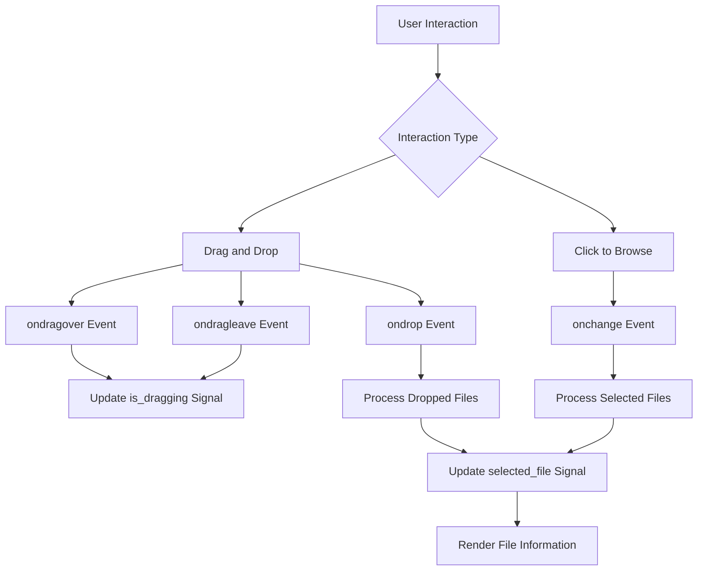
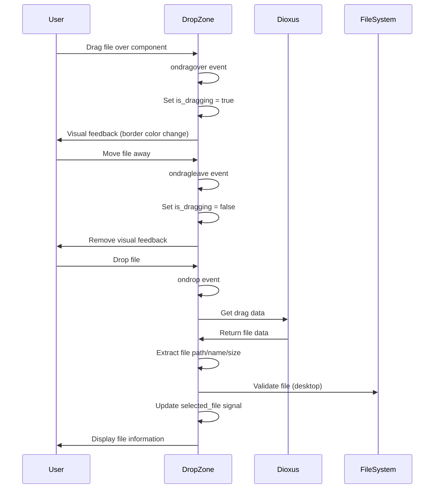

# File Drop Zone Issues

<cite>
**Referenced Files in This Document**   
- [drop_zone.rs](file://abogen-ui/crates/ui/components/drop_zone.rs)
- [state.rs](file://abogen-ui/crates/ui/state.rs)
- [lib.rs](file://abogen-ui/crates/ui/lib.rs)
</cite>

## Table of Contents
1. [Introduction](#introduction)
2. [Drop Zone Component Analysis](#drop-zone-component-analysis)
3. [Event Propagation Issues](#event-propagation-issues)
4. [File Type Filtering](#file-type-filtering)
5. [State Synchronization Problems](#state-synchronization-problems)
6. [Borrow Checker Errors (E0716)](#borrow-checker-errors-e0716)
7. [Cross-Browser Compatibility](#cross-browser-compatibility)
8. [Solutions and Best Practices](#solutions-and-best-practices)
9. [Conclusion](#conclusion)

## Introduction
The drop_zone component in the VoxWeave application enables users to select files through drag-and-drop interactions or by clicking to browse. This document addresses common issues encountered with this component, including unresponsive drag events, incorrect file type filtering, and state synchronization problems. The analysis focuses on the implementation in Dioxus 0.7, examining both desktop and web targets, and provides solutions for the borrow checker errors that can occur during file processing.

## Drop Zone Component Analysis

The drop_zone component is implemented as a Dioxus component that handles both drag-and-drop operations and traditional file input. It uses signals to manage state and provides visual feedback during drag operations. The component is designed to work across different platforms, with specific implementations for desktop and web targets.



**Diagram sources**
- [drop_zone.rs](file://abogen-ui/crates/ui/components/drop_zone.rs#L8-L234)

**Section sources**
- [drop_zone.rs](file://abogen-ui/crates/ui/components/drop_zone.rs#L8-L234)

## Event Propagation Issues

The drop_zone component experiences event propagation issues that can prevent drop events from being properly captured. The current implementation correctly stops propagation of drag events using `e.stop_propagation()` in both `ondragover` and `ondrop` handlers, which prevents parent components from interfering with the drag operation.

However, the component's event handling structure could be improved by ensuring that all drag-related events are properly handled. The current implementation uses separate event handlers for `ondragover`, `ondragleave`, and `ondrop`, which is correct, but the order of operations in the `ondrop` handler could be optimized.

The component correctly handles both desktop and web platforms through conditional compilation. For desktop targets, it uses the native file system paths, while for web targets, it uses the browser's file API through async operations.



**Diagram sources**
- [drop_zone.rs](file://abogen-ui/crates/ui/components/drop_zone.rs#L116-L125)

## File Type Filtering

The drop_zone component implements file type filtering through the HTML `accept` attribute on the hidden file input element. The current implementation restricts file selection to `.txt`, `.epub`, and `.pdf` files:

```rust
accept: ".txt,.epub,.pdf"
```

This filtering is applied to both the click-to-browse functionality and the drag-and-drop operation. However, there is a potential issue with the implementation: the filtering is only applied to the file input element, but the drag-and-drop handler does not perform additional validation on the dropped files.

For desktop targets, the component extracts the file path from the drag data and attempts to process it without verifying the file extension. This could allow users to drop files with unsupported extensions. The web implementation faces a similar issue, as it processes the dropped file based on the information provided by the browser without additional validation.

The component should implement additional validation in the `handle_file` function to ensure that only files with supported extensions are processed. This would provide a more robust filtering mechanism that works consistently across both interaction methods.

**Section sources**
- [drop_zone.rs](file://abogen-ui/crates/ui/components/drop_zone.rs#L38-L39)

## State Synchronization Problems

The drop_zone component updates the `selected_file` signal in the `AppState` when a file is selected or dropped. However, there are potential issues with how this state update is implemented that could lead to inconsistent behavior.

The component correctly uses the signal pattern for state updates, but there is a potential race condition in how the signal is accessed. In multiple places, the code creates a local mutable reference to the signal:

```rust
let mut selected_file = state.selected_file;
*selected_file.write() = Some(file_info);
```

This pattern is correct and follows the recommended approach for signal mutation in Dioxus. However, the component could improve state synchronization by ensuring that all state updates are performed in a consistent manner and that the state is properly updated before any side effects occur.

The component also needs to handle the case where multiple files are dropped simultaneously. Currently, it only processes the first file in the dropped files collection, which is reasonable, but it should provide feedback to the user when multiple files are dropped to indicate that only one file will be processed.

**Section sources**
- [drop_zone.rs](file://abogen-ui/crates/ui/components/drop_zone.rs#L25-L30)
- [state.rs](file://abogen-ui/crates/ui/state.rs#L150-L155)

## Borrow Checker Errors (E0716)

The borrow checker error E0716, "temporary value dropped while borrowed," can occur in the drop_zone component when improper reference handling is used during file processing. This error typically arises when a temporary value is created and then a reference to it is returned or stored.

In the current implementation, the component avoids this error by using the correct signal mutation pattern. However, there are potential scenarios where this error could occur:

1. When creating temporary `FileInfo` objects and attempting to store references to them
2. When passing file paths or names by reference without proper lifetime management
3. When using closures that capture references to temporary values

The solution to these issues is to ensure that all data stored in the application state is owned rather than borrowed. The `FileInfo` struct correctly owns its data with `String` fields rather than string slices, which prevents lifetime issues.

For the borrow checker errors that might occur in the `handle_file` function, the solution is to ensure that all file paths are properly owned before being used to create `FileInfo` objects. The current implementation correctly converts the `PathBuf` to a string using `to_string_lossy()`, which creates an owned `String`.

```mermaid
flowchart TD
A[Temporary Value Created] --> B{Reference Stored?}
B --> |Yes| C[Error E0716]
B --> |No| D[Value Dropped Safely]
C --> E[Solution: Own the Data]
E --> F[Use Owned Types<br>(String, Vec, etc.)]
E --> G[Clone When Necessary]
E --> H[Move Instead of Borrow]
F --> I[Prevent Lifetime Issues]
G --> I
H --> I
```

**Diagram sources**
- [drop_zone.rs](file://abogen-ui/crates/ui/components/drop_zone.rs#L25-L30)
- [state.rs](file://abogen-ui/crates/ui/state.rs#L3-L10)

## Cross-Browser Compatibility

The drop_zone component implements different logic for web and desktop targets using conditional compilation. This approach ensures that the component works correctly across different platforms, but there are considerations for cross-browser compatibility on the web target.

For web browsers, the component uses the `spawn(async move { ... })` pattern to handle file operations asynchronously. This is necessary because file operations in web browsers are inherently asynchronous due to security restrictions. The component correctly uses the `evt.data().files()` method to access dropped files, which is supported in modern browsers.

However, there may be compatibility issues with older browsers or browsers with strict security settings that limit access to file information. The component should include error handling for cases where the file API is not available or where the user denies permission to access file data.

The component also needs to handle differences in how browsers represent file paths. On the web, the component uses a synthetic path format (`web-file://filename`) since actual file system paths are not available for security reasons. This is a good approach as it provides a consistent interface regardless of the underlying browser implementation.

**Section sources**
- [drop_zone.rs](file://abogen-ui/crates/ui/components/drop_zone.rs#L61-L62)
- [drop_zone.rs](file://abogen-ui/crates/ui/components/drop_zone.rs#L158-L174)

## Solutions and Best Practices

To resolve the issues identified in the drop_zone component, the following solutions and best practices should be implemented:

1. **Enhanced File Validation**: Add explicit file extension validation in the `handle_file` function to ensure that only supported file types are processed, regardless of how the file was selected.

2. **Consistent Signal Pattern**: Ensure that all signal mutations follow the same pattern of creating a mutable reference and then writing to it, as shown in the STATUS.md documentation.

3. **Improved Error Handling**: Add comprehensive error handling for cases where file operations fail, including providing user feedback when a file cannot be processed.

4. **User Feedback for Multiple Files**: When multiple files are dropped, provide visual feedback indicating that only the first file will be processed.

5. **Browser Compatibility Testing**: Test the component across different browsers to ensure consistent behavior, particularly with regard to file API availability and security restrictions.

6. **Documentation of Limitations**: Clearly document the limitations of the web implementation, particularly regarding file path access and the synthetic path format used.

The current implementation already follows many best practices, such as using conditional compilation for platform-specific code and properly handling asynchronous operations on the web target. By implementing the additional improvements suggested above, the component can become more robust and user-friendly.

## Conclusion

The drop_zone component in the VoxWeave application provides essential functionality for file input through drag-and-drop interactions. While the current implementation is largely correct, there are opportunities for improvement in file validation, error handling, and user feedback. By addressing the issues outlined in this document and following the recommended best practices, the component can provide a more reliable and consistent user experience across different platforms and browsers.

The component correctly handles the core functionality of file selection and state synchronization, and with the suggested improvements, it can become a robust and user-friendly interface element. The use of Dioxus signals for state management is appropriate, and the platform-specific implementations for desktop and web targets demonstrate good architectural design.