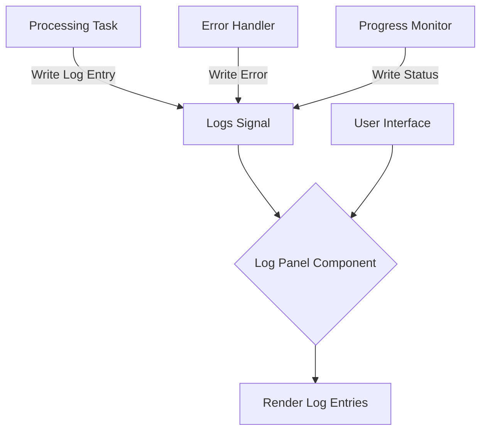
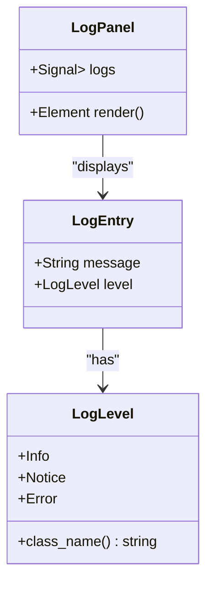
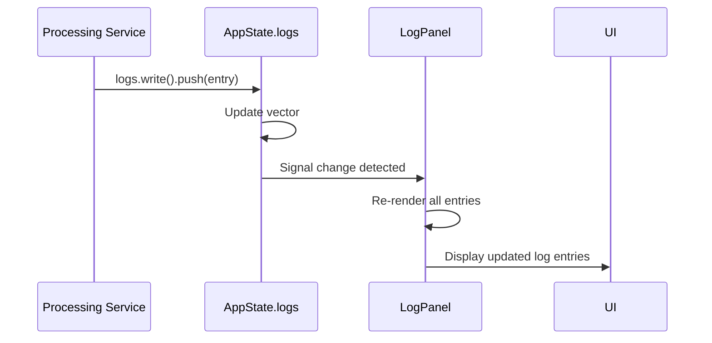

# Log Panel Display Issues

<cite>
**Referenced Files in This Document**   
- [log_panel.rs](file://abogen-ui/crates/ui/components/log_panel.rs)
- [state.rs](file://abogen-ui/crates/ui/state.rs)
- [lib.rs](file://abogen-ui/crates/ui/lib.rs)
- [theme.rs](file://abogen-ui/crates/ui/theme.rs)
</cite>

## Table of Contents
1. [Introduction](#introduction)
2. [Core Components](#core-components)
3. [Architecture Overview](#architecture-overview)
4. [Detailed Component Analysis](#detailed-component-analysis)
5. [Performance Considerations](#performance-considerations)
6. [Troubleshooting Guide](#troubleshooting-guide)
7. [Conclusion](#conclusion)

## Introduction
The Log Panel component in the VoxWeave application is responsible for displaying real-time processing output during audio and video generation workflows. This document addresses common issues encountered with the log panel, including missing log entries, incorrect log level coloring, performance degradation under high-frequency updates, and UI blocking during long operations. The analysis focuses on the implementation of the `LogPanel` component, its integration with the application state system, and optimization strategies for handling large volumes of log data efficiently.

## Core Components

The log panel functionality is built around several key components that work together to display processing output. The primary components include the `LogPanel` UI component, the `LogEntry` data structure, and the signal-based state management system that coordinates log updates across the application.

**Section sources**
- [log_panel.rs](file://abogen-ui/crates/ui/components/log_panel.rs#L1-L44)
- [state.rs](file://abogen-ui/crates/ui/state.rs#L200-L259)

## Architecture Overview

The log panel operates within a reactive state management architecture where log entries are stored in a shared signal that can be accessed and modified by various parts of the application. When processing tasks generate output, they write to the logs signal, which automatically triggers UI updates in the log panel component.

**Diagram sources **
- [log_panel.rs](file://abogen-ui/crates/ui/components/log_panel.rs#L6-L25)
- [state.rs](file://abogen-ui/crates/ui/state.rs#L200-L259)

## Detailed Component Analysis

### Log Panel Component Analysis

The `LogPanel` component is a Dioxus functional component that receives a signal containing a vector of `LogEntry` objects and renders them in a scrollable container. The component uses a simple for-loop to iterate through all log entries and display them with appropriate styling based on their log level.

#### Component Structure

**Diagram sources **
- [log_panel.rs](file://abogen-ui/crates/ui/components/log_panel.rs#L6-L44)
- [state.rs](file://abogen-ui/crates/ui/state.rs#L200-L259)

#### Data Flow Analysis
The log panel follows a unidirectional data flow pattern where external components write to the shared logs signal, and the log panel reads from it to determine what to render. This creates a clear separation between data production and presentation.

**Diagram sources **
- [lib.rs](file://abogen-ui/crates/ui/lib.rs#L90-L102)
- [log_panel.rs](file://abogen-ui/crates/ui/components/log_panel.rs#L17-L25)

## Performance Considerations

The current implementation of the log panel has several performance characteristics that can lead to issues when handling high-frequency log updates or large volumes of log data.

### Rendering Performance Issues
The log panel uses a simple approach of rendering all log entries on every update, which can cause performance degradation when the number of entries grows large. The component does not implement virtualization, meaning all entries are rendered in the DOM regardless of visibility.

### Signal Subscription Problems
Improper signal subscription can cause the log panel to stop updating during long-running operations. Since the component reads from the logs signal within the render function, if the signal is not properly updated or if there are race conditions in signal modification, the UI may not reflect the latest state.

### Race Condition Risks
When multiple processes write to the logs signal simultaneously, there is a potential for race conditions. The current implementation relies on the underlying signal system to handle concurrent access, but without proper synchronization, log entries could be lost or displayed out of order.

## Troubleshooting Guide

### Missing Log Entries
Missing log entries typically occur when:
- The logs signal is not properly updated by the writing component
- There are race conditions between multiple writers to the logs signal
- The signal subscription is not correctly established

To resolve missing log entries, ensure that all components writing to the logs signal use the proper write syntax and that the signal is not being cleared unexpectedly.

**Section sources**
- [lib.rs](file://abogen-ui/crates/ui/lib.rs#L50-L51)
- [grep_code results](file://abogen-ui/crates/ui/lib.rs#L92)

### Incorrect Log Level Coloring
The log level coloring is determined by the `class_name()` method on the `LogLevel` enum, which maps each level to a CSS class. Issues with coloring typically stem from:
- CSS class names not matching between the enum method and theme definitions
- Theme CSS not being properly loaded
- Incorrect log level assignment in log entries

The current implementation correctly maps `Info` to "info", `Notice` to "notice", and `Error` to "error", which correspond to CSS classes defined in the theme.

**Section sources**
- [log_panel.rs](file://abogen-ui/crates/ui/components/log_panel.rs#L35-L44)
- [theme.rs](file://abogen-ui/crates/ui/theme.rs#L180-L193)

### Performance Degradation with High-Frequency Updates
The log panel can experience performance issues when handling high-frequency log updates due to:
- Full re-renders of all log entries on each update
- Lack of virtualization for large log sets
- Potential blocking of the UI thread during intensive logging

### UI Blocking During Long Operations
The log panel may stop updating during long-running operations if:
- The main thread is blocked by intensive processing
- Signal updates are batched or delayed
- The rendering process itself becomes too expensive

## Conclusion

The current log panel implementation provides basic functionality for displaying processing output but has several limitations that affect reliability and performance under heavy load. The primary issues stem from the lack of virtualization, potential race conditions in signal handling, and inefficient rendering of large log sets. Future improvements should focus on implementing virtualized rendering to handle large volumes of log data, optimizing signal updates to prevent UI blocking, and ensuring thread-safe access to the logs signal when multiple processes are writing simultaneously. Additionally, implementing log retention policies and pagination could help manage memory usage and maintain performance over extended processing sessions.