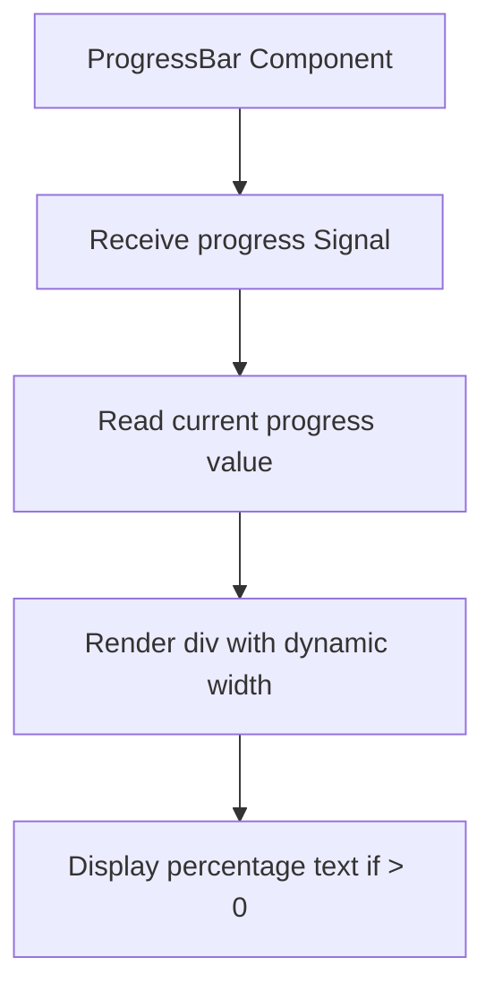
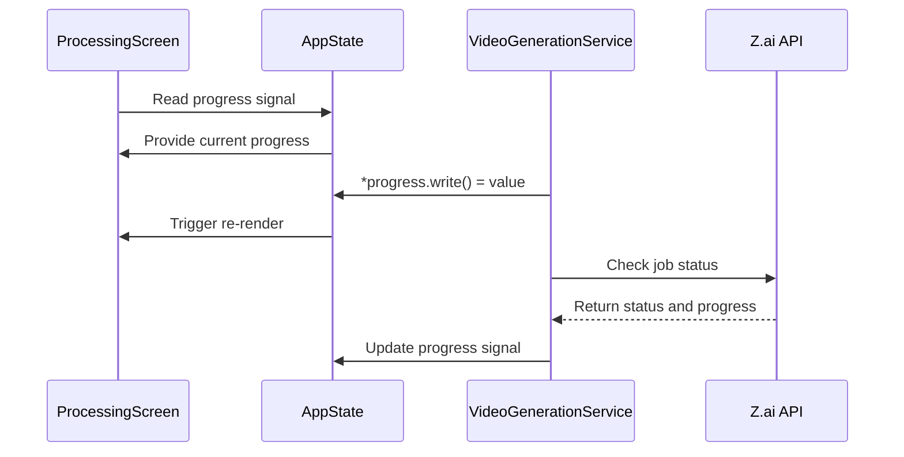
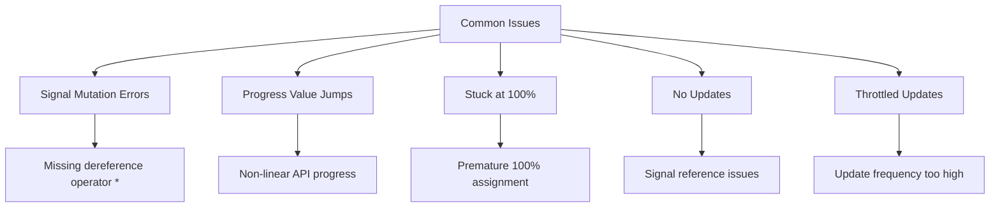
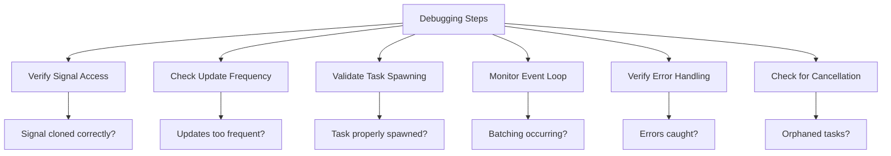

# Progress Bar Update Issues

<cite>
**Referenced Files in This Document**   
- [progress_bar.rs](file://abogen-ui/crates/ui/components/progress_bar.rs)
- [state.rs](file://abogen-ui/crates/ui/state.rs)
- [video_generation.rs](file://abogen-ui/crates/ui/services/video_generation.rs)
- [zai_video.rs](file://abogen-ui/crates/ui/services/zai_video.rs)
- [lib.rs](file://abogen-ui/crates/ui/lib.rs)
- [video.rs](file://src/video.rs)
</cite>

## Table of Contents
1. [Introduction](#introduction)
2. [Progress Bar Component Structure](#progress-bar-component-structure)
3. [AppState and Signal Management](#appstate-and-signal-management)
4. [Video Generation and Progress Reporting](#video-generation-and-progress-reporting)
5. [Common Progress Update Issues](#common-progress-update-issues)
6. [Debugging Progress Throttling and Dropped Updates](#debugging-progress-throttling-and-dropped-updates)
7. [Best Practices for Real-Time Progress Updates](#best-practices-for-real-time-progress-updates)
8. [Conclusion](#conclusion)

## Introduction
This document addresses common issues with the progress bar component in the VoxWeave application, particularly focusing on problems such as the progress bar not updating, jumping values, or getting stuck at 100% before actual completion. The analysis centers on the interaction between the UI component and backend processing logic, with emphasis on proper signal mutation in Dioxus and correct progress reporting from asynchronous operations.

**Section sources**
- [progress_bar.rs](file://abogen-ui/crates/ui/components/progress_bar.rs#L1-L21)
- [state.rs](file://abogen-ui/crates/ui/state.rs#L208)

## Progress Bar Component Structure

The `ProgressBar` component is a Dioxus functional component that accepts a `Signal<u8>` representing the current progress percentage. It renders a styled div element with an inner bar whose width is dynamically set based on the progress value. The component displays the percentage text when progress exceeds 0.

The implementation uses Dioxus's reactive system to automatically re-render when the signal value changes. The component reads the current progress value within the render function and applies it directly to the CSS width property and display text.



**Diagram sources**
- [progress_bar.rs](file://abogen-ui/crates/ui/components/progress_bar.rs#L1-L21)

**Section sources**
- [progress_bar.rs](file://abogen-ui/crates/ui/components/progress_bar.rs#L1-L21)

## AppState and Signal Management

The `AppState` struct contains a `progress` field of type `Signal<u8>` that serves as the single source of truth for progress updates across the application. This signal is initialized to 0 in the `new()` method and is designed to be shared across components and services.

Improper mutation of this signal can lead to inconsistent UI states. The signal must be written to using the proper Dioxus pattern (`*signal.write() = value`) to ensure reactive updates are triggered. Direct assignment or mutation without dereferencing can break the reactivity chain.

The `AppState` is instantiated in the `InnerApp` component and passed down to child components, ensuring a consistent state management pattern throughout the application.

```mermaid
classDiagram
class AppState {
+selected_file : Signal<Option<FileInfo>>
+queue : Signal<Vec<QueuedItem>>
+voice : Signal<String>
+speed : Signal<f64>
+subtitle_mode : Signal<SubtitleMode>
+voice_format : Signal<VoiceFormat>
+subtitle_format : Signal<SubtitleFormat>
+replace_newlines : Signal<bool>
+save_location : Signal<SaveLocation>
+use_gpu : Signal<bool>
+generate_video : Signal<bool>
+video_style : Signal<VideoStyle>
+video_resolution : Signal<VideoResolution>
+video_format : Signal<VideoFormat>
+video_prompt : Signal<Option<String>>
+is_processing : Signal<bool>
+progress : Signal<u8>
+logs : Signal<Vec<LogEntry>>
+cancel_token : Signal<Option<()>>
}
class ProgressBar {
-progress : Signal<u8>
}
AppState --> ProgressBar : "provides progress signal"
```

**Diagram sources**
- [state.rs](file://abogen-ui/crates/ui/state.rs#L1-L258)
- [progress_bar.rs](file://abogen-ui/crates/ui/components/progress_bar.rs#L1-L21)

**Section sources**
- [state.rs](file://abogen-ui/crates/ui/state.rs#L1-L258)
- [lib.rs](file://abogen-ui/crates/ui/lib.rs#L600-L639)

## Video Generation and Progress Reporting

The video generation process involves multiple asynchronous steps, each of which should contribute to progress updates. The `VideoGenerationService` and `ZaiVideoService` components handle the communication with external APIs and are responsible for updating the progress signal at key stages of processing.

The `poll_video_status` methods in both services are critical for progress reporting. They periodically check the status of video generation jobs and extract progress information from API responses. This progress value is then written to the shared `progress` signal, which should trigger UI updates.

The services receive the progress signal as a mutable parameter and update it at logical stages: after uploading files, creating jobs, during polling, and before finalizing the output.



**Diagram sources**
- [video_generation.rs](file://abogen-ui/crates/ui/services/video_generation.rs#L49-L233)
- [zai_video.rs](file://abogen-ui/crates/ui/services/zai_video.rs#L62-L159)
- [state.rs](file://abogen-ui/crates/ui/state.rs#L208)

**Section sources**
- [video_generation.rs](file://abogen-ui/crates/ui/services/video_generation.rs#L1-L488)
- [zai_video.rs](file://abogen-ui/crates/ui/services/zai_video.rs#L1-L357)
- [video.rs](file://src/video.rs#L1-L461)

## Common Progress Update Issues

Several issues can cause the progress bar to behave incorrectly:

1. **Signal Mutation Errors**: Direct assignment to the signal without dereferencing (`progress.write() = value` instead of `*progress.write() = value`) prevents proper reactivity.

2. **Progress Value Jumps**: Occur when progress updates are batched or when the API returns non-linear progress values. The UI may jump from 20% to 80% if intermediate updates are skipped.

3. **Stuck at 100%**: Happens when the progress signal is set to 100 before the operation completes, typically due to incorrect ordering of operations in the service logic.

4. **No Updates**: Can result from the signal not being properly shared between components or from asynchronous tasks not having access to the correct signal reference.

5. **Throttled Updates**: The UI may not reflect rapid progress changes if updates occur faster than the rendering cycle can process them.

The root cause often lies in improper handling of the reactive signal system or incorrect timing of progress updates in relation to actual processing stages.



**Diagram sources**
- [progress_bar.rs](file://abogen-ui/crates/ui/components/progress_bar.rs#L1-L21)
- [state.rs](file://abogen-ui/crates/ui/state.rs#L208)
- [video_generation.rs](file://abogen-ui/crates/ui/services/video_generation.rs#L233)

**Section sources**
- [progress_bar.rs](file://abogen-ui/crates/ui/components/progress_bar.rs#L1-L21)
- [state.rs](file://abogen-ui/crates/ui/state.rs#L208)
- [video_generation.rs](file://abogen-ui/crates/ui/services/video_generation.rs#L1-L488)

## Debugging Progress Throttling and Dropped Updates

To identify when progress updates are being throttled or dropped due to task scheduling:

1. **Verify Signal Access**: Ensure that all asynchronous tasks have access to the same signal instance. Cloning the signal using `.clone()` maintains the same underlying reactive value.

2. **Check Update Frequency**: If progress updates occur too rapidly, consider implementing a debounce mechanism or minimum interval between updates to prevent overwhelming the rendering system.

3. **Validate Task Spawning**: Ensure that tasks updating progress are properly spawned using `dioxus::prelude::spawn` and that they maintain references to the correct signal.

4. **Monitor Event Loop**: Rapid signal mutations in tight loops may be batched by the framework. Inserting small delays (`tokio::time::sleep`) between updates can help ensure they are processed.

5. **Verify Error Handling**: Ensure that errors in the progress update chain don't silently fail. Wrap signal mutations in appropriate error handling to catch and log issues.

6. **Check for Cancellation**: When processing is cancelled, ensure the progress signal is properly reset and that no orphaned tasks continue to update it.

The key is to ensure that every progress update properly mutates the signal and that the reactive system can keep up with the update frequency.



**Diagram sources**
- [lib.rs](file://abogen-ui/crates/ui/lib.rs#L600-L639)
- [video_generation.rs](file://abogen-ui/crates/ui/services/video_generation.rs#L233)
- [zai_video.rs](file://abogen-ui/crates/ui/services/zai_video.rs#L159)

**Section sources**
- [lib.rs](file://abogen-ui/crates/ui/lib.rs#L600-L639)
- [video_generation.rs](file://abogen-ui/crates/ui/services/video_generation.rs#L1-L488)
- [zai_video.rs](file://abogen-ui/crates/ui/services/zai_video.rs#L1-L357)

## Best Practices for Real-Time Progress Updates

To ensure smooth animation and real-time updates during asynchronous operations:

1. **Proper Signal Mutation**: Always use `*signal.write() = value` pattern when updating signals to ensure reactivity.

2. **Sequential Progress Updates**: Ensure progress values increase monotonically and avoid jumping backward or making large jumps forward.

3. **Stage-Based Progress Mapping**: Map discrete processing stages to percentage ranges (e.g., upload: 0-30%, processing: 30-80%, download: 80-100%).

4. **API Progress Integration**: When consuming APIs that provide progress, normalize the values to ensure smooth transitions.

5. **Cancellation Handling**: When cancelling operations, properly reset the progress signal and ensure no background tasks continue to update it.

6. **Error Recovery**: In case of errors, update progress to reflect the failure state and provide appropriate feedback.

7. **Performance Considerations**: Avoid updating progress too frequently; consider limiting updates to every 1-5% change or with a minimum time interval.

The integration between the pipeline's progress reporting and the UI component should follow a consistent pattern where each significant processing step results in a progress update that accurately reflects the overall completion percentage.

```mermaid
flowchart TD
A[Best Practices] --> B[Proper Signal Mutation]
A --> C[Sequential Progress]
A --> D[Stage-Based Mapping]
A --> E[API Integration]
A --> F[Cancellation Handling]
A --> G[Error Recovery]
A --> H[Performance]
B --> I[Use *signal.write() = value]
C --> J[Monotonic increases]
D --> K[Map stages to ranges]
E --> L[Normalize API values]
F --> M[Reset on cancel]
G --> N[Reflect failure state]
H --> O[Limit update frequency]
```

**Diagram sources**
- [progress_bar.rs](file://abogen-ui/crates/ui/components/progress_bar.rs#L1-L21)
- [state.rs](file://abogen-ui/crates/ui/state.rs#L208)
- [video_generation.rs](file://abogen-ui/crates/ui/services/video_generation.rs#L233)

**Section sources**
- [progress_bar.rs](file://abogen-ui/crates/ui/components/progress_bar.rs#L1-L21)
- [state.rs](file://abogen-ui/crates/ui/state.rs#L1-L258)
- [video_generation.rs](file://abogen-ui/crates/ui/services/video_generation.rs#L1-L488)

## Conclusion
The progress bar component issues in VoxWeave primarily stem from improper signal management and inconsistent progress reporting patterns across asynchronous operations. By ensuring proper signal mutation with the dereference operator, implementing stage-based progress mapping, and carefully managing the timing of updates, the UI can provide smooth, accurate feedback during processing operations. The integration between the backend processing pipeline and the frontend UI must maintain a consistent contract for progress reporting to ensure users receive reliable status updates.