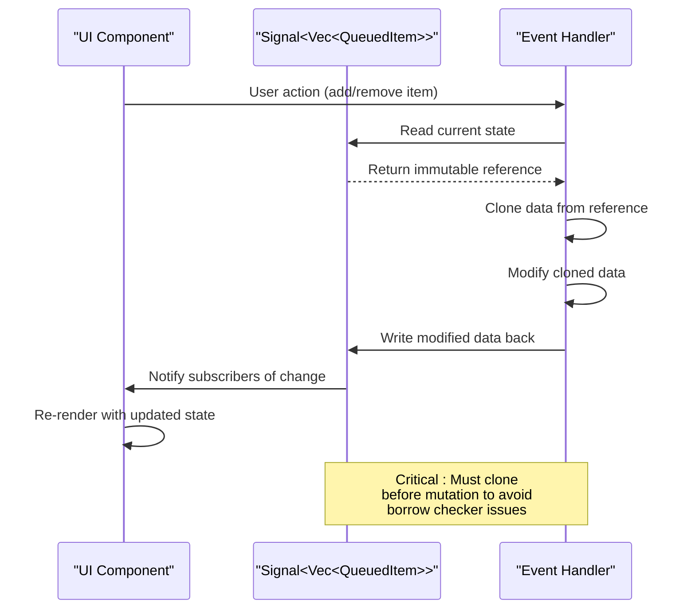
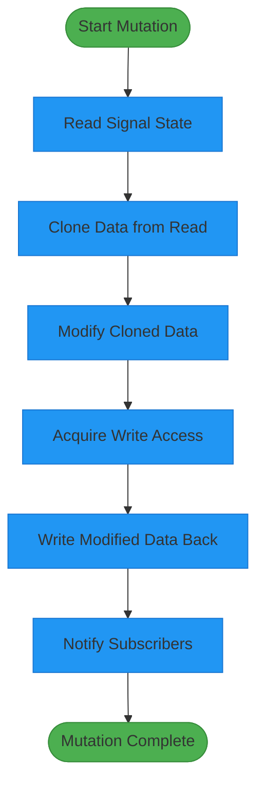

# Queue Modal Management Issues

<cite>
**Referenced Files in This Document**   
- [queue_modal.rs](file://abogen-ui/crates/ui/components/queue_modal.rs)
- [state.rs](file://abogen-ui/crates/ui/state.rs)
- [lib.rs](file://abogen-ui/crates/ui/lib.rs)
- [queue.rs](file://src/queue.rs)
- [STATUS.md](file://abogen-ui/STATUS.md)
</cite>

## Table of Contents
1. [Introduction](#introduction)
2. [Core Issues in Queue Modal Management](#core-issues-in-queue-modal-management)
3. [State Structure and Data Flow](#state-structure-and-data-flow)
4. [Reactivity Problems and UI Synchronization](#reactivity-problems-and-ui-synchronization)
5. [Race Conditions in Concurrent Operations](#race-conditions-in-concurrent-operations)
6. [Data Persistence and Mutation Patterns](#data-persistence-and-mutation-patterns)
7. [Recommended Mutation Patterns for Nested State](#recommended-mutation-patterns-for-nested-state)
8. [Troubleshooting Guide](#troubleshooting-guide)
9. [Conclusion](#conclusion)

## Introduction
This document addresses critical issues in the `queue_modal` component responsible for managing batch processing jobs in the Dioxus application. The modal interface allows users to view, reorder, and remove queued items for audio and video generation tasks. Several problems have been identified that affect data integrity, UI reactivity, and state synchronization. This analysis provides a comprehensive understanding of these issues and offers solutions based on established patterns in the codebase.

**Section sources**
- [queue_modal.rs](file://abogen-ui/crates/ui/components/queue_modal.rs#L1-L195)
- [state.rs](file://abogen-ui/crates/ui/state.rs#L1-L259)

## Core Issues in Queue Modal Management

The queue modal component exhibits several critical issues that impact user experience and data integrity:

1. **Queued items not persisting after closure**: Items added to the queue may not be properly retained when the modal is closed and reopened.
2. **Incorrect state synchronization**: The visual display in the modal does not always reflect the actual state of the queue signal.
3. **Race conditions during concurrent operations**: Simultaneous add/remove operations can lead to inconsistent state.
4. **Data loss or duplication**: Improper handling of `Vec<QueuedItem>` in `AppState` can result in lost or duplicated queue entries.

These issues stem from improper signal mutation patterns and inadequate handling of Dioxus's reactivity system.

**Section sources**
- [queue_modal.rs](file://abogen-ui/crates/ui/components/queue_modal.rs#L1-L195)
- [state.rs](file://abogen-ui/crates/ui/state.rs#L1-L259)
- [lib.rs](file://abogen-ui/crates/ui/lib.rs#L1-L640)

## State Structure and Data Flow

The application state is managed through the `AppState` struct which contains a `Signal<Vec<QueuedItem>>` for the queue. The `QueuedItem` struct contains comprehensive configuration for each processing job including file information, voice settings, subtitle options, and video generation parameters.

```mermaid
classDiagram
class AppState {
+Signal<Option<FileInfo>> selected_file
+Signal<Vec<QueuedItem>> queue
+Signal<String> voice
+Signal<f64> speed
+Signal<SubtitleMode> subtitle_mode
+Signal<VoiceFormat> voice_format
+Signal<SubtitleFormat> subtitle_format
+Signal<bool> replace_newlines
+Signal<SaveLocation> save_location
+Signal<bool> use_gpu
+Signal<bool> generate_video
+Signal<VideoStyle> video_style
+Signal<VideoResolution> video_resolution
+Signal<VideoFormat> video_format
+Signal<Option<String>> video_prompt
+Signal<bool> is_processing
+Signal<u8> progress
+Signal<Vec<LogEntry>> logs
+Signal<Option<()>> cancel_token
}
class QueuedItem {
+FileInfo file
+String voice
+f64 speed
+SubtitleMode subtitle_mode
+VoiceFormat voice_format
+SubtitleFormat subtitle_format
+bool replace_newlines
+bool use_gpu
+bool generate_video
+VideoStyle video_style
+VideoResolution video_resolution
+VideoFormat video_format
+Option<String> video_prompt
+SaveLocation save_location
}
class FileInfo {
+String name
+String path
+u64 size
}
AppState --> QueuedItem : "contains"
QueuedItem --> FileInfo : "references"
```

**Diagram sources**
- [state.rs](file://abogen-ui/crates/ui/state.rs#L1-L259)

## Reactivity Problems and UI Synchronization

The primary reactivity issue occurs when the modal fails to reflect real-time changes to the queue. This is caused by improper signal mutation patterns in event handlers. When mutations are performed directly on signals captured in closures, the borrow checker prevents proper mutation, leading to stale UI state.

The correct pattern, as documented in the project status, involves creating a mutable copy of the signal before mutation:



**Diagram sources**
- [queue_modal.rs](file://abogen-ui/crates/ui/components/queue_modal.rs#L127-L161)
- [STATUS.md](file://abogen-ui/STATUS.md#L196-L206)

## Race Conditions in Concurrent Operations

Race conditions occur when multiple operations attempt to modify the queue simultaneously. The current implementation is vulnerable because each operation reads the queue state independently and writes back modifications without coordination.

When two operations (e.g., adding an item and removing another) execute concurrently:
1. Both operations read the current queue state
2. Each modifies their local copy of the queue
3. Each writes back their modified version
4. The last write wins, potentially overwriting changes from the first operation

This can lead to data loss or inconsistent state. The issue is exacerbated by the fact that queue operations involve multiple steps: reading the current state, cloning it, modifying the clone, and writing it back.

**Section sources**
- [queue_modal.rs](file://abogen-ui/crates/ui/components/queue_modal.rs#L127-L161)
- [lib.rs](file://abogen-ui/crates/ui/lib.rs#L31-L55)

## Data Persistence and Mutation Patterns

The root cause of data persistence issues lies in improper signal mutation patterns. In Dioxus 0.5, signals are `Copy` types, but when captured in closures, Rust's borrow checker requires special handling to allow mutation.

The problematic pattern:
```rust
// This fails due to borrow checker constraints
app_state.queue.write().push(item);
```

The correct pattern, as established in the codebase:
```rust
let mut queue = state.queue;
*queue.write() = items;
```

This pattern works because signals are `Copy` types in Dioxus 0.5, allowing them to be cloned before mutation. The mutation sequence involves:
1. Creating a mutable copy of the signal
2. Reading the current value and cloning it
3. Modifying the cloned data
4. Writing the modified data back to the signal

**Section sources**
- [STATUS.md](file://abogen-ui/STATUS.md#L196-L206)
- [queue_modal.rs](file://abogen-ui/crates/ui/components/queue_modal.rs#L127-L161)

## Recommended Mutation Patterns for Nested State

For complex nested state structures like `Vec<QueuedItem>` in `AppState`, the following mutation pattern should be consistently applied:



**Diagram sources**
- [STATUS.md](file://abogen-ui/STATUS.md#L196-L206)
- [queue_modal.rs](file://abogen-ui/crates/ui/components/queue_modal.rs#L127-L161)

## Troubleshooting Guide

### Issue: Queue items not persisting after modal closure
**Symptoms**: Items appear to be added but disappear when the modal is reopened.
**Root Cause**: Signal mutation without proper cloning pattern.
**Solution**: Ensure all queue modifications follow the established pattern:
```rust
let mut queue = state.queue;
let mut items = queue.read().clone();
items.push(new_item);
*queue.write() = items;
```

### Issue: UI not reflecting queue changes
**Symptoms**: The modal display doesn't update when items are added or removed.
**Root Cause**: Direct signal mutation without proper reactivity handling.
**Solution**: Always use the copy-and-write pattern for signal mutations.

### Issue: Race conditions during concurrent operations
**Symptoms**: Items are lost or duplicated when multiple operations occur simultaneously.
**Solution**: Implement operation queuing or use mutex-like patterns to serialize access to the queue state.

### Issue: Data loss during processing
**Symptoms**: Queue is cleared unexpectedly during processing.
**Solution**: Ensure the processing logic properly handles the queue state and doesn't inadvertently clear it.

**Section sources**
- [queue_modal.rs](file://abogen-ui/crates/ui/components/queue_modal.rs#L1-L195)
- [lib.rs](file://abogen-ui/crates/ui/lib.rs#L31-L55)
- [STATUS.md](file://abogen-ui/STATUS.md#L196-L206)

## Conclusion
The queue modal management issues stem from improper handling of Dioxus signals and nested state structures. By consistently applying the established mutation pattern of creating a mutable signal copy before modification, these issues can be resolved. The key insight is that Dioxus 0.5 signals are `Copy` types, enabling the pattern of `let mut signal_copy = original_signal; *signal_copy.write() = new_value;`. This approach ensures proper reactivity, prevents race conditions, and maintains data integrity throughout the application lifecycle.

**Section sources**
- [STATUS.md](file://abogen-ui/STATUS.md#L196-L206)
- [queue_modal.rs](file://abogen-ui/crates/ui/components/queue_modal.rs#L1-L195)
- [state.rs](file://abogen-ui/crates/ui/state.rs#L1-L259)