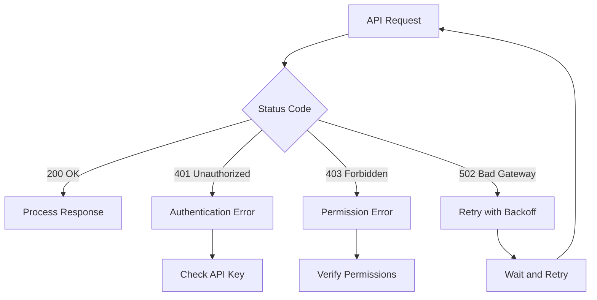

# API Authentication and Connectivity

<cite>
**Referenced Files in This Document**   
- [video.rs](file://src/video.rs)
- [zai_video.rs](file://abogen-ui/crates/ui/services/zai_video.rs)
- [video_generation.rs](file://abogen-ui/crates/ui/services/video_generation.rs)
</cite>

## Table of Contents
1. [API Authentication Configuration](#api-authentication-configuration)
2. [Authentication Failure Scenarios](#authentication-failure-scenarios)
3. [Network Connectivity Issues](#network-connectivity-issues)
4. [HTTP Error Handling](#http-error-handling)
5. [Troubleshooting and Validation](#troubleshooting-and-validation)

## API Authentication Configuration

The VoxWeave video generation pipeline supports authentication with both Z.AI and OpenAI Sora services through environment variables. The `VideoGenerationService::from_env()` implementation in the core video module follows a specific priority order when loading API credentials.

The service first attempts to load the `OPENAI_API_KEY` environment variable. If this variable is not set, it falls back to the `ZAI_API_KEY` environment variable. This dual-provider approach allows users to choose between OpenAI Sora and Z.AI services for video generation.

To properly configure authentication, users must set the appropriate environment variable before running the application. For Z.AI services, set:
```bash
export ZAI_API_KEY=your_zai_api_key_here
```

For OpenAI Sora services, set:
```bash
export OPENAI_API_KEY=your_openai_api_key_here
```

The service endpoints are configured as follows:
- Z.AI API: `https://api.z.ai/api/paas/v4`
- OpenAI API: `https://api.openai.com/v1`

**Section sources**
- [video.rs](file://src/video.rs#L31-L46)

## Authentication Failure Scenarios

Several common authentication failure scenarios can occur when using the video generation pipeline. The most frequent issues include malformed API keys, incorrect environment variable names, and insufficient permission scopes.

When neither `OPENAI_API_KEY` nor `ZAI_API_KEY` environment variables are set, the `from_env()` method returns an error with the message "Neither OPENAI_API_KEY nor ZAI_API_KEY environment variable is set". This prevents the service from initializing without proper authentication credentials.

Malformed API keys typically result in HTTP 401 Unauthorized responses from the API endpoints. The system validates API keys at the service level, but the actual authentication occurs when making requests to the external APIs. Incorrectly formatted keys (such as those with spaces, special characters, or improper length) will be rejected by the API servers.

Permission scope issues may arise when the API key lacks the necessary permissions for video generation operations. The service requires API keys with permissions to access video generation endpoints, upload media files, and retrieve generated content.

**Section sources**
- [video.rs](file://src/video.rs#L35-L45)
- [zai_video.rs](file://abogen-ui/crates/ui/services/zai_video.rs#L49-L54)

## Network Connectivity Issues

Network connectivity problems can prevent the video generation pipeline from accessing the required API endpoints. The primary endpoints that must be accessible are `https://api.z.ai/api/paas/v4` for Z.AI services and `https://api.openai.com/v1` for OpenAI services.

DNS resolution failures can occur if the system cannot resolve the API domain names. This may be caused by network configuration issues, DNS server problems, or firewall restrictions that block DNS queries. Users should verify that they can resolve these domains using standard DNS lookup tools.

Firewall restrictions represent another common connectivity issue. Corporate networks or security software may block outbound connections to these API endpoints. The video generation service requires outbound HTTPS (port 443) access to both domains. Users experiencing connectivity issues should check their firewall settings and proxy configurations.

Network timeouts can also disrupt the video generation process, particularly during the polling phase when checking job status. The service implements retry logic with exponential backoff to handle transient network issues, but persistent connectivity problems will ultimately result in job failures.

**Section sources**
- [video.rs](file://src/video.rs#L31-L40)
- [video_generation.rs](file://abogen-ui/crates/ui/services/video_generation.rs#L457-L486)

## HTTP Error Handling

The video generation pipeline implements comprehensive error handling for HTTP responses from the API services. Different HTTP status codes trigger specific error handling procedures in the `create_video_job()` and `poll_video_status()` functions.

HTTP 401 Unauthorized errors indicate authentication failures, typically due to invalid or missing API keys. When a 401 response is received, the service returns an error message containing the status code and response text, which helps users identify authentication issues.

HTTP 403 Forbidden errors suggest that the API key is valid but lacks sufficient permissions for the requested operation. This may occur if the key has restricted scope or if the account has limitations on video generation capabilities.

HTTP 502 Bad Gateway errors represent server-side issues with the API providers. The service handles these errors by continuing to poll for job status, as 502 errors are often transient. The retry mechanism with exponential backoff helps mitigate temporary server issues.

The error handling implementation includes parsing the response body to extract detailed error messages when available. This provides users with specific information about the nature of the failure, rather than generic error messages.



**Diagram sources**
- [video.rs](file://src/video.rs#L179-L214)
- [video.rs](file://src/video.rs#L246-L284)
- [video_generation.rs](file://abogen-ui/crates/ui/services/video_generation.rs#L211-L248)

**Section sources**
- [video.rs](file://src/video.rs#L179-L354)
- [video_generation.rs](file://abogen-ui/crates/ui/services/video_generation.rs#L170-L248)

## Troubleshooting and Validation

Effective troubleshooting of API authentication and connectivity issues requires systematic validation of credentials and network access. Users can employ several methods to diagnose and resolve common problems.

To test API connectivity, users can use curl commands to verify access to the endpoints. For Z.AI services:
```bash
curl -H "Authorization: Bearer $ZAI_API_KEY" https://api.z.ai/api/paas/v4/health
```

For OpenAI services:
```bash
curl -H "Authorization: Bearer $OPENAI_API_KEY" https://api.openai.com/v1/models
```

These commands help verify that the network path to the APIs is accessible and that the credentials are properly formatted.

Users should validate their credentials through the respective provider dashboards. The Z.AI dashboard allows users to view API key status, usage statistics, and permission scopes. Similarly, the OpenAI platform provides detailed information about API keys and usage limits.

When troubleshooting, users should follow this systematic approach:
1. Verify environment variable names and values
2. Test network connectivity to API endpoints
3. Check API key permissions and scopes
4. Monitor API usage limits and quotas
5. Review error messages for specific details

The service implements retry logic with exponential backoff for transient failures, which helps mitigate temporary network issues. However, persistent errors require manual intervention and credential validation.

**Section sources**
- [video.rs](file://src/video.rs#L49-L94)
- [zai_video.rs](file://abogen-ui/crates/ui/services/zai_video.rs#L49-L94)
- [video_generation.rs](file://abogen-ui/crates/ui/services/video_generation.rs#L457-L486)