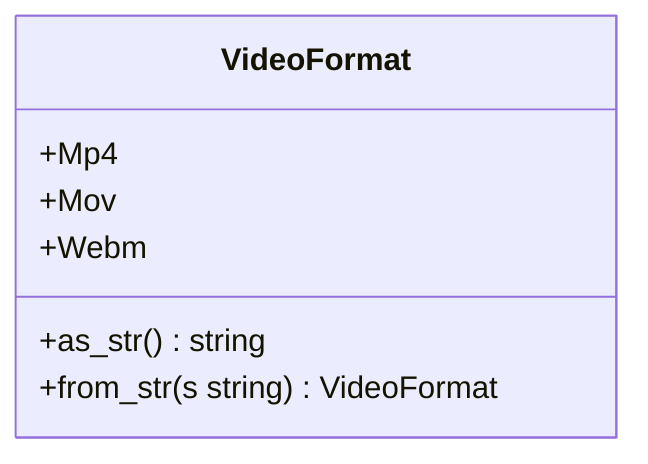
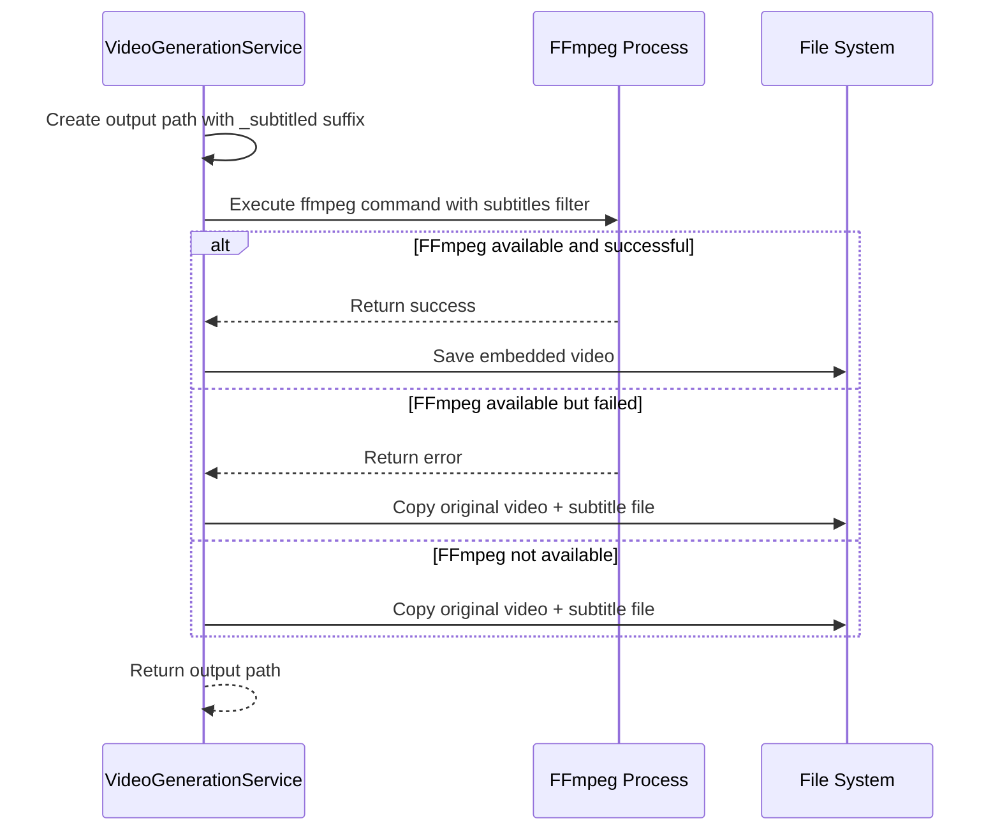
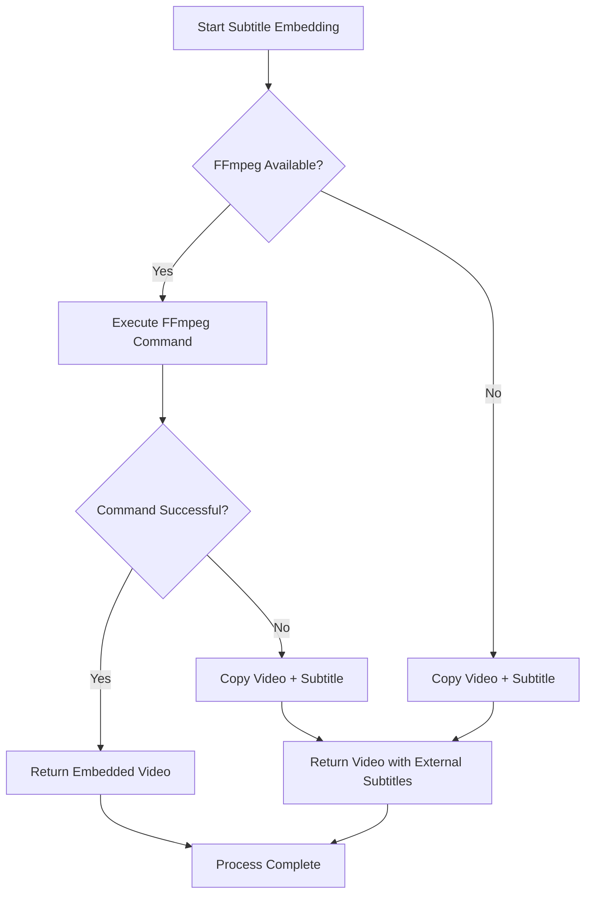

# Output Format and Conversion Issues

<cite>
**Referenced Files in This Document**   
- [video.rs](file://src/video.rs)
- [queue.rs](file://src/queue.rs)
- [state.rs](file://abogen-ui/crates/ui/state.rs)
- [video_generation.rs](file://abogen-ui/crates/ui/services/video_generation.rs)
- [sanitize.rs](file://src/sanitize.rs)
</cite>

## Table of Contents
1. [Introduction](#introduction)
2. [Supported Video Formats](#supported-video-formats)
3. [File Extension and MIME Type Handling](#file-extension-and-mime-type-handling)
4. [Subtitle Embedding Process](#subtitle-embedding-process)
5. [Common Output Issues and Troubleshooting](#common-output-issues-and-troubleshooting)
6. [Platform-Specific Playback Problems](#platform-specific-playback-problems)
7. [Output Integrity Verification](#output-integrity-verification)
8. [Best Practices for Format Conversion](#best-practices-for-format-conversion)

## Introduction
This document addresses video output format and conversion issues in VoxWeave, focusing on the handling of supported formats (MP4, MOV, WebM) as defined in the VideoFormat enum. It covers the implementation of the download_video() and embed_subtitles() functions, file extension management, container compatibility, and common issues encountered during video generation and subtitle embedding processes.

**Section sources**
- [video.rs](file://src/video.rs#L369-L431)
- [state.rs](file://abogen-ui/crates/ui/state.rs#L126-L185)

## Supported Video Formats
VoxWeave supports three primary video output formats through the VideoFormat enum: MP4, MOV, and WebM. These formats are implemented across both the core library and UI components, ensuring consistent handling throughout the application.

The VideoFormat enum provides string conversion methods that map each format to its corresponding file extension:
- MP4 maps to "mp4" extension
- MOV maps to "mov" extension  
- WebM maps to "webm" extension

These formats are used in video generation configuration and determine the output file extension during the download and subtitle embedding processes.



**Diagram sources**
- [state.rs](file://abogen-ui/crates/ui/state.rs#L155-L185)
- [queue.rs](file://src/queue.rs#L46-L51)

**Section sources**
- [state.rs](file://abogen-ui/crates/ui/state.rs#L155-L185)
- [queue.rs](file://src/queue.rs#L46-L51)

## File Extension and MIME Type Handling
The system handles file extensions through consistent string conversion methods in the VideoFormat enum. When generating output paths, the config.format.as_str() method is used to determine the appropriate file extension.

During the video download process, the output filename is constructed using:
```rust
let video_filename = format!("{}.{}", audio_stem, config.format.as_str());
```

The system does not explicitly handle MIME types for output video files, relying instead on standard file extensions to indicate format. This approach ensures compatibility with most media players and operating systems, though it may lead to issues in environments that strictly enforce MIME type validation.

**Section sources**
- [video.rs](file://src/video.rs#L369-L408)
- [video_generation.rs](file://abogen-ui/crates/ui/services/video_generation.rs#L353-L390)

## Subtitle Embedding Process
The subtitle embedding process uses FFmpeg to burn subtitles into video files. The process follows these steps:

1. Create output path with "_subtitled" suffix using the configured video format
2. Execute FFmpeg command with subtitles filter
3. Handle success, failure, or FFmpeg unavailability

When FFmpeg is available, the system uses the following command structure:
```
ffmpeg -i [input_video] -vf "subtitles=[subtitle_file]" -c:v libx264 -c:a copy -y [output_path]
```

If FFmpeg is not available, the system falls back to copying the original video and providing subtitles as a separate file.



**Diagram sources**
- [video.rs](file://src/video.rs#L369-L431)
- [video_generation.rs](file://abogen-ui/crates/ui/services/video_generation.rs#L353-L458)

**Section sources**
- [video.rs](file://src/video.rs#L369-L431)
- [video_generation.rs](file://abogen-ui/crates/ui/services/video_generation.rs#L353-L458)

## Common Output Issues and Troubleshooting
### Incomplete Downloads and Corrupted Files
Incomplete downloads can occur due to network issues during video retrieval from the Z.ai API. The system implements basic error checking through HTTP status validation, but does not currently verify the integrity of downloaded video data.

Corrupted files may result from:
- Interrupted download processes
- FFmpeg conversion failures
- Insufficient disk space
- Permission issues in output directory

### Format Conversion Failures
Subtitle embedding failures typically occur when:
- FFmpeg is not installed or not in system PATH
- Input video format is incompatible with FFmpeg's subtitle filter
- Subtitle file path contains special characters
- Output directory has insufficient permissions

The system handles FFmpeg failures by falling back to external subtitle files, ensuring that video content remains available even when embedding fails.

### Filename and Path Issues
Special characters in filenames are handled through the sanitize_name_for_os function, which:
- Replaces invalid characters with underscores
- Handles OS-specific reserved names (e.g., "CON" on Windows)
- Prevents hidden files on macOS by replacing leading dots
- Limits filename length to 255 characters

Long file paths may cause issues on Windows systems with MAX_PATH limitations. The system does not currently implement path length validation.



**Diagram sources**
- [video.rs](file://src/video.rs#L369-L431)
- [sanitize.rs](file://src/sanitize.rs#L0-L129)

**Section sources**
- [video.rs](file://src/video.rs#L369-L431)
- [sanitize.rs](file://src/sanitize.rs#L0-L129)

## Platform-Specific Playback Problems
### MP4 Format Issues
While MP4 is widely supported, issues may arise due to:
- H.264 profile compatibility with older devices
- Audio codec compatibility (AAC vs. others)
- Container metadata issues

### MOV Format Limitations
MOV files may encounter playback issues on non-Apple devices due to:
- Proprietary QuickTime extensions
- Codec compatibility issues
- Metadata handling differences

### WebM Format Challenges
WebM support varies significantly across platforms:
- Limited support on iOS devices
- Inconsistent hardware acceleration
- Browser-specific implementation differences

## Output Integrity Verification
The system currently lacks comprehensive output verification mechanisms. Basic validation includes:
- HTTP status checking during download
- FFmpeg process exit code validation
- File existence checks

For critical applications, users should implement additional verification steps:
- Check file headers using media analysis tools
- Validate file size against expected values
- Test playback on target devices
- Verify subtitle synchronization

## Best Practices for Format Conversion
1. **Choose appropriate formats for target platforms:**
   - MP4 for maximum compatibility
   - WebM for web-focused applications
   - MOV for Apple ecosystem integration

2. **Ensure FFmpeg is properly installed:**
   - Verify FFmpeg is in system PATH
   - Test FFmpeg functionality independently
   - Keep FFmpeg updated to latest version

3. **Handle edge cases in filenames:**
   - Avoid special characters in source files
   - Use short, descriptive names
   - Ensure adequate permissions in output directory

4. **Implement fallback strategies:**
   - Use external subtitles when embedding fails
   - Provide format conversion options
   - Maintain original files until conversion is verified

5. **Test on target devices:**
   - Verify playback on intended platforms
   - Check subtitle rendering quality
   - Validate file size and quality trade-offs

**Section sources**
- [video.rs](file://src/video.rs#L369-L431)
- [video_generation.rs](file://abogen-ui/crates/ui/services/video_generation.rs#L353-L458)
- [sanitize.rs](file://src/sanitize.rs#L0-L129)