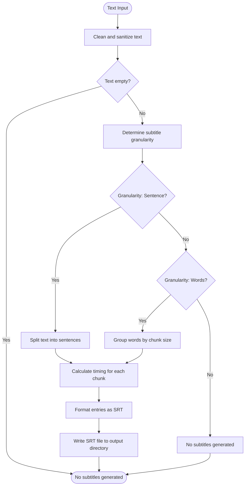
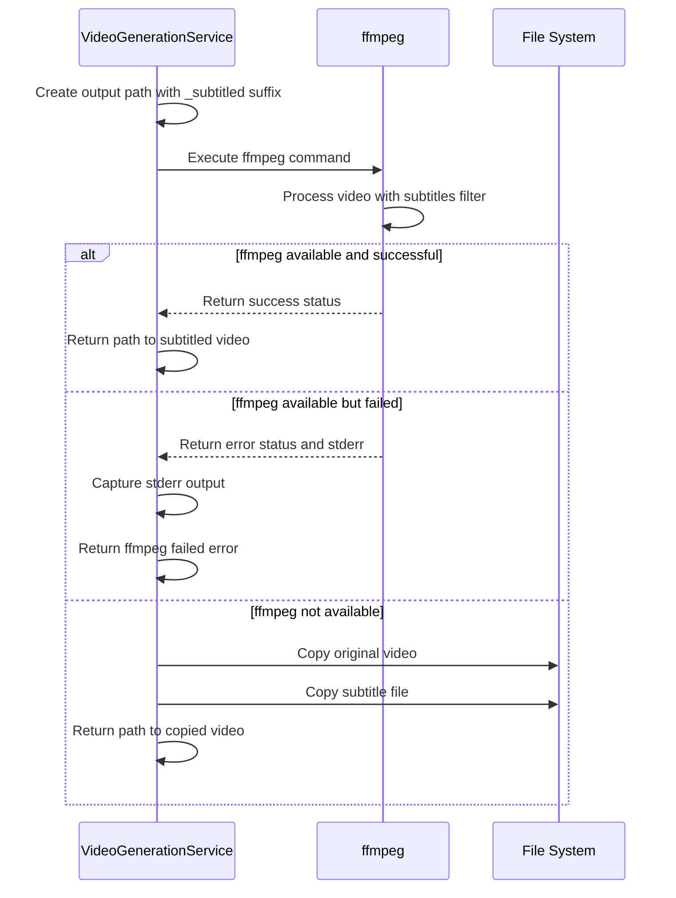
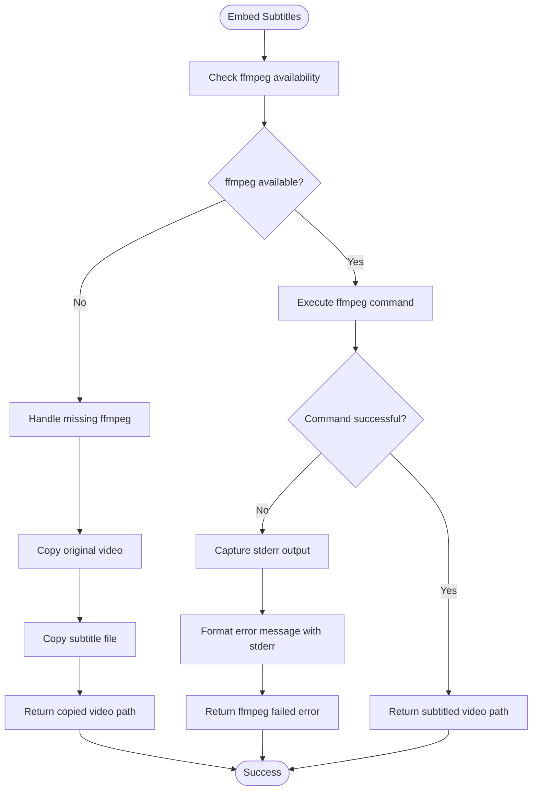
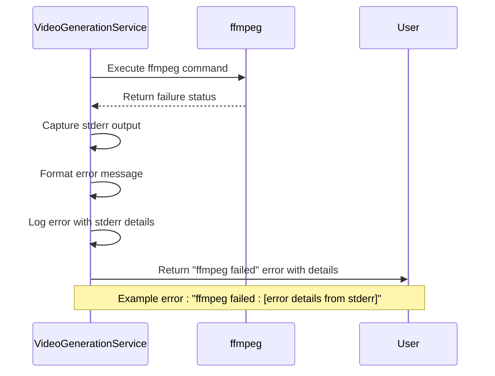
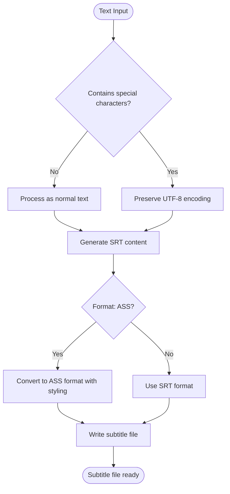
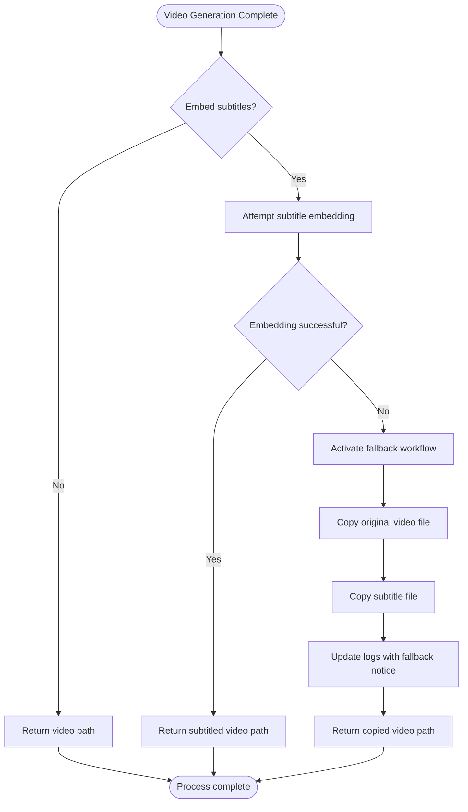

# Subtitle Synchronization and Embedding

<cite>
**Referenced Files in This Document**   
- [src/subtitle.rs](file://src/subtitle.rs)
- [src/video.rs](file://src/video.rs)
- [abogen-ui/crates/ui/services/video_generation.rs](file://abogen-ui/crates/ui/services/video_generation.rs)
- [abogen-ui/crates/ui/services/tts_service.rs](file://abogen-ui/crates/ui/services/tts_service.rs)
- [abogen-ui/crates/ui/services/mlt_video.rs](file://abogen-ui/crates/ui/services/mlt_video.rs)
- [src/pipeline.rs](file://src/pipeline.rs)
</cite>

## Table of Contents
1. [Introduction](#introduction)
2. [Subtitle Generation and Timing](#subtitle-generation-and-timing)
3. [Subtitle Embedding Process](#subtitle-embedding-process)
4. [Common Failure Points](#common-failure-points)
5. [Error Handling and Troubleshooting](#error-handling-and-troubleshooting)
6. [Text Encoding and Special Characters](#text-encoding-and-special-characters)
7. [Verification and Fallback Workflows](#verification-and-fallback-workflows)

## Introduction
This document addresses subtitle synchronization and embedding issues within VoxWeave's video pipeline. It covers subtitle timing accuracy between generated audio and SRT files, particularly when using different TTS engines or speed multipliers. The document details the subtitle embedding process via ffmpeg in VideoGenerationService::embed_subtitles(), including common failure points, error handling, and fallback workflows.

## Subtitle Generation and Timing

Subtitle timing accuracy is critical for synchronizing generated audio with SRT files. The timing is calculated based on text content, granularity settings, and average words per minute (WPM).

The system supports multiple subtitle granularity options:
- **Sentence-level**: Subtitles are split at sentence boundaries
- **Word-level**: Subtitles are grouped by specified word count
- **Disabled**: No subtitles are generated

The timing calculation uses a default WPM of 150 if not specified or if a non-positive value is provided. Each subtitle entry's duration is calculated based on word count and the average milliseconds per word.

**Diagram sources**
- [src/subtitle.rs](file://src/subtitle.rs#L0-L54)
- [src/subtitle.rs](file://src/subtitle.rs#L52-L95)

**Section sources**
- [src/subtitle.rs](file://src/subtitle.rs#L0-L155)
- [src/pipeline.rs](file://src/pipeline.rs#L41-L81)

## Subtitle Embedding Process

The subtitle embedding process uses ffmpeg to burn subtitles into video files through the VideoGenerationService::embed_subtitles() method. This process occurs after video generation and before final output.

The embedding workflow:
1. Create output path with "_subtitled" suffix
2. Execute ffmpeg command with subtitles filter
3. Handle success, failure, or ffmpeg unavailability
4. Return path to embedded video or fallback output

The ffmpeg command uses the subtitles video filter to render subtitles directly into the video stream, preserving the original audio stream while encoding the video with libx264.

**Diagram sources**
- [src/video.rs](file://src/video.rs#L369-L408)
- [abogen-ui/crates/ui/services/video_generation.rs](file://abogen-ui/crates/ui/services/video_generation.rs#L353-L390)

**Section sources**
- [src/video.rs](file://src/video.rs#L369-L431)
- [abogen-ui/crates/ui/services/video_generation.rs](file://abogen-ui/crates/ui/services/video_generation.rs#L353-L419)

## Common Failure Points

Several common failure points can occur during subtitle embedding:

### Missing ffmpeg Installation
The most common failure point is the absence of ffmpeg in the system PATH. When ffmpeg is not available, the system implements a fallback mechanism that copies the original video and subtitle files to the output directory without embedding.

### Path Resolution Issues
Path resolution problems can occur when:
- Video or subtitle paths contain special characters
- Paths are too long for the operating system
- Paths contain spaces not properly escaped
- Relative paths are resolved incorrectly

### Permission Errors
Permission errors may arise when:
- The application lacks write permissions to the output directory
- The video file is locked by another process
- Read permissions are missing for input files

### Platform-Specific Limitations
On web platforms (WASM architecture), ffmpeg cannot be executed directly. The system detects this and uses a web-compatible fallback that provides subtitles as a separate file.

**Diagram sources**
- [src/video.rs](file://src/video.rs#L369-L431)
- [abogen-ui/crates/ui/services/video_generation.rs](file://abogen-ui/crates/ui/services/video_generation.rs#L353-L419)

**Section sources**
- [src/video.rs](file://src/video.rs#L369-L431)
- [abogen-ui/crates/ui/services/video_generation.rs](file://abogen-ui/crates/ui/services/video_generation.rs#L353-L419)

## Error Handling and Troubleshooting

The error handling in embed_subtitles() captures detailed information when ffmpeg fails, providing actionable feedback for troubleshooting.

When ffmpeg fails, the system captures the stderr output and includes it in the error message. This allows users to diagnose the specific cause of the failure, such as codec issues, file format problems, or command-line parameter errors.

For scenarios where subtitle embedding fails but video generation succeeds, the system returns the original video path and logs a notice that subtitles will be provided as a separate file. This ensures that users still receive their video content even when subtitle embedding fails.

**Diagram sources**
- [src/video.rs](file://src/video.rs#L405-L431)
- [abogen-ui/crates/ui/services/video_generation.rs](file://abogen-ui/crates/ui/services/video_generation.rs#L388-L419)

**Section sources**
- [src/video.rs](file://src/video.rs#L405-L431)
- [abogen-ui/crates/ui/services/video_generation.rs](file://abogen-ui/crates/ui/services/video_generation.rs#L388-L419)

## Text Encoding and Special Characters

Subtitle embedding must handle various text encoding issues and special characters:

### Text Encoding
The system uses UTF-8 encoding for subtitle files to support international characters and special symbols. When generating SRT files, all text is preserved in its original encoding.

### Special Character Handling
Special characters in subtitles are handled through proper escaping in the ffmpeg command line. The subtitle path is passed directly to ffmpeg, which handles the file content.

### Styling Conflicts
Styling conflicts are minimized by using the standard SRT format without embedded styling. For advanced styling needs, the system supports ASS (Advanced SubStation Alpha) format through format conversion.

The subtitle generation process preserves special characters and handles them correctly in the output SRT files.

**Diagram sources**
- [abogen-ui/crates/ui/services/tts_service.rs](file://abogen-ui/crates/ui/services/tts_service.rs#L149-L178)
- [src/subtitle.rs](file://src/subtitle.rs#L0-L54)

**Section sources**
- [abogen-ui/crates/ui/services/tts_service.rs](file://abogen-ui/crates/ui/services/tts_service.rs#L149-L178)
- [src/subtitle.rs](file://src/subtitle.rs#L0-L54)

## Verification and Fallback Workflows

To verify successful subtitle embedding, users should check for:
- The presence of the "_subtitled" suffix in the output filename
- Visual confirmation that subtitles appear in the video
- File size differences between original and subtitled videos

When ffmpeg is unavailable, the system implements a fallback workflow:
1. Copy the original video file to the output directory
2. Copy the subtitle file to the same directory with matching basename
3. Return the path to the copied video

This ensures that users receive both video and subtitle content even when embedding fails. The subtitles remain available as a separate .srt file that can be loaded by video players.

The fallback mechanism ensures robustness across different environments, including systems without ffmpeg and web platforms where native command execution is not possible.

**Diagram sources**
- [src/video.rs](file://src/video.rs#L369-L431)
- [abogen-ui/crates/ui/services/video_generation.rs](file://abogen-ui/crates/ui/services/video_generation.rs#L353-L458)

**Section sources**
- [src/video.rs](file://src/video.rs#L369-L431)
- [abogen-ui/crates/ui/services/video_generation.rs](file://abogen-ui/crates/ui/services/video_generation.rs#L353-L458)