# Video Generation Issues

<cite>
**Referenced Files in This Document**   
- [CLI_VIDEO_GENERATION.md](file://CLI_VIDEO_GENERATION.md)
- [VIDEO_CLI_IMPLEMENTATION.md](file://VIDEO_CLI_IMPLEMENTATION.md)
- [generate_video.sh](file://generate_video.sh)
- [src/video.rs](file://src/video.rs)
- [abogen-ui/crates/ui/services/zai_video.rs](file://abogen-ui/crates/ui/services/zai_video.rs)
- [abogen-ui/crates/ui/services/video_generation.rs](file://abogen-ui/crates/ui/services/video_generation.rs)
- [abogen-ui/crates/ui/services/mlt_video.rs](file://abogen-ui/crates/ui/services/mlt_video.rs)
</cite>

## Table of Contents
1. [Introduction](#introduction)
2. [Z.AI API Integration Issues](#zai-api-integration-issues)
3. [Video Style and Resolution Problems](#video-style-and-resolution-problems)
4. [Custom Prompt Handling](#custom-prompt-handling)
5. [Subtitle and Audio Synchronization](#subtitle-and-audio-synchronization)
6. [Script Execution and Format Conversion](#script-execution-and-format-conversion)
7. [Timeout and Large File Handling](#timeout-and-large-file-handling)
8. [API Request/Response Debugging](#api-requestresponse-debugging)

## Introduction
This document addresses common issues encountered in VoxWeave's AI video pipeline, focusing on troubleshooting video generation problems. The analysis covers Z.AI API integration challenges, video style selection, resolution settings, custom prompt handling, subtitle embedding, and script execution issues. The documentation provides solutions for format conversion failures and timeout errors during video generation.

**Section sources**
- [CLI_VIDEO_GENERATION.md](file://CLI_VIDEO_GENERATION.md#L1-L324)
- [VIDEO_CLI_IMPLEMENTATION.md](file://VIDEO_CLI_IMPLEMENTATION.md#L1-L335)

## Z.AI API Integration Issues

### Authentication Failures
Authentication issues occur when the Z.AI API key is not properly configured. The system checks for both `ZAI_API_KEY` and `OPENAI_API_KEY` environment variables, with Z.AI being the fallback option.

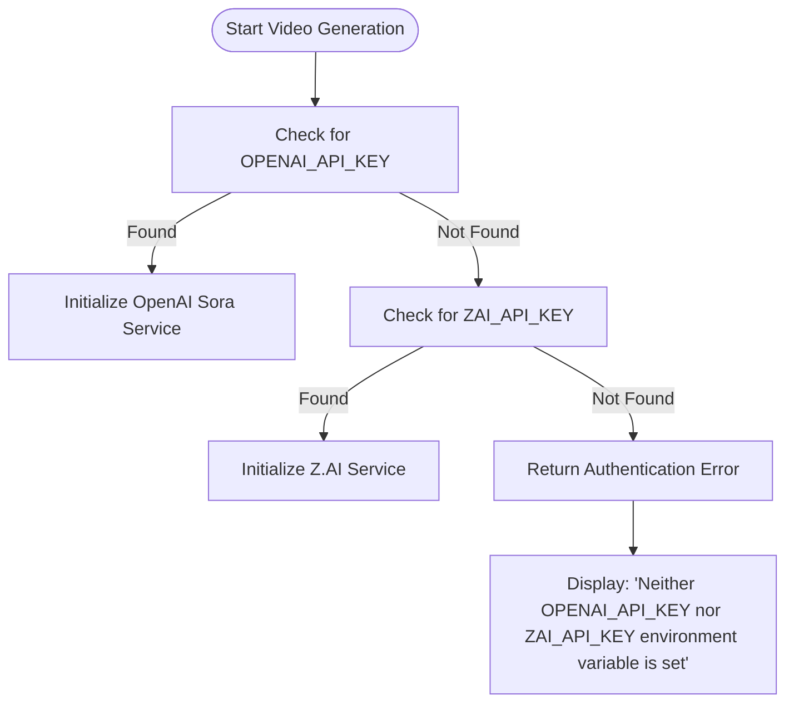

**Diagram sources**
- [src/video.rs](file://src/video.rs#L45-L81)
- [abogen-ui/crates/ui/services/zai_video.rs](file://abogen-ui/crates/ui/services/zai_video.rs#L49-L94)

### Rate Limiting and Invalid API Keys
The system implements retry logic with exponential backoff to handle rate limiting. Invalid API keys result in immediate authentication errors with clear messaging.

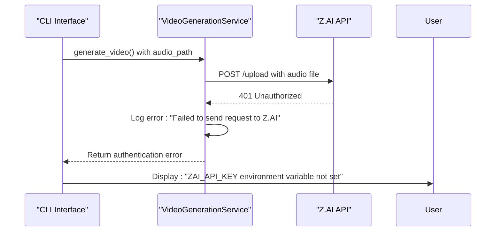

**Diagram sources**
- [abogen-ui/crates/ui/services/video_generation.rs](file://abogen-ui/crates/ui/services/video_generation.rs#L100-L150)
- [src/video.rs](file://src/video.rs#L100-L150)

**Section sources**
- [src/video.rs](file://src/video.rs#L45-L81)
- [abogen-ui/crates/ui/services/zai_video.rs](file://abogen-ui/crates/ui/services/zai_video.rs#L49-L94)

## Video Style and Resolution Problems

### Video Style Selection Issues
The system supports multiple video styles including realistic, anime, 3d, cinematic, biotech, cyberpunk, and educational. Style selection issues typically occur due to case sensitivity or invalid style names.

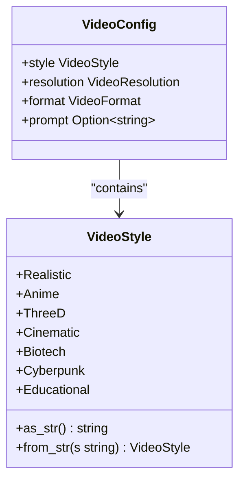

**Diagram sources**
- [abogen-ui/crates/ui/state.rs](file://abogen-ui/crates/ui/state.rs#L96-L129)
- [src/main.rs](file://src/main.rs#L337-L375)

### Resolution Setting Problems
Resolution settings (720p, 1080p, 4k) must match exactly with supported values. The system defaults to 1080p if an invalid resolution is specified.

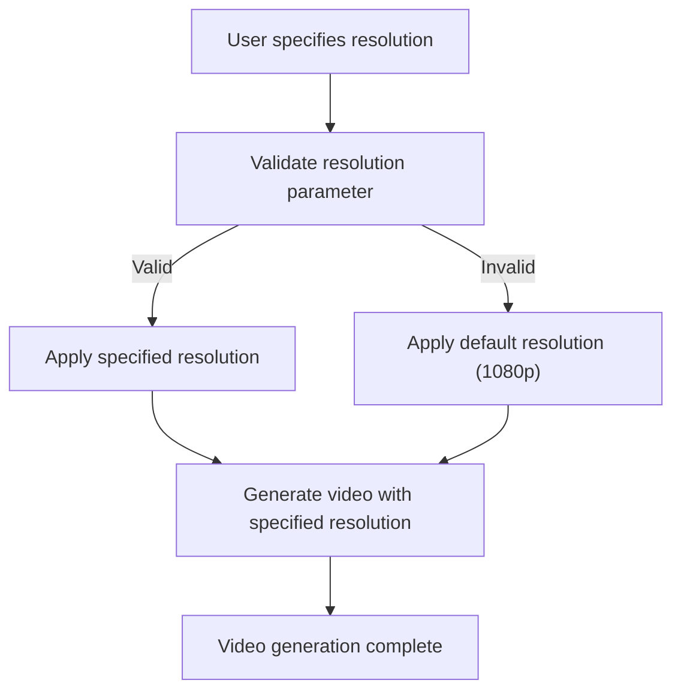

**Diagram sources**
- [src/main.rs](file://src/main.rs#L337-L375)
- [abogen-ui/crates/ui/lib.rs](file://abogen-ui/crates/ui/lib.rs#L492-L514)

**Section sources**
- [VIDEO_CLI_IMPLEMENTATION.md](file://VIDEO_CLI_IMPLEMENTATION.md#L100-L150)
- [CLI_VIDEO_GENERATION.md](file://CLI_VIDEO_GENERATION.md#L100-L150)

## Custom Prompt Handling

### Custom Prompt Implementation
Custom prompts are optional parameters that enhance video generation with specific visual instructions. The system handles prompts through the `prompt` field in the video configuration.

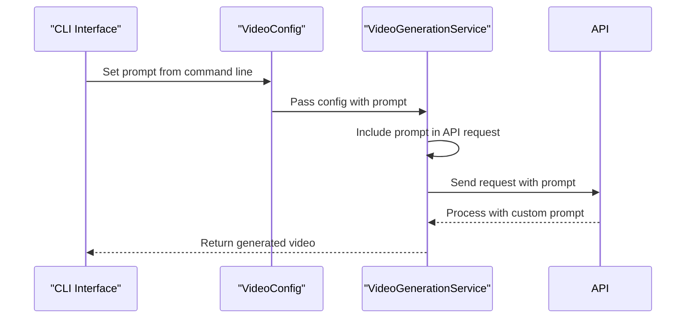

**Diagram sources**
- [src/video.rs](file://src/video.rs#L200-L250)
- [VIDEO_CLI_IMPLEMENTATION.md](file://VIDEO_CLI_IMPLEMENTATION.md#L150-L200)

**Section sources**
- [VIDEO_CLI_IMPLEMENTATION.md](file://VIDEO_CLI_IMPLEMENTATION.md#L150-L200)
- [CLI_VIDEO_GENERATION.md](file://CLI_VIDEO_GENERATION.md#L150-L200)

## Subtitle and Audio Synchronization

### Subtitle Embedding Issues
Subtitle embedding relies on ffmpeg for integration into the final video. When ffmpeg is unavailable, subtitles are provided as a separate .srt file.

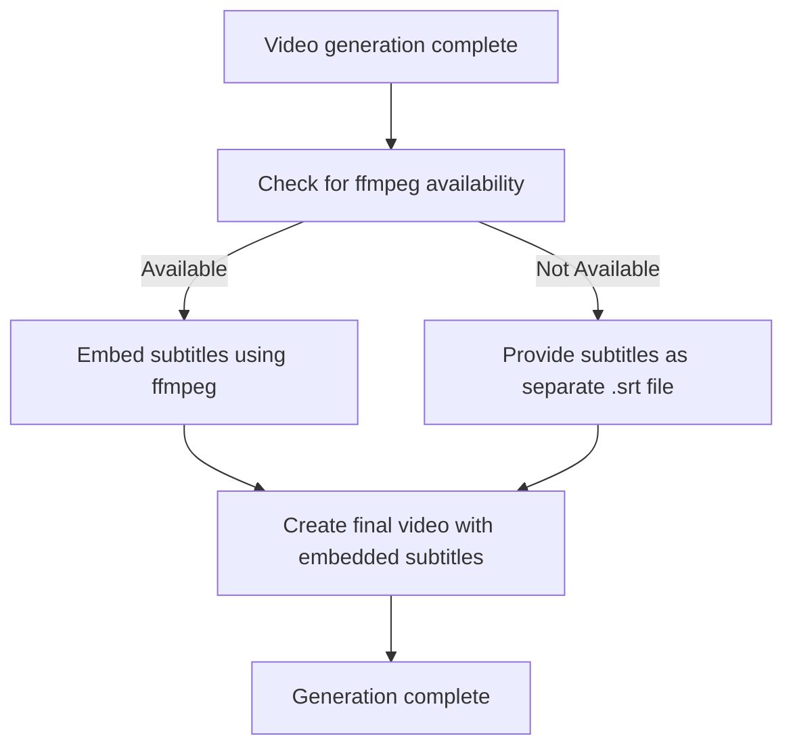

**Diagram sources**
- [abogen-ui/crates/ui/services/video_generation.rs](file://abogen-ui/crates/ui/services/video_generation.rs#L353-L390)
- [abogen-ui/crates/ui/services/mlt_video.rs](file://abogen-ui/crates/ui/services/mlt_video.rs#L277-L323)

### Audio-Video Synchronization Problems
Synchronization issues are prevented through precise timing calculations based on audio duration and word-level subtitle timing.

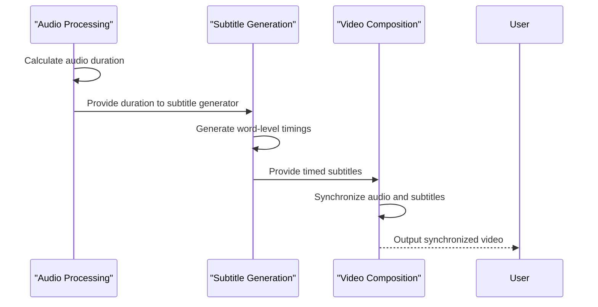

**Diagram sources**
- [abogen-ui/crates/ui/services/mlt_video.rs](file://abogen-ui/crates/ui/services/mlt_video.rs#L277-L323)
- [abogen-ui/crates/ui/services/tts_service.rs](file://abogen-ui/crates/ui/services/tts_service.rs#L149-L178)

**Section sources**
- [abogen-ui/crates/ui/services/mlt_video.rs](file://abogen-ui/crates/ui/services/mlt_video.rs#L277-L323)
- [abogen-ui/crates/ui/services/tts_service.rs](file://abogen-ui/crates/ui/services/tts_service.rs#L149-L178)

## Script Execution and Format Conversion

### generate_video.sh Script Issues
The generate_video.sh script handles the complete video generation workflow but may fail due to missing API keys or build errors.

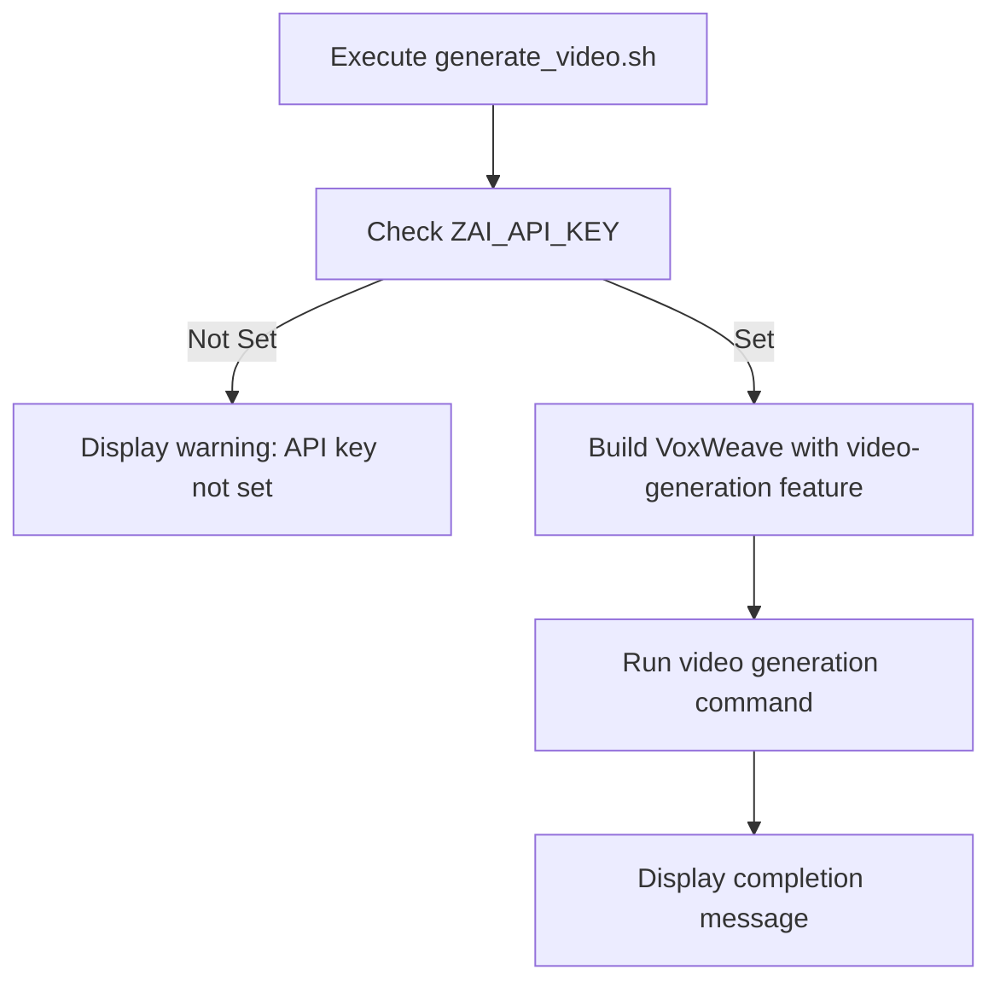

**Diagram sources**
- [generate_video.sh](file://generate_video.sh#L1-L40)
- [VIDEO_CLI_IMPLEMENTATION.md](file://VIDEO_CLI_IMPLEMENTATION.md#L286-L313)

### Format Conversion Failures
Format conversion (mp4, mov, webm) may fail due to missing codecs or incorrect format specifications in the configuration.

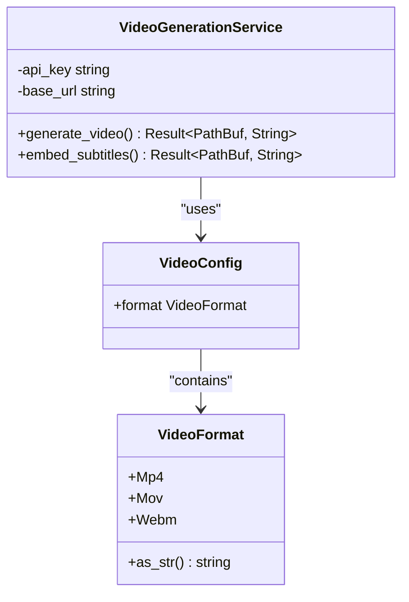

**Diagram sources**
- [src/main.rs](file://src/main.rs#L337-L375)
- [abogen-ui/crates/ui/lib.rs](file://abogen-ui/crates/ui/lib.rs#L492-L514)

**Section sources**
- [generate_video.sh](file://generate_video.sh#L1-L40)
- [src/video.rs](file://src/video.rs#L389-L420)

## Timeout and Large File Handling

### Timeout Errors During Video Generation
The system implements timeout handling with a maximum wait time of 5 minutes for video generation jobs.

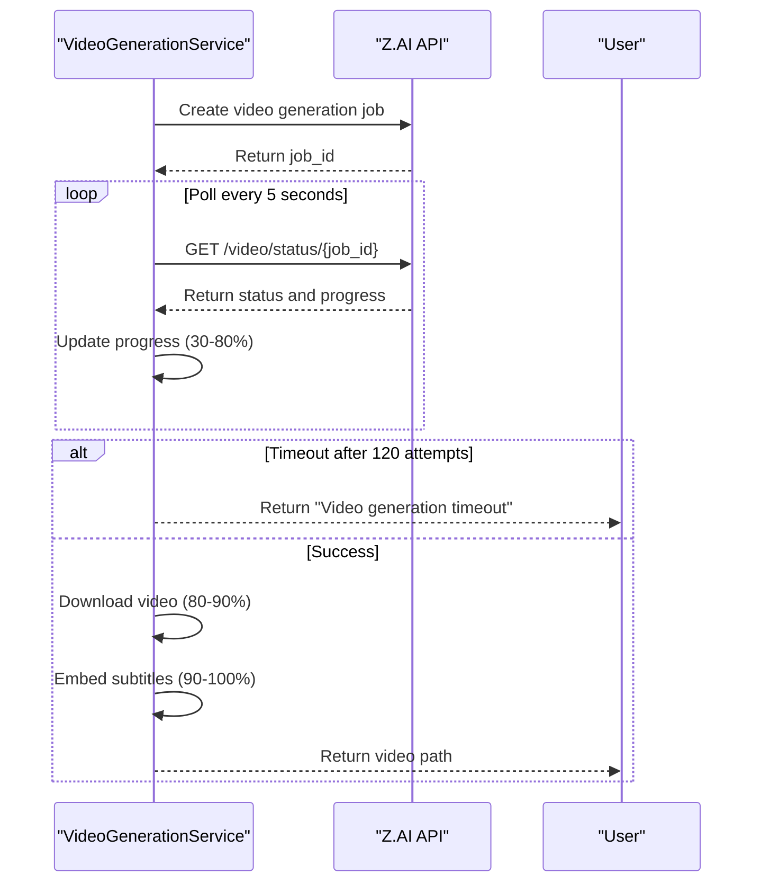

**Diagram sources**
- [abogen-ui/crates/ui/services/zai_video.rs](file://abogen-ui/crates/ui/services/zai_video.rs#L138-L182)
- [src/video.rs](file://src/video.rs#L283-L322)

### Handling Large File Outputs
Large file outputs are managed through direct file system operations and streaming downloads to prevent memory issues.

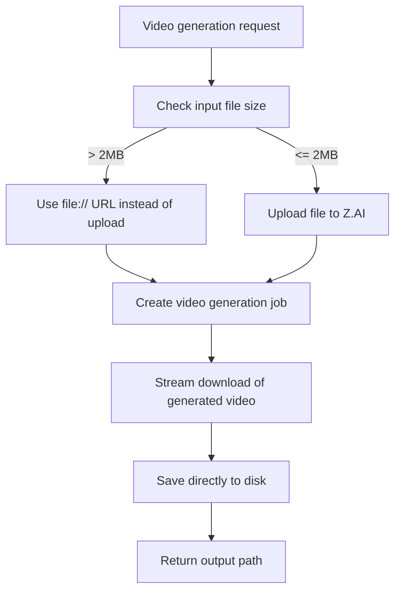

**Diagram sources**
- [src/video.rs](file://src/video.rs#L150-L200)
- [abogen-ui/crates/ui/services/video_generation.rs](file://abogen-ui/crates/ui/services/video_generation.rs#L200-L250)

**Section sources**
- [src/video.rs](file://src/video.rs#L150-L200)
- [abogen-ui/crates/ui/services/zai_video.rs](file://abogen-ui/crates/ui/services/zai_video.rs#L138-L182)

## API Request/Response Debugging

### Debugging API Request/Response Cycles
The system provides comprehensive logging for API request/response cycles to facilitate debugging.

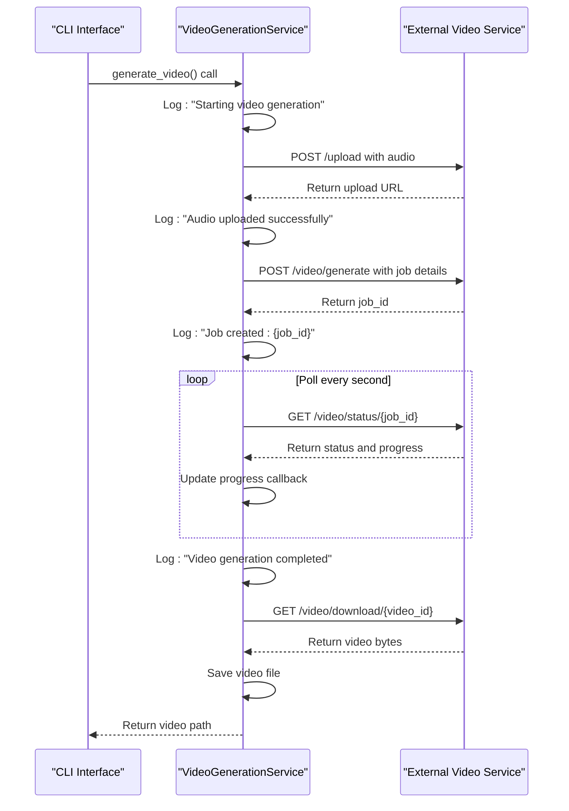

**Diagram sources**
- [src/video.rs](file://src/video.rs#L45-L81)
- [abogen-ui/crates/ui/services/video_generation.rs](file://abogen-ui/crates/ui/services/video_generation.rs#L100-L150)

### Interpreting Error Codes
External video generation services return specific error codes that are translated into user-friendly messages.

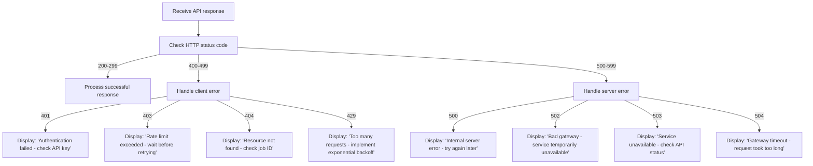

**Diagram sources**
- [src/video.rs](file://src/video.rs#L49-L94)
- [abogen-ui/crates/ui/services/zai_video.rs](file://abogen-ui/crates/ui/services/zai_video.rs#L49-L94)

**Section sources**
- [src/video.rs](file://src/video.rs#L45-L81)
- [abogen-ui/crates/ui/services/zai_video.rs](file://abogen-ui/crates/ui/services/zai_video.rs#L49-L94)