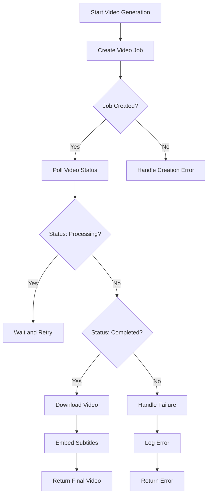
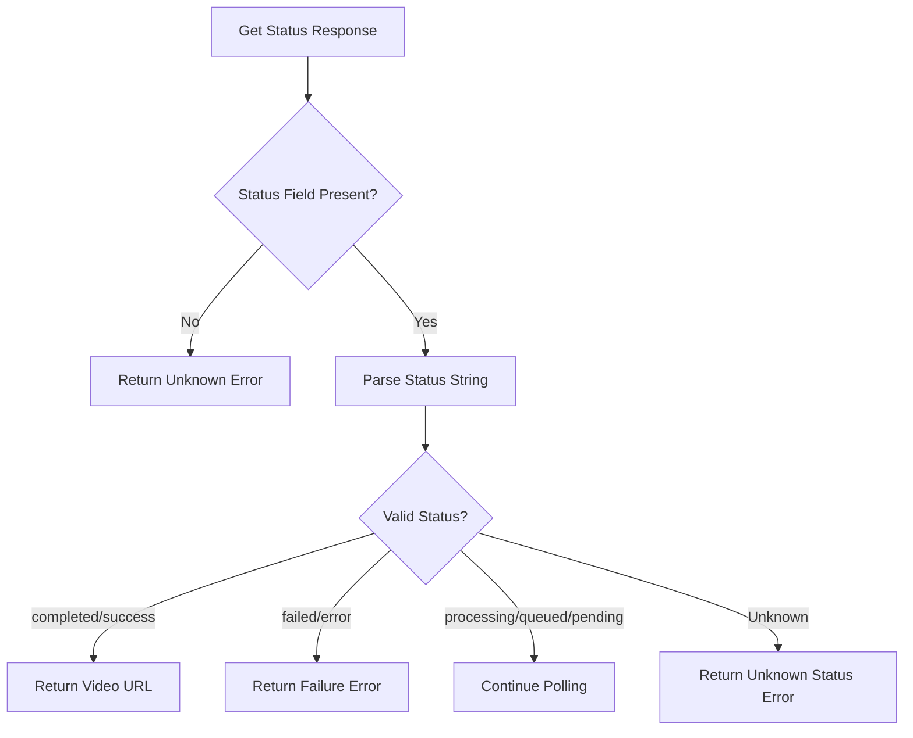

# Video Generation Job Failures

<cite>
**Referenced Files in This Document**   
- [video.rs](file://src/video.rs)
- [zai_video.rs](file://abogen-ui/crates/ui/services/zai_video.rs)
- [state.rs](file://abogen-ui/crates/ui/state.rs)
- [ZAI_VIDEO_FEATURE.md](file://abogen-ui/ZAI_VIDEO_FEATURE.md)
- [VIDEO_CLI_IMPLEMENTATION.md](file://VIDEO_CLI_IMPLEMENTATION.md)
</cite>

## Table of Contents
1. [Introduction](#introduction)
2. [Video Generation Service Overview](#video-generation-service-overview)
3. [Error Conditions in Video Generation](#error-conditions-in-video-generation)
4. [Job Status and Polling Mechanism](#job-status-and-polling-mechanism)
5. [Timeout Handling in poll_video_status()](#timeout-handling-in-poll_video_status)
6. [Invalid Request Parameters](#invalid-request-parameters)
7. [Model Unavailability and Quota Exhaustion](#model-unavailability-and-quota-exhaustion)
8. [Debugging Techniques](#debugging-techniques)
9. [Conclusion](#conclusion)

## Introduction

This document provides a comprehensive analysis of video generation job failures in VoxWeave, focusing on the `VideoGenerationService::create_video_job()` and `poll_video_status()` functions. It details error conditions such as invalid video styles, unsupported resolutions, malformed prompts, and API response issues. The document also covers debugging strategies using log callbacks and response inspection to resolve common video generation problems.

## Video Generation Service Overview

The video generation system in VoxWeave integrates with the Z.AI API to create AI-generated videos from text input, TTS narration, and visual styles. The service handles the full pipeline from job creation to final video delivery, including status polling and error handling.



**Diagram sources**
- [video.rs](file://src/video.rs#L90-L128)
- [zai_video.rs](file://abogen-ui/crates/ui/services/zai_video.rs#L115-L130)

**Section sources**
- [video.rs](file://src/video.rs#L1-L453)
- [zai_video.rs](file://abogen-ui/crates/ui/services/zai_video.rs#L1-L358)

## Error Conditions in Video Generation

### Invalid Video Styles

The system supports specific video styles including "cyberpunk", "cinematic", "biotech", "educational", "realistic", "anime", "3d", and "wan2.5-t2v-preview". Invalid style values will result in API errors.

When an invalid style is provided, the Z.AI API returns a 400 Bad Request response with an error message indicating the invalid parameter. The system validates styles through the `VideoStyle` enum in the state module, which maps string values to enum variants with default fallback to "realistic" for unrecognized values.

### Unsupported Resolutions

Supported resolutions are:
- 720p (1280×720)
- 1080p (1920×1080) 
- 4k (3840×2160)

Requests with unsupported resolution values will be rejected by the Z.AI API. The system uses the `VideoResolution` enum to validate resolution inputs, with "1080p" as the default value for invalid inputs.

### Malformed Custom Prompts

Custom prompts must be valid UTF-8 strings without control characters. Extremely long prompts (>1000 characters) may cause request size limitations. The prompt field is optional and can be omitted for default style-based generation.

The system accepts prompts through the `VideoConfig` struct, which allows optional prompt strings. Malformed prompts typically result in API validation errors rather than processing failures.

**Section sources**
- [state.rs](file://abogen-ui/crates/ui/state.rs#L100-L150)
- [video.rs](file://src/video.rs#L20-L40)
- [ZAI_VIDEO_FEATURE.md](file://abogen-ui/ZAI_VIDEO_FEATURE.md#L25-L75)

## Job Status and Polling Mechanism

### Status Response Interpretation

The Z.AI API returns job status with the following possible values:
- **completed**: Video generation finished successfully
- **success**: Synonym for completed
- **failed**: Job failed due to processing error
- **error**: Synonym for failed  
- **processing**: Job is currently being processed
- **queued**: Job is waiting in queue
- **pending**: Job is pending processing
- **unknown**: Unrecognized status (treated as error)

The `poll_video_status()` function interprets these responses and takes appropriate actions based on the status value.

### Handling FAIL Status

When the API returns "failed" or "error" status:
1. The system extracts the error message from the response body
2. Returns a formatted error string containing the API error
3. Stops polling and propagates the error to the caller
4. Logs the failure with ERROR level

The error response may include additional context such as model-specific errors or quota limitations.

### PROCESSING Timeouts

The system handles long-running jobs through a polling mechanism with configurable timeout limits. Jobs in "processing", "queued", or "pending" states trigger continued polling until completion or timeout.

The polling interval and maximum attempts vary between implementations:
- CLI version: 1-second intervals, 300 attempts (5-minute timeout)
- UI version: 5-second intervals, 120 attempts (10-minute timeout)

### Unknown Status Responses

When the API returns an unrecognized status string, the system treats this as an error condition. This prevents indefinite polling on unsupported or deprecated status values. The error message includes the received status for debugging purposes.



**Diagram sources**
- [video.rs](file://src/video.rs#L230-L274)
- [zai_video.rs](file://abogen-ui/crates/ui/services/zai_video.rs#L156-L182)

**Section sources**
- [video.rs](file://src/video.rs#L230-L320)
- [zai_video.rs](file://abogen-ui/crates/ui/services/zai_video.rs#L156-L200)

## Timeout Handling in poll_video_status()

### 5-Minute Timeout Mechanism

The `poll_video_status()` function implements a 5-minute timeout for video generation jobs in the CLI implementation. This is achieved through:

1. **Maximum Attempts**: 300 attempts at 1-second intervals
2. **Attempt Counter**: Tracks polling attempts
3. **Timeout Check**: Validates attempt count against maximum
4. **Error Propagation**: Returns timeout error when exceeded

```rust
let max_attempts = 300; // 5 minutes at 1s intervals
let mut attempts = 0;

loop {
    if attempts >= max_attempts {
        anyhow::bail!("Video generation timeout (5 minutes exceeded)");
    }
    // ... polling logic
    attempts += 1;
}
```

### Strategies for Long-Running Jobs

For jobs that exceed the 5-minute timeout:

1. **Implement Retry Logic**: The system should allow retrying failed jobs with exponential backoff
2. **Use Asynchronous Processing**: For long videos, consider implementing webhook-based completion notification instead of polling
3. **Increase Timeout**: Adjust `max_attempts` for specific use cases requiring longer processing
4. **Chunked Processing**: Break long videos into smaller segments for parallel processing

The UI implementation uses a more generous 10-minute timeout (120 attempts at 5-second intervals), acknowledging that users prefer longer wait times with visual feedback over premature failures.

**Section sources**
- [video.rs](file://src/video.rs#L230-L274)
- [zai_video.rs](file://abogen-ui/crates/ui/services/zai_video.rs#L167-L172)

## Invalid Request Parameters

### Parameter Validation

The system validates request parameters before sending to the Z.AI API:

1. **Audio URL**: Must be a valid HTTPS URL
2. **Style**: Must match supported styles in `VideoStyle` enum
3. **Resolution**: Must be one of "720p", "1080p", or "4k"
4. **Model**: Must be "video-generation" (hardcoded)
5. **Prompt**: Optional, must be valid UTF-8 string

### Error Responses

Invalid parameters result in 400 Bad Request responses from the Z.AI API with descriptive error messages. The system captures these responses and formats them for user display.

Common validation errors include:
- Invalid style name
- Unsupported resolution
- Missing required fields
- Malformed JSON
- Excessive request size

The `create_video_job()` function handles these errors by parsing the API response and returning descriptive error messages to the caller.

**Section sources**
- [video.rs](file://src/video.rs#L185-L228)
- [zai_video.rs](file://abogen-ui/crates/ui/services/zai_video.rs#L138-L182)

## Model Unavailability and Quota Exhaustion

### Model Unavailability

The system currently supports the following models:
- **cogvideox-3**: Not currently implemented
- **sora-2-pro**: Not currently implemented
- **video-generation**: Default model (hardcoded)

Attempts to use unavailable models will fail as the model parameter is hardcoded to "video-generation" in the request body. The system does not expose model selection to users.

### Quota Exhaustion

When API quotas are exhausted:
1. The Z.AI API returns a 429 Too Many Requests or 403 Forbidden response
2. The system captures the HTTP status and error text
3. Returns a descriptive error message to the caller
4. Logs the quota issue for user awareness

Users must monitor their Z.AI API usage and upgrade plans when approaching limits. The system does not implement automatic retry for quota exhaustion, as this would not resolve the underlying issue.

**Section sources**
- [video.rs](file://src/video.rs#L185-L228)
- [ZAI_VIDEO_FEATURE.md](file://abogen-ui/ZAI_VIDEO_FEATURE.md#L100-L120)

## Debugging Techniques

### Using log_callback for Job Lifecycle Tracing

The `log_callback` parameter enables detailed tracing of the video generation lifecycle:

```rust
let result = service.generate_video(
    &audio_path,
    subtitle_path.as_ref().map(|p| p.as_path()),
    &video_config,
    Some(|progress| println!("Progress: {}%", progress)),
    Some(|message, level| println!("[{:?}] {}", level, message))
).await;
```

The log callback receives messages at key stages:
- "Uploading audio to Z.ai..."
- "Creating video generation job..."
- "Video generation started (Job ID: ...)"
- "Downloading generated video..."
- "Embedding subtitles into video..."
- Success or failure messages

### Response Inspection

For debugging API issues, inspect the raw responses:

1. **Job Creation Response**: Check for `job_id` presence
2. **Status Polling Response**: Verify `status`, `progress`, and `video_url` fields
3. **Error Responses**: Capture full HTTP status and response body

The system uses `serde_json::Value` for flexible response parsing, allowing inspection of unexpected fields during debugging.

### Common Debugging Scenarios

| Issue | Diagnostic Steps | Solution |
|------|------------------|----------|
| Missing job_id | Check API key validity, verify request parameters | Validate API key and input parameters |
| Timeout errors | Check video length, monitor API status | Reduce input length or increase timeout |
| Download failures | Verify video_url format, check network | Retry with valid URL and stable connection |
| Subtitle embedding | Check ffmpeg availability, validate paths | Install ffmpeg or use external subtitles |

**Section sources**
- [video.rs](file://src/video.rs#L90-L128)
- [tts_service.rs](file://abogen-ui/crates/ui/services/tts_service.rs#L453-L485)

## Conclusion

Video generation job failures in VoxWeave can be effectively diagnosed and resolved by understanding the error conditions, status responses, and timeout mechanisms. Key strategies include validating input parameters, handling API errors appropriately, and using logging for lifecycle tracing. The system provides comprehensive error handling for common issues such as invalid styles, unsupported resolutions, and quota limitations. By following the debugging techniques outlined in this document, users can successfully troubleshoot and resolve video generation failures.