# Component Architecture

<cite>
**Referenced Files in This Document**   
- [header.rs](file://abogen-ui/crates/ui/components/header.rs)
- [drop_zone.rs](file://abogen-ui/crates/ui/components/drop_zone.rs)
- [neon_button.rs](file://abogen-ui/crates/ui/components/neon_button.rs)
- [slider.rs](file://abogen-ui/crates/ui/components/slider.rs)
- [combo.rs](file://abogen-ui/crates/ui/components/combo.rs)
- [checkbox.rs](file://abogen-ui/crates/ui/components/checkbox.rs)
- [progress_bar.rs](file://abogen-ui/crates/ui/components/progress_bar.rs)
- [log_panel.rs](file://abogen-ui/crates/ui/components/log_panel.rs)
- [file_picker.rs](file://abogen-ui/crates/ui/services/file_picker.rs)
- [gpu_probe.rs](file://abogen-ui/crates/ui/services/gpu_probe.rs)
- [tts_service.rs](file://abogen-ui/crates/ui/services/tts_service.rs)
- [state.rs](file://abogen-ui/crates/ui/state.rs)
- [lib.rs](file://abogen-ui/crates/ui/lib.rs)
- [theme.rs](file://abogen-ui/crates/ui/theme.rs)
</cite>

## Table of Contents
1. [Introduction](#introduction)
2. [Project Structure](#project-structure)
3. [Core Components](#core-components)
4. [Architecture Overview](#architecture-overview)
5. [Detailed Component Analysis](#detailed-component-analysis)
6. [Dependency Analysis](#dependency-analysis)
7. [Performance Considerations](#performance-considerations)
8. [Troubleshooting Guide](#troubleshooting-guide)
9. [Conclusion](#conclusion)

## Introduction
This document provides comprehensive documentation for the UI component architecture of the abogen-ui application, focusing on reusable Dioxus components. It details the implementation and integration of core UI elements, state management patterns, and service layer abstractions that enable cross-platform functionality. The documentation covers how components consume application state signals, trigger state mutations, and integrate with backend services for file handling, GPU detection, and text-to-speech processing.

## Project Structure

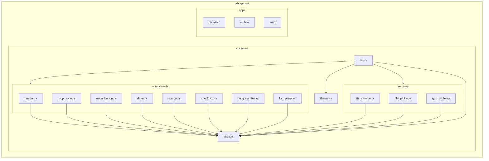

**Diagram sources**
- [lib.rs](file://abogen-ui/crates/ui/lib.rs)
- [state.rs](file://abogen-ui/crates/ui/state.rs)

**Section sources**
- [lib.rs](file://abogen-ui/crates/ui/lib.rs)
- [state.rs](file://abogen-ui/crates/ui/state.rs)

## Core Components

The abogen-ui component library implements a collection of reusable Dioxus components designed for a cyberpunk-themed text-to-speech application. These components follow a consistent pattern of consuming `AppState` signals for state management and triggering state mutations through event handlers. The core components include navigation elements, input controls, feedback indicators, and service integrations that work together to create a cohesive user interface across desktop, mobile, and web platforms.

**Section sources**
- [header.rs](file://abogen-ui/crates/ui/components/header.rs)
- [drop_zone.rs](file://abogen-ui/crates/ui/components/drop_zone.rs)
- [neon_button.rs](file://abogen-ui/crates/ui/components/neon_button.rs)
- [slider.rs](file://abogen-ui/crates/ui/components/slider.rs)
- [combo.rs](file://abogen-ui/crates/ui/components/combo.rs)
- [checkbox.rs](file://abogen-ui/crates/ui/components/checkbox.rs)
- [progress_bar.rs](file://abogen-ui/crates/ui/components/progress_bar.rs)
- [log_panel.rs](file://abogen-ui/crates/ui/components/log_panel.rs)
- [state.rs](file://abogen-ui/crates/ui/state.rs)

## Architecture Overview

The component architecture follows a unidirectional data flow pattern where the central `AppState` manages application state and components consume state signals to render UI elements. Components trigger state mutations through event handlers, which update the shared state and cause re-renders across dependent components. Service layer components abstract platform-specific logic for file operations, GPU detection, and text-to-speech processing, providing a consistent interface to the UI layer.

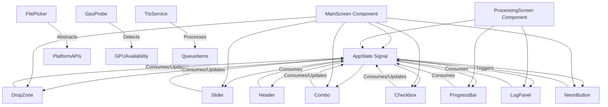

**Diagram sources**
- [lib.rs](file://abogen-ui/crates/ui/lib.rs)
- [state.rs](file://abogen-ui/crates/ui/state.rs)
- [tts_service.rs](file://abogen-ui/crates/ui/services/tts_service.rs)

## Detailed Component Analysis

### UI Components Analysis

#### Header Component
The Header component displays the application logo, version information, and a navigation caret. It uses inline styles to create a cyberpunk aesthetic with neon gradients and maintains a fixed position at the top of the interface.

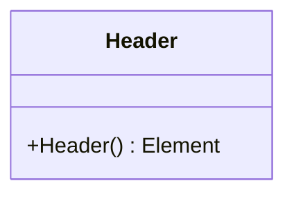

**Diagram sources**
- [header.rs](file://abogen-ui/crates/ui/components/header.rs)

**Section sources**
- [header.rs](file://abogen-ui/crates/ui/components/header.rs)

#### Drop Zone Component
The DropZone component provides a file input interface that supports both drag-and-drop and click-to-browse interactions. It handles file selection across platforms, normalizing web and desktop file APIs, and updates the `selected_file` state in `AppState`.

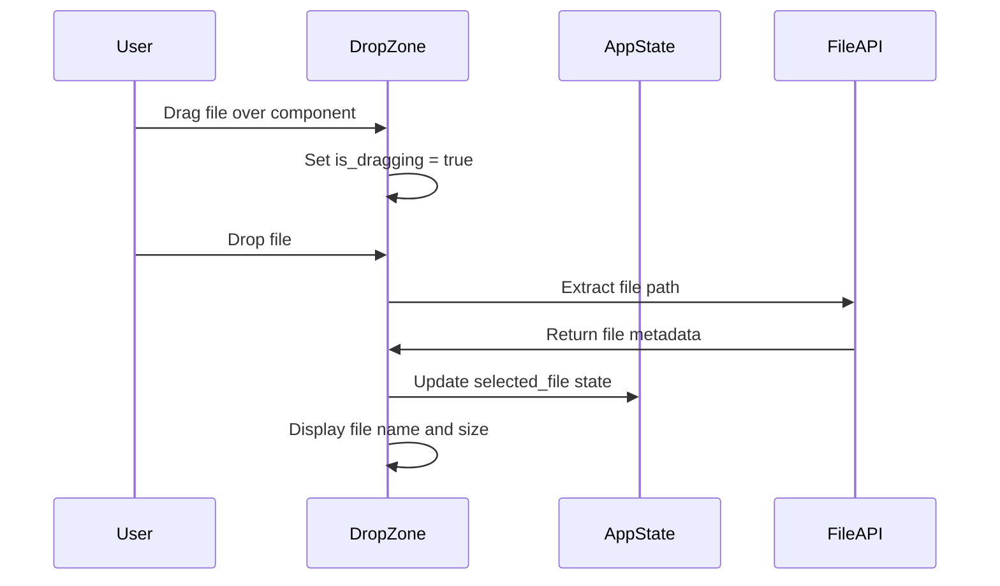

**Diagram sources**
- [drop_zone.rs](file://abogen-ui/crates/ui/components/drop_zone.rs)
- [state.rs](file://abogen-ui/crates/ui/state.rs)

**Section sources**
- [drop_zone.rs](file://abogen-ui/crates/ui/components/drop_zone.rs)
- [state.rs](file://abogen-ui/crates/ui/state.rs)

#### Neon Button Component
The NeonButton component implements a stylized button with hover, focus, and disabled states. It supports primary styling for important actions and handles click events while respecting the disabled state.

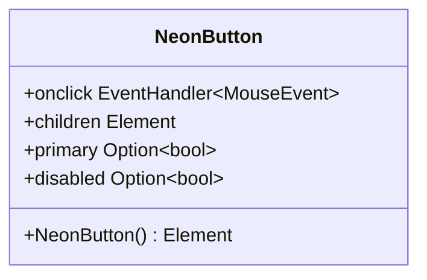

**Diagram sources**
- [neon_button.rs](file://abogen-ui/crates/ui/components/neon_button.rs)

**Section sources**
- [neon_button.rs](file://abogen-ui/crates/ui/components/neon_button.rs)

#### Slider Component
The Slider component provides a speed control with a numeric readout. It binds to a `Signal<f64>` for the value and updates the state when the user interacts with the range input.

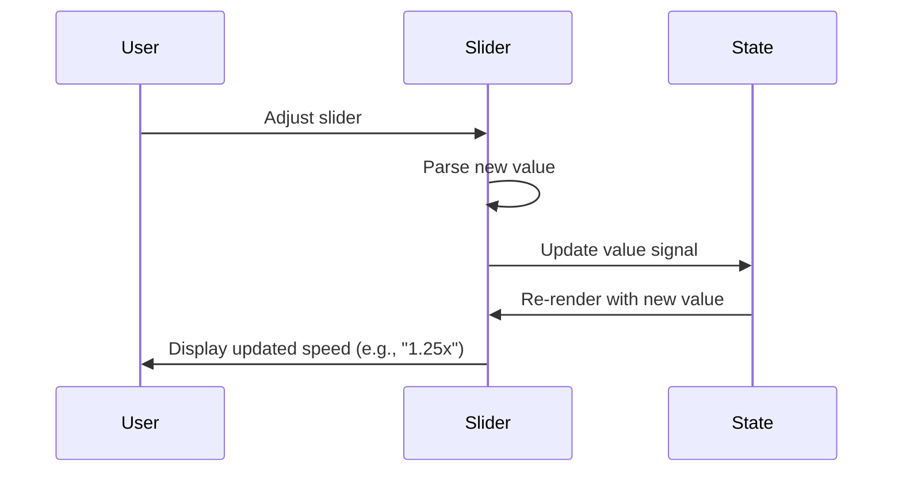

**Diagram sources**
- [slider.rs](file://abogen-ui/crates/ui/components/slider.rs)
- [state.rs](file://abogen-ui/crates/ui/state.rs)

**Section sources**
- [slider.rs](file://abogen-ui/crates/ui/components/slider.rs)
- [state.rs](file://abogen-ui/crates/ui/state.rs)

#### Combo Component
The Combo component implements a searchable dropdown for voice selection. It integrates with the voices service to display voice metadata and supports filtering by name, ID, and language.

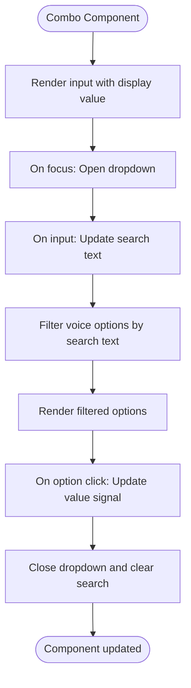

**Diagram sources**
- [combo.rs](file://abogen-ui/crates/ui/components/combo.rs)
- [services/voices.rs](file://abogen-ui/crates/ui/services/voices.rs)
- [state.rs](file://abogen-ui/crates/ui/state.rs)

**Section sources**
- [combo.rs](file://abogen-ui/crates/ui/components/combo.rs)
- [state.rs](file://abogen-ui/crates/ui/state.rs)

#### Checkbox Component
The CheckBox component implements a styled checkbox input that binds to a boolean signal in the application state.

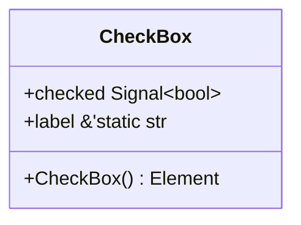

**Diagram sources**
- [checkbox.rs](file://abogen-ui/crates/ui/components/checkbox.rs)

**Section sources**
- [checkbox.rs](file://abogen-ui/crates/ui/components/checkbox.rs)

#### Progress Bar Component
The ProgressBar component visually represents processing progress as a percentage. It consumes a `Signal<u8>` for the progress value and updates the UI accordingly.

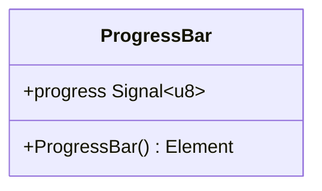

**Diagram sources**
- [progress_bar.rs](file://abogen-ui/crates/ui/components/progress_bar.rs)

**Section sources**
- [progress_bar.rs](file://abogen-ui/crates/ui/components/progress_bar.rs)

#### Log Panel Component
The LogPanel component displays processing logs with color coding based on log level. It consumes a `Signal<Vec<LogEntry>>` and renders each entry with appropriate styling.

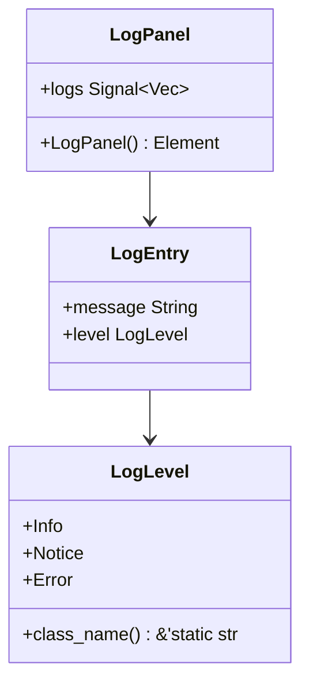

**Diagram sources**
- [log_panel.rs](file://abogen-ui/crates/ui/components/log_panel.rs)
- [state.rs](file://abogen-ui/crates/ui/state.rs)

**Section sources**
- [log_panel.rs](file://abogen-ui/crates/ui/components/log_panel.rs)
- [state.rs](file://abogen-ui/crates/ui/state.rs)

### Service Components Analysis

#### File Picker Service
The file_picker.rs module provides a platform-agnostic interface for file selection, with separate implementations for web and native platforms.

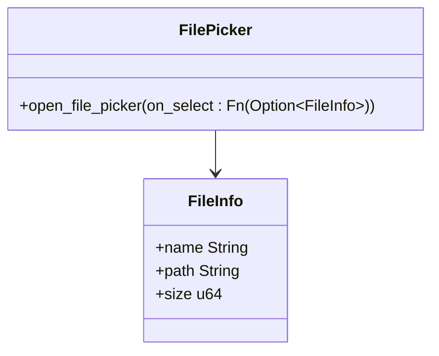

**Diagram sources**
- [file_picker.rs](file://abogen-ui/crates/ui/services/file_picker.rs)
- [state.rs](file://abogen-ui/crates/ui/state.rs)

**Section sources**
- [file_picker.rs](file://abogen-ui/crates/ui/services/file_picker.rs)
- [state.rs](file://abogen-ui/crates/ui/state.rs)

#### GPU Probe Service
The gpu_probe.rs module detects GPU acceleration availability, returning true when the GPU feature is enabled.

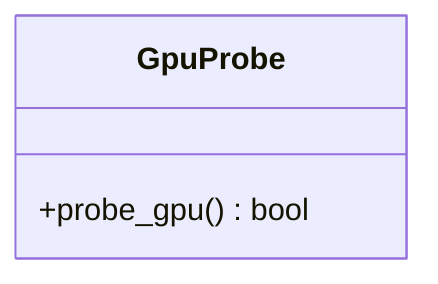

**Diagram sources**
- [gpu_probe.rs](file://abogen-ui/crates/ui/services/gpu_probe.rs)

**Section sources**
- [gpu_probe.rs](file://abogen-ui/crates/ui/services/gpu_probe.rs)

#### TTS Service
The tts_service.rs module handles the text-to-speech processing pipeline, managing queue processing, audio generation, and file conversion.

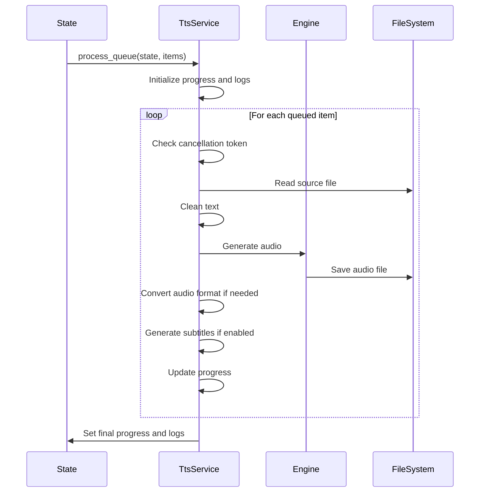

**Diagram sources**
- [tts_service.rs](file://abogen-ui/crates/ui/services/tts_service.rs)
- [state.rs](file://abogen-ui/crates/ui/state.rs)

**Section sources**
- [tts_service.rs](file://abogen-ui/crates/ui/services/tts_service.rs)
- [state.rs](file://abogen-ui/crates/ui/state.rs)

## Dependency Analysis

The component architecture demonstrates a clear separation of concerns with well-defined dependencies between UI components, state management, and service layers. The dependency graph shows how components depend on the central AppState for state management while service components provide platform-specific functionality to the UI layer.

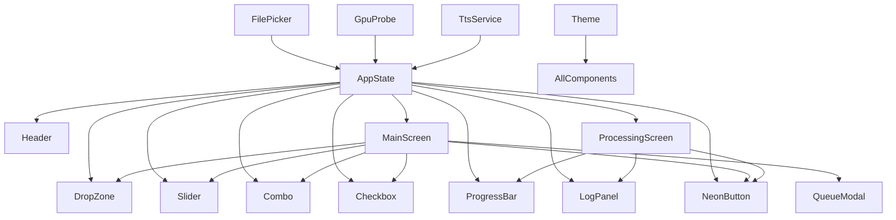

**Diagram sources**
- [lib.rs](file://abogen-ui/crates/ui/lib.rs)
- [state.rs](file://abogen-ui/crates/ui/state.rs)
- [tts_service.rs](file://abogen-ui/crates/ui/services/tts_service.rs)
- [file_picker.rs](file://abogen-ui/crates/ui/services/file_picker.rs)
- [gpu_probe.rs](file://abogen-ui/crates/ui/services/gpu_probe.rs)

**Section sources**
- [lib.rs](file://abogen-ui/crates/ui/lib.rs)
- [state.rs](file://abogen-ui/crates/ui/state.rs)

## Performance Considerations
The component architecture incorporates several performance optimizations, including the use of Dioxus signals for efficient state management, async processing to prevent UI blocking during TTS operations, and yield points in the processing loop to maintain UI responsiveness. The separation of UI components from service logic allows for independent optimization of each layer. The use of `spawn_blocking` for CPU-intensive TTS operations prevents the main thread from freezing during audio generation.

## Troubleshooting Guide
Common issues in the component architecture typically relate to state synchronization, platform-specific behavior differences, and service integration. When components fail to update, verify that state signals are properly consumed and mutated. For file handling issues, check the platform-specific implementations in file_picker.rs. When TTS processing fails, examine the logs in the LogPanel component and verify that required dependencies like ffmpeg are available for audio format conversion.

**Section sources**
- [tts_service.rs](file://abogen-ui/crates/ui/services/tts_service.rs)
- [log_panel.rs](file://abogen-ui/crates/ui/components/log_panel.rs)
- [state.rs](file://abogen-ui/crates/ui/state.rs)

## Conclusion
The abogen-ui component architecture demonstrates a well-structured approach to building a cross-platform Dioxus application with reusable components, centralized state management, and abstracted service layers. The design enables consistent UI behavior across platforms while accommodating platform-specific requirements through conditional compilation. The clear separation between presentation components and business logic services facilitates maintenance and extension of the application's functionality.