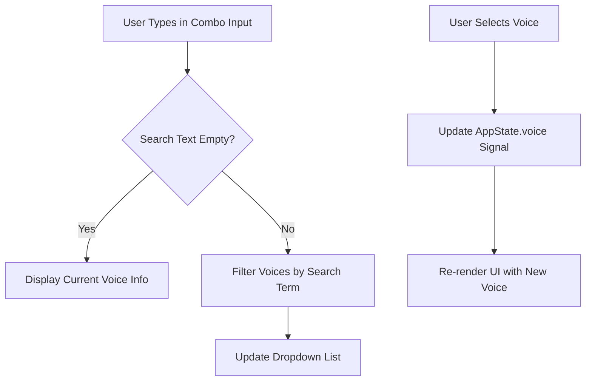
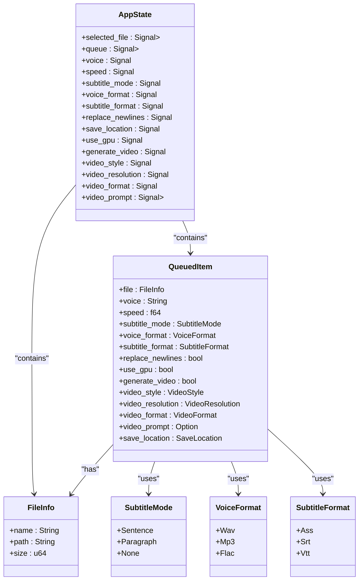

# Main Configuration Workflow

<cite>
**Referenced Files in This Document**   
- [drop_zone.rs](file://abogen-ui/crates/ui/components/drop_zone.rs)
- [state.rs](file://abogen-ui/crates/ui/state.rs)
- [combo.rs](file://abogen-ui/crates/ui/components/combo.rs)
- [slider.rs](file://abogen-ui/crates/ui/components/slider.rs)
- [lib.rs](file://abogen-ui/crates/ui/lib.rs)
</cite>

## Table of Contents
1. [File Selection with DropZone](#file-selection-with-dropzone)
2. [Configuration Interface Elements](#configuration-interface-elements)
3. [State Management and Data Flow](#state-management-and-data-flow)
4. [Error Handling and Validation](#error-handling-and-validation)
5. [Platform-Specific Behavior](#platform-specific-behavior)

## File Selection with DropZone

The DropZone component serves as the primary interface for file input in the Abogen UI application, supporting both drag-and-drop and click-to-browse interactions. It accepts files with the extensions `.txt`, `.epub`, and `.pdf` through the `accept` attribute on the hidden file input element. When a user clicks the drop zone, it triggers the native file browser dialog via a programmatically activated `<input type="file">` element with a dynamically generated ID to ensure uniqueness across instances.

For drag-and-drop functionality, the component listens to `ondragover`, `ondragleave`, and `ondrop` events to provide visual feedback using neon-colored borders and shadows. During a drag operation, the border color shifts from magenta to cyan, indicating an active drop target. Upon dropping a file, event data is processed to extract file paths on desktop platforms or file metadata on web platforms.

On desktop builds, the dropped file's path is canonicalized and passed to the `handle_file` function, which reads filesystem metadata (name, size) and updates the application state. On web builds, due to sandboxing constraints, only file name and size are accessible through the browser's File API, with a synthetic `web-file://` path scheme used for identification.

Once a valid file is selected, its metadata is stored in the `AppState.selected_file` signal, triggering a UI update that displays the filename and formatted size below the drop zone label. Invalid or non-existent files trigger warning logs but do not update the state.

**Section sources**
- [drop_zone.rs](file://abogen-ui/crates/ui/components/drop_zone.rs#L1-L235)
- [lib.rs](file://abogen-ui/crates/ui/lib.rs#L300-L310)

## Configuration Interface Elements

The configuration interface provides several interactive components for customizing audio and video output settings. These controls are bound directly to `Signal` values in the `AppState`, ensuring reactive updates across the application.

### Voice Selection via Combo Component

The `Combo` component implements a searchable dropdown for voice selection, displaying both the voice's display name and language. It integrates with the `voices` service to enrich voice IDs with metadata such as `display_name` and `language`. Users can filter voices by typing in the input field, which searches across ID, display name, and language fields. Selecting a voice updates the `AppState.voice` signal with the corresponding voice ID (e.g., `af_heart`, `zm_yunxi`).

**Diagram sources**
- [combo.rs](file://abogen-ui/crates/ui/components/combo.rs#L1-L146)
- [lib.rs](file://abogen-ui/crates/ui/lib.rs#L340-L345)

### Speed Adjustment Using Slider

The `Slider` component allows users to adjust narration speed between 0.5x and 2.0x in 0.05 increments. It binds directly to the `AppState.speed` signal, updating in real-time as the user drags the slider thumb. A numeric readout displays the current speed value with two decimal places in a monospace font, styled with cyan text for visibility.

**Section sources**
- [slider.rs](file://abogen-ui/crates/ui/components/slider.rs#L1-L53)
- [lib.rs](file://abogen-ui/crates/ui/lib.rs#L320-L325)

### Subtitle Mode and Format Selection

Users can configure subtitle generation through two dropdown menus:
- **Subtitle Mode**: Controls segmentation logic with options: Sentence, Paragraph, or None.
- **Subtitle Format**: Determines output format: ASS (default), SRT, or VTT.

Each selection updates the corresponding `AppState.subtitle_mode` or `AppState.subtitle_format` signal using `onchange` handlers that parse the selected string value into the appropriate enum variant.

### Output Preferences

Additional configuration options include:
- **Voice Format**: WAV, MP3, or FLAC output
- **Replace Newlines**: Toggle to normalize line breaks in text
- **Save Location**: Desktop (default) or custom path
- **GPU Acceleration**: Enable/disable if hardware supports it

These settings are managed through standard `<select>` elements whose values are synchronized with their respective signals in the application state.

**Section sources**
- [lib.rs](file://abogen-ui/crates/ui/lib.rs#L350-L450)
- [state.rs](file://abogen-ui/crates/ui/state.rs#L1-L256)

## State Management and Data Flow

Application state is centralized in the `AppState` struct, which encapsulates reactive `Signal` types for all configurable parameters. The `new()` method initializes default values, including `"af_heart"` as the default voice and `SubtitleMode::Sentence` as the default subtitle mode.

When a file is added to the processing queue via the "Add to Queue" button, the current state values are combined with the selected file metadata to create a `QueuedItem` instance. This item is then pushed into the `AppState.queue` vector, and the `selected_file` signal is reset to `None`, clearing the drop zone display.

Signals such as `voice`, `speed`, `subtitle_mode`, and others are passed down to their respective UI components as props, enabling two-way data binding. Changes in the UI immediately mutate the signal values, which propagate reactivity throughout the component tree.

**Diagram sources**
- [state.rs](file://abogen-ui/crates/ui/state.rs#L1-L256)
- [lib.rs](file://abogen-ui/crates/ui/lib.rs#L200-L220)

## Error Handling and Validation

The application implements validation at multiple levels to ensure robust operation. File type validation is enforced through the `accept=".txt,.epub,.pdf"` attribute on the file input, limiting user selection to supported formats. However, this is a client-side hint and not a security boundary.

During file processing, the `handle_file` function attempts to read filesystem metadata using `std::fs::metadata`. If this fails (e.g., due to permissions or corruption), a warning is logged and the file is not loaded. Similarly, when handling drag events, checks are performed to verify that the file path exists before attempting to read it.

On the web platform, file access is sandboxed, so only metadata available through the browser's File API is used. No direct filesystem access occurs, eliminating the risk of invalid path errors but limiting metadata availability.

Invalid enum values from user input are handled gracefully using default fallbacks in the `from_str` implementations for `VideoStyle`, `VideoResolution`, and `VideoFormat`.

**Section sources**
- [drop_zone.rs](file://abogen-ui/crates/ui/components/drop_zone.rs#L40-L60)
- [state.rs](file://abogen-ui/crates/ui/state.rs#L100-L150)

## Platform-Specific Behavior

The Abogen UI exhibits distinct behaviors between desktop and web builds due to platform capabilities:

- **File Path Handling**: Desktop builds use canonicalized filesystem paths, while web builds use synthetic `web-file://` URIs.
- **Metadata Access**: Desktop applications can retrieve full file metadata (size, path), whereas web applications rely on browser-provided file objects.
- **Directory Selection**: Custom save locations are disabled on web builds due to sandboxing; all outputs default to downloads.
- **Event Handling**: Desktop uses native drag data with `PathBuf`, while web uses asynchronous `FileReader` APIs within `spawn`ed futures.

Conditional compilation (`#[cfg(target_arch = "wasm32")]`) ensures appropriate code paths are executed per platform, maintaining a consistent UX while respecting security boundaries.

**Section sources**
- [drop_zone.rs](file://abogen-ui/crates/ui/components/drop_zone.rs#L70-L150)
- [lib.rs](file://abogen-ui/crates/ui/lib.rs#L400-L420)