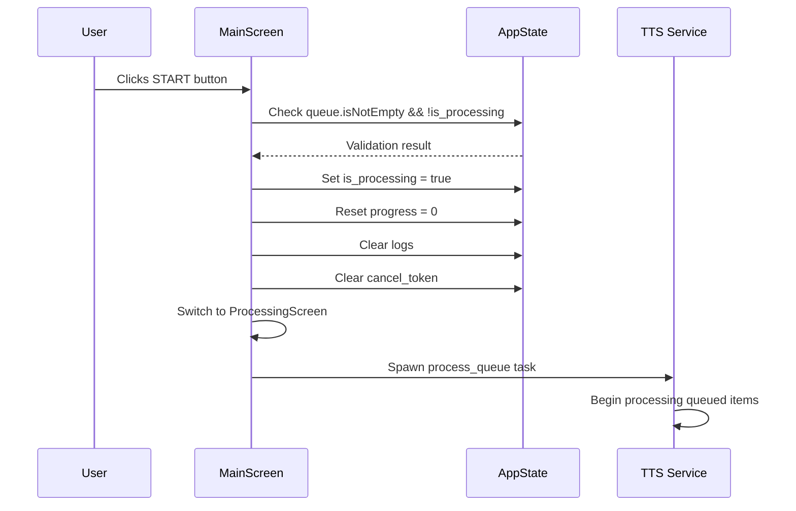
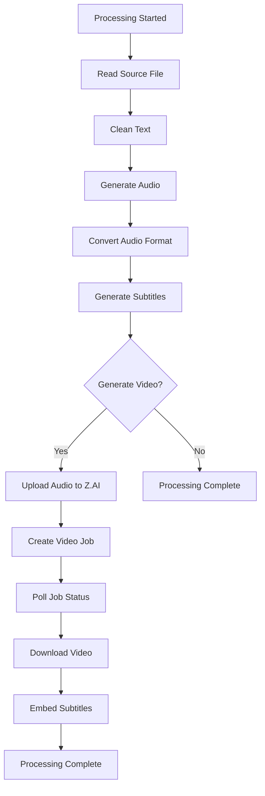

# Processing and Output Workflow

<cite>
**Referenced Files in This Document**   
- [state.rs](file://abogen-ui/crates/ui/state.rs)
- [queue_modal.rs](file://abogen-ui/crates/ui/components/queue_modal.rs)
- [log_panel.rs](file://abogen-ui/crates/ui/components/log_panel.rs)
- [progress_bar.rs](file://abogen-ui/crates/ui/components/progress_bar.rs)
- [tts_service.rs](file://abogen-ui/crates/ui/services/tts_service.rs)
- [video_generation.rs](file://abogen-ui/crates/ui/services/video_generation.rs)
- [lib.rs](file://abogen-ui/crates/ui/lib.rs)
</cite>

## Table of Contents
1. [Introduction](#introduction)
2. [Queue Management System](#queue-management-system)
3. [Processing Initiation Workflow](#processing-initiation-workflow)
4. [Real-time Feedback Mechanisms](#real-time-feedback-mechanisms)
5. [Backend Service Integration](#backend-service-integration)
6. [Cancellation and State Reset](#cancellation-and-state-reset)
7. [Error Propagation and Handling](#error-propagation-and-handling)
8. [Conclusion](#conclusion)

## Introduction
This document details the processing and output workflow in the Abogen UI application, focusing on the complete lifecycle from queue management to final output generation. The system orchestrates text-to-speech synthesis, subtitle generation, and video creation through a coordinated frontend-backend architecture. The workflow begins with user interaction in the UI, progresses through state management and service integration, and concludes with real-time feedback and final output delivery. This comprehensive analysis covers the data flow, component interactions, and error handling mechanisms that enable seamless media processing.

## Queue Management System

The queue management system serves as the central hub for organizing processing tasks in the Abogen UI application. When users select files through the interface, these files are prepared for processing and can be added to the queue via the "Add to Queue" button. This action triggers the creation of a `QueuedItem` struct that captures all relevant processing parameters including voice selection, speed settings, subtitle configuration, and video generation options.

The queue is managed through the `AppState.queue` signal, which maintains a vector of `QueuedItem` structures. Each `QueuedItem` contains comprehensive configuration data such as the source file information, voice parameters, output formats, and video generation settings. The `QueueModal` component provides a user interface for viewing and managing the queue, allowing users to reorder items through up/down buttons or remove specific entries.

Within the `MainScreen` component, the "Add to Queue" button click handler creates a new `QueuedItem` by reading the current values from various state signals including `state.voice`, `state.speed`, and `state.subtitle_mode`. After adding the item to the queue, the selected file state is cleared to prepare for the next selection. The queue's current status is continuously monitored, with the UI displaying appropriate messages based on whether the queue is empty or contains pending items.

**Section sources**
- [state.rs](file://abogen-ui/crates/ui/state.rs#L5-L255)
- [queue_modal.rs](file://abogen-ui/crates/ui/components/queue_modal.rs#L0-L194)
- [lib.rs](file://abogen-ui/crates/ui/lib.rs#L500-L550)

## Processing Initiation Workflow

The processing workflow begins when the user clicks the "START" button on the main screen. This action triggers a series of state changes that initiate the processing pipeline. The `on_start` event handler first validates that the queue is not empty and that no processing is currently underway by checking the `AppState.queue` and `AppState.is_processing` signals.

Upon validation, the system prepares for processing by resetting relevant state variables. The `AppState.is_processing` signal is set to `true`, indicating that processing has begun. The `AppState.progress` signal is reset to 0, and the `AppState.logs` vector is cleared to prepare for new log entries. The `AppState.cancel_token` is also cleared to ensure no residual cancellation state interferes with the new processing session.

The UI then transitions from the main screen to the processing screen, providing users with a dedicated interface for monitoring the ongoing processing. A processing task is spawned asynchronously using Dioxus's `spawn` function, which executes the `process_queue` function from the `tts_service` module. This function receives a clone of the application state and a snapshot of the current queue, ensuring that the processing occurs with a consistent view of the data even if the UI state changes during processing.

**Diagram sources**
- [lib.rs](file://abogen-ui/crates/ui/lib.rs#L150-L200)
- [state.rs](file://abogen-ui/crates/ui/state.rs#L150-L200)

**Section sources**
- [lib.rs](file://abogen-ui/crates/ui/lib.rs#L130-L250)
- [state.rs](file://abogen-ui/crates/ui/state.rs#L150-L200)

## Real-time Feedback Mechanisms

The Abogen UI application provides comprehensive real-time feedback through multiple visual components that keep users informed about the processing status. The primary feedback mechanisms include the `LogPanel` component for detailed processing messages and the `ProgressBar` component for visual progress indication.

The `LogPanel` component displays a chronological stream of `LogEntry` messages, each containing a message string and a `LogLevel` enum value. The `LogLevel` determines the visual styling of each log entry, with different CSS classes applied for Info, Notice, and Error levels. This color-coding system allows users to quickly identify the severity and nature of each processing event. The component continuously monitors the `AppState.logs` signal and automatically updates the display whenever new log entries are added during processing.

The `ProgressBar` component provides a visual representation of processing progress by binding to the `AppState.progress` signal. As the processing advances through various stages, the progress value is updated incrementally, causing the progress bar to fill accordingly. The component displays the current percentage value within the bar itself, providing both visual and numerical feedback. The progress calculation takes into account the number of items in the queue and the completion percentage of each individual item.

These feedback mechanisms work in concert to provide a comprehensive view of the processing status. While the progress bar shows the overall completion percentage, the log panel provides granular details about each processing step, including file reading, audio generation, subtitle creation, and video rendering. This dual feedback system ensures that users have both a high-level overview and detailed insights into the processing workflow.

**Diagram sources**
- [log_panel.rs](file://abogen-ui/crates/ui/components/log_panel.rs#L0-L43)
- [progress_bar.rs](file://abogen-ui/crates/ui/components/progress_bar.rs#L0-L23)
- [tts_service.rs](file://abogen-ui/crates/ui/services/tts_service.rs#L100-L500)

**Section sources**
- [log_panel.rs](file://abogen-ui/crates/ui/components/log_panel.rs#L0-L43)
- [progress_bar.rs](file://abogen-ui/crates/ui/components/progress_bar.rs#L0-L23)
- [tts_service.rs](file://abogen-ui/crates/ui/services/tts_service.rs#L100-L500)

## Backend Service Integration

The processing workflow integrates with backend services through the `tts_service.rs` and `video_generation.rs` modules, which handle the core text-to-speech and video generation functionalities. The `process_queue` function in `tts_service.rs` serves as the primary integration point, coordinating the entire processing pipeline from text input to final output.

For text-to-speech conversion, the system supports multiple engine backends, including Kokoro TTS and Coqui TTS. The choice of engine is determined by the voice profile selected in the UI, with voice IDs prefixed with "coqui-" triggering the Coqui engine. Audio generation occurs in a blocking task to prevent UI freezing, with the synthesis process running in a separate thread while the UI remains responsive.

Video generation is handled through the `VideoGenerationService` class in `video_generation.rs`, which interfaces with the Z.AI API for video creation. When video generation is enabled, the system first attempts to use the Z.AI service by uploading the generated audio file and creating a video generation job. The service then polls the job status periodically, updating the progress indicator as the video is rendered on the remote server.

The integration includes fallback mechanisms for various scenarios. If Z.AI video generation fails, the system can fall back to standard video generation methods. Similarly, if FFmpeg is not available for audio format conversion, the system maintains the original WAV format with a notice to the user. These fallbacks ensure that processing can continue even when certain features are unavailable in the current environment.

**Section sources**
- [tts_service.rs](file://abogen-ui/crates/ui/services/tts_service.rs#L100-L500)
- [video_generation.rs](file://abogen-ui/crates/ui/services/video_generation.rs#L100-L400)

## Cancellation and State Reset

The cancellation system provides users with control over the processing workflow through a "CANCEL" button that appears during processing. When clicked, this button triggers the `on_cancel` handler in the `ProcessingScreen` component, which sets the `AppState.cancel_token` signal to `Some(())`. This cancellation token is periodically checked during processing, allowing long-running operations to terminate gracefully when cancellation is requested.

The cancellation mechanism works in conjunction with the state reset process to ensure a clean transition back to the main interface. After setting the cancellation token, the system resets `AppState.is_processing` to `false` and returns to the main screen. The cancellation token itself is cleared after processing completes, ensuring it doesn't interfere with future processing sessions.

The state reset process occurs automatically when processing completes, whether successfully or due to cancellation. The `InnerApp` component's processing task includes logic to return to the main screen after processing finishes, with different timing based on the outcome. Successful processing includes a brief delay to allow users to see the completion message, while error conditions include a longer delay to ensure error messages are visible before returning to the main screen.

This coordinated cancellation and reset system ensures that the application maintains a consistent state regardless of how processing ends. Users can immediately begin a new processing session without needing to manually reset any parameters, as the system automatically prepares itself for the next operation.

**Section sources**
- [lib.rs](file://abogen-ui/crates/ui/lib.rs#L200-L250)
- [tts_service.rs](file://abogen-ui/crates/ui/services/tts_service.rs#L300-L400)

## Error Propagation and Handling

The error handling system in the Abogen UI application follows a comprehensive approach to managing failures during processing. Errors are propagated through Result types from the backend services to the UI layer, where they are converted into user-friendly log messages. The system distinguishes between different error types through the `LogLevel` enum, allowing appropriate visual representation of issues.

When processing failures occur, they are captured and logged with descriptive messages that help users understand the nature of the problem. Common error scenarios include missing source files, failed audio synthesis, and video generation API errors. Each error is logged with `LogLevel::Error`, which applies distinct styling in the `LogPanel` component to draw attention to critical issues.

The system also handles non-critical issues through `LogLevel::Notice`, which displays informational messages about fallback behaviors or platform limitations. For example, when running in a web environment where FFmpeg is unavailable for audio conversion, the system logs a notice explaining that the original WAV format will be retained.

Error propagation follows a structured pattern where lower-level service errors are caught, wrapped with context, and passed up the call chain. This ensures that errors contain sufficient information for debugging while remaining accessible to end users. The final processing task in `InnerApp` includes specific handling for error conditions, including extended display times for error messages to ensure users can read and understand what went wrong.

**Section sources**
- [state.rs](file://abogen-ui/crates/ui/state.rs#L200-L255)
- [tts_service.rs](file://abogen-ui/crates/ui/services/tts_service.rs#L400-L500)
- [video_generation.rs](file://abogen-ui/crates/ui/services/video_generation.rs#L300-L400)

## Conclusion
The processing and output workflow in the Abogen UI application demonstrates a well-architected system for managing complex media processing tasks. By leveraging Dioxus signals for state management, the application maintains a responsive interface while handling potentially long-running operations. The queue system provides flexible task organization, while the real-time feedback mechanisms keep users informed throughout the processing lifecycle.

The integration with backend services through the TTS and video generation modules showcases a robust approach to handling external dependencies and API interactions. The cancellation system and comprehensive error handling ensure that users maintain control over the processing workflow and can understand and respond to any issues that arise.

This workflow represents a complete solution for text-to-speech and video generation, balancing user experience with technical functionality. The modular design allows for future enhancements and additional processing options while maintaining a clean separation between UI components and business logic.