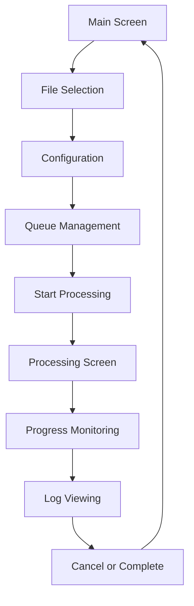
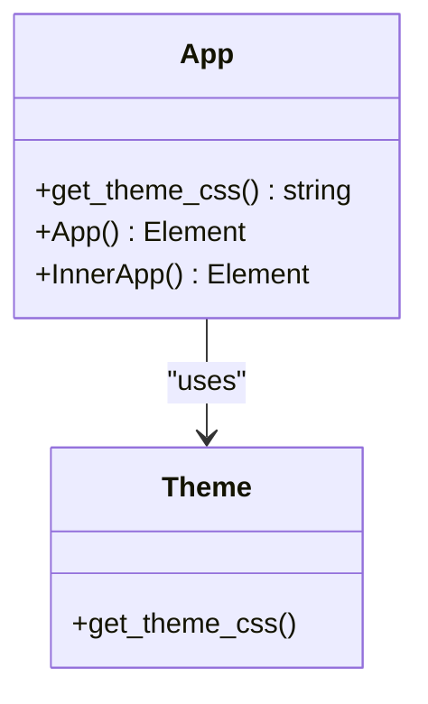
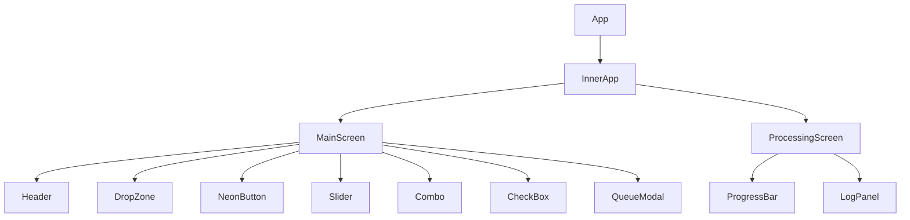

# Interface Overview

<cite>
**Referenced Files in This Document**   
- [abogen-ui/README.md](file://abogen-ui/README.md)
- [abogen-ui/crates/ui/theme.rs](file://abogen-ui/crates/ui/theme.rs)
- [abogen-ui/crates/ui/lib.rs](file://abogen-ui/crates/ui/lib.rs)
- [abogen-ui/crates/ui/state.rs](file://abogen-ui/crates/ui/state.rs)
- [abogen-ui/crates/ui/components/header.rs](file://abogen-ui/crates/ui/components/header.rs)
- [abogen-ui/crates/ui/components/drop_zone.rs](file://abogen-ui/crates/ui/components/drop_zone.rs)
- [abogen-ui/crates/ui/components/neon_button.rs](file://abogen-ui/crates/ui/components/neon_button.rs)
- [abogen-ui/crates/ui/components/progress_bar.rs](file://abogen-ui/crates/ui/components/progress_bar.rs)
- [abogen-ui/crates/ui/components/log_panel.rs](file://abogen-ui/crates/ui/components/log_panel.rs)
- [abogen-ui/crates/ui/components/slider.rs](file://abogen-ui/crates/ui/components/slider.rs)
- [abogen-ui/crates/ui/components/combo.rs](file://abogen-ui/crates/ui/components/combo.rs)
- [abogen-ui/crates/ui/components/checkbox.rs](file://abogen-ui/crates/ui/components/checkbox.rs)
- [abogen-ui/crates/ui/components/queue_modal.rs](file://abogen-ui/crates/ui/components/queue_modal.rs)
</cite>

## Table of Contents
1. [Introduction](#introduction)
2. [Visual Identity and Theming](#visual-identity-and-theming)
3. [Core Screens](#core-screens)
4. [Typography and Responsive Design](#typography-and-responsive-design)
5. [Theme Application and Global Styling](#theme-application-and-global-styling)
6. [Accessibility Features](#accessibility-features)
7. [Feature Flags and UI Behavior](#feature-flags-and-ui-behavior)
8. [Component Architecture](#component-architecture)

## Introduction
The Abogen UI is a cross-platform application built with Rust and Dioxus 0.5, designed with a cyberpunk aesthetic inspired by Blade Runner. It provides a unified interface across desktop, web, and mobile platforms, enabling users to process text files into audio and video content with customizable voice and visual settings. The interface emphasizes neon aesthetics, real-time feedback, and accessibility while maintaining responsive behavior across device sizes.

## Visual Identity and Theming
The application implements a cyberpunk-themed visual identity using a dark color palette with vibrant neon accents. The theme is defined in `theme.rs` using CSS variables that establish the core visual language:

- `--bg: #070A12` - Primary background color
- `--panel-bg: #0A0F1A` - Panel background with subtle gradient
- `--neon-cyan: #27E8FF` - Primary accent for interactive elements
- `--neon-magenta: #FF3AD4` - Secondary accent for borders and highlights
- `--neon-amber: #FFB300` - Warning and progress indicators
- `--neon-lime: #39FF14` - Success and completion states

The theme includes a radial gradient background that enhances the cyberpunk atmosphere, with panels featuring magenta borders and inner glows. Interactive elements like buttons and inputs use subtle animations and glow effects to provide visual feedback. The styling ensures high contrast between text and backgrounds while maintaining the dark theme's immersive quality.

**Section sources**
- [abogen-ui/crates/ui/theme.rs](file://abogen-ui/crates/ui/theme.rs#L1-L209)

## Core Screens
The application features two primary screens that guide the user through the processing workflow.

### Main Screen
The Main Screen serves as the entry point for file processing, featuring:

- **File Selection**: A drag-and-drop zone with visual feedback for file types (.txt, .epub, .pdf)
- **Configuration Panel**: Controls for voice selection, speed adjustment, subtitle generation, and output formats
- **Queue Management**: Buttons to add, manage, and clear processing items
- **Video Generation Options**: Conditional section for Z.AI video generation with style, resolution, and format selection

The screen uses a panel-based layout with neon-styled form controls, allowing users to configure all processing parameters before initiating the workflow.

### Processing Screen
The Processing Screen provides real-time feedback during file processing:

- **Progress Bar**: Animated bar with percentage display and neon gradient
- **Log Panel**: Scrollable console with color-coded messages (cyan for info, amber for notices, red for errors)
- **Cancel Button**: Immediate cancellation that returns to the Main Screen

The screen maintains the cyberpunk aesthetic while prioritizing clarity of processing status and progress.

**Diagram sources**
- [abogen-ui/crates/ui/lib.rs](file://abogen-ui/crates/ui/lib.rs#L150-L639)
- [abogen-ui/crates/ui/components/progress_bar.rs](file://abogen-ui/crates/ui/components/progress_bar.rs#L1-L24)
- [abogen-ui/crates/ui/components/log_panel.rs](file://abogen-ui/crates/ui/components/log_panel.rs#L1-L44)

**Section sources**
- [abogen-ui/crates/ui/lib.rs](file://abogen-ui/crates/ui/lib.rs#L150-L639)
- [abogen-ui/README.md](file://abogen-ui/README.md#L80-L119)

## Typography and Responsive Design
The interface uses the **Rajdhani** font from Google Fonts, loaded via CSS import in the theme. This geometric sans-serif typeface complements the cyberpunk aesthetic with its clean, technical appearance. The font is applied globally with a sans-serif fallback stack.

The layout implements responsive design principles to adapt to different screen sizes:

- **Desktop**: Full-width container with multi-column layouts
- **Mobile**: Single-column layout with adjusted padding and font sizes
- **Web**: Responsive container with media queries for smaller screens

Media queries adjust padding, button sizes, and font scales below 768px, ensuring usability on mobile devices. The container max-width is set to 1280px with flexible spacing, maintaining visual hierarchy across resolutions.

**Section sources**
- [abogen-ui/crates/ui/theme.rs](file://abogen-ui/crates/ui/theme.rs#L1-L209)
- [abogen-ui/README.md](file://abogen-ui/README.md#L150-L155)

## Theme Application and Global Styling
The theme is applied globally through the root `App` component in `lib.rs`, which injects the CSS string from `get_theme_css()` into a `<style>` tag. This approach ensures consistent styling across all platform targets (desktop, web, mobile) without requiring platform-specific style loading.

The `get_theme_css()` function returns a static string containing all CSS rules, including:
- Global resets and box-sizing
- Font imports and body styling
- Component-specific classes (buttons, panels, inputs)
- Responsive media queries
- Custom properties for theming

The styling is applied at the application root level, making it available to all child components without additional imports or configuration.

**Diagram sources**
- [abogen-ui/crates/ui/lib.rs](file://abogen-ui/crates/ui/lib.rs#L10-L50)
- [abogen-ui/crates/ui/theme.rs](file://abogen-ui/crates/ui/theme.rs#L1-L209)

**Section sources**
- [abogen-ui/crates/ui/lib.rs](file://abogen-ui/crates/ui/lib.rs#L10-L50)
- [abogen-ui/crates/ui/theme.rs](file://abogen-ui/crates/ui/theme.rs#L1-L209)

## Accessibility Features
The interface implements several accessibility features to ensure usability for all users:

- **Keyboard Navigation**: All interactive elements are focusable and operable via keyboard
- **Focus States**: Neon magenta outline (`--neon-magenta`) appears on focused elements
- **Color Contrast**: Text-to-background ratios meet WCAG AA standards
- **Semantic HTML**: Proper use of labels, inputs, and ARIA attributes
- **Visual Feedback**: Clear hover and active states for interactive elements

Buttons and form controls include proper event handlers for keyboard interaction, with disabled states preventing interaction when appropriate. The log panel uses semantic HTML structure with proper spacing and readable font sizes.

**Section sources**
- [abogen-ui/crates/ui/theme.rs](file://abogen-ui/crates/ui/theme.rs#L1-L209)
- [abogen-ui/crates/ui/components/neon_button.rs](file://abogen-ui/crates/ui/components/neon_button.rs#L1-L28)
- [abogen-ui/crates/ui/components/checkbox.rs](file://abogen-ui/crates/ui/components/checkbox.rs#L1-L28)

## Feature Flags and UI Behavior
The application uses Cargo feature flags to control UI visibility and behavior:

- **real-tts**: When enabled, uses the real TTS backend; otherwise uses a stub implementation
- **video-generation**: Controls availability of video generation features
- **zai-video**: Enables enhanced Z.AI video generation with style presets
- **gpu**: Enables GPU acceleration probe and related UI controls

These flags affect both component rendering and backend service selection. For example, the `ProcessingScreen` uses conditional compilation to determine which service processes the queue. The UI dynamically shows or hides video generation options based on the `video-generation` flag, and the `use_gpu` state is initialized based on the `gpu` feature.

Feature-specific UI elements, such as the video generation section, are conditionally rendered based on signal values that respect the feature flags, ensuring a consistent user experience across build configurations.

**Section sources**
- [abogen-ui/crates/ui/lib.rs](file://abogen-ui/crates/ui/lib.rs#L150-L639)
- [abogen-ui/README.md](file://abogen-ui/README.md#L157-L179)

## Component Architecture
The UI is structured as a component-based architecture with clear separation of concerns:

- **Root Components**: `App` and `InnerApp` manage global state and routing
- **Screen Components**: `MainScreen` and `ProcessingScreen` define primary views
- **UI Components**: Reusable elements like `NeonButton`, `Slider`, and `LogPanel`
- **State Management**: `AppState` struct with reactive signals for all UI state

The component hierarchy flows from the root `App` down to specialized components, with state passed via props. Each component encapsulates its styling and behavior, promoting reusability across the application.

**Diagram sources**
- [abogen-ui/crates/ui/lib.rs](file://abogen-ui/crates/ui/lib.rs#L10-L639)
- [abogen-ui/crates/ui/components/header.rs](file://abogen-ui/crates/ui/components/header.rs#L1-L29)
- [abogen-ui/crates/ui/components/drop_zone.rs](file://abogen-ui/crates/ui/components/drop_zone.rs#L1-L235)

**Section sources**
- [abogen-ui/crates/ui/lib.rs](file://abogen-ui/crates/ui/lib.rs#L10-L639)
- [abogen-ui/crates/ui/components/mod.rs](file://abogen-ui/crates/ui/components/mod.rs)
- [abogen-ui/crates/ui/state.rs](file://abogen-ui/crates/ui/state.rs#L1-L256)