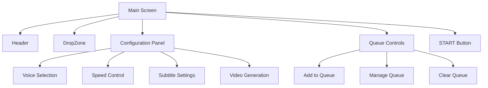
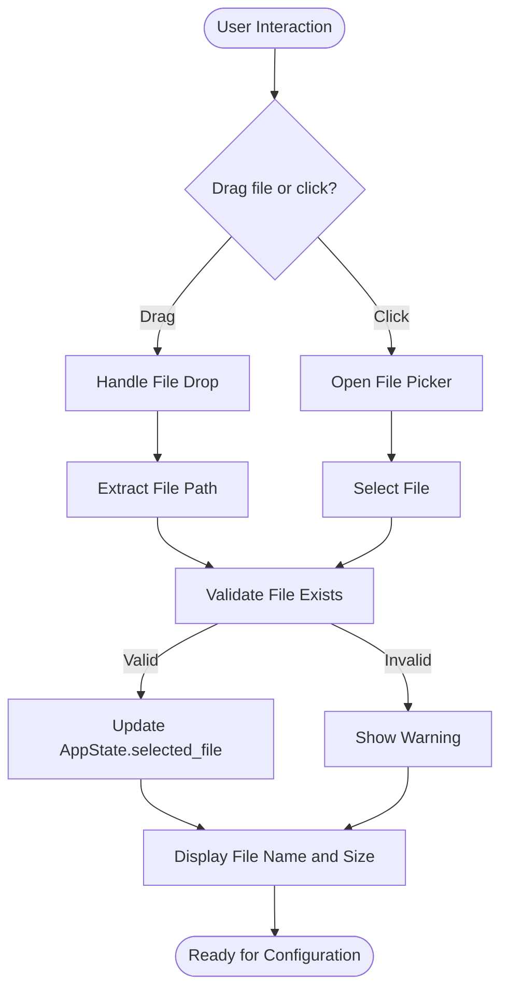
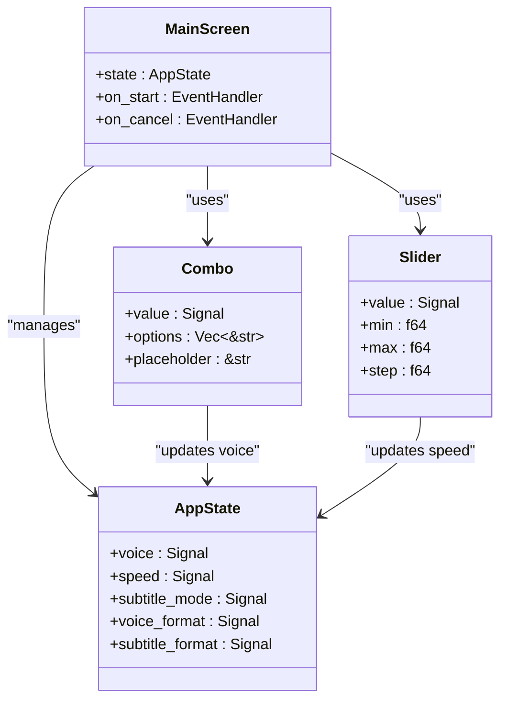
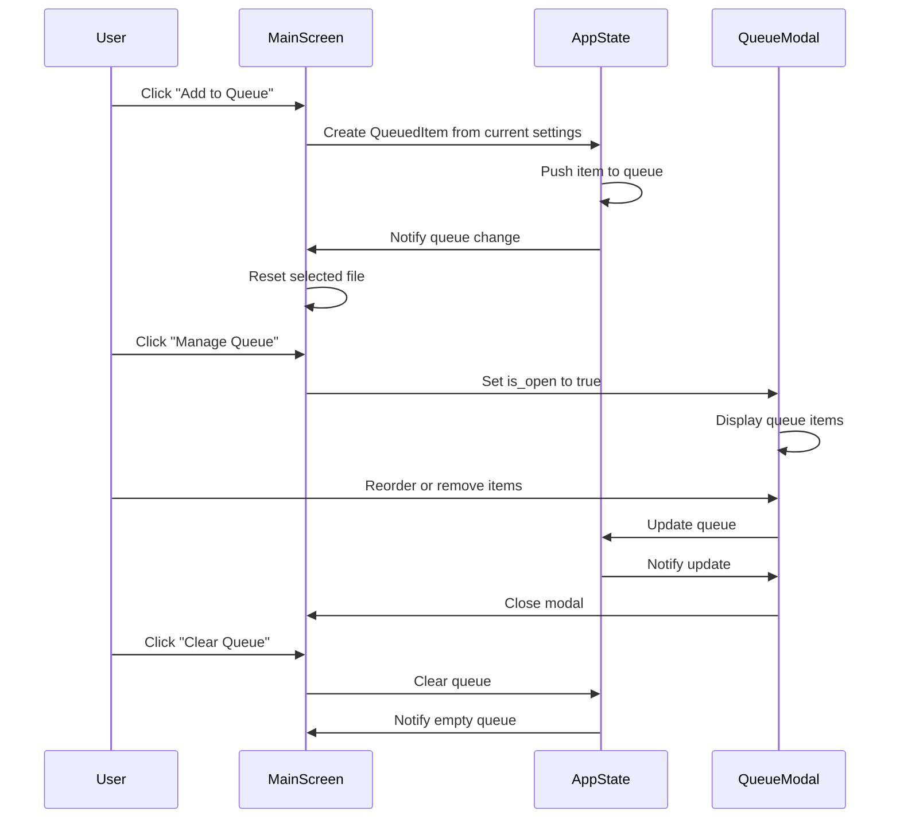
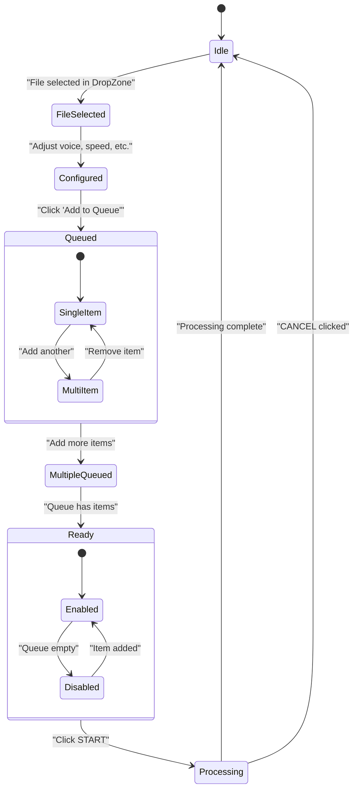
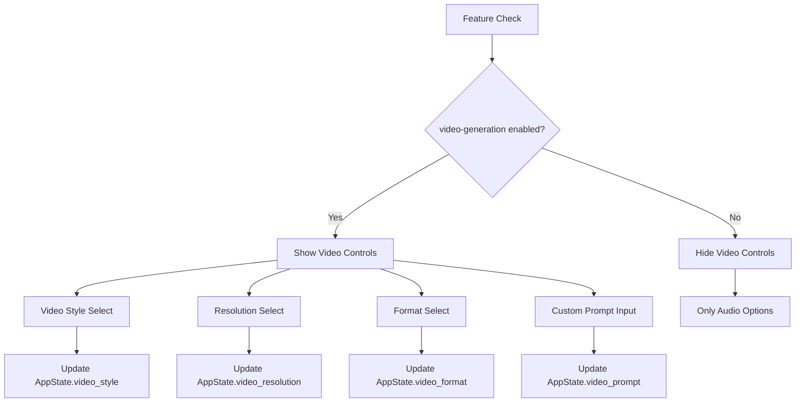
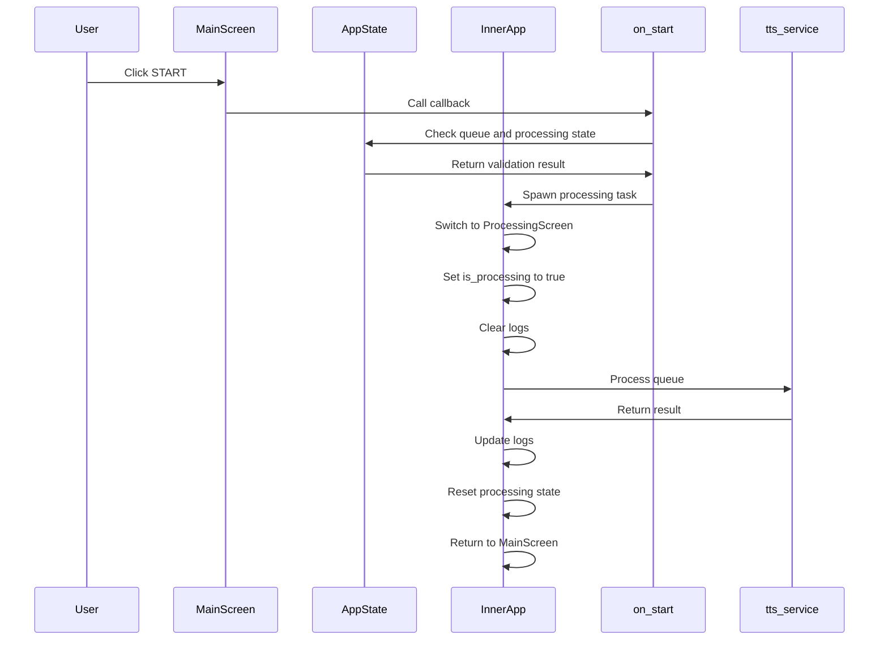

# Main Screen

<cite>
**Referenced Files in This Document**   
- [lib.rs](file://abogen-ui/crates/ui/lib.rs)
- [drop_zone.rs](file://abogen-ui/crates/ui/components/drop_zone.rs)
- [header.rs](file://abogen-ui/crates/ui/components/header.rs)
- [combo.rs](file://abogen-ui/crates/ui/components/combo.rs)
- [slider.rs](file://abogen-ui/crates/ui/components/slider.rs)
- [neon_button.rs](file://abogen-ui/crates/ui/components/neon_button.rs)
- [queue_modal.rs](file://abogen-ui/crates/ui/components/queue_modal.rs)
- [state.rs](file://abogen-ui/crates/ui/state.rs)
- [voices.rs](file://abogen-ui/crates/ui/services/voices.rs)
- [theme.rs](file://abogen-ui/crates/ui/theme.rs)
</cite>

## Table of Contents
1. [Introduction](#introduction)
2. [Visual Layout](#visual-layout)
3. [File Input Workflow](#file-input-workflow)
4. [Configuration Panel](#configuration-panel)
5. [Queue Management System](#queue-management-system)
6. [State-Driven UI Behavior](#state-driven-ui-behavior)
7. [Accessibility Features](#accessibility-features)
8. [Feature Flag Control](#feature-flag-control)
9. [Event Handling and Callbacks](#event-handling-and-callbacks)
10. [Conclusion](#conclusion)

## Introduction
The Main Screen serves as the primary interface for the abogen application, providing users with a comprehensive workflow for file input, configuration, and processing queue management. Built using Dioxus, this component orchestrates various UI elements including file selection, voice configuration, and video generation settings. The screen's design follows a cyberpunk aesthetic with neon-styled components and responsive layout, enabling users to prepare text-to-speech and video generation tasks through an intuitive interface.

**Section sources**
- [lib.rs](file://abogen-ui/crates/ui/lib.rs#L150-L639)

## Visual Layout
The Main Screen features a structured layout divided into distinct sections: Header, DropZone, Configuration Panel, and Processing Controls. The Header displays the application logo and version information, while the DropZone provides a prominent area for file selection. The central Configuration Panel organizes voice, subtitle, and video settings in a grid layout, and the bottom section contains queue management and processing controls. The overall design uses a dark cyberpunk theme with neon accents, ensuring high visibility and aesthetic consistency across components.

**Diagram sources**
- [lib.rs](file://abogen-ui/crates/ui/lib.rs#L150-L639)
- [header.rs](file://abogen-ui/crates/ui/components/header.rs#L1-L29)
- [drop_zone.rs](file://abogen-ui/crates/ui/components/drop_zone.rs#L1-L235)

**Section sources**
- [lib.rs](file://abogen-ui/crates/ui/lib.rs#L150-L639)
- [header.rs](file://abogen-ui/crates/ui/components/header.rs#L1-L29)
- [theme.rs](file://abogen-ui/crates/ui/theme.rs#L1-L209)

## File Input Workflow
The file input workflow centers around the DropZone component, which supports both drag-and-drop functionality and traditional file browsing. Users can drag text files (.txt, .epub, .pdf) into the designated area or click to open a file picker dialog. The DropZone visually indicates drag state with color changes and glow effects, providing immediate feedback. Once a file is selected, its name and size are displayed within the DropZone, confirming successful selection. The component handles both desktop and web environments, adapting file access methods accordingly through conditional compilation.

**Diagram sources**
- [drop_zone.rs](file://abogen-ui/crates/ui/components/drop_zone.rs#L1-L235)
- [lib.rs](file://abogen-ui/crates/ui/lib.rs#L150-L639)

**Section sources**
- [drop_zone.rs](file://abogen-ui/crates/ui/components/drop_zone.rs#L1-L235)
- [lib.rs](file://abogen-ui/crates/ui/lib.rs#L150-L639)

## Configuration Panel
The Configuration Panel provides comprehensive controls for audio and video generation settings. It includes a Combo component for voice selection from over 50 available voices, a Slider for speed adjustment (0.5x to 2.0x), and multiple select inputs for subtitle and format options. The panel uses a responsive grid layout with clear labels and visual hierarchy. Voice selection includes filtering capabilities, allowing users to search through voices by name, ID, or language. The configuration state is managed through reactive signals, ensuring immediate UI updates when settings change.

**Diagram sources**
- [combo.rs](file://abogen-ui/crates/ui/components/combo.rs#L1-L146)
- [slider.rs](file://abogen-ui/crates/ui/components/slider.rs#L1-L53)
- [state.rs](file://abogen-ui/crates/ui/state.rs#L1-L256)

**Section sources**
- [combo.rs](file://abogen-ui/crates/ui/components/combo.rs#L1-L146)
- [slider.rs](file://abogen-ui/crates/ui/components/slider.rs#L1-L53)
- [state.rs](file://abogen-ui/crates/ui/state.rs#L1-L256)

## Queue Management System
The queue management system enables users to organize multiple processing tasks before execution. Three primary controls manage the queue: "Add to Queue", "Manage Queue", and "Clear Queue". The "Add to Queue" button creates a QueuedItem from the current file and configuration settings, adding it to the AppState.queue. The "Manage Queue" button opens a modal interface for viewing, reordering, and removing queue items. The "Clear Queue" button empties all items. The system maintains state consistency through reactive signals, automatically updating the UI when the queue changes.

**Diagram sources**
- [lib.rs](file://abogen-ui/crates/ui/lib.rs#L150-L639)
- [queue_modal.rs](file://abogen-ui/crates/ui/components/queue_modal.rs#L1-L195)
- [state.rs](file://abogen-ui/crates/ui/state.rs#L1-L256)

**Section sources**
- [lib.rs](file://abogen-ui/crates/ui/lib.rs#L150-L639)
- [queue_modal.rs](file://abogen-ui/crates/ui/components/queue_modal.rs#L1-L195)
- [state.rs](file://abogen-ui/crates/ui/state.rs#L1-L256)

## State-Driven UI Behavior
The Main Screen's UI behavior is entirely driven by the application state (AppState), which uses reactive signals to manage component state. The interface conditionally renders based on AppState properties, such as displaying file information only when selected_file is Some. The START button's disabled state depends on both queue emptiness and processing status. Configuration controls are linked directly to their respective state signals, creating a unidirectional data flow. This state-driven approach ensures UI consistency and eliminates race conditions through Dioxus's reactivity system.

**Diagram sources**
- [lib.rs](file://abogen-ui/crates/ui/lib.rs#L150-L639)
- [state.rs](file://abogen-ui/crates/ui/state.rs#L1-L256)

**Section sources**
- [lib.rs](file://abogen-ui/crates/ui/lib.rs#L150-L639)
- [state.rs](file://abogen-ui/crates/ui/state.rs#L1-L256)

## Accessibility Features
The Main Screen incorporates several accessibility features to ensure usability for all users. Interactive elements have proper focus states with visible outlines, following the neon theme's aesthetic while maintaining visibility. Keyboard navigation is supported through standard tab order, allowing users to navigate between controls without a mouse. Form controls include appropriate labels and semantic HTML elements. The UI provides visual feedback for all interactions, including hover effects on buttons and color changes in the DropZone during drag operations. Error states are communicated through both visual cues and console logging.

**Section sources**
- [neon_button.rs](file://abogen-ui/crates/ui/components/neon_button.rs#L1-L28)
- [theme.rs](file://abogen-ui/crates/ui/theme.rs#L1-L209)
- [lib.rs](file://abogen-ui/crates/ui/lib.rs#L150-L639)

## Feature Flag Control
Feature flags control the visibility of advanced functionality, particularly the video generation section. The 'video-generation' feature flag determines whether the video generation controls are displayed in the configuration panel. When enabled, users can configure video style, resolution, format, and custom prompts. This conditional rendering is implemented using Rust's cfg attribute, ensuring that unused code is excluded from compilation when features are disabled. The feature flag system allows for modular functionality and reduces complexity for users who only require basic text-to-speech capabilities.

**Diagram sources**
- [lib.rs](file://abogen-ui/crates/ui/lib.rs#L150-L639)
- [state.rs](file://abogen-ui/crates/ui/state.rs#L1-L256)

**Section sources**
- [lib.rs](file://abogen-ui/crates/ui/lib.rs#L150-L639)
- [state.rs](file://abogen-ui/crates/ui/state.rs#L1-L256)

## Event Handling and Callbacks
Event handling in the Main Screen follows a structured pattern where UI components trigger callbacks that modify application state. The on_start callback, passed to the MainScreen component, initiates processing when the START button is clicked. This callback validates the queue and transitions to the ProcessingScreen. Event handlers for form controls directly update their corresponding state signals, creating a responsive interface. The system uses Dioxus's EventHandler abstraction to ensure type safety and proper closure management. Asynchronous operations are spawned using Dioxus's spawn function, preventing UI blocking during processing.

**Diagram sources**
- [lib.rs](file://abogen-ui/crates/ui/lib.rs#L150-L639)
- [state.rs](file://abogen-ui/crates/ui/state.rs#L1-L256)

**Section sources**
- [lib.rs](file://abogen-ui/crates/ui/lib.rs#L150-L639)
- [state.rs](file://abogen-ui/crates/ui/state.rs#L1-L256)

## Conclusion
The Main Screen provides a comprehensive interface for configuring and managing text-to-speech and video generation workflows. Through its well-structured layout, state-driven design, and accessible controls, it offers users an intuitive experience for preparing processing tasks. The integration of reactive state management with Dioxus components ensures a responsive and consistent interface. Feature flags enable modular functionality, while the queue system allows for batch processing of multiple files. The screen's design balances aesthetic appeal with usability, making complex configuration options approachable through clear visual hierarchy and immediate feedback mechanisms.