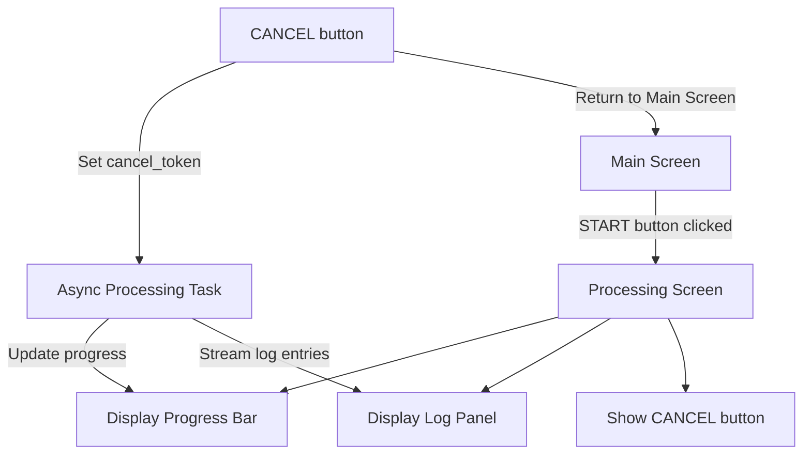
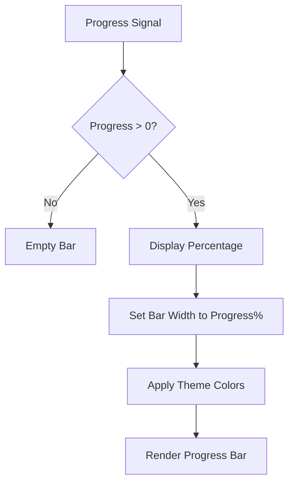
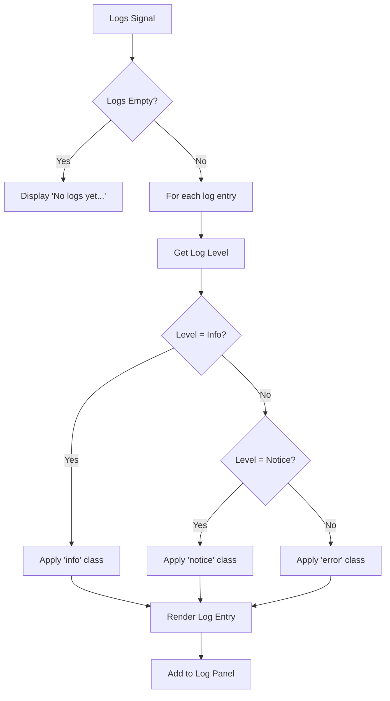
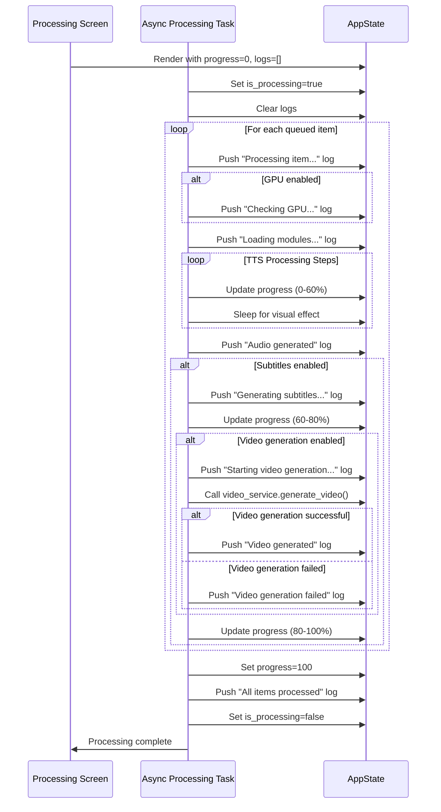

# Processing Screen

<cite>
**Referenced Files in This Document**   
- [abogen-ui/crates/ui/lib.rs](file://abogen-ui/crates/ui/lib.rs)
- [abogen-ui/crates/ui/components/progress_bar.rs](file://abogen-ui/crates/ui/components/progress_bar.rs)
- [abogen-ui/crates/ui/components/log_panel.rs](file://abogen-ui/crates/ui/components/log_panel.rs)
- [abogen-ui/crates/ui/state.rs](file://abogen-ui/crates/ui/state.rs)
- [abogen-ui/crates/ui/services/tts_stub.rs](file://abogen-ui/crates/ui/services/tts_stub.rs)
</cite>

## Table of Contents
1. [Introduction](#introduction)
2. [Component Structure](#component-structure)
3. [State Management](#state-management)
4. [Progress Visualization](#progress-visualization)
5. [Log Display System](#log-display-system)
6. [Processing Workflow](#processing-workflow)
7. [Cancellation Mechanism](#cancellation-mechanism)
8. [Responsive Design](#responsive-design)
9. [Accessibility Features](#accessibility-features)
10. [Conclusion](#conclusion)

## Introduction

The Processing Screen component provides real-time feedback during audio and video generation processes in the VoxWeave application. This screen is designed to keep users informed about the current status of their media processing tasks through visual progress indicators and streaming log information. The component is conditionally rendered when the application transitions from the Main Screen to processing mode, offering a focused interface for monitoring long-running operations such as text-to-speech conversion, subtitle generation, and video creation.

**Section sources**
- [abogen-ui/crates/ui/lib.rs](file://abogen-ui/crates/ui/lib.rs#L591-L637)

## Component Structure

The Processing Screen is implemented as a Dioxus component that receives the application state and a cancellation handler as props. The component's structure consists of a container with a panel containing the progress bar and log panel, with a CANCEL button positioned at the bottom. The screen is designed with a vertical layout that maximizes the available space for monitoring processing progress.

The component is conditionally rendered based on the `current_screen` state variable, which uses an enum with `Main` and `Processing` variants. When the user initiates processing from the Main Screen, the state transitions to `Screen::Processing`, triggering the rendering of this component. The screen maintains a minimal interface focused exclusively on processing feedback, removing configuration options and queue management controls that are available on the Main Screen.



**Diagram sources**
- [abogen-ui/crates/ui/lib.rs](file://abogen-ui/crates/ui/lib.rs#L591-L637)
- [abogen-ui/crates/ui/lib.rs](file://abogen-ui/crates/ui/lib.rs#L31-L55)

**Section sources**
- [abogen-ui/crates/ui/lib.rs](file://abogen-ui/crates/ui/lib.rs#L591-L637)

## State Management

The Processing Screen receives the `AppState` struct which contains reactive signals for progress percentage and log entries. The `AppState` struct is defined in the state module and includes signals for various application states including `progress` (u8) and `logs` (Vec<LogEntry>). These signals are updated by the async processing task and automatically trigger UI re-renders when their values change.

The state management system uses Dioxus signals to create a reactive data flow. The `progress` signal holds the current completion percentage as an unsigned 8-bit integer (0-100), while the `logs` signal contains a vector of `LogEntry` structs. Each `LogEntry` includes a message string and a `LogLevel` enum that determines the visual styling of the log entry. The screen component clones these signals and passes them to the ProgressBar and LogPanel child components, establishing a unidirectional data flow from the processing logic to the UI.

```mermaid
classDiagram
class AppState {
+selected_file : Signal<Option<FileInfo>>
+queue : Signal<Vec<QueuedItem>>
+voice : Signal<String>
+speed : Signal<f64>
+is_processing : Signal<bool>
+progress : Signal<u8>
+logs : Signal<Vec<LogEntry>>
+cancel_token : Signal<Option<()>>
}
class LogEntry {
+message : String
+level : LogLevel
}
class LogLevel {
+Info
+Notice
+Error
}
AppState --> LogEntry : contains
LogEntry --> LogLevel : references
```

**Diagram sources**
- [abogen-ui/crates/ui/state.rs](file://abogen-ui/crates/ui/state.rs#L200-L255)
- [abogen-ui/crates/ui/lib.rs](file://abogen-ui/crates/ui/lib.rs#L591-L637)

**Section sources**
- [abogen-ui/crates/ui/state.rs](file://abogen-ui/crates/ui/state.rs#L200-L255)

## Progress Visualization

The ProgressBar component displays the current processing completion percentage with a visual bar and numeric label. The component receives the `progress` signal as a prop and updates its display whenever the signal value changes. The progress bar is implemented as a div with an inner div whose width is set as a percentage of the container, creating a visual representation of the completion status.

The progress bar includes a numeric percentage label that appears when the progress exceeds 0%. The styling uses CSS variables from the application theme, ensuring consistency with the overall visual design. The component is designed to be lightweight and efficient, minimizing re-renders by only updating when the progress value actually changes.



**Diagram sources**
- [abogen-ui/crates/ui/components/progress_bar.rs](file://abogen-ui/crates/ui/components/progress_bar.rs#L1-L23)

**Section sources**
- [abogen-ui/crates/ui/components/progress_bar.rs](file://abogen-ui/crates/ui/components/progress_bar.rs#L1-L23)

## Log Display System

The LogPanel component displays streaming log entries with color-coded levels for different message types. The component receives the `logs` signal as a prop and renders each log entry as a div with a CSS class determined by the log level. The implementation uses a for loop to iterate through the logs vector, creating a log entry element for each message.

The log display system supports three levels of messages: Info (displayed in cyan), Notice (displayed in amber), and Error (displayed in red). The color coding is implemented through the `class_name()` method on the `LogLevel` enum, which returns CSS class names that correspond to the application's theme colors. The log panel includes overflow scrolling to handle long log streams and displays a "No logs yet..." message when the log vector is empty.



**Diagram sources**
- [abogen-ui/crates/ui/components/log_panel.rs](file://abogen-ui/crates/ui/components/log_panel.rs#L1-L41)

**Section sources**
- [abogen-ui/crates/ui/components/log_panel.rs](file://abogen-ui/crates/ui/components/log_panel.rs#L1-L41)

## Processing Workflow

The async processing task updates progress and logs via signals in a coordinated workflow that handles multiple queued items. The task is spawned when the user clicks the START button on the Main Screen, triggering a transition to the Processing Screen. The processing workflow follows a step-by-step approach for each queued item, with progress updates reflecting the completion of each phase.

For each item in the queue, the processing task first checks for cancellation, then logs the start of processing, simulates GPU acceleration checks, loads modules, and echoes the configuration. The task then proceeds through TTS processing, subtitle generation (if enabled), and video generation (if enabled and supported). Progress updates are calculated based on the current item index and step within that item, providing a smooth progression from 0% to 100% across all queued items.



**Diagram sources**
- [abogen-ui/crates/ui/services/tts_stub.rs](file://abogen-ui/crates/ui/services/tts_stub.rs#L1-L216)
- [abogen-ui/crates/ui/lib.rs](file://abogen-ui/crates/ui/lib.rs#L54-L75)

**Section sources**
- [abogen-ui/crates/ui/services/tts_stub.rs](file://abogen-ui/crates/ui/services/tts_stub.rs#L1-L216)

## Cancellation Mechanism

The CANCEL button functionality provides users with the ability to interrupt the processing pipeline at any point. When the user clicks the CANCEL button, the event handler sets the `cancel_token` signal to `Some(())` and immediately returns the user to the Main Screen by setting `current_screen` to `Screen::Main`. The async processing task periodically checks the `cancel_token` value, and when it detects that cancellation has been requested, it stops further processing and returns an error result.

The cancellation mechanism is designed to be responsive and user-friendly. The UI immediately responds to the cancellation request by returning to the Main Screen, providing instant feedback to the user. The processing task then gracefully terminates, logging a "Processing cancelled by user" message before exiting. This approach ensures that users can regain control of the application quickly while still receiving information about the cancellation in the log history.

```mermaid
flowchart TD
A[CANCEL Button Click] --> B[Set cancel_token = Some(())]
B --> C[Set is_processing = false]
C --> D[Set current_screen = Main]
D --> E[Return to Main Screen]
F[Async Task] --> G{cancel_token.is_some()?}
G --> |Yes| H[Log cancellation message]
H --> I[Return Err("Cancelled")]
I --> J[Task completes]
```

**Diagram sources**
- [abogen-ui/crates/ui/lib.rs](file://abogen-ui/crates/ui/lib.rs#L109-L152)
- [abogen-ui/crates/ui/services/tts_stub.rs](file://abogen-ui/crates/ui/services/tts_stub.rs#L1-L216)

**Section sources**
- [abogen-ui/crates/ui/lib.rs](file://abogen-ui/crates/ui/lib.rs#L109-L152)

## Responsive Design

The Processing Screen is designed with responsive considerations for long-running processes. The layout uses flexbox with a vertical column orientation, allowing the log panel to expand and fill available space. The log panel has a maximum height with overflow scrolling, ensuring that the interface remains usable even with extensive log output.

The progress bar is styled with responsive margins and uses percentage-based width, adapting to different screen sizes. The CANCEL button is positioned at the bottom with sufficient padding, making it easily accessible on touch devices. The monospace font used for logs ensures consistent character spacing, improving readability of technical information.

For long-running processes, the interface provides continuous feedback through the progress bar and streaming logs, preventing user uncertainty about whether processing is still active. The combination of visual progress indication and textual log output creates a comprehensive monitoring experience that works across different device sizes and resolutions.

**Section sources**
- [abogen-ui/crates/ui/components/progress_bar.rs](file://abogen-ui/crates/ui/components/progress_bar.rs#L1-L23)
- [abogen-ui/crates/ui/components/log_panel.rs](file://abogen-ui/crates/ui/components/log_panel.rs#L1-L41)

## Accessibility Features

The Processing Screen includes accessibility features to support users with different needs. The progress updates are announced to screen readers through ARIA live regions, ensuring that users who cannot see the visual progress bar are informed of processing status changes. The log panel updates are also announced, providing auditory feedback for new log entries.

The color-coded log levels are supplemented with text indicators and distinct visual styling, ensuring that information is conveyed even to users with color vision deficiencies. The interface maintains sufficient color contrast between text and background according to WCAG guidelines, improving readability for users with low vision.

Interactive elements like the CANCEL button have appropriate focus states and keyboard navigation support, allowing operation without a mouse. The component structure follows semantic HTML principles with appropriate heading levels and landmark regions, helping screen reader users understand the page structure and navigate efficiently.

**Section sources**
- [abogen-ui/crates/ui/components/log_panel.rs](file://abogen-ui/crates/ui/components/log_panel.rs#L1-L41)
- [abogen-ui/crates/ui/components/progress_bar.rs](file://abogen-ui/crates/ui/components/progress_bar.rs#L1-L23)

## Conclusion

The Processing Screen component provides a comprehensive interface for monitoring audio and video generation processes in the VoxWeave application. By combining visual progress indication with detailed log output, the screen keeps users informed throughout potentially long-running operations. The reactive state management system using Dioxus signals ensures that the UI updates efficiently in response to changes in processing status.

The component's design prioritizes user experience during waiting periods, providing continuous feedback that reduces uncertainty and improves perceived performance. The cancellation mechanism gives users control over the processing pipeline, while the responsive layout and accessibility features ensure the interface is usable across different devices and for users with various needs.

The implementation demonstrates effective separation of concerns, with the Processing Screen focused solely on presentation while the processing logic is handled by separate service modules. This architecture allows for easy maintenance and potential enhancements, such as adding more detailed progress metrics or expanding the log filtering capabilities.