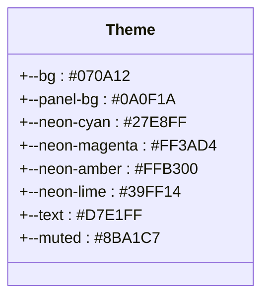
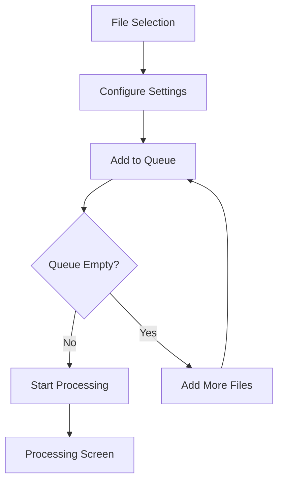
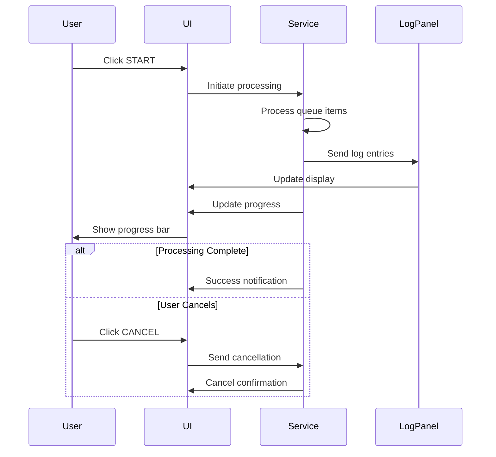
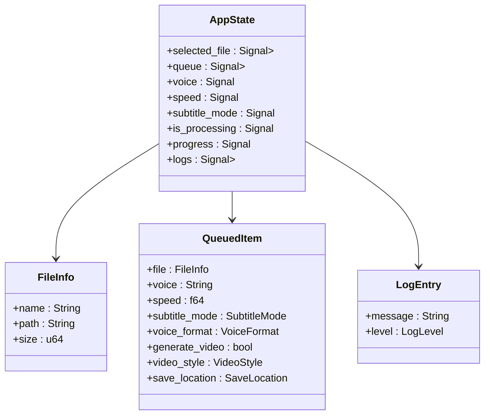

# UI Application Guide

<cite>
**Referenced Files in This Document**   
- [README.md](file://abogen-ui/README.md)
- [theme.rs](file://abogen-ui/crates/ui/theme.rs)
- [state.rs](file://abogen-ui/crates/ui/state.rs)
- [header.rs](file://abogen-ui/crates/ui/components/header.rs)
- [drop_zone.rs](file://abogen-ui/crates/ui/components/drop_zone.rs)
- [neon_button.rs](file://abogen-ui/crates/ui/components/neon_button.rs)
- [log_panel.rs](file://abogen-ui/crates/ui/components/log_panel.rs)
- [file_picker.rs](file://abogen-ui/crates/ui/services/file_picker.rs)
- [tts_stub.rs](file://abogen-ui/crates/ui/services/tts_stub.rs)
- [voices.rs](file://abogen-ui/crates/ui/services/voices.rs)
- [video_generation.rs](file://abogen-ui/crates/ui/services/video_generation.rs)
- [zai_video.rs](file://abogen-ui/crates/ui/services/zai_video.rs)
</cite>

## Table of Contents
1. [Introduction](#introduction)
2. [Cyberpunk User Experience](#cyberpunk-user-experience)
3. [Main Screen Workflow](#main-screen-workflow)
4. [Processing Screen](#processing-screen)
5. [Component Architecture](#component-architecture)
6. [Usage Examples](#usage-examples)
7. [State Management](#state-management)
8. [Service Integration](#service-integration)
9. [Accessibility and Responsive Design](#accessibility-and-responsive-design)
10. [Feature Flag Usage](#feature-flag-usage)

## Introduction
The Abogen UI is a cross-platform application built with Rust and Dioxus 0.5, featuring a cyberpunk-themed interface with neon accents and dark UI elements. This guide provides comprehensive documentation for the UI application, covering its design, functionality, architecture, and usage across desktop, web, and mobile platforms.

## Cyberpunk User Experience
The application features a distinctive cyberpunk aesthetic inspired by Blade Runner and similar media, characterized by neon accents against dark backgrounds. The theme is defined in `theme.rs` using a specific color palette with glowing effects that create an immersive futuristic experience.

The visual design incorporates:
- **Neon Glow Effects**: Cyan, magenta, amber, and lime glows on interactive elements
- **Dark Backgrounds**: Deep space-like gradients with radial patterns
- **Futuristic Typography**: Rajdhani font from Google Fonts with high-contrast text
- **Interactive Feedback**: Animated hover states and focus indicators



**Diagram sources**
- [theme.rs](file://abogen-ui/crates/ui/theme.rs#L1-L209)

**Section sources**
- [theme.rs](file://abogen-ui/crates/ui/theme.rs#L1-L209)
- [README.md](file://abogen-ui/README.md#L1-L229)

## Main Screen Workflow
The main screen provides a comprehensive interface for file processing with an intuitive workflow that guides users through configuration and queue management.

### File Selection via Drag-and-Drop
Users can select files through either clicking the drop zone or using drag-and-drop functionality. The interface supports `.txt`, `.epub`, and `.pdf` file formats. The drop zone component provides visual feedback during drag operations, changing border color and adding glow effects when files are being dragged over.

### Configuration Settings
After file selection, users configure various processing parameters:
- **Voice Selection**: Searchable combobox for selecting from available voices
- **Speed Adjustment**: Slider control for voice speed (0.5x to 2.0x)
- **Subtitle Generation**: Mode selection (Sentence, Paragraph, or None)
- **Output Configuration**: Format selection for voice (WAV, MP3, FLAC) and subtitles (ASS, SRT, VTT)
- **Advanced Options**: Newline replacement, save location, and GPU acceleration toggle

### Queue Management
The application allows users to manage multiple processing jobs through a queue system:
- **Add to Queue**: Current file and settings are added to processing queue
- **Manage Queue**: View and reorder queue items (implementation pending)
- **Clear Queue**: Remove all items from the queue
- **Start Processing**: Initiate processing when queue is ready



**Diagram sources**
- [README.md](file://abogen-ui/README.md#L1-L229)
- [drop_zone.rs](file://abogen-ui/crates/ui/components/drop_zone.rs#L1-L235)

**Section sources**
- [README.md](file://abogen-ui/README.md#L1-L229)
- [drop_zone.rs](file://abogen-ui/crates/ui/components/drop_zone.rs#L1-L235)

## Processing Screen
The processing screen provides real-time feedback during file processing operations, allowing users to monitor progress and view detailed logs.

### Real-Time Log Display
The log panel displays processing messages with color-coded entries:
- **Info Messages**: Cyan text for general processing information
- **Notice Messages**: Amber text for important notifications
- **Error Messages**: Red text for errors and warnings

Logs are streamed in real-time as processing occurs, providing immediate feedback on the current state of operations.

### Progress Tracking
The application features a progress bar that updates in real-time during processing:
- Visual indication of overall completion percentage
- Smooth transitions between progress states
- Responsive design that adapts to different screen sizes

Users can cancel processing at any time using the cancel button, which returns them to the main screen.



**Diagram sources**
- [tts_stub.rs](file://abogen-ui/crates/ui/services/tts_stub.rs#L1-L217)
- [log_panel.rs](file://abogen-ui/crates/ui/components/log_panel.rs#L1-L44)

**Section sources**
- [tts_stub.rs](file://abogen-ui/crates/ui/services/tts_stub.rs#L1-L217)
- [log_panel.rs](file://abogen-ui/crates/ui/components/log_panel.rs#L1-L44)

## Component Architecture
The UI components are organized in the `abogen-ui/crates/ui/components` directory, following a modular architecture that promotes reusability and maintainability.

### Header Component
The header component displays the application logo, version information, and navigation controls. It features a panel with a gradient logo and version text, providing a consistent visual identity across the application.

**Section sources**
- [header.rs](file://abogen-ui/crates/ui/components/header.rs#L1-L29)

### Drop Zone Component
The drop zone component handles file selection through both click and drag-and-drop interactions. It provides platform-specific implementations for web and desktop environments, with visual feedback during drag operations and proper file metadata handling.

**Section sources**
- [drop_zone.rs](file://abogen-ui/crates/ui/components/drop_zone.rs#L1-L235)

### Neon Button Component
The neon button component implements styled buttons with cyberpunk aesthetics. It supports primary and secondary variants with appropriate glow effects, hover animations, and disabled states. The component handles click events while respecting disabled status.

**Section sources**
- [neon_button.rs](file://abogen-ui/crates/ui/components/neon_button.rs#L1-L28)

### Log Panel Component
The log panel component displays processing logs with syntax highlighting based on message type. It supports scrolling for long log outputs and provides a clean interface for monitoring processing status. The component automatically updates when new log entries are added.

**Section sources**
- [log_panel.rs](file://abogen-ui/crates/ui/components/log_panel.rs#L1-L44)

## Usage Examples
The application can be launched on multiple platforms using the provided launchers in the apps directory.

### Desktop Launch
For desktop platforms, use the Dioxus Desktop launcher:

```bash
cd apps/desktop
cargo run --release
```

### Web Launch
For web deployment, use Trunk to serve the application:

```bash
cd apps/web
trunk serve
```

Access the application at `http://localhost:8080` in your browser.

### Mobile Launch
For mobile platforms, use the Dioxus Mobile toolchain:

```bash
cd apps/mobile
dx build android  # or ios
```

**Section sources**
- [README.md](file://abogen-ui/README.md#L1-L229)

## State Management
Application state is managed through the `state.rs` file, which defines the central state structure and reactive signals for UI updates.

### State Structure
The `AppState` struct contains signals for all application state:
- **File Selection**: `selected_file` signal with `FileInfo` struct
- **Queue Management**: `queue` signal with `QueuedItem` collection
- **Processing Configuration**: Various signals for voice, speed, subtitle settings
- **Processing State**: `is_processing`, `progress`, and `logs` signals
- **Service Integration**: `cancel_token` for processing cancellation

### Data Structures
Key data structures include:
- `FileInfo`: File metadata (name, path, size)
- `QueuedItem`: Complete processing configuration for a file
- `LogEntry`: Log messages with level classification



**Diagram sources**
- [state.rs](file://abogen-ui/crates/ui/state.rs#L1-L256)

**Section sources**
- [state.rs](file://abogen-ui/crates/ui/state.rs#L1-L256)

## Service Integration
The application integrates various services through the `services/` directory, providing platform-agnostic interfaces for key functionality.

### File Picker Service
The file picker service provides a unified interface for file selection across platforms:
- **Web Implementation**: Uses HTML input elements
- **Native Implementation**: Uses platform-specific APIs (Tauri, mobile)

Currently stubbed, with warnings logged when called.

**Section sources**
- [file_picker.rs](file://abogen-ui/crates/ui/services/file_picker.rs#L1-L37)

### TTS Service
The TTS service handles text-to-speech processing:
- **Stub Implementation**: Simulates processing with async delays
- **Real Implementation**: Enabled via `real-tts` feature flag
- **Progress Updates**: Real-time progress and log streaming
- **Cancellation Support**: Graceful cancellation with cleanup

**Section sources**
- [tts_stub.rs](file://abogen-ui/crates/ui/services/tts_stub.rs#L1-L217)

### Voice Management
The voices service manages voice selection and information:
- **Kokoro Voices**: Comprehensive collection of voices by language and gender
- **Coqui Voices**: Additional voices available when feature is enabled
- **Voice Information**: Metadata including display name, language, and engine

**Section sources**
- [voices.rs](file://abogen-ui/crates/ui/services/voices.rs#L1-L217)

### Video Generation
The video generation service creates videos using external APIs:
- **Z.AI Integration**: Cloud-based video generation with API key
- **MLT Composition**: Local video composition with audio and subtitles
- **Format Support**: Multiple resolutions and formats (720p, 1080p, 4K)

**Section sources**
- [video_generation.rs](file://abogen-ui/crates/ui/services/video_generation.rs#L1-L489)
- [zai_video.rs](file://abogen-ui/crates/ui/services/zai_video.rs#L1-L337)

## Accessibility and Responsive Design
The application prioritizes accessibility and responsive design to ensure usability across devices and for users with diverse needs.

### Accessibility Features
- **WCAG AA Compliance**: Meets accessibility standards for contrast and usability
- **Keyboard Navigation**: Full keyboard operability for all controls
- **Focus States**: Visible focus indicators for interactive elements
- **Semantic HTML**: Proper element usage for screen readers

### Responsive Design
- **Mobile-First Approach**: Layouts adapt to small screens
- **Flexible Containers**: Max-width constraints with responsive padding
- **Touch Targets**: Adequate sizing for touch interactions
- **Media Queries**: CSS breakpoints for different screen sizes

**Section sources**
- [theme.rs](file://abogen-ui/crates/ui/theme.rs#L1-L209)
- [README.md](file://abogen-ui/README.md#L1-L229)

## Feature Flag Usage
The application uses Cargo feature flags to enable optional functionality, allowing for modular compilation and deployment.

### Available Features
- **gpu**: Enables GPU acceleration probe (default: disabled)
- **real-tts**: Uses real TTS backend with Kokoro (default: stub)
- **video-generation**: Enables video generation with Z.ai API
- **zai-video**: Enhanced Z.AI video generation with style presets

### Usage Examples
Build with specific features:

```bash
# Basic build with GPU support
cargo build --features gpu

# TTS and video generation
cargo build --features "real-tts video-generation"

# Full feature set
cargo build --features "real-tts video-generation zai-video"
```

Feature flags control both compilation and runtime behavior, with appropriate fallbacks when features are disabled.

**Section sources**
- [README.md](file://abogen-ui/README.md#L1-L229)
- [video_generation.rs](file://abogen-ui/crates/ui/services/video_generation.rs#L1-L489)
- [zai_video.rs](file://abogen-ui/crates/ui/services/zai_video.rs#L1-L337)