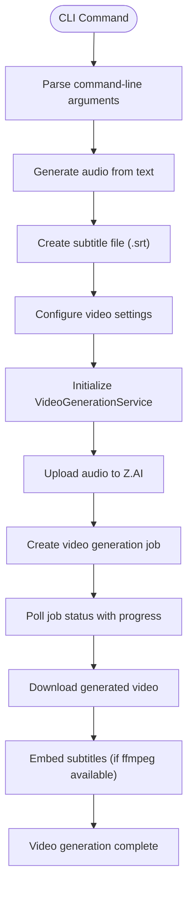
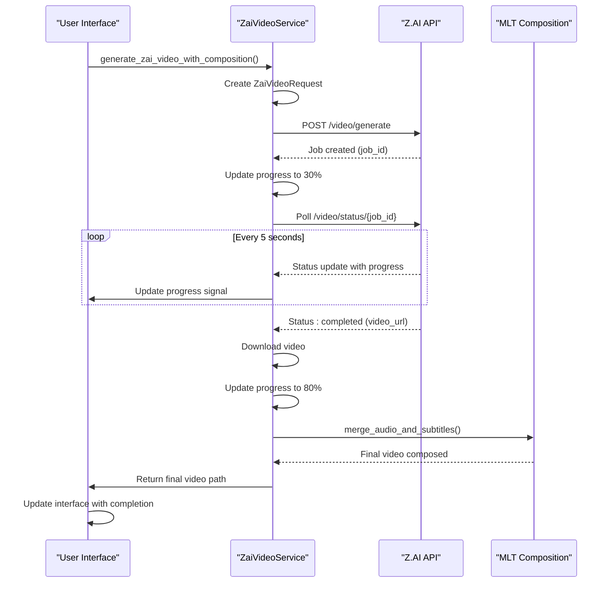
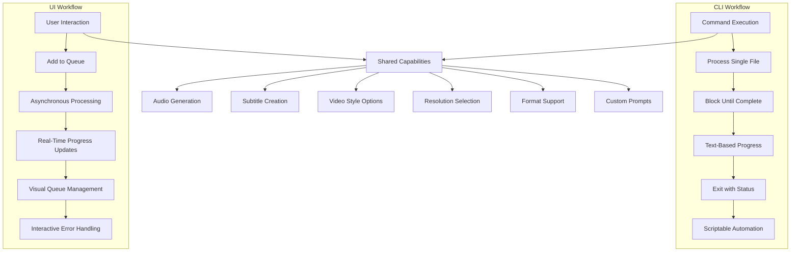

# CLI and UI Implementation

<cite>
**Referenced Files in This Document**   
- [src/main.rs](file://src/main.rs)
- [src/video.rs](file://src/video.rs)
- [abogen-ui/crates/ui/services/zai_video.rs](file://abogen-ui/crates/ui/services/zai_video.rs)
- [abogen-ui/crates/ui/services/mlt_video.rs](file://abogen-ui/crates/ui/services/mlt_video.rs)
</cite>

## Table of Contents
1. [Introduction](#introduction)
2. [Shared Video Generation Service](#shared-video-generation-service)
3. [CLI Implementation](#cli-implementation)
4. [UI Implementation](#ui-implementation)
5. [Workflow Comparison](#workflow-comparison)
6. [Configuration and Features](#configuration-and-features)
7. [Error Handling](#error-handling)
8. [Use Case Guidance](#use-case-guidance)

## Introduction
This document provides a comprehensive comparison of the Command Line Interface (CLI) and User Interface (UI) implementations for video generation in VoxWeave. Both interfaces leverage a shared `VideoGenerationService` to create narrated videos with AI-generated visuals, while offering distinct approaches to user interaction, workflow management, and progress tracking. The CLI focuses on automation and batch processing, while the UI emphasizes interactive control and real-time feedback.

## Shared Video Generation Service

The `VideoGenerationService` in `src/video.rs` serves as the common foundation for both CLI and UI implementations, providing a unified interface for video generation through the Z.AI API. This service handles the complete video generation pipeline including audio upload, job creation, status polling, video download, and subtitle embedding.

The service supports multiple video providers through the `VideoProvider` enum, currently including ZAI and OpenAISora. It uses a consistent configuration structure (`VideoConfig`) that defines video style, resolution, format, and optional custom prompts. The service implements robust error handling and progress reporting mechanisms that are adapted differently by the CLI and UI interfaces.

Both interfaces follow a similar three-step workflow: first generating audio from text using TTS, then creating subtitle files, and finally generating the video by combining these assets with AI visuals. The shared service ensures consistent behavior across both interfaces while allowing each to implement its own user experience patterns.

**Section sources**
- [src/video.rs](file://src/video.rs#L1-L463)

## CLI Implementation

The CLI implementation in `src/main.rs` provides a command-line interface for video generation through the `video` subcommand. This implementation uses the `clap` crate for argument parsing, defining a comprehensive set of options for input files, output directories, voice selection, video style, resolution, format, custom prompts, and playback speed.

The `handle_video` function orchestrates the video generation process by first generating audio and subtitles using the existing TTS pipeline, then invoking the `generate_video_cli` async function to create the video. The CLI implementation uses tokio's runtime to execute the asynchronous video generation process, blocking until completion.

Progress reporting in the CLI is text-based, with a simple percentage indicator that updates in place. Log messages are displayed with different emoji indicators for information (ℹ️), warnings (⚠️), and errors (❌). The implementation provides clear error messages for common issues such as missing API keys, API errors, timeouts, and file I/O problems.

The CLI's design emphasizes automation and scripting capabilities, making it ideal for batch processing, CI/CD pipelines, and server environments where interactive user input is not available.

**Diagram sources**
- [src/main.rs](file://src/main.rs#L250-L417)
- [src/video.rs](file://src/video.rs#L1-L463)

**Section sources**
- [src/main.rs](file://src/main.rs#L250-L417)

## UI Implementation

The UI implementation in `abogen-ui/crates/ui/services/zai_video.rs` provides an asynchronous service for video generation with real-time feedback and queue management. Unlike the CLI's blocking approach, the UI implementation uses Dioxus signals to provide live updates to the user interface, enabling real-time progress visualization and interactive control.

The `ZaiVideoService` struct handles communication with the Z.AI API, creating video generation jobs and polling for completion status. The service integrates with the UI's state management system through `Signal<Vec<LogEntry>>` for logging and `Signal<u8>` for progress tracking, allowing the UI to update dynamically as the video generation progresses.

A key feature of the UI implementation is the `generate_zai_video_with_composition` function, which orchestrates a multi-stage process: first generating a base video from Z.AI, then composing the final output with local audio and subtitles using MLT (Media Lovin' Toolkit). This composition step enables word-by-word subtitle highlighting and precise audio synchronization that enhances the viewing experience.

The UI also implements queue management capabilities, allowing users to add multiple video generation tasks to a queue and process them sequentially. This enables batch processing while maintaining the interactive nature of the interface, with visual indicators showing the status of each queued item.

**Diagram sources**
- [abogen-ui/crates/ui/services/zai_video.rs](file://abogen-ui/crates/ui/services/zai_video.rs#L1-L337)
- [abogen-ui/crates/ui/services/mlt_video.rs](file://abogen-ui/crates/ui/services/mlt_video.rs#L1-L350)

**Section sources**
- [abogen-ui/crates/ui/services/zai_video.rs](file://abogen-ui/crates/ui/services/zai_video.rs#L1-L337)

## Workflow Comparison

The CLI and UI implementations differ significantly in their workflow approaches, reflecting their different target use cases. The CLI follows a linear, batch-oriented workflow optimized for automation, while the UI provides an interactive, queue-based workflow with real-time feedback.

The CLI workflow is sequential and blocking: it processes one video at a time, waiting for completion before returning control to the user. This makes it ideal for scripting and automation, where commands can be chained together in shell scripts or CI/CD pipelines. The CLI's strength lies in its ability to process multiple files through simple shell loops, making batch processing straightforward.

In contrast, the UI workflow is asynchronous and non-blocking, allowing users to continue interacting with the application while videos are being generated. The UI implements a visual queue system where multiple video generation tasks can be added and monitored simultaneously. Users can see the progress of each task, view real-time logs, and manage the queue by adding, removing, or reordering items.

The CLI provides minimal feedback during processing, limited to text-based progress percentages and log messages. Error handling is straightforward, with the process exiting on failure. The UI, however, offers rich feedback through progress bars, color-coded logs, and status indicators. It also implements more sophisticated error handling, allowing users to address issues and retry failed tasks without restarting the entire application.

Both interfaces share the same core video generation capabilities, including support for multiple styles (cyberpunk, biotech, educational, etc.), resolutions (720p, 1080p, 4K), and formats (MP4, MOV, WebM). They also support custom visual prompts to guide the AI generation process.

**Diagram sources**
- [src/main.rs](file://src/main.rs#L250-L417)
- [abogen-ui/crates/ui/services/zai_video.rs](file://abogen-ui/crates/ui/services/zai_video.rs#L1-L337)

## Configuration and Features

Both CLI and UI implementations share a common set of configuration options and features, ensuring consistent behavior across interfaces. The core configuration includes video style, resolution, format, and custom prompts, all of which are implemented using the same underlying `VideoConfig` structure.

The CLI exposes these options through command-line arguments, allowing users to specify them directly in the command. For example, `--style cyberpunk --resolution 1080p --format mp4` sets the video style, resolution, and format. The UI presents these options through interactive controls such as dropdown menus and input fields, providing a more discoverable interface for users.

Both interfaces support the same video styles: realistic, anime, 3d, cinematic, biotech, cyberpunk, and educational. Each style produces distinct visual aesthetics, from photorealistic documentaries to vibrant anime art. The resolution options (720p, 1080p, 4K) affect both generation time and video quality, with higher resolutions taking longer to process but providing better visual fidelity.

A key difference between the interfaces is in their handling of subtitles. The CLI generates subtitles as a separate SRT file and can optionally embed them into the video using ffmpeg if available. The UI, through its MLT composition step, creates videos with word-by-word highlighted subtitles that synchronize precisely with the audio, providing a more engaging viewing experience.

The UI also offers additional interface-specific features such as drag-and-drop file input, real-time previews, and visual queue management. These features enhance the interactive experience but are not available in the CLI, which focuses on scriptability and automation.

**Section sources**
- [src/main.rs](file://src/main.rs#L250-L417)
- [src/video.rs](file://src/video.rs#L1-L463)
- [abogen-ui/crates/ui/services/zai_video.rs](file://abogen-ui/crates/ui/services/zai_video.rs#L1-L337)

## Error Handling

The CLI and UI implementations employ different approaches to error handling, reflecting their distinct use cases and user interaction models. The CLI follows a fail-fast approach typical of command-line tools, where errors result in immediate termination with descriptive error messages.

When an error occurs in the CLI, such as a missing API key or video generation timeout, the process outputs an error message to stderr and exits with a non-zero status code. This behavior is essential for automation scenarios, where scripts need to detect and respond to failures. The CLI provides clear, actionable error messages such as "ZAI_API_KEY environment variable not set" or "Video generation timeout," helping users quickly diagnose and resolve issues.

In contrast, the UI implements a more resilient error handling strategy that allows users to continue using the application even when individual tasks fail. Errors are displayed in the log panel with appropriate severity levels (info, notice, warning, error), and users can inspect the details to understand what went wrong. The UI does not terminate on errors, enabling users to correct configuration issues and retry failed operations without restarting the entire application.

Both interfaces validate prerequisites before starting video generation, checking for the presence of required environment variables (ZAI_API_KEY) and ensuring that input files are accessible. They also handle API-level errors from the Z.AI service, translating HTTP status codes and error messages into user-friendly notifications.

The UI's error handling is particularly important for its queue management functionality, as it allows some tasks in the queue to succeed even if others fail. This selective processing capability makes the UI more robust for batch operations where input quality may vary across files.

**Section sources**
- [src/main.rs](file://src/main.rs#L250-L417)
- [abogen-ui/crates/ui/services/zai_video.rs](file://abogen-ui/crates/ui/services/zai_video.rs#L1-L337)

## Use Case Guidance

The choice between CLI and UI implementations depends on the specific use case and user requirements. The CLI is best suited for automation, batch processing, and server environments where interactive user input is not available or desirable.

For automation scenarios such as CI/CD pipelines, scheduled content generation, or server-side processing, the CLI's scriptability and predictable behavior make it the ideal choice. Its ability to process multiple files through simple shell loops, combined with its exit codes for failure detection, enables robust integration into larger automation workflows. The CLI is also preferred for headless environments where a graphical interface is not available.

The UI, on the other hand, excels in interactive scenarios where users need real-time feedback, visual progress tracking, and the ability to manage multiple tasks simultaneously. It is particularly well-suited for content creators who want to experiment with different styles and settings, as the immediate visual feedback allows for rapid iteration and refinement.

For batch processing of multiple files, the CLI's simplicity and scriptability make it more efficient, especially when combined with shell features like loops and parallel processing. However, for smaller batches or when users want to monitor progress and intervene if issues arise, the UI's queue management and real-time logging provide superior control.

In development and testing scenarios, the CLI is often preferred for its ability to quickly verify functionality through simple commands, while the UI is valuable for demonstrating features and gathering user feedback on the overall experience.

Ultimately, both interfaces complement each other, with the CLI serving automation and power users, and the UI serving interactive and creative workflows. Users can leverage both interfaces as needed, using the CLI for automated tasks and the UI for interactive content creation.

**Section sources**
- [src/main.rs](file://src/main.rs#L250-L417)
- [abogen-ui/crates/ui/services/zai_video.rs](file://abogen-ui/crates/ui/services/zai_video.rs#L1-L337)