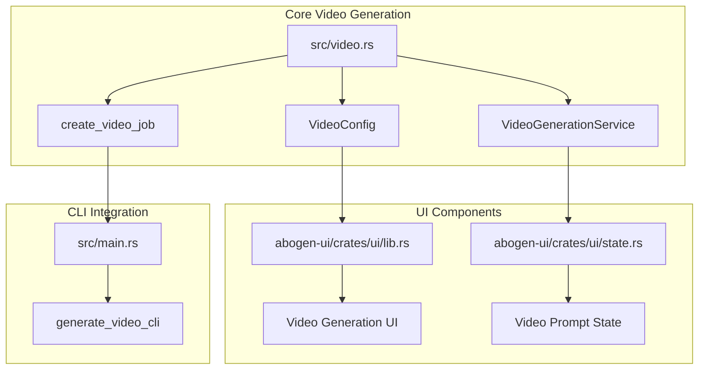
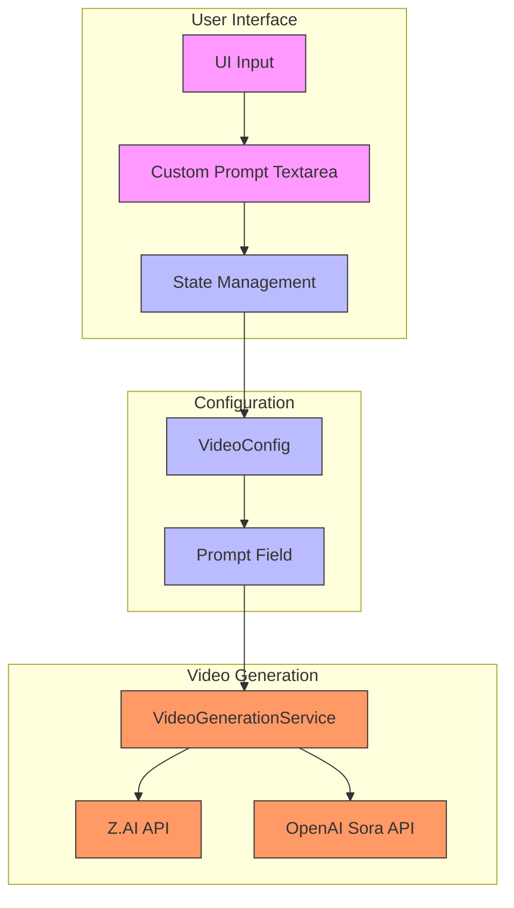
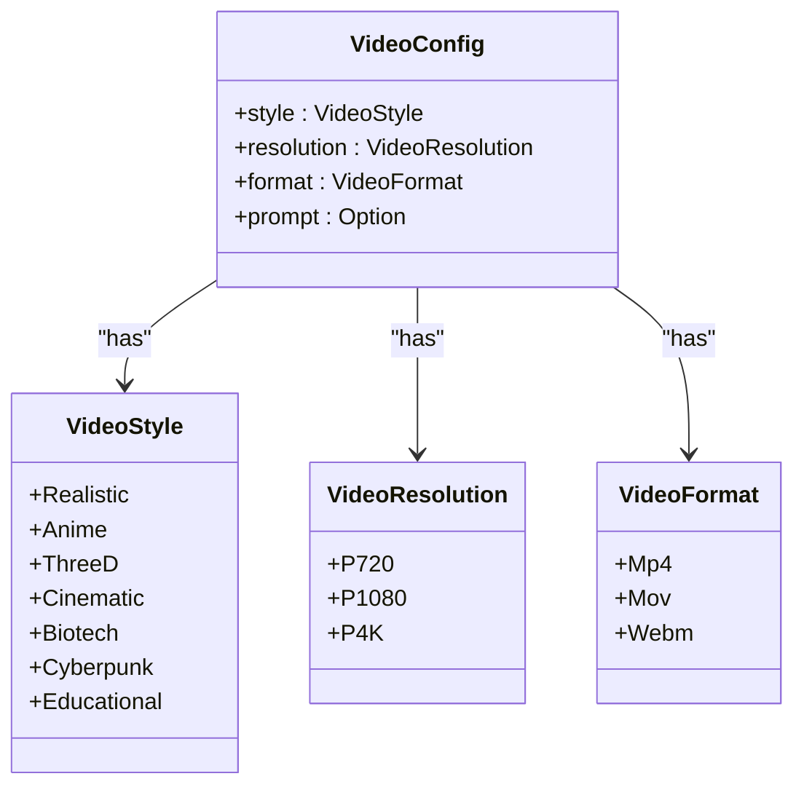
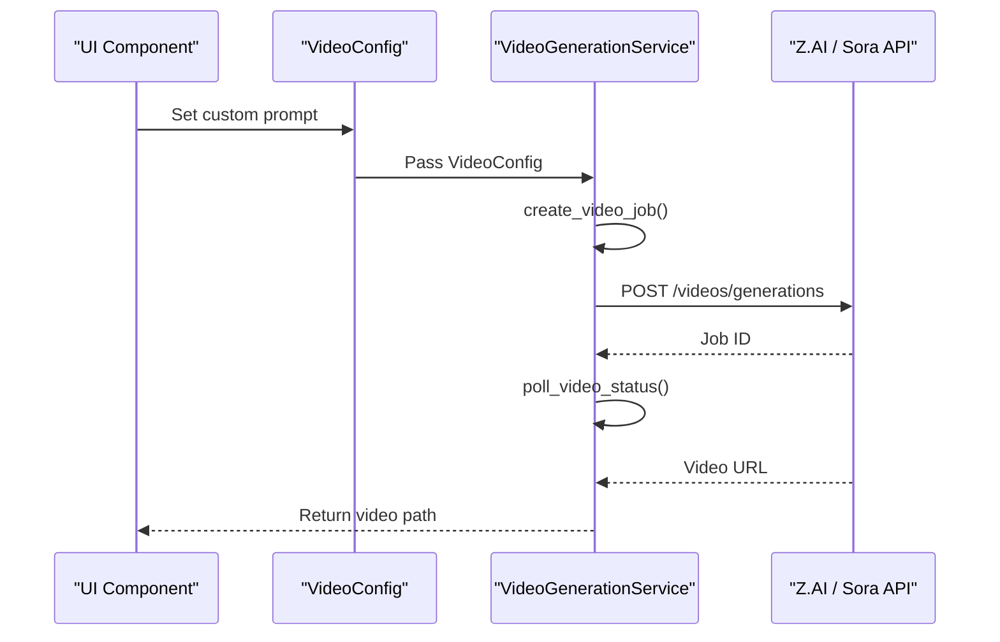
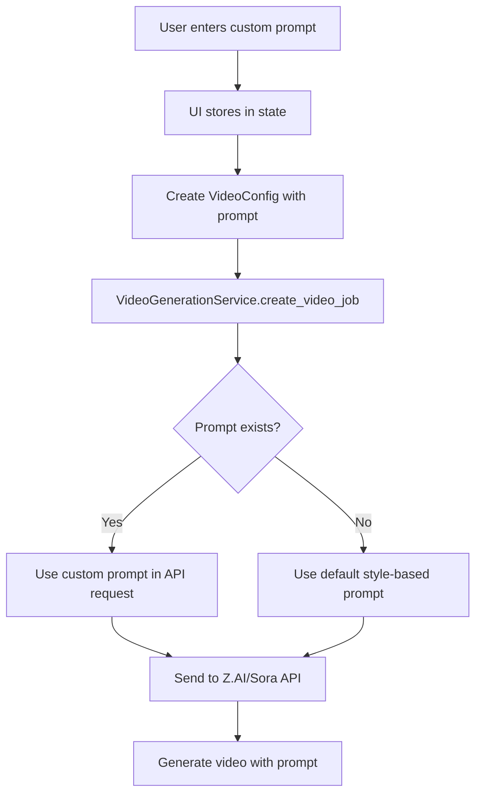
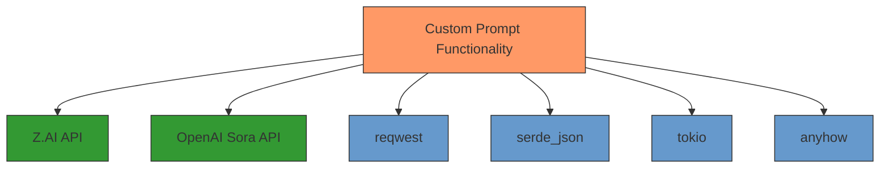

# Custom Prompts

<cite>
**Referenced Files in This Document**   
- [src/video.rs](file://src/video.rs)
- [abogen-ui/crates/ui/services/video_generation.rs](file://abogen-ui/crates/ui/services/video_generation.rs)
- [abogen-ui/crates/ui/services/zai_video.rs](file://abogen-ui/crates/ui/services/zai_video.rs)
- [abogen-ui/crates/ui/lib.rs](file://abogen-ui/crates/ui/lib.rs)
- [abogen-ui/crates/ui/state.rs](file://abogen-ui/crates/ui/state.rs)
- [src/main.rs](file://src/main.rs)
- [VIDEO_CLI_IMPLEMENTATION.md](file://VIDEO_CLI_IMPLEMENTATION.md)
- [ZAI_VIDEO_FEATURE.md](file://abogen-ui/ZAI_VIDEO_FEATURE.md)
</cite>

## Table of Contents
1. [Introduction](#introduction)
2. [Project Structure](#project-structure)
3. [Core Components](#core-components)
4. [Architecture Overview](#architecture-overview)
5. [Detailed Component Analysis](#detailed-component-analysis)
6. [Dependency Analysis](#dependency-analysis)
7. [Performance Considerations](#performance-considerations)
8. [Troubleshooting Guide](#troubleshooting-guide)
9. [Conclusion](#conclusion)

## Introduction
This document provides comprehensive documentation for the custom prompt functionality in VoxWeave's video generation system. It explains how the optional prompt field in VideoConfig influences AI-generated visuals through the Z.AI and OpenAI Sora APIs. The implementation details cover how custom prompts override default style-based prompts in the create_video_job method. The document includes examples of effective prompt engineering for different content types and styles, best practices for crafting descriptive prompts, limitations such as prompt length restrictions and content policies, integration in both CLI (--prompt) and UI implementations, and troubleshooting guidance for cases where prompts are ignored or produce unexpected results.

## Project Structure
The project structure reveals a well-organized codebase with clear separation of concerns between the core video generation functionality and the UI components. The video generation logic is implemented in the src/video.rs file, while the UI components are located in the abogen-ui directory. The configuration and state management are handled in separate modules, allowing for clean integration between the frontend and backend components.

**Diagram sources**
- [src/video.rs](file://src/video.rs#L1-L463)
- [abogen-ui/crates/ui/lib.rs](file://abogen-ui/crates/ui/lib.rs#L1-L640)
- [src/main.rs](file://src/main.rs#L1-L500)

## Core Components
The core components of the custom prompt functionality are centered around the VideoConfig struct and the VideoGenerationService implementation. The VideoConfig struct contains the prompt field which is an optional string that can be used to influence the AI-generated visuals. The VideoGenerationService handles the communication with the Z.AI and OpenAI Sora APIs, using the prompt to customize the video generation process.

**Section sources**
- [src/video.rs](file://src/video.rs#L1-L463)
- [abogen-ui/crates/ui/services/video_generation.rs](file://abogen-ui/crates/ui/services/video_generation.rs#L1-L489)

## Architecture Overview
The architecture of the custom prompt functionality follows a clean separation between the UI layer, the configuration layer, and the video generation service. The UI collects the custom prompt from the user and passes it through the application state to the video generation service. The service then uses this prompt when creating video generation jobs with the AI APIs.

**Diagram sources**
- [src/video.rs](file://src/video.rs#L1-L463)
- [abogen-ui/crates/ui/lib.rs](file://abogen-ui/crates/ui/lib.rs#L1-L640)
- [abogen-ui/crates/ui/state.rs](file://abogen-ui/crates/ui/state.rs#L1-L256)

## Detailed Component Analysis

### Video Configuration Analysis
The VideoConfig struct is the central data structure for video generation parameters, including the custom prompt functionality. It contains fields for style, resolution, format, and the optional prompt that allows users to influence the AI-generated visuals.

**Diagram sources**
- [src/video.rs](file://src/video.rs#L1-L463)
- [abogen-ui/crates/ui/services/video_generation.rs](file://abogen-ui/crates/ui/services/video_generation.rs#L1-L489)

### Video Generation Service Analysis
The VideoGenerationService is responsible for creating video generation jobs with the AI APIs. It handles both Z.AI and OpenAI Sora providers, using the custom prompt when provided to influence the generated visuals.

**Diagram sources**
- [src/video.rs](file://src/video.rs#L1-L463)
- [abogen-ui/crates/ui/services/video_generation.rs](file://abogen-ui/crates/ui/services/video_generation.rs#L1-L489)

### Custom Prompt Implementation Analysis
The custom prompt functionality is implemented across multiple layers of the application, from the UI input to the API request. The prompt field in VideoConfig is optional and when present, it overrides the default style-based prompt.

**Diagram sources**
- [src/video.rs](file://src/video.rs#L1-L463)
- [abogen-ui/crates/ui/lib.rs](file://abogen-ui/crates/ui/lib.rs#L1-L640)
- [abogen-ui/crates/ui/state.rs](file://abogen-ui/crates/ui/state.rs#L1-L256)

## Dependency Analysis
The custom prompt functionality depends on several key components and external services. The primary dependencies include the Z.AI and OpenAI Sora APIs for video generation, the reqwest crate for HTTP requests, and the serde_json crate for JSON serialization.

**Diagram sources**
- [src/video.rs](file://src/video.rs#L1-L463)
- [Cargo.toml](file://Cargo.toml#L1-L50)

## Performance Considerations
The custom prompt functionality has several performance considerations that affect the video generation process. The prompt processing itself is lightweight, but the impact on video generation time and quality can be significant depending on the complexity of the requested visuals.

**Section sources**
- [src/video.rs](file://src/video.rs#L1-L463)
- [VIDEO_CLI_IMPLEMENTATION.md](file://VIDEO_CLI_IMPLEMENTATION.md#L1-L335)

## Troubleshooting Guide
When custom prompts are ignored or produce unexpected results, there are several potential causes and solutions to consider. The most common issues relate to API limitations, prompt formatting, and configuration errors.

**Section sources**
- [src/video.rs](file://src/video.rs#L1-L463)
- [abogen-ui/crates/ui/services/video_generation.rs](file://abogen-ui/crates/ui/services/video_generation.rs#L1-L489)
- [ZAI_VIDEO_FEATURE.md](file://abogen-ui/ZAI_VIDEO_FEATURE.md#L1-L169)

## Conclusion
The custom prompt functionality in VoxWeave's video generation system provides a powerful way for users to influence AI-generated visuals through both the Z.AI and OpenAI Sora APIs. By implementing the optional prompt field in VideoConfig, users can override default style-based prompts with custom descriptions that guide the visual generation process. The functionality is well-integrated across both CLI and UI implementations, allowing for flexible use in different workflows. While there are limitations such as prompt length restrictions and content policies, the system provides a robust foundation for creative video generation with AI.