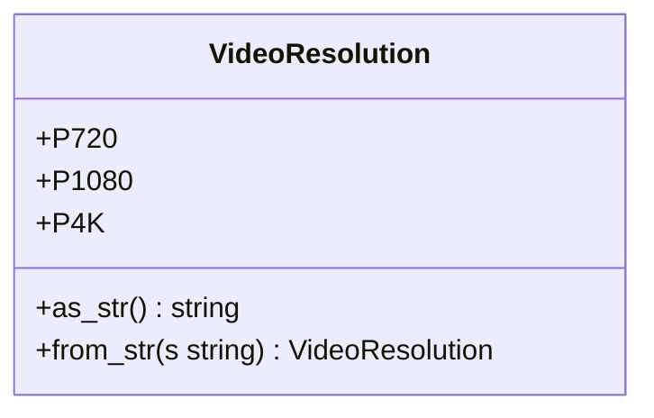
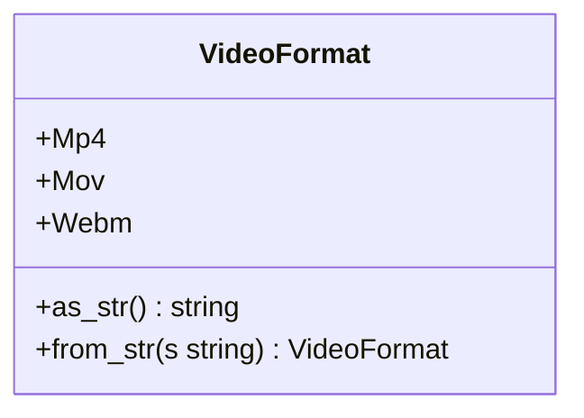
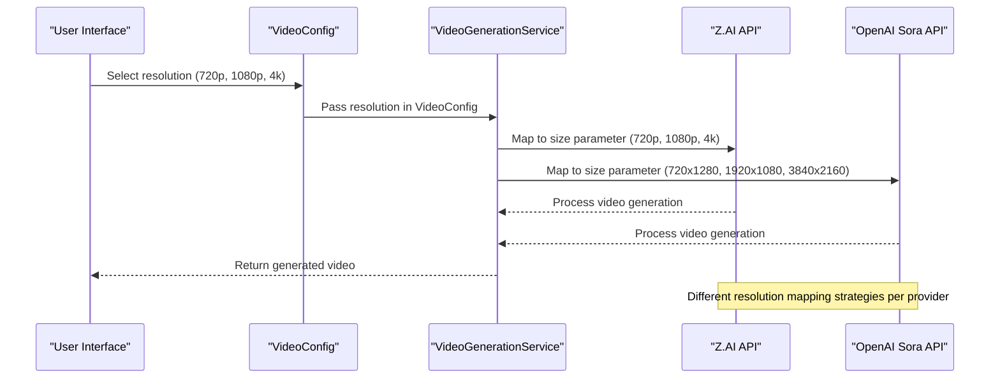
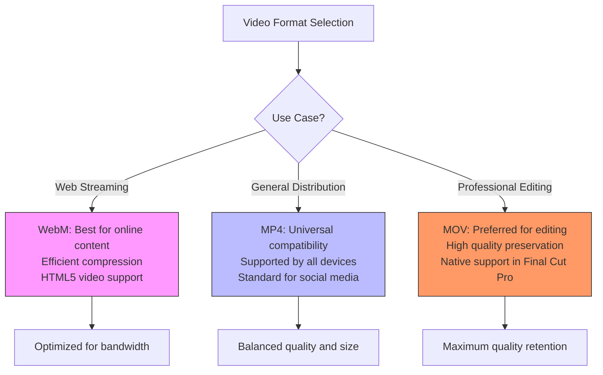
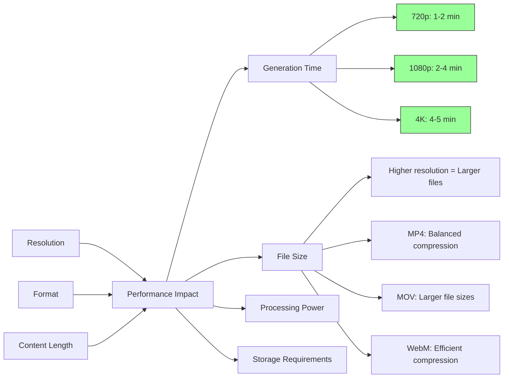
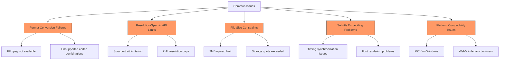

# Resolutions and Formats

<cite>
**Referenced Files in This Document**   
- [video.rs](file://src/video.rs)
- [queue.rs](file://src/queue.rs)
- [state.rs](file://abogen-ui/crates/ui/state.rs)
- [lib.rs](file://abogen-ui/crates/ui/lib.rs)
- [VIDEO_CLI_IMPLEMENTATION.md](file://VIDEO_CLI_IMPLEMENTATION.md)
- [CLI_VIDEO_GENERATION.md](file://CLI_VIDEO_GENERATION.md)
- [ZAI_VIDEO_FEATURE.md](file://abogen-ui/ZAI_VIDEO_FEATURE.md)
</cite>

## Table of Contents
1. [Introduction](#introduction)
2. [Video Resolution Options](#video-resolution-options)
3. [Video Format Options](#video-format-options)
4. [Resolution and API Integration](#resolution-and-api-integration)
5. [Format Compatibility and Use Cases](#format-compatibility-and-use-cases)
6. [Performance Considerations](#performance-considerations)
7. [Practical Applications and Examples](#practical-applications-and-examples)
8. [Common Issues and Limitations](#common-issues-and-limitations)
9. [API Parameter Mapping](#api-parameter-mapping)

## Introduction
This document details the implementation and usage of video resolution and format options in the VoxWeave application. It covers the VideoResolution (720p, 1080p, 4k) and VideoFormat (mp4, mov, webm) enums defined in the codebase, their integration with video generation providers (Z.AI and OpenAI Sora), and their impact on quality, performance, and compatibility. The documentation includes practical examples, performance implications, and troubleshooting guidance for developers and users.

## Video Resolution Options

The VoxWeave application supports three video resolution options through the `VideoResolution` enum defined in the codebase. These resolutions directly impact video quality, generation time, and file size.



**Diagram sources**
- [queue.rs](file://src/queue.rs#L20-L35)
- [state.rs](file://abogen-ui/crates/ui/state.rs#L123-L135)

The available resolution options are:

- **720p HD**: Standard high definition resolution (1280x720 pixels), suitable for quick generation and web streaming
- **1080p Full HD**: Full high definition resolution (1920x1080 pixels), providing balanced quality and performance
- **4K Ultra HD**: Ultra high definition resolution (3840x2160 pixels), delivering maximum visual quality for professional use

Higher resolutions result in better visual quality but increase generation time and file size. The UI presents these options with descriptive labels to guide user selection based on their needs and system capabilities.

**Section sources**
- [queue.rs](file://src/queue.rs#L20-L35)
- [state.rs](file://abogen-ui/crates/ui/state.rs#L123-L135)
- [lib.rs](file://abogen-ui/crates/ui/lib.rs#L492-L500)

## Video Format Options

The application supports three video container formats through the `VideoFormat` enum, each with different compatibility characteristics and use cases.



**Diagram sources**
- [queue.rs](file://src/queue.rs#L37-L52)
- [state.rs](file://abogen-ui/crates/ui/state.rs#L152-L164)

The available format options are:

- **MP4**: Most widely compatible format, supported by virtually all devices and platforms, ideal for general distribution
- **MOV**: Apple's QuickTime format, preferred for professional video editing workflows, especially on macOS
- **WebM**: Open, royalty-free format optimized for web streaming, providing efficient compression for online content

The format selection affects not only compatibility but also the final processing workflow, particularly when embedding subtitles using FFmpeg during post-processing.

**Section sources**
- [queue.rs](file://src/queue.rs#L37-L52)
- [state.rs](file://abogen-ui/crates/ui/state.rs#L152-L164)
- [lib.rs](file://abogen-ui/crates/ui/lib.rs#L505-L514)

## Resolution and API Integration

Video resolution settings are mapped differently when interfacing with the Z.AI and OpenAI Sora APIs, reflecting each provider's specific requirements and capabilities.



**Diagram sources**
- [video.rs](file://src/video.rs#L214-L244)
- [video.rs](file://src/video.rs#L246-L260)

When using the Z.AI provider, the resolution is passed directly as a string parameter ("720p", "1080p", "4k") in the API request. The OpenAI Sora provider requires explicit pixel dimensions, with 720p mapped to "720x1280" (portrait orientation), 1080p to "1920x1080", and 4K to "3840x2160". This mapping occurs in the `create_video_job` method of the `VideoGenerationService`, which translates the application's resolution enum to the appropriate API-specific format.

The resolution directly affects generation time, with typical durations being 1-2 minutes for 720p, 2-4 minutes for 1080p, and 4-5 minutes for 4K, though actual times vary based on content length, API server load, and network conditions.

**Section sources**
- [video.rs](file://src/video.rs#L214-L260)
- [VIDEO_CLI_IMPLEMENTATION.md](file://VIDEO_CLI_IMPLEMENTATION.md#L255-L293)
- [CLI_VIDEO_GENERATION.md](file://CLI_VIDEO_GENERATION.md#L213-L283)

## Format Compatibility and Use Cases

Different video formats serve distinct purposes and have varying compatibility across platforms and use cases.



**Diagram sources**
- [video.rs](file://src/video.rs#L375-L390)
- [queue.rs](file://src/queue.rs#L37-L52)

**MP4 (MPEG-4 Part 14)** is the most versatile format, offering excellent compatibility across devices, operating systems, and platforms. It's the recommended choice for content intended for social media, websites, or general distribution, as it's supported by YouTube, Facebook, Instagram, and virtually all mobile devices and desktop players.

**MOV (QuickTime File Format)** is particularly valuable in professional video production workflows, especially within the Apple ecosystem. It's the native format for Final Cut Pro and maintains high quality during editing processes. This format is ideal for users who plan to further edit their generated videos or work in professional video production environments.

**WebM** is an open, royalty-free format developed specifically for web video. It provides excellent compression efficiency with the VP8/VP9 video codecs and Opus audio codec, making it perfect for web applications where bandwidth optimization is crucial. It's the preferred format for HTML5 video elements and streaming platforms that prioritize fast loading times.

**Section sources**
- [video.rs](file://src/video.rs#L375-L390)
- [ZAI_VIDEO_FEATURE.md](file://abogen-ui/ZAI_VIDEO_FEATURE.md#L0-L50)
- [queue.rs](file://src/queue.rs#L37-L52)

## Performance Considerations

Video resolution and format choices have significant implications for performance, affecting generation time, file size, processing requirements, and storage needs.



**Diagram sources**
- [video.rs](file://src/video.rs#L214-L260)
- [VIDEO_CLI_IMPLEMENTATION.md](file://VIDEO_CLI_IMPLEMENTATION.md#L255-L293)

Higher resolutions exponentially increase file sizes and processing requirements. A 4K video can be 4-8 times larger than its 720p counterpart, requiring more storage space and bandwidth for transfer. The generation process is computationally intensive, with 4K videos demanding significantly more processing power and memory from the API servers.

Format selection also impacts performance. MOV files typically have less compression to preserve quality, resulting in larger file sizes compared to MP4 files with similar visual quality. WebM offers the most efficient compression among the three formats, making it ideal for applications where bandwidth and storage are constrained.

When embedding subtitles using FFmpeg, the processing time increases further, as the system must re-encode the video to incorporate the subtitle track. This post-processing step adds to the overall generation time, particularly for high-resolution videos.

**Section sources**
- [video.rs](file://src/video.rs#L214-L260)
- [VIDEO_CLI_IMPLEMENTATION.md](file://VIDEO_CLI_IMPLEMENTATION.md#L255-L293)
- [CLI_VIDEO_GENERATION.md](file://CLI_VIDEO_GENERATION.md#L213-L283)

## Practical Applications and Examples

Understanding the practical applications of different resolution and format combinations helps users make informed decisions based on their specific use cases.

```mermaid
table
title: "Recommended Resolution and Format Combinations"
header: "Use Case, Recommended Resolution, Recommended Format, Rationale"
row: "Social Media Content, 1080p, MP4, Optimal balance of quality and file size for platforms like Instagram and Facebook"
row: "YouTube Videos, 4K, MP4, Maximum quality for professional content with broad platform compatibility"
row: "Website Embedding, 720p, WebM, Fast loading times and efficient bandwidth usage for web streaming"
row: "Professional Editing, 4K, MOV, Highest quality preservation for post-production workflows"
row: "Quick Prototyping, 720p, MP4, Fast generation for testing and iteration"
row: "Mobile Applications, 1080p, WebM, Good quality with efficient compression for mobile data usage"
```

**Diagram sources**
- [ZAI_VIDEO_FEATURE.md](file://abogen-ui/ZAI_VIDEO_FEATURE.md#L0-L50)
- [CLI_VIDEO_GENERATION.md](file://CLI_VIDEO_GENERATION.md#L213-L283)

For **educational content** where clarity and readability are paramount, 1080p resolution with MP4 format provides an excellent balance, ensuring text and graphics remain sharp while maintaining reasonable file sizes for distribution.

When creating content for **professional video editing**, selecting 4K resolution with MOV format preserves maximum quality throughout the editing process, allowing for zooming, cropping, and color grading without quality degradation.

For **web-based applications** and **online courses**, 720p resolution with WebM format optimizes loading times and reduces bandwidth consumption, providing a smooth viewing experience even on slower internet connections.

Content creators focusing on **social media** should use 1080p resolution with MP4 format, as this combination meets the quality standards of platforms like Instagram, TikTok, and Facebook while ensuring compatibility across different devices.

**Section sources**
- [ZAI_VIDEO_FEATURE.md](file://abogen-ui/ZAI_VIDEO_FEATURE.md#L0-L50)
- [CLI_VIDEO_GENERATION.md](file://CLI_VIDEO_GENERATION.md#L213-L283)

## Common Issues and Limitations

Users may encounter several common issues related to resolution and format selection, particularly when working with different API providers and processing constraints.



**Diagram sources**
- [video.rs](file://src/video.rs#L105-L125)
- [video.rs](file://src/video.rs#L375-L390)

**Format conversion failures** typically occur when FFmpeg is not available in the system environment or when attempting unsupported codec combinations during subtitle embedding. The application relies on FFmpeg to merge subtitles with the generated video, and missing or misconfigured FFmpeg installations will cause this step to fail, resulting in videos without subtitles.

**Resolution-specific API limitations** include the OpenAI Sora provider's requirement for portrait orientation in 720p resolution (720x1280), which may not suit all content types. Additionally, both providers may impose caps on maximum resolution based on the user's subscription tier or API quota.

**File size constraints** are particularly relevant for the upload process, where audio files larger than 2MB automatically fall back to file:// URLs instead of being uploaded to the API server. This limitation ensures reliable processing but may affect workflow consistency.

**Subtitle embedding problems** can arise from timing synchronization issues between the audio, video, and subtitle tracks, or from font rendering problems when special characters are used in the subtitles.

**Platform compatibility issues** include limited MOV support on Windows systems and WebM compatibility with older browsers that don't support the VP8/VP9 codecs.

**Section sources**
- [video.rs](file://src/video.rs#L105-L125)
- [video.rs](file://src/video.rs#L375-L390)

## API Parameter Mapping

The mapping between application-level resolution settings and API-specific parameters is a critical aspect of the video generation workflow, ensuring proper communication with external providers.

```mermaid
table
title: "Resolution to API Parameter Mapping"
header: "Application Setting, Z.AI API Parameter, OpenAI Sora API Parameter, Notes"
row: "720p, size='720p', size='720x1280', Sora uses portrait orientation"
row: "1080p, size='1080p', size='1920x1080', Standard landscape for both"
row: "4K, size='4k', size='3840x2160', Maximum quality for both providers"
```

**Diagram sources**
- [video.rs](file://src/video.rs#L214-L260)

In the `create_video_job` method of the `VideoGenerationService`, the application translates the `VideoResolution` enum values to provider-specific parameters. For Z.AI, this is a direct string mapping using the `as_str()` method of the enum. For OpenAI Sora, the method performs a transformation to the specific pixel dimensions required by the API.

The format parameter is handled differently, as it primarily affects the local processing and file naming rather than the API request itself. The selected format determines the file extension of the downloaded video and the output format used by FFmpeg during subtitle embedding.

This mapping abstraction allows the application to maintain a consistent interface for video generation while accommodating the specific requirements of different API providers, providing a seamless experience for users regardless of their chosen provider.

**Section sources**
- [video.rs](file://src/video.rs#L214-L260)
- [video.rs](file://src/video.rs#L375-L390)