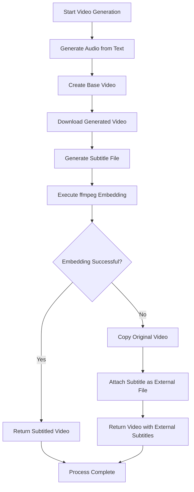
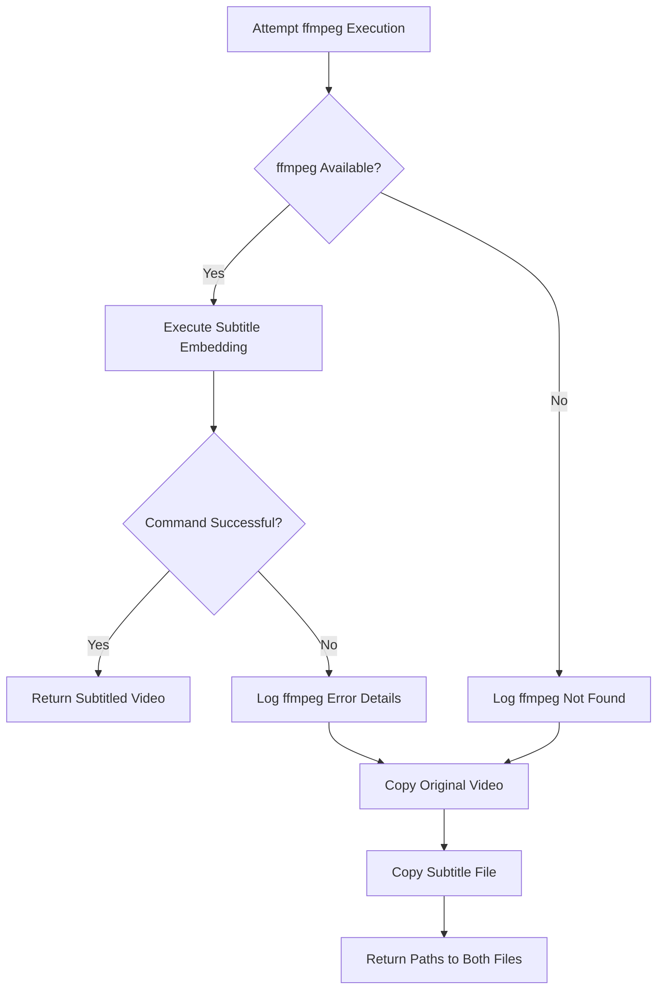
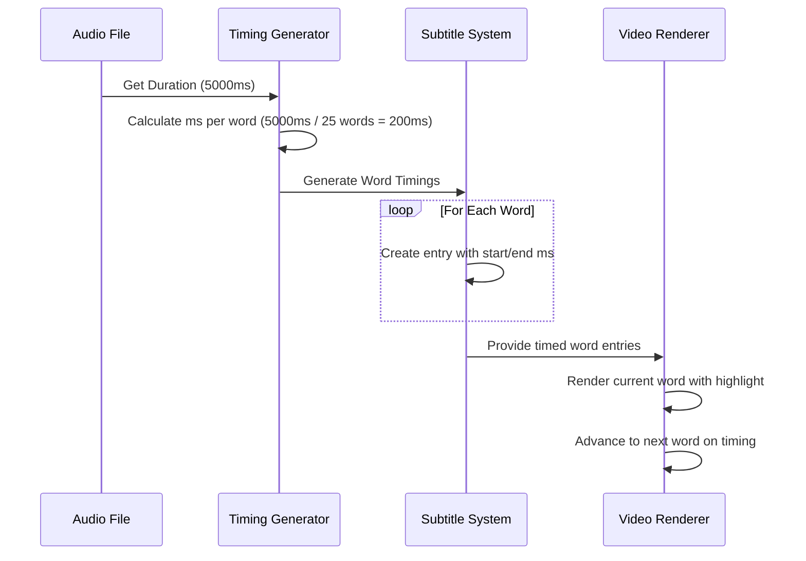

# Subtitle Embedding

<cite>
**Referenced Files in This Document**   
- [video.rs](file://src/video.rs#L416-L461)
- [video_generation.rs](file://abogen-ui/crates/ui/services/video_generation.rs#L353-L390)
- [mlt_video.rs](file://abogen-ui/crates/ui/services/mlt_video.rs#L277-L323)
- [tts_service.rs](file://abogen-ui/crates/ui/services/tts_service.rs#L365-L395)
- [subtitle.rs](file://src/subtitle.rs#L0-L54)
</cite>

## Table of Contents
1. [Introduction](#introduction)
2. [Subtitle Embedding Process Flow](#subtitle-embedding-process-flow)
3. [ffmpeg Command Structure](#ffmpeg-command-structure)
4. [Requirements and Error Handling](#requirements-and-error-handling)
5. [Word-Highlighted Subtitle Synchronization](#word-highlighted-subtitle-synchronization)
6. [Fallback Behavior and Examples](#fallback-behavior-and-examples)
7. [Troubleshooting Common ffmpeg Errors](#troubleshooting-common-ffmpeg-errors)
8. [Performance Considerations](#performance-considerations)

## Introduction
The VoxWeave video generation pipeline incorporates subtitle embedding functionality to integrate SRT files into the final video output. This document details the implementation of the `embed_subtitles` method in the `VideoGenerationService`, which utilizes ffmpeg to process and embed subtitles. The system supports both standard subtitle embedding and advanced word-highlighted subtitles synchronized with narration. The process includes downloading the generated video, executing ffmpeg with appropriate filters, and handling various output scenarios based on success or failure conditions.

## Subtitle Embedding Process Flow
The subtitle embedding process in the VoxWeave pipeline follows a structured sequence of operations that begins after the video generation service has created the base video file. The workflow initiates with the download of the generated video from the remote service, followed by the preparation of subtitle files in the appropriate format (typically SRT). The system then invokes the `embed_subtitles` method, which constructs and executes an ffmpeg command to integrate the subtitles into the video stream. During this process, the system monitors the operation's progress and handles the output according to the success or failure of the embedding operation. If successful, the system returns the path to the subtitled video; if the operation fails, the system implements fallback procedures to ensure video delivery without embedded subtitles.

**Diagram sources**
- [video.rs](file://src/video.rs#L416-L461)
- [video_generation.rs](file://abogen-ui/crates/ui/services/video_generation.rs#L353-L390)

**Section sources**
- [video.rs](file://src/video.rs#L416-L461)
- [video_generation.rs](file://abogen-ui/crates/ui/services/video_generation.rs#L353-L390)

## ffmpeg Command Structure
The `embed_subtitles` method constructs a specific ffmpeg command with carefully selected arguments to ensure proper subtitle integration. The command begins with the `-i` argument to specify the input video file, followed by the `-vf` (video filter) argument that contains the subtitles filter configuration. The filter specification uses the format `subtitles={subtitle_path}` where the path to the SRT file is dynamically inserted. The command then specifies video encoding parameters with `-c:v libx264` to use the H.264 codec, while `-c:a copy` preserves the original audio stream without re-encoding. The `-y` flag enables overwrite of the output file if it already exists, preventing interruption due to file conflicts. The output path is specified at the end of the command sequence, directing ffmpeg to save the processed video to the designated location.

**Section sources**
- [video.rs](file://src/video.rs#L416-L461)
- [video_generation.rs](file://abogen-ui/crates/ui/services/video_generation.rs#L353-L390)

## Requirements and Error Handling
The subtitle embedding functionality requires ffmpeg to be installed and accessible in the system's PATH for successful operation. When ffmpeg is unavailable or the command execution fails, the system implements comprehensive error handling procedures. The error detection mechanism captures both command execution failures (when ffmpeg is not found) and processing failures (when ffmpeg returns a non-zero exit status). In cases where ffmpeg is not available, the system falls back to copying the original video file and placing the subtitle file in the same directory with a matching filename. This ensures that users still receive subtitle information, albeit as an external file rather than embedded content. The system logs detailed error messages including stderr output from ffmpeg to aid in troubleshooting and provides clear feedback through the logging system about the success or failure of the embedding operation.

**Diagram sources**
- [video_generation.rs](file://abogen-ui/crates/ui/services/video_generation.rs#L388-L419)

**Section sources**
- [video_generation.rs](file://abogen-ui/crates/ui/services/video_generation.rs#L388-L419)

## Word-Highlighted Subtitle Synchronization
The VoxWeave pipeline supports advanced word-highlighted subtitles that synchronize with the narration timing. This functionality is achieved through the MLT (Media Lovin' Toolkit) system, which generates precise timing data for each word in the subtitle text. The synchronization process begins by analyzing the audio duration and distributing timing information across words based on an average words-per-minute rate (default 150 WPM). The system creates individual subtitle entries for each word with specific start and end timestamps that align with the audio narration. During video rendering, these timed word entries are processed to display only the current word being spoken, with visual highlighting (typically cyan text) to indicate the active word. This word-level synchronization creates a dynamic subtitle experience that enhances viewer comprehension and engagement.

**Diagram sources**
- [mlt_video.rs](file://abogen-ui/crates/ui/services/mlt_video.rs#L277-L323)
- [subtitle.rs](file://src/subtitle.rs#L52-L95)

**Section sources**
- [mlt_video.rs](file://abogen-ui/crates/ui/services/mlt_video.rs#L277-L323)
- [subtitle.rs](file://src/subtitle.rs#L52-L95)

## Fallback Behavior and Examples
The subtitle embedding system implements robust fallback behavior to ensure video delivery even when subtitle embedding fails. In successful scenarios, the system produces a single video file with embedded subtitles that are permanently integrated into the video stream. When embedding fails, the system creates two separate files: the original video file and a companion subtitle file with the same base name. For example, if the original video is named "presentation.mp4", a successful embedding would produce "presentation_subtitled.mp4", while a failed embedding would result in "presentation.mp4" and "presentation.srt" existing as separate files. The system logs clearly indicate the outcome, with success messages showing "Video with subtitles ready" and failure messages noting "Subtitle embedding failed" followed by the use of the video without subtitles. This fallback mechanism ensures that users always receive their video content, with subtitles available either embedded or as a separate track.

**Section sources**
- [video_generation.rs](file://abogen-ui/crates/ui/services/video_generation.rs#L416-L458)
- [video.rs](file://src/video.rs#L114-L127)

## Troubleshooting Common ffmpeg Errors
Common ffmpeg errors in the subtitle embedding process typically stem from file path issues, codec incompatibilities, or permission problems. When encountering "No such file or directory" errors, verify that both the video and subtitle file paths are correct and accessible. For codec-related errors, ensure that the libx264 encoder is available in the ffmpeg installation. Permission errors can occur when the output directory is not writable, so confirm that the application has write permissions to the target location. When subtitle formatting issues arise, validate that the SRT file follows proper formatting with sequential numbering, timestamp formatting (HH:MM:SS,mmm --> HH:MM:SS,mmm), and appropriate line breaks. Memory-related errors with large files can be mitigated by ensuring sufficient system resources or processing videos in smaller segments. The system's error messages include the full ffmpeg stderr output, which provides specific details about the nature of the failure and guidance for resolution.

**Section sources**
- [video_generation.rs](file://abogen-ui/crates/ui/services/video_generation.rs#L388-L419)

## Performance Considerations
Performance considerations for subtitle embedding primarily involve processing time and resource utilization, especially with large video files. The ffmpeg subtitle embedding process requires re-encoding the video stream, which is computationally intensive and time-consuming for longer videos. The system's performance scales with video resolution and duration, with 4K videos requiring significantly more processing time than 720p videos. To optimize performance, the system uses the `-c:a copy` parameter to avoid re-encoding audio, preserving the original audio stream. For very large files, consider processing during off-peak hours or implementing batch processing with progress tracking. The word-highlighted subtitle feature, which uses MLT for rendering, has different performance characteristics than ffmpeg embedding and may be preferred for certain use cases. Monitoring system resources during processing can help identify bottlenecks and inform decisions about hardware requirements for high-volume subtitle embedding operations.

**Section sources**
- [video_generation.rs](file://abogen-ui/crates/ui/services/video_generation.rs#L353-L390)
- [mlt_video.rs](file://abogen-ui/crates/ui/services/mlt_video.rs#L277-L323)