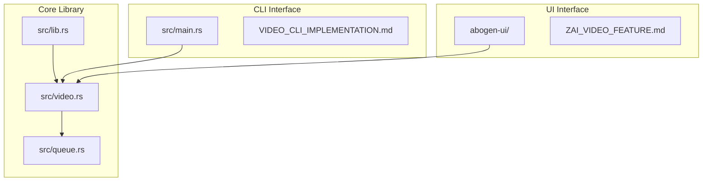
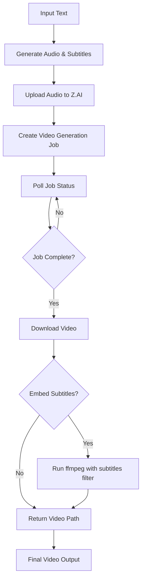
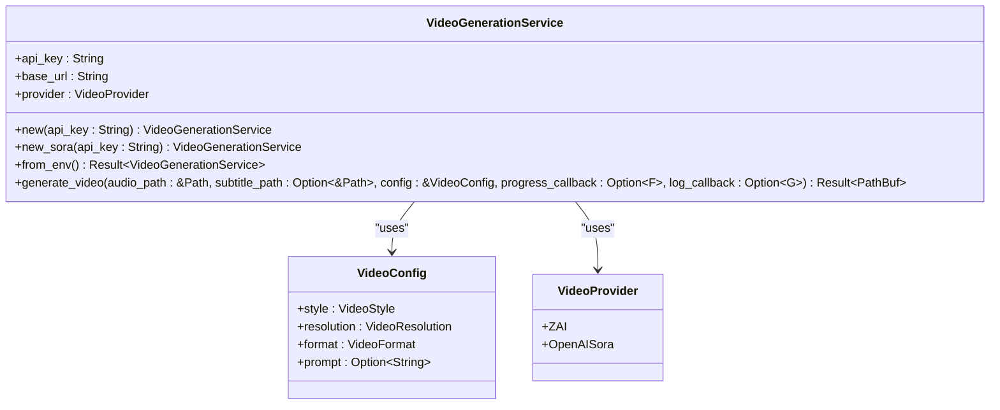
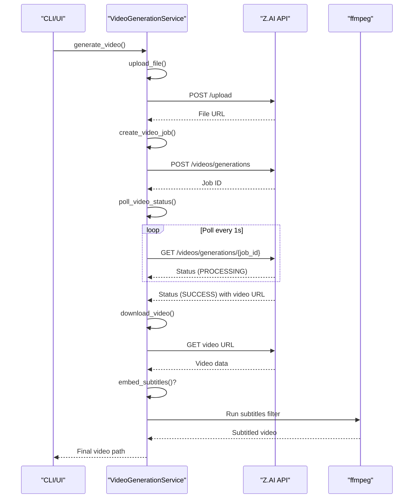
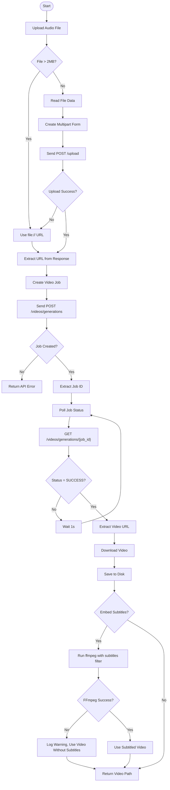
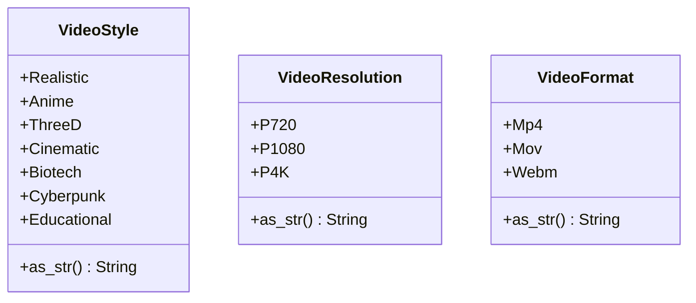
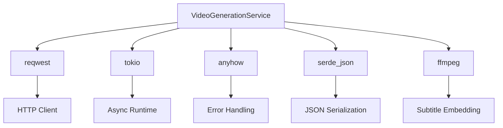

# Video Generation

<cite>
**Referenced Files in This Document**   
- [src/video.rs](file://src/video.rs)
- [VIDEO_CLI_IMPLEMENTATION.md](file://VIDEO_CLI_IMPLEMENTATION.md)
- [abogen-ui/ZAI_VIDEO_FEATURE.md](file://abogen-ui/ZAI_VIDEO_FEATURE.md)
- [src/queue.rs](file://src/queue.rs)
- [src/lib.rs](file://src/lib.rs)
</cite>

## Table of Contents
1. [Introduction](#introduction)
2. [Project Structure](#project-structure)
3. [Core Components](#core-components)
4. [Architecture Overview](#architecture-overview)
5. [Detailed Component Analysis](#detailed-component-analysis)
6. [Dependency Analysis](#dependency-analysis)
7. [Performance Considerations](#performance-considerations)
8. [Troubleshooting Guide](#troubleshooting-guide)
9. [Conclusion](#conclusion)

## Introduction

The VoxWeave video generation system enables automated creation of narrated videos from text content using the Z.AI API. This documentation details the implementation of the `VideoGenerationService` in `src/video.rs`, which orchestrates the complete pipeline: audio upload, job creation, status polling, video download, and subtitle embedding via ffmpeg. The system supports multiple video styles, resolutions, and formats, and allows for custom visual prompts. Both CLI and UI implementations are covered, with integration details from `VIDEO_CLI_IMPLEMENTATION.md` and `ZAI_VIDEO_FEATURE.md`. The service includes robust error handling for API key issues, timeouts, and HTTP status codes, and provides examples of API interactions.

## Project Structure

The video generation functionality is distributed across multiple components in the VoxWeave repository. The core logic resides in `src/video.rs`, while configuration and data structures are defined in `src/queue.rs`. The UI integration is handled in the `abogen-ui` crate, specifically in `services/zai_video.rs` and `services/mlt_video.rs`. The CLI implementation is integrated into `src/main.rs` and documented in `VIDEO_CLI_IMPLEMENTATION.md`.

**Diagram sources**
- [src/video.rs](file://src/video.rs#L1-L462)
- [src/queue.rs](file://src/queue.rs#L1-L154)
- [src/lib.rs](file://src/lib.rs#L1-L13)
- [VIDEO_CLI_IMPLEMENTATION.md](file://VIDEO_CLI_IMPLEMENTATION.md#L1-L334)
- [abogen-ui/ZAI_VIDEO_FEATURE.md](file://abogen-ui/ZAI_VIDEO_FEATURE.md#L1-L168)

**Section sources**
- [src/video.rs](file://src/video.rs#L1-L462)
- [src/queue.rs](file://src/queue.rs#L1-L154)
- [src/lib.rs](file://src/lib.rs#L1-L13)

## Core Components

The `VideoGenerationService` in `src/video.rs` is the central component for video generation. It handles the complete pipeline from audio upload to final video delivery with subtitles. The service supports two providers: Z.AI and OpenAI Sora, with Z.AI being the primary provider. The service is configured through the `VideoConfig` struct, which specifies the video style, resolution, format, and optional custom prompt. The service integrates with the existing TTS pipeline to generate synchronized audio and subtitles.

**Section sources**
- [src/video.rs](file://src/video.rs#L15-L462)
- [src/queue.rs](file://src/queue.rs#L2-L49)

## Architecture Overview

The video generation architecture follows a modular design with clear separation of concerns. The CLI and UI both interface with the `VideoGenerationService`, which handles the interaction with the Z.AI API. The service manages the complete workflow: uploading the audio file, creating a video generation job, polling for completion, downloading the generated video, and optionally embedding subtitles using ffmpeg.

**Diagram sources**
- [src/video.rs](file://src/video.rs#L150-L462)
- [VIDEO_CLI_IMPLEMENTATION.md](file://VIDEO_CLI_IMPLEMENTATION.md#L50-L80)

## Detailed Component Analysis

### Video Generation Service Analysis

The `VideoGenerationService` implements a comprehensive pipeline for video generation. It begins by uploading the audio file to Z.AI, either via direct upload or by providing a file URL for large files. It then creates a video generation job with the specified style, resolution, and prompt. The service polls the job status until completion, downloads the generated video, and optionally embeds subtitles using ffmpeg.

#### For Object-Oriented Components:

**Diagram sources**
- [src/video.rs](file://src/video.rs#L15-L462)

#### For API/Service Components:

**Diagram sources**
- [src/video.rs](file://src/video.rs#L150-L462)

#### For Complex Logic Components:

**Diagram sources**
- [src/video.rs](file://src/video.rs#L150-L462)

**Section sources**
- [src/video.rs](file://src/video.rs#L15-L462)

### Video Styles and Configurations

The system supports multiple video styles, resolutions, and formats through dedicated enum types in `src/queue.rs`. These configurations are used by both the CLI and UI to provide consistent options for video generation.

**Diagram sources**
- [src/queue.rs](file://src/queue.rs#L2-L49)

**Section sources**
- [src/queue.rs](file://src/queue.rs#L2-L49)

## Dependency Analysis

The video generation system has several key dependencies that enable its functionality. The core dependencies are managed through Cargo features, allowing the video generation module to be conditionally compiled.

**Diagram sources**
- [Cargo.toml](file://Cargo.toml#L1-L20)
- [src/video.rs](file://src/video.rs#L1-L462)

**Section sources**
- [VIDEO_CLI_IMPLEMENTATION.md](file://VIDEO_CLI_IMPLEMENTATION.md#L200-L230)

## Performance Considerations

Video generation performance is influenced by several factors, including resolution, content length, and API server load. Generation times typically range from 1-2 minutes for 720p, 2-4 minutes for 1080p, and 4-5 minutes for 4K resolution. The system implements a 5-minute timeout for video generation jobs to prevent indefinite waiting. Batch processing is supported through the CLI, allowing multiple videos to be generated sequentially. For optimal performance, users should select the appropriate resolution for their needs and consider adding delays between batch requests to avoid rate limits.

**Section sources**
- [VIDEO_CLI_IMPLEMENTATION.md](file://VIDEO_CLI_IMPLEMENTATION.md#L300-L320)

## Troubleshooting Guide

The video generation system includes comprehensive error handling for common issues. Key error scenarios and their solutions include:

**Section sources**
- [src/video.rs](file://src/video.rs#L150-L462)
- [VIDEO_CLI_IMPLEMENTATION.md](file://VIDEO_CLI_IMPLEMENTATION.md#L250-L280)

### API Key Errors
When the ZAI_API_KEY environment variable is not set, the system returns a clear error message. Users should ensure the API key is properly set in their environment.

### Timeout Errors
If video generation exceeds the 5-minute timeout, the system returns a timeout error. Users can try with shorter input text or verify their network connection.

### HTTP Status Errors
API errors from Z.AI are propagated with the HTTP status code and error message, allowing users to diagnose issues such as rate limiting or invalid requests.

### FFmpeg Errors
When subtitle embedding fails due to missing or misconfigured ffmpeg, the system logs a warning and returns the video without subtitles, ensuring partial functionality.

## Conclusion

The VoxWeave video generation system provides a robust and flexible solution for creating narrated videos from text content using the Z.AI API. The `VideoGenerationService` in `src/video.rs` implements a complete pipeline that handles audio upload, job creation, status polling, video download, and subtitle embedding. The system supports multiple video styles, resolutions, and formats, and allows for custom visual prompts. Both CLI and UI implementations provide feature parity, with the CLI enabling automation and batch processing. The architecture is modular and well-documented, with comprehensive error handling and performance considerations.