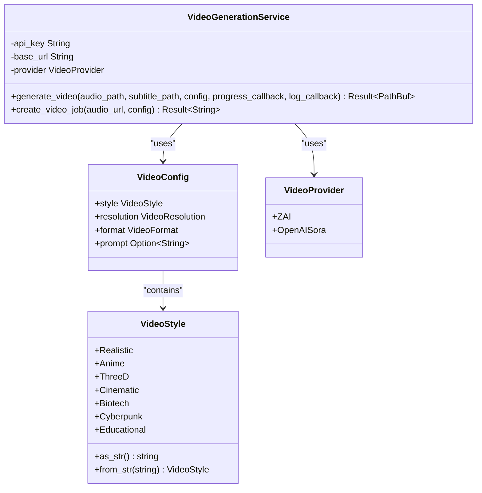
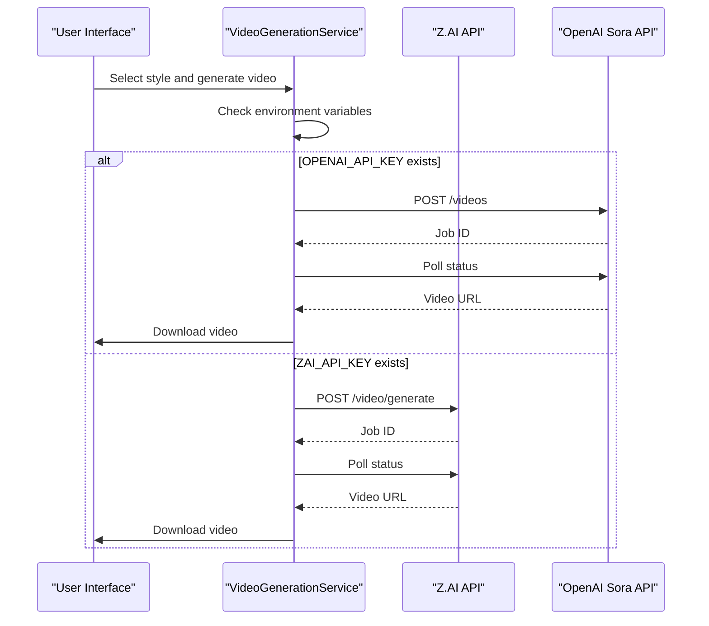

# Video Styles

<cite>
**Referenced Files in This Document**   
- [video.rs](file://src/video.rs)
- [state.rs](file://abogen-ui/crates/ui/state.rs)
- [zai_video.rs](file://abogen-ui/crates/ui/services/zai_video.rs)
- [ZAI_VIDEO_FEATURE.md](file://abogen-ui/ZAI_VIDEO_FEATURE.md)
- [VIDEO_CLI_IMPLEMENTATION.md](file://VIDEO_CLI_IMPLEMENTATION.md)
- [VIDEO_CLI_QUICKREF.md](file://VIDEO_CLI_QUICKREF.md)
</cite>

## Table of Contents
1. [Introduction](#introduction)
2. [Supported Video Styles](#supported-video-styles)
3. [Style Implementation](#style-implementation)
4. [API Integration](#api-integration)
5. [Style-Specific Prompts](#style-specific-prompts)
6. [Configuration and Mapping](#configuration-and-mapping)
7. [Common Issues](#common-issues)
8. [Style Selection Guidance](#style-selection-guidance)
9. [Conclusion](#conclusion)

## Introduction
The VoxWeave application provides a comprehensive video generation feature that transforms text input into visually rich videos using AI-powered visual generation. The VideoGenerationService enables users to select from multiple distinct visual styles, each producing unique aesthetic outcomes. This documentation details the implementation of supported styles including cyberpunk, cinematic, educational, realistic, anime, 3d, and biotech, explaining how style selection affects visual output and API requests to Z.AI and OpenAI Sora. The system integrates seamlessly with the text-to-speech pipeline, creating synchronized audio-visual content with subtitles.

## Supported Video Styles
The VoxWeave application supports seven distinct video styles, each designed for specific content types and aesthetic preferences. These styles are implemented as an enumeration in the application state and are available through both the UI and CLI interfaces.

- **Realistic**: Photorealistic visuals with natural lighting and textures
- **Anime**: Vibrant anime/manga art style with stylized characters and backgrounds
- **3D**: Three-dimensional rendered graphics with depth and perspective
- **Cinematic**: Movie-like cinematography with dramatic lighting and camera movements
- **Biotech**: Scientific/biotech themed visuals with DNA particles and holographic effects
- **Cyberpunk**: Futuristic neon aesthetics with magenta and cyan lighting
- **Educational**: Clean, professional visuals with minimalistic graphics

These styles are accessible through the VideoStyle enum in the application state, allowing consistent style selection across different components of the application.

**Section sources**
- [state.rs](file://abogen-ui/crates/ui/state.rs#L48-L94)
- [ZAI_VIDEO_FEATURE.md](file://abogen-ui/ZAI_VIDEO_FEATURE.md#L30-L60)

## Style Implementation
The video styles are implemented through a combination of frontend state management and backend API integration. The VideoStyle enum in the application state handles style selection and conversion to string representations used in API requests.

The implementation follows a consistent pattern across the application:

1. **UI Selection**: Users select a style through dropdown menus in the interface
2. **State Management**: The selected style is stored in the application state
3. **API Translation**: The style enum is converted to a string representation for API requests
4. **Service Processing**: The video generation service uses the style parameter to configure visual output

The style implementation is consistent between the desktop UI and CLI interfaces, ensuring a uniform user experience across different access methods.

**Diagram sources**
- [state.rs](file://abogen-ui/crates/ui/state.rs#L48-L94)
- [video.rs](file://src/video.rs#L0-L43)

**Section sources**
- [state.rs](file://abogen-ui/crates/ui/state.rs#L96-L129)
- [zai_video.rs](file://abogen-ui/crates/ui/services/zai_video.rs#L235-L262)
- [video.rs](file://src/video.rs#L45-L81)

## API Integration
The video generation system integrates with two AI video generation APIs: Z.AI and OpenAI Sora. The VideoGenerationService handles the communication with these APIs, abstracting the differences between their request formats and response structures.

### Z.AI Integration
For Z.AI, the style parameter is directly used in the API request with the following mapping:

- Style string is sent as the "style" parameter
- Resolution is converted to string representation (e.g., "1080p")
- A custom prompt can be included to enhance style-specific visuals

The Z.AI API endpoint is `https://api.z.ai/v1/video/generate` with a POST request containing the text, voice, style, subtitles flag, resolution, and optional prompt.

### OpenAI Sora Integration
For OpenAI Sora, the style parameter is incorporated into the prompt system:

- The style name is included in the default prompt: "Generate a {style} style video"
- Resolution is converted to dimensional format (e.g., "1920x1080")
- The model parameter is set to "sora-2-pro"

The Sora API endpoint is `https://api.openai.com/v1/videos` with a POST request containing the model, prompt, size, and seconds parameters.

The system automatically selects the appropriate API based on available environment variables (OPENAI_API_KEY takes precedence over ZAI_API_KEY).

**Diagram sources**
- [video.rs](file://src/video.rs#L214-L244)
- [zai_video.rs](file://abogen-ui/crates/ui/services/zai_video.rs#L235-L262)

**Section sources**
- [video.rs](file://src/video.rs#L45-L81)
- [video.rs](file://src/video.rs#L214-L244)

## Style-Specific Prompts
Each video style can be enhanced with custom prompts that guide the AI generation process toward specific visual characteristics. The system supports both default style-specific prompts and user-defined custom prompts.

### Default Prompts
The application provides enhanced default prompts for certain styles:

- **Biotech**: "Narrate this text with cinematic biotech visuals. Use neon green and blue DNA particles, transparent data layers, and soft laboratory lighting. Sync subtitles word-by-word and overlay holographic effects."
- **Cyberpunk**: "Narrate this text with cyberpunk neon aesthetics. Use vibrant magenta and cyan lights, futuristic cityscapes, and digital rain effects. Sync subtitles with glitch animations."
- **Educational**: "Narrate this text with clean educational visuals. Use minimalistic graphics, clear typography, and professional color schemes. Sync subtitles smoothly."

For other styles (realistic, anime, 3d, cinematic), the system uses a generic prompt format: "Generate a {style} style video".

### Custom Prompt Override
Users can provide custom prompts through the UI or CLI, which override the default prompts. This allows for fine-grained control over the visual output, enabling users to specify particular scenes, camera angles, or visual elements.

The prompt system follows this hierarchy:
1. User-provided custom prompt (highest priority)
2. Style-specific default prompt
3. Generic style prompt (lowest priority)

**Section sources**
- [zai_video.rs](file://abogen-ui/crates/ui/services/zai_video.rs#L235-L262)
- [ZAI_VIDEO_FEATURE.md](file://abogen-ui/ZAI_VIDEO_FEATURE.md#L30-L60)

## Configuration and Mapping
The video style configuration is managed through the VideoConfig struct, which contains the style selection along with other video generation parameters. The mapping between style enum values and API parameters is handled automatically by the VideoGenerationService.

### Style to API Parameter Mapping
| Style Enum | Z.AI API Parameter | OpenAI Sora Prompt |
|------------|--------------------|-------------------|
| Realistic | "realistic" | "Generate a realistic style video" |
| Anime | "anime" | "Generate a anime style video" |
| ThreeD | "3d" | "Generate a 3d style video" |
| Cinematic | "cinematic" | "Generate a cinematic style video" |
| Biotech | "biotech" | "Generate a biotech style video" |
| Cyberpunk | "cyberpunk" | "Generate a cyberpunk style video" |
| Educational | "educational" | "Generate a educational style video" |

### Configuration Structure
The VideoConfig struct contains the following fields:
- **style**: VideoStyle enum value
- **resolution**: VideoResolution enum value
- **format**: VideoFormat enum value
- **prompt**: Optional custom prompt string

The create_video_job method in the VideoGenerationService converts these configuration values into the appropriate API request format based on the selected provider (Z.AI or OpenAI Sora).

**Section sources**
- [video.rs](file://src/video.rs#L0-L43)
- [video.rs](file://src/video.rs#L214-L244)

## Common Issues
Several common issues may arise when using the video styles feature, primarily related to API compatibility, configuration errors, and environmental requirements.

### Invalid Style Selection
When an invalid style is specified, the system defaults to the "realistic" style. This occurs when:
- A non-existent style name is provided
- The style parameter is empty or null
- A typo exists in the style name

To prevent this issue, users should verify their style selection against the supported styles list.

### API Compatibility Issues
Different APIs have varying levels of style support:
- **Z.AI**: Full support for all seven styles
- **OpenAI Sora**: Style interpretation may vary as styles are provided through prompts rather than direct parameters

Users may notice differences in visual output between the two APIs even when using the same style parameter.

### Environmental Requirements
The video generation feature requires specific environmental setup:
- **ZAI_API_KEY** or **OPENAI_API_KEY** must be set in environment variables
- Internet connection is required for API access
- For subtitle embedding, ffmpeg must be installed on the system

Failure to meet these requirements will result in video generation failures or limited functionality.

### Resolution and Performance Considerations
Higher resolutions (4K) require longer processing times and may be subject to API rate limits. Users should consider using 720p or 1080p for testing and reserve 4K for final production to optimize API usage and processing time.

**Section sources**
- [video.rs](file://src/video.rs#L45-L81)
- [VIDEO_CLI_IMPLEMENTATION.md](file://VIDEO_CLI_IMPLEMENTATION.md#L200-L250)
- [VIDEO_CLI_QUICKREF.md](file://VIDEO_CLI_QUICKREF.md#L100-L130)

## Style Selection Guidance
Choosing the appropriate video style depends on the content type and intended audience. The following guidance helps users select the most effective style for their specific use case.

### Educational Content
For educational materials, presentations, and instructional videos:
- **Recommended**: Educational, Realistic
- **Rationale**: Clean, professional visuals enhance information retention
- **Tips**: Use custom prompts to specify diagrams, charts, or specific visual aids

### Creative Storytelling
For narratives, fiction, and creative content:
- **Recommended**: Cinematic, Anime, 3D
- **Rationale**: These styles provide dramatic visuals that enhance storytelling
- **Tips**: Use custom prompts to describe specific scenes, characters, or settings

### Technology and Science Content
For tech reviews, scientific explanations, and futurism:
- **Recommended**: Biotech, Cyberpunk
- **Rationale**: These styles convey innovation and technological advancement
- **Tips**: Emphasize specific visual elements like data streams, holograms, or futuristic interfaces

### General Purpose Content
For mixed content, vlogs, or unspecified use cases:
- **Recommended**: Realistic, Cinematic
- **Rationale**: Versatile styles that work well across multiple content types
- **Tips**: Start with realistic style for broad compatibility

### Platform-Specific Considerations
When targeting specific platforms:
- **Social Media**: Use Cyberpunk or Anime for higher engagement
- **Professional Settings**: Use Realistic or Educational for credibility
- **Entertainment**: Use Cinematic or 3D for visual impact

Users should also consider their audience's preferences and the brand identity when selecting a video style.

**Section sources**
- [ZAI_VIDEO_FEATURE.md](file://abogen-ui/ZAI_VIDEO_FEATURE.md#L30-L60)
- [VIDEO_CLI_QUICKREF.md](file://VIDEO_CLI_QUICKREF.md#L50-L80)

## Conclusion
The video styles feature in VoxWeave provides a powerful and flexible system for creating AI-generated videos with distinct visual aesthetics. By supporting seven different styles and integrating with both Z.AI and OpenAI Sora APIs, the application offers users extensive creative possibilities. The implementation ensures consistent style selection across UI and CLI interfaces, with automatic mapping to appropriate API parameters. Users can enhance their videos with style-specific prompts or custom prompts for greater control over visual output. While the system handles invalid style selections gracefully by defaulting to realistic style, users should be aware of API compatibility differences and environmental requirements. By following the style selection guidance based on content type and audience, users can create compelling videos that effectively communicate their message with the appropriate visual aesthetic.